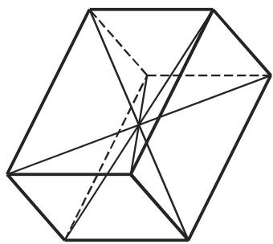

# 数学手册(原书第10版) images-64 插图资产（0d62a961，内容待鉴定）

本页登记《数学手册(原书第10版)》images 目录下一枚此前未入库的 JPEG 插图资产，短码 sszxml。它是在 [[methodology/插图资产哈希入库法]] 规程下新入库的一枚哈希资产：现行索引所列十枚 images-64 资产的哈希前缀均为 0a/0b，本枚前缀为 0d62a961，系该锚位下首见 0d 前缀的资产。其图像内容与章节归属均未鉴定，是 [[concepts/图像资产与文本对位]] 考证活动中又一枚待对位实例，归属之辨由 [[queries/sszxml图像归属何章何节之辨]] 追踪。



## 资产身份（结构化数据，verbatim）

```text
文件：数学手册(原书第10版)/images/0d62a9611b17174c512f2f1c4bd025e0b7a27b41c67267d747d47fdc61270276.jpg
哈希：0d62a9611b17174c512f2f1c4bd025e0b7a27b41c67267d747d47fdc61270276（64 位十六进制，前缀 0d62a961）
体量：14.4 KB
媒体路径：media/10-数学手册原书第10版--6-images--64-0d62a9611b17174c512f2f1c4bd025e0b7a27b41c67267d747d47fdc61270276--sszxml/001-0d62a9611b17174c512f2f1c4bd025e0b7a27b41c67267d747d47fdc61270276.jpg
短码：sszxml
```

## 入库依据（直接证据）

- 哈希 `0d62a9611b17174c512f2f1c4bd025e0b7a27b41c67267d747d47fdc61270276` 与媒体路径为本资产的确定性标识，可独立复核。
- 现行索引十枚 images-64 资产（短码 1ikigq0、1gx8gjx、1ra5c4c、1evgdxq、14ey292、17lqxz4、exsc01、1gcwv0k、21pp71、8r4woa）的哈希均以 0a/0b 起头，无一与 `0d62a961` 重合，可复核本枚为新增枚。

## 内容鉴定状态

本源材料未附任何文字层——无 OCR 转写、无图注、无参照页码——故图像内容鉴定目前无从着手。这是一项状态陈述而非实证主张；在鉴定完成之前，任何关于本图像所绘内容及其章节归属的表述均属越权（见 [[queries/sszxml图像归属何章何节之辨]]）。

低置信旁注（体量推断，不得作为归属依据）：14.4 KB 的体量提示本资产或为小幅图形（单条公式或小示意图）而非整页数值表。

## 与既有维基的关联

- 母作品：[[entities/数学手册原书第10版]]。注意：另有 [[entities/数学手册-原书第10版]] 与之并存，归一待决；本页 related 暂指向前者。
- 沿用规程与概念：[[methodology/插图资产哈希入库法]]、[[concepts/图像资产与文本对位]]。
- 锚位累积：本枚入册后，images-64 锚位下已登记的哈希资产增至十一枚，见 [[findings/images-64锚位哈希资产增至十一枚]]；既有 [[findings/images-64锚位哈希资产增至五枚]] 的计数口径待核对。
- 并列实例：同锚位既有资产中，exsc01（0abd8458）与 8r4woa（0a74ffc6）经鉴定属第 2 章，21pp71 有归属第 21 章之辨。这些归属结论均系各自资产之鉴定结果，不可移用于本枚。

## 开放问题

1. 本图像究竟绘何内容、归属手册何章何节？（[[queries/sszxml图像归属何章何节之辨]]）
2. "images--64" 是否为管线固定锚位而非真实位置索引？（[[queries/images-64锚位双哈希资产之辨]]、[[queries/images目录图像未鉴定之辨]]）
3. 短码 sszxml 在既有短码序列（1ikigq0、1gx8gjx、21pp71 等）中的生成规律为何？

<!-- llm-wiki:embedded-images -->
## Embedded Images

### Document


<!-- llm-wiki:embedded-images -->
