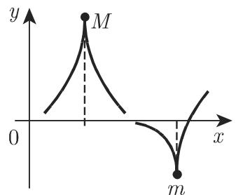

# 数学手册(原书第10版) images-64 插图资产（0e58c227，内容待鉴定）

本页是 [[entities/数学手册原书第10版]] images 目录（第 6 部件，锚位 64）下一枚插图资产的入库记录页。该资产是无随附上下文的孤立图像文件，以 SHA-256 文件哈希为唯一稳定标识；当前状态为**内容待鉴定**——尚未与手册任何章节建立对位关系。

## 资产元数据

| 字段 | 值 |
|---|---|
| 文件路径 | `数学手册(原书第10版)/images/0e58c227f422b7d5ed2d7d253b7c64bfd47884c011147ad5dad0b3382afd9ff9.jpg` |
| SHA-256 | `0e58c227f422b7d5ed2d7d253b7c64bfd47884c011147ad5dad0b3382afd9ff9` |
| 大小 | 7.9 KB |
| 格式 | JPEG |
| 目录锚位 | images（第 6 部件），锚位 64 |
| 媒体引用路径 | `media/10-数学手册原书第10版--6-images--64-0e58c227f422b7d5ed2d7d253b7c64bfd47884c011147ad5dad0b3382afd9ff9--bughdo/001-0e58c227f422b7d5ed2d7d253b7c64bfd47884c011147ad5dad0b3382afd9ff9.jpg` |
| 状态 | 内容待鉴定 |

媒体路径末段的 `bughdo` 为转写器生成的随机消歧后缀，属内部工作流产物，无独立知识价值。

## 入库方法

本页依 [[methodology/插图资产哈希入库法]] 建立：以文件哈希为唯一标识建 source 页，归属问题另立 query 页（[[queries/0e58c227图像归属何章何节之辨]]）。该方法已在 images-64 锚位多枚资产上重复应用，本资产是又一次直接验证，表明流程可复制。

## 与 images-64 锚位聚集现象的关系

本资产落位于 `--6-images--64-` 锚位。该锚位已聚集多枚内容互异的哈希资产（见 [[queries/images-64锚位双哈希资产之辨]] 与 [[findings/images-64锚位哈希资产增至十七枚]]），本资产为该现象新增一例；同时，未鉴定资产集合（[[queries/images目录图像未鉴定之辨]]）随之扩大一枚。

## 待决问题

- 本图内容为何——需目验或 OCR 方可判定，在此之前任何章节归属陈述均不可成立；
- 归属第几章何节——追踪于 [[queries/0e58c227图像归属何章何节之辨]]；
- images-64 锚位为何聚集如此多异哈希文件——转写器行为存疑，已并入 [[queries/images-64锚位双哈希资产之辨]] 追问。

## 证据强度说明

上表所列为直接元数据证据（哈希、大小、路径）。仅凭 7.9 KB 的偏小体积推断“或为简单线条图/公式片段”属未经验证的推断，本页不将其作为事实记录。

## 备注

母书实体页当前存在 [[entities/数学手册原书第10版]] 与 [[entities/数学手册-原书第10版]] 两个并存页面，同指一书。本页及相关新页统一回指前者，合并与规范化待人工裁决。

<!-- llm-wiki:embedded-images -->
## Embedded Images

### Document

<!-- llm-wiki:embedded-images -->
