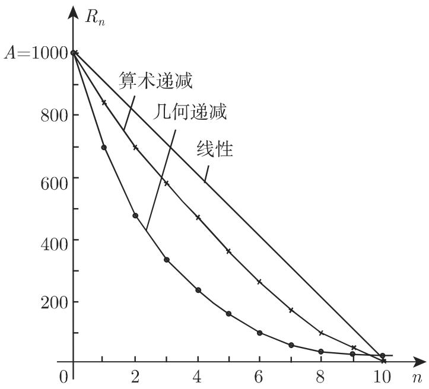

# 数学手册(原书第10版) images 目录图像资产 1k1jza2

## 资产概况

本页登记《数学手册(原书第10版)》`images/` 目录下的一枚图像资产。该资产此前未见于维基索引，属新资产、非重复登记，依 [[插图资产哈希入库法]] 以文件内容 SHA-256 哈希为锚位首次入库。其图像内容尚未目验鉴定，本页仅记载可直接核验的元数据与“待鉴定”状态，不作任何章节归属或图形内容的猜测性描述。

```text
文件名（SHA-256 锚）: 0eb267f78f970f6a095af922cf9eec3410a9aa32140cbf420d5405c6f84d1ab5.jpg
大小: 33.8 KB
路径: 数学手册(原书第10版)/images/
媒体锚: media/10-数学手册原书第10版--6-images--64-0eb267f78f970f6a095af922cf9eec3410a9aa32140cbf420d5405c6f84d1ab5--1k1jza2/001-0eb267f78f970f6a095af922cf9eec3410a9aa32140cbf420d5405c6f84d1ab5.jpg
```



## 登记依据与系列位置

- 本资产是 images-64 锚位哈希资产系列的新一员：此前该系列已登记十七枚（见 [[images-64锚位哈希资产增至十七枚]]），本枚登记后计数递增至十八（见 [[images-64锚位哈希资产增至十八枚]]）。
- 33.8 KB 在已登记资产中偏大——索引所见此前最大者为 1e5tdtk 的 24.0 KB。此为弱量级线索，至多暗示图形或较复杂，不构成任何内容结论。

## 待决问题

- 图像实际内容为何（插图、表格还是公式截图），归属宿主书籍 [[数学手册原书第10版]] 何章何节——已立专页 [[0eb267f7图像归属何章何节之辨]] 追踪，待内容可辨识后可用 [[索引页码锚点法]] 反查归属。
- 本源为纯图像资产，不含任何可读文本主张，不涉及公式、定理或人物；故无任何主张可归属到具名数学实体，亦不应与既有章节结论（如 [[21-14傅里叶变换表抽验通过清单]]）相互转移。

<!-- llm-wiki:embedded-images -->
## Embedded Images

### Document


<!-- llm-wiki:embedded-images -->
