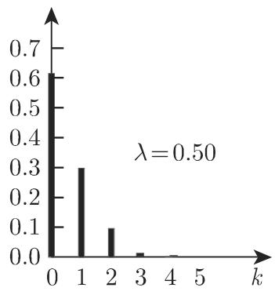

# 数学手册(原书第10版) images-64 插图资产（1a55f612，内容待鉴定）

本页登记一枚出自《数学手册（原书第10版）》`images` 目录的插图资产：完整 SHA-256 哈希为 `1a55f612b05130c1b6ce225482303e20bb37677cc58f0e36cd8aa07755dd2a66`，经媒体渲染路径归位于 images-64 锚位，slug 后缀 `x3z4fp`。本源为纯图像文件，可核实的事实仅限文件系统元数据；图像内容与所属章节截至入库之日均为待鉴定状态。

## 资产元数据

| 字段 | 值 |
|---|---|
| 文件名 | `1a55f612b05130c1b6ce225482303e20bb37677cc58f0e36cd8aa07755dd2a66.jpg` |
| 完整 SHA-256 | `1a55f612b05130c1b6ce225482303e20bb37677cc58f0e36cd8aa07755dd2a66` |
| 哈希前 8 位 | `1a55f612` |
| 大小 | 11.9 KB |
| 所在目录 | `数学手册(原书第10版)/images` |
| 渲染路径 | `media/10-数学手册原书第10版--6-images--64-1a55f612b05130c1b6ce225482303e20bb37677cc58f0e36cd8aa07755dd2a66--x3z4fp/001-1a55f612b05130c1b6ce225482303e20bb37677cc58f0e36cd8aa07755dd2a66.jpg` |

## 内容与归属现状

- 图像内容不可从现有材料判读，状态为「内容待鉴定」。11.9 KB 的体量与已入库资产（7.0–33.8 KB）同量级，提示可能为单幅小型示意图——此为推断，非证据。
- 所属章节无从确定，对位问题由 [[queries/1a55f612图像归属何章何节之辨]] 承载；本资产是 [[concepts/图像资产与文本对位]] 待办样本池的新增成员，同属 [[queries/images目录图像未鉴定之辨]] 所统摄的未鉴定资产积压。

## 在入库链条中的位置

- 本资产依 [[methodology/插图资产哈希入库法]] 入库：以完整哈希为键登记 images 目录插图、逐枚建页溯源。
- 直接衔接上一次清点 [[findings/images-64锚位哈希资产索引清点二十四枚]]；本枚入库后按递增口径计为二十五枚，见 [[findings/images-64锚位哈希资产增至二十五枚]]（该计数口径存疑，详见该页说明）。
- 观察（推断，非证据）：此前入库资产的哈希均以 "0" 开头，本枚以 `1a55f612` 开头，提示入库或沿哈希排序推进至 "1x" 新区段；此说需以后续入库资产的前缀分布验证。

## 事实边界

以上事实仅关于本枚 `1a55f612` 资产自身的元数据，不可外推至 images-64 锚位下其他哈希资产的内容、归属或质量。本源与既有 wiki 内容无直接矛盾。

<!-- llm-wiki:embedded-images -->
## Embedded Images

### Document

<!-- llm-wiki:embedded-images -->
