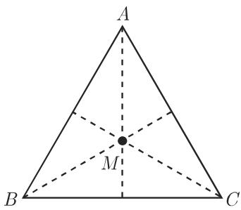

# 数学手册(原书第10版) images-64 插图资产（1b4cdda5，内容待鉴定）

本页登记《数学手册(原书第10版)》转换仓库 images 目录下的一枚哈希命名图像资产。宿主文献为德文数学手册（原作者 [[entities/布龙施泰因]]、[[entities/谢缅佳耶夫]]）第 10 版的中文转换本。本资产依 [[methodology/插图资产哈希入库法]] 入库：文件名即其内容的完整 SHA-256 哈希，配锚位编号与归属 query 页追踪；图像内容尚未鉴定，本次登记仅为占位。

## 结构化元数据

```
文件路径:  数学手册(原书第10版)/images/1b4cdda561a14986d44b8f9151b0514b9884a62a1177836c2c36a7168e9e9cf8.jpg
SHA-256:  1b4cdda561a14986d44b8f9151b0514b9884a62a1177836c2c36a7168e9e9cf8
大小:     9.2 KB
锚位:     images--64（目录枚举序号 64）
文档代码:  124pc73
媒体引用:  media/10-数学手册原书第10版--6-images--64-1b4cdda561a14986d44b8f9151b0514b9884a62a1177836c2c36a7168e9e9cf8--124pc73/001-1b4cdda561a14986d44b8f9151b0514b9884a62a1177836c2c36a7168e9e9cf8.jpg
状态:     内容待鉴定
```

## 图像本体



## 证据与推断之别

- **直接证据（强度高）**：文件名即完整 SHA-256、大小 9.2 KB、锚位 images--64、文档代码 124pc73、媒体引用路径——均出自文件元数据本身。
- **推断（不作依据）**：9.2 KB 的体量与既有小型插图资产（如 7.0 KB 的 hv9y04、7.3 KB 的 auvo0f）相仿，提示本资产可能为小幅插图或公式裁片，但此为体量类比，不构成内容证据。
- **无证据项**：图像的描绘对象（几何图形、函数曲线、公式裁片、表格裁片等）与章节归属，目前一无所知。

## 在既有追踪框架中的位置

- 本资产是 [[methodology/插图资产哈希入库法]] 与 [[concepts/图像资产与文本对位]] 的又一次实例化：登记已完成，对位未开始。
- 本资产加入 [[queries/images-64锚位双哈希资产之辨]] 所追踪的 images--64 锚位异哈希聚积现象，是该现象的又一实例；按既有计数系列，锚位下互异哈希资产递增至二十六枚（见 [[findings/images-64锚位哈希资产增至二十六枚]]）。
- 与 [[queries/images目录图像未鉴定之辨]] 所追踪的未鉴定资产群同列，进一步加重 images 目录资产大量未对位的已知缺口。

## 主张边界

本页所有事实仅关于 1b4cdda5…9e9cf8 这一具体文件。其他 images-64 锚位资产的任何鉴定结论（章节归属、内容描述）不得转用于本资产，即使它们共享同一锚位编号；锚位"64"是目录枚举序号，不构成内容线索。在鉴定完成前，本页的知识价值为零，仅为占位登记。

## 关联

- 归属追踪：[[queries/124pc73图像归属何章何节之辨]]
- 方法论：[[methodology/插图资产哈希入库法]]
- 概念：[[concepts/图像资产与文本对位]]
- 现象追踪：[[queries/images-64锚位双哈希资产之辨]]、[[queries/images目录图像未鉴定之辨]]
- 计数系列：[[findings/images-64锚位哈希资产增至二十六枚]]

<!-- llm-wiki:embedded-images -->
## Embedded Images

### Document


<!-- llm-wiki:embedded-images -->
