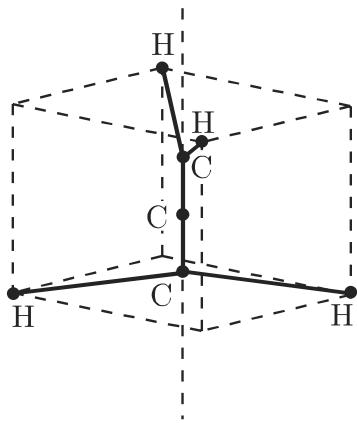

# 数学手册(原书第10版) images-64 插图资产（1b72af67，内容待鉴定）

## 概述

本页是《数学手册(原书第10版)》`images/` 目录下一枚哈希命名图像资产的入库登记页。资产完整文件名为 `1b72af67c9b0f584c9d64ea79cf26d990497edf5bfa565594ad2c4866d64c2eb.jpg`（13.3 KB），媒体路径 slug 后缀为 `1mqtitn`，以完整 SHA-256 哈希为唯一标识，按 [[methodology/插图资产哈希入库法]] 协议入库。截至本页创建，**图像内容尚未鉴定**：所属章节、图题与页码均待目验或 OCR 后确认，归属问题由 [[queries/1b72af67图像归属何章何节之辨]] 追踪。

## 元数据（逐字保留）

```text
文件名: 1b72af67c9b0f584c9d64ea79cf26d990497edf5bfa565594ad2c4866d64c2eb.jpg
体积:   13.3 KB
路径:   数学手册(原书第10版)/images/
媒体:   media/10-数学手册原书第10版--6-images--64-1b72af67c9b0f584c9d64ea79cf26d990497edf5bfa565594ad2c4866d64c2eb--1mqtitn/001-1b72af67c9b0f584c9d64ea79cf26d990497edf5bfa565594ad2c4866d64c2eb.jpg
```

## 图像本体



## 内容状态与证据强度

- **唯一可守结论：内容待鉴定。** 本源未附带图注、页码、章节上下文或任何转写文本；文件名与体积对图像内容、归属章节不具判断力。
- 推断（非直接证据）：13.3 KB 与既有已入库资产（2.7–33.8 KB 区间）同量级，属小型插图/图形片段的典型体量。
- 证据强度：元数据层面强（哈希、体积、路径可直证）；内容层面为零（需目验或 OCR）。
- 在鉴定完成前，关于图像内容类型（公式图、几何图、表格截图等）与章节归属的一切判断均不成立。

## 入库语境

- 本枚延续 images-64 系列资产页的既定模式：同系列此前已有二十五枚 source 页并各配"归属何章何节"query 页（如 `1a55f612…--x3z4fp`、`0f05d072…--hv9y04`）。
- 入库后清点计数递增，见 [[findings/images-64锚位哈希资产增至二十六枚]]（前一期为 [[findings/images-64锚位哈希资产增至二十五枚]]）。
- 本枚同时落入 [[queries/images目录图像未鉴定之辨]] 的未鉴定资产范围，是 [[concepts/图像资产与文本对位]] 的又一待对位实例。
- 断言边界：以上断言仅针对 `1b72af67…c2eb.jpg` 这一资产自身，不得移用于其他哈希资产。

## 待办

1. 目验或 OCR 鉴定图像内容。
2. 归属章节定位，可借 [[methodology/索引页码锚点法]] 与既有章节页交叉比对。
3. 鉴定完成后回填本页与 [[queries/1b72af67图像归属何章何节之辨]] 的归属信息。

<!-- llm-wiki:embedded-images -->
## Embedded Images

### Document


<!-- llm-wiki:embedded-images -->
