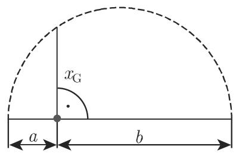

# 数学手册(原书第10版) 1.2 有限级数

本页是 [[entities/数学手册(原书第10版)]] 第 1 章第 1.2 节的源摘要。该节定义有限级数（式 1.51），依次给出等差级数（一阶与 k 阶，式 1.52–1.53）、等比级数（式 1.54）与特殊有限级数的闭式公式目录（式 1.55–1.64），随后定义算术、几何、调和、二次四种均值（式 1.65–1.68），最后给出两正数均值的严格排序不等式（式 1.69）。全节只陈述结果而不附证明，属权威汇编；所列均为可独立推导验证的标准数学恒等式。

## 章节结构

- **1.2.1 有限级数的定义**（式 1.51）——见 [[concepts/有限级数]]
- **1.2.2 等差级数**：一阶（式 1.52）与 k 阶（式 1.53，含差分表与 Newton 型通项/求和公式）——见 [[concepts/等差级数]]、[[concepts/差分]]
- **1.2.3 等比级数**（式 1.54，含 $|q|<1$ 时的无穷极限）——见 [[concepts/等比级数]]
- **1.2.4 特殊的有限级数**（式 1.55–1.64 公式目录）——见 [[concepts/幂和公式]]
- **1.2.5 均值**：算术（1.65）、几何（1.66）、调和（1.67）、二次（1.68）及两正数均值排序（1.69）——见 [[concepts/均值]]、[[concepts/均值不等式]]

## 核心公式（原文照录）

### 1.2.1 有限级数的定义

$$s_n = a_0 + a_1 + a_2 + \dots + a_n = \sum_{i=0}^{n} a_i \tag{1.51}$$

被加数 $a_i$（$i = 0, 1, 2, \dots, n$）由一定的公式给出，它们是数，称为级数的项。

### 1.2.2 等差级数

一阶等差级数是其项构成等差数列的有限级数，即相邻两项的差是常数：

$$\Delta a_i = a_{i+1} - a_i = d = \text{常数}, \quad \text{故} \quad a_i = a_0 + id \tag{1.52a}$$

$$s_n = a_0 + (a_0 + d) + (a_0 + 2d) + \dots + (a_0 + nd) \tag{1.52b}$$

$$s_n = \frac{a_0 + a_n}{2}(n+1) = \frac{n+1}{2}(2a_0 + nd) \tag{1.52c}$$

k 阶等差级数是序列 $a_0, a_1, \dots, a_n$ 的 k 阶差分 $\Delta^k a_i$ 为常数的有限级数。高阶差分按

$$\Delta^v a_i = \Delta^{v-1} a_{i+1} - \Delta^{v-1} a_i \quad (v = 2, 3, \dots, k) \tag{1.53a}$$

计算。差分表（三角模式，式 1.53b）原文如下，可用于方便地计算高阶差分：

```latex
\begin{array}{c c c c c}
a _ {0} & & & & \\
\Delta a _ {0} & & & & \\
a _ {1} & \Delta^ {2} a _ {0} & & & \\
\Delta a _ {1} & & \Delta^ {3} a _ {0} & & \\
a _ {2} & \Delta^ {2} a _ {1} & & \ddots & \Delta^ {k} a _ {0} \\
\Delta a _ {2} & & \Delta^ {3} a _ {1} & & \\
a _ {3} & \Delta^ {2} a _ {2} & & \ddots & \Delta^ {k} a _ {1} & \ddots \\
\vdots & & \vdots & \vdots & \Delta^ {n} a _ {0} \\
\vdots & \vdots & & \Delta^ {k} a _ {n - k} & \ddots \\
& & \Delta^ {3} a _ {n - 3} & \ddots \\
& \Delta^ {2} a _ {n - 2} & & \\
\Delta a _ {n - 1} & & & \\
a _ {n} & & &
\end{array}
```

对于通项与前 n 项和，有下述 Newton 前向差分型公式（式 1.53c–d）：

$$a_i = a_0 + \binom{i}{1}\Delta a_0 + \binom{i}{2}\Delta^2 a_0 + \dots + \binom{i}{k}\Delta^k a_0 \quad (i = 1, 2, \dots, n)$$

$$s_n = \binom{n+1}{1}a_0 + \binom{n+1}{2}\Delta a_0 + \binom{n+1}{3}\Delta^2 a_0 + \dots + \binom{n+1}{k+1}\Delta^k a_0$$

### 1.2.3 等比级数

若和式 (1.51) 的项构成等比数列，即相邻两项的比值为常数：

$$\frac{a_{i+1}}{a_i} = q = \text{常数}, \quad \text{故} \quad a_i = a_0 q^i \tag{1.54a}$$

则

$$s_n = a_0 + a_0 q + a_0 q^2 + \dots + a_0 q^n = a_0\,\frac{q^{n+1} - 1}{q - 1} \quad (q \neq 1) \tag{1.54b}$$

$$s_n = (n+1)\,a_0 \quad (q = 1) \tag{1.54c}$$

当 $n \to \infty$ 时（手册注明参见其第 616 页 7.2.1.1, 2.），上式是无穷等比级数；若 $|q| < 1$，级数有极限，极限值称为和 $s$：

$$s = \frac{a_0}{1 - q} \tag{1.54d}$$

### 1.2.4 特殊的有限级数（式 1.55–1.64）

| 编号 | 公式 |
|------|------|
| 1.55 | $1 + 2 + 3 + \dots + (n-1) + n = \frac{n(n+1)}{2}$ |
| 1.56 | $p + (p+1) + (p+2) + \dots + (p+n) = \frac{(n+1)(2p+n)}{2}$ |
| 1.57 | $1 + 3 + 5 + \dots + (2n-3) + (2n-1) = n^2$ |
| 1.58 | $2 + 4 + 6 + \dots + (2n-2) + 2n = n(n+1)$ |
| 1.59 | $1^2 + 2^2 + 3^2 + \dots + (n-1)^2 + n^2 = \frac{n(n+1)(2n+1)}{6}$ |
| 1.60 | $1^3 + 2^3 + 3^3 + \dots + (n-1)^3 + n^3 = \frac{n^2(n+1)^2}{4}$ |
| 1.61 | $1^2 + 3^2 + 5^2 + \dots + (2n-1)^2 = \frac{n(4n^2-1)}{3}$ |
| 1.62 | $1^3 + 3^3 + 5^3 + \dots + (2n-1)^3 = n^2(2n^2-1)$ |
| 1.63 | $1^4 + 2^4 + 3^4 + \dots + n^4 = \frac{n(n+1)(2n+1)(3n^2+3n-1)}{30}$ |
| 1.64 | $1 + 2x + 3x^2 + \dots + nx^{n-1} = \frac{1-(n+1)x^n + nx^{n+1}}{(1-x)^2} \quad (x \neq 1)$ |

### 1.2.5 均值

手册注明本节参见其第 1088 页 16.3.2.2, 1. 与第 1108 页 16.4.1.3, 1.（均未入库）。

**算术平均（值）**——n 个数 $a_1, a_2, \dots, a_n$：

$$x_A = \frac{a_1 + a_2 + \dots + a_n}{n} = \frac{1}{n}\sum_{k=1}^{n} a_k \tag{1.65a}$$

对于两个数 $a$ 和 $b$，有 $x_A = \frac{a+b}{2}$（1.65b）；数值 $a, x_A, b$ 构成等差数列。

**几何平均（值）**——n 个**正数** $a_1, a_2, \dots, a_n$：

$$x_G = \sqrt[n]{a_1 a_2 \cdots a_n} = \left(\prod_{k=1}^{n} a_k\right)^{\frac{1}{n}} \tag{1.66a}$$

对于两个正数 $a$ 和 $b$，有 $x_G = \sqrt{ab}$（1.66b）；数值 $a, x_G, b$ 构成等比数列。若 $a$ 和 $b$ 是给定的直线段，则可借助于图 1.3 (a) 或图 1.3 (b) 中的任一种方式构造长度为 $x_G = \sqrt{ab}$ 的线段。根据黄金分割，几何平均值的一种特殊情形可通过分割直线段得到（手册参见其第 260 页 3.5.2.3, (3)，未入库）。




**调和平均**——n 个数 $a_1, a_2, \dots, a_n$（$a_i \neq 0;\ i = 1, 2, \dots, n$）：

$$x_H = \left[\frac{1}{n}\left(\frac{1}{a_1} + \frac{1}{a_2} + \dots + \frac{1}{a_n}\right)\right]^{-1} = \left[\frac{1}{n}\sum_{k=1}^{n}\frac{1}{a_k}\right]^{-1} \tag{1.67a}$$

对于两个数 $a$ 和 $b$，有 $x_H = \left[\frac{1}{2}\left(\frac{1}{a} + \frac{1}{b}\right)\right]^{-1} = \frac{2ab}{a+b}$（1.67b）。

**二次均值**——n 个数 $a_1, a_2, \dots, a_n$：

$$x_Q = \sqrt{\frac{1}{n}(a_1^2 + a_2^2 + \dots + a_n^2)} = \sqrt{\frac{1}{n}\sum_{k=1}^{n} a_k^2} \tag{1.68a}$$

对于两个数 $a$ 和 $b$，有 $x_Q = \sqrt{\frac{a^2+b^2}{2}}$（1.68b）。手册指出二次均值在观测误差理论中很重要。

**两个正数均值之间的关系**（式 1.69）——对于 $x_A = \frac{a+b}{2}$、$x_G = \sqrt{ab}$、$x_H = \frac{2ab}{a+b}$、$x_Q = \sqrt{\frac{a^2+b^2}{2}}$：

(1) 若 $a < b$，则

$$a < x_H < x_G < x_A < x_Q < b \tag{1.69a}$$

(2) 若 $a = b$，则

$$a = x_A = x_G = x_H = x_Q = b \tag{1.69b}$$

## 术语与前提条件说明

- **术语**：本手册将"级数"用作"和式"的同义词——有限级数指有限和，等差级数/等比级数分别指等差数列/等比数列的求和结果（级数 = 和式，数列 = 项的序列）。这与中文数学教材的常见用法存在张力：后者通常把"级数"保留给无穷级数，把有限情形称作"数列的和"。手册在其 7.2.1.1 节（未入库）讨论无穷级数；引用本节公式时须注意这一术语差异。
- **前提条件**：几何平均要求 n 个正数（式 1.66a）；调和平均的定义仅要求 $a_i \neq 0$（式 1.67a）；而排序不等式（式 1.69）明确限定两个正数。各公式的前提条件须分开记录、不得互相挪用——含非正数时均值排序不成立。
- **与现有 wiki 无冲突**：本节与已入库的 1.1.x 各节（[[concepts/幂]]、[[concepts/根]]、[[concepts/对数]]、[[concepts/求和号]]、[[concepts/求积号]] 等）仅是使用与扩展关系。

## 与 wiki 的关联

- 本节是 [[concepts/求和号]]（式 1.51、1.65a、1.67a、1.68a）与 [[concepts/求积号]]（式 1.66a）的直接应用场景；几何平均使用 [[concepts/幂]]（$\frac{1}{n}$ 次幂）与 [[concepts/根]]（n 次方根、$\sqrt{ab}$）。
- 实质性结果分别建页：[[concepts/幂和公式]]（式 1.55–1.64 目录）、[[concepts/均值]]（四种均值定义）、[[concepts/均值不等式]] 与 [[findings/均值排序-h-g-a-q]]（式 1.69）。
- 前向线索（未入库章节）：7.2.1.1 无穷级数、16.3.2.2 与 16.4.1.3（统计学中的均值、观测误差理论）、3.5.2.3 黄金分割。
- 弱化处理：图 1.3 的作图细节与未入库章节的页码引用仅作线索保留，不单独建页。

<!-- llm-wiki:embedded-images -->
## Embedded Images

### Document


<!-- llm-wiki:embedded-images -->
