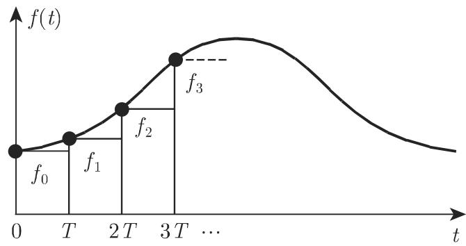

# 数学手册(原书第10版) 15.4 Z变换

本节为《数学手册》(原书第10版) 第 15 章「积分变换」的第 4 节（正文内部回指页码为第 1038–1042 页），编号范围式 (15.105)–(15.142)。主题是 [[concepts/z变换]]：连续过程用微分方程描述、以傅里叶变换与拉普拉斯变换求解；离散过程由差分方程描述，而求解差分方程「已知的最好方法是 Z变换」，它与拉普拉斯变换密切相关。本节是 15.2 拉普拉斯变换（见 [[sources/10-数学手册原书第10版--10-152-拉普拉斯变换--12vbv4w]]）在离散侧的对偶，源文亦自引 15.2.1.1 与式 (15.7b)。

## 节次结构

- **15.4.1 Z变换的性质**
  - 15.4.1.1 离散函数：$f(nT)=f_n$，离散函数与序列 $\{f_n\}$ 等价，可用阶梯函数表示（图 15.27，[[concepts/离散函数与序列]]）
  - 15.4.1.2 定义、收敛与唯一性：式 (15.105)–(15.107)；极限定理 (15.108)–(15.112)（[[concepts/z变换的极限定理]]）
  - 15.4.1.3 计算法则：移位（两条）、求和、差分、阻尼、卷积、微分、积分七组，式 (15.113)–(15.122)（[[concepts/z变换的运算规则]]）
  - 15.4.1.4 与拉普拉斯变换的关系：阶梯函数嵌入 (15.123)–(15.124)、离散拉普拉斯变换 (15.125)、代换 $e^p=z$、桥梁公式 (15.126a/b)（[[concepts/离散拉普拉斯变换]]）
  - 15.4.1.5 逆变换：四种方法 (15.127)–(15.128)，例题 (15.129)–(15.131) 四法互证（[[concepts/z逆变换]]）
- **15.4.2 Z变换的应用**
  - 15.4.2.1 线性差分方程的一般解法：式 (15.132)–(15.134)
  - 15.4.2.2 二阶差分方程（初值问题）：式 (15.135)–(15.140)，含双曲代换
  - 15.4.2.3 二阶差分方程（边值问题）：式 (15.141)–(15.142)

## 核心主张

1. **定义与收敛理论（Z变换）**：$F(z)$ 是关于 $1/z$ 的幂级数（洛朗级数），收敛理论整体移植自复幂级数：$|z|>1/R$ 绝对收敛、$|z|<1/R$ 发散、$|z|\geqslant 1/R_0>1/R$ 一致收敛；$R=\infty$（全平面收敛）或 $R=0$（不可变换）。唯一性：$F(z)$ 在 $|z|>1/R$ 解析且在 $z=\infty$ 正则（$F(\infty)=f_0$）⟺ 存在唯一原序列。
2. **极限定理（Z变换）**：初值 (15.108) 沿任意路径成立；(15.111) 可逐项恢复全序列；终值 (15.112) $\lim f_n=\lim_{z\to1+0}(z-1)F(z)$ **不可逆**——源文以 $f_n=(-1)^n$ 反例自证（$\lim_{z\to1+0}(z-1)\frac{z}{z+1}=0$ 而极限不存在）。此单向性是 (15.112) 专属命题，不可移用于 (15.108)/(15.111)。
3. **七组计算法则（Z变换）**：见式 (15.113)–(15.122)；其中卷积定理 (15.120) 相当于幂级数乘法法则。
4. **与拉普拉斯变换的关系**：阶梯函数（$T=1$）的拉普拉斯变换导出离散拉普拉斯变换 (15.125)，$e^p=z$ 代换后即洛朗级数——此代换即「Z变换」名称的由来；桥梁公式 $pF(p)=(1-1/z)F(z)$（15.126a/b）。注意式中 $F(p)$（拉普拉斯）与 $F(z)$（Z变换）**同字母异义**。
5. **逆变换四法（Z逆变换）**：表格法、洛朗级数法、$F(1/z)$ 泰勒系数公式 (15.128)、极限定理法；例题 $F(z)=\frac{2z}{(z-2)(z-1)^2}$ 四法互证，得 $f_n=2(2^n-n-1)$。
6. **差分方程解法（常系数线性差分方程）**：第二移位定理把 (15.132) 化为代数方程，通解 (15.134) 自动含初值；二阶初值问题按根 $\alpha_1\neq\alpha_2$ / $\alpha_1=\alpha_2$ 给闭式 (15.138a–g)，卷积项 $\sum p_{v-1}g_{n-v}$（15.138d）是 [[concepts/杜阿梅尔公式]] 的离散对应物；双曲代换 $a_1=-2a\cosh b,\ a_0=a^2$ 给出 (15.139)–(15.140)（复系数时数值上更有利）；边值问题由 $y_N$ 反解 $y_1$ 得 (15.141)–(15.142)，**仅当 $\alpha_1^N\neq\alpha_2^N$ 有一般解**，否则出现特征值/特征向量现象。
7. **分类学论点**：Z变换是（作用于序列的）级数变换，不属于表 15.1 的十二种积分变换之列——这是对 [[concepts/积分变换]] 页族谱的一个边界性补充。

## 关键公式（逐字转录）

```latex
F(z) = Σ_{n=0}^{∞} f_n (1/z)^n                                       (15.105)
F(z) = Z{f_n}                                                         (15.106)
{1}: F(z) = Σ (1/z)^n = z/(z-1),  收敛当 |1/z| < 1                    (15.107)
f_0 = lim_{z→∞} F(z)                                                  (15.108)
z{F(z) - f_0} = f_1 + f_2(1/z) + f_3(1/z)^2 + …                       (15.109)
z^2{F(z) - f_0 - f_1(1/z)} = f_2 + f_3(1/z) + f_4(1/z)^2 + …          (15.110)
f_1 = lim_{z→∞} z{F(z) - f_0},  f_2 = lim_{z→∞} z^2{F(z) - f_0 - f_1(1/z)}, …   (15.111)
lim_{n→∞} f_n = lim_{z→1+0} (z-1)F(z)   [单向：需先保证 lim f_n 存在]  (15.112)
Z{f_{n-k}} = z^{-k} F(z),   f_{n-k} = 0 当 n-k < 0                    (15.113)
Z{f_{n+k}} = z^k [F(z) - Σ_{v=0}^{k-1} f_v (1/z)^v]                   (15.114)
Z{Σ_{v=0}^{n-1} f_v} = F(z)/(z-1),  |z| > max(1, 1/R)                 (15.115)
Δf_n = f_{n+1} - f_n,  Δ^m f_n = Δ(Δ^{m-1} f_n),  Δ^0 f_n = f_n       (15.116)
Z{Δ^k f_n} = (z-1)^k F(z) - z Σ_{v=0}^{k-1} (z-1)^{k-v-1} Δ^v f_0     (15.117 一般式)
Z{λ^n f_n} = F(z/λ),   λ≠0, |z| > |λ|/R                               (15.118)
f_n * g_n = Σ_{v=0}^{n} f_v g_{n-v};   Z{f_n * g_n} = F(z)G(z)        (15.119, 15.120)
Z{n f_n} = -z dF(z)/dz                                                (15.121)
Z{f_n/n} = ∫_z^∞ F(ξ)/ξ dξ,   假定 f_0 = 0                            (15.122)
f(t) = f(nT) = f_n,  nT ≤ t < (n+1)T                                  (15.123)
L{f(t)} = F(p) = (1-e^{-p})/p · Σ_{n=0}^{∞} f_n e^{-np}               (15.124)
D{f_n} = Σ_{n=0}^{∞} f_n e^{-np};   代换 e^p = z                      (15.125)
p F(p) = (1 - 1/z) F(z)                                               (15.126a)
Z^{-1}{F(z)} = {f_n}                                                  (15.127)
f_n = (1/n!) d^n/dz^n F(1/z) |_{z=0}                                  (15.128)
F(z) = 2z/((z-2)(z-1)^2) = 2/z^2 + 8/z^3 + 22/z^4 + 52/z^5 + 114/z^6 + …   (15.129)
Y(z) = (1/p(z)) G(z) + (1/p(z)) Σ_{i=0}^{k-1} y_i Σ_{j=i+1}^{k} a_j z^{j-i}   (15.134)
Z^{-1}{z/p(z)} = {p_n}:  p_n = (α_1^n - α_2^n)/(α_1 - α_2)  或  n α_1^{n-1}   (15.138a)
y_n = Σ_{v=0}^{n} p_{v-1} g_{n-v} + y_0(p_{n+1} + a_1 p_n) + y_1 p_n  (15.138d)
y_n = Σ_{v=2}^{n} g_{n-v}(α_1^{v-1}-α_2^{v-1})/(α_1-α_2)
      - y_0 a_0 (α_1^{n-1}-α_2^{n-1})/(α_1-α_2) + y_1 (α_1^n-α_2^n)/(α_1-α_2)   (15.138f)
Z^{-1}{z/(z^2 - 2az cosh b + a^2)} = a^{n-1} sinh(bn)/sinh b
      [转写本分母作 "sinh n"，疑为 sinh b]                             (15.139)
y_n = (1/sinh b)[Σ_{v=2}^{n} g_{n-v} a^{v-2} sinh(v-1)b
      - y_0 a^n sinh(n-1)b + y_1 a^{n-1} sinh(nb)]                    (15.140)
y_1 = [y_0 a_0(α_1^{N-1}-α_2^{N-1}) + y_N(α_1-α_2)
       - Σ_{v=2}^{N}(α_1^{v-1}-α_2^{v-1})g_{N-v}]/(α_1^N - α_2^N)     (15.141)
y_n = (1/(α_1-α_2))Σ_{v=2}^{n}(α_1^{v-1}-α_2^{v-1})g_{n-v}
      - ((α_1^n-α_2^n)/((α_1-α_2)(α_1^N-α_2^N))) Σ_{v=2}^{N}(α_1^{v-1}-α_2^{v-1})g_{N-v}
      + [y_0(α_1^N α_2^n - α_1^n α_2^N) + y_N(α_1^n - α_2^n)]/(α_1^N - α_2^N)   (15.142)
```

## 全链条复算结论

- 式 (15.105)–(15.107)：✓ $\{1\}\mapsto z/(z-1)$（公比 $1/z$ 的几何级数），收敛域为单位圆外部。见 [[findings/式15-105至15-112-z变换定义收敛与极限定理转录复算]]。
- 式 (15.108)–(15.112)：✓ 含 $(-1)^n\mapsto z/(z+1)$ 反例验证，终值定理单向性成立。
- 式 (15.113)–(15.115)：✓ 以 $f_n=1$ 代入验证。
- 式 (15.116)–(15.117)：一般式 ✓；二阶行末项「$-z f_0$」疑脱 $\Delta$，应为 $-z\,\Delta f_0$（以 $f_n=n$ 代入：按转写文本得 $z\neq0$，按一般式得 $0$）。见 [[queries/式15-117二阶差分末项zf0疑为zδf0]]。
- 式 (15.118)–(15.121)：✓（(15.121) 以 $f_n=1$ 验证得 $z/(z-1)^2$）。
- 式 (15.123)–(15.128)：✓ 逐项推导（(15.124) 分段积分、(15.126) 代换）均吻合。见 [[findings/式15-123至15-128-z变换与拉普拉斯变换关系及逆变换方法转录复算]]。
- 式 (15.129)–(15.131)：✓ $f_n=2(2^n-n-1)$；级数系数 $0,0,2,8,22,52,114$；(15.130) 各阶导数在 $z=0$ 处值 $0,0,4,48$ 全部吻合；四法互证。见 [[findings/式15-129至15-131-四种逆变换方法例题转录复算]]。
- 式 (15.132)–(15.138g)：✓ $k=2$ 退化核对 (15.137)；(15.138d)–(15.138g) 含韦达化简均验证；化简句「$\alpha_1=-(\alpha_1+\alpha_2)$」疑为 $a_1=-(\alpha_1+\alpha_2)$。见 [[findings/式15-132至15-138-差分方程z变换求解转录复算]]、[[queries/式15-138f前韦达句α1疑为a1]]。
- 式 (15.139)–(15.140)：✓ 由阻尼法则与欧拉式独立推导吻合；但 (15.139) 分母「$\sinh n$」疑为「$\sinh b$」（量纲与推导均要求 $\sinh b$）。见 [[findings/式15-139至15-142-双曲代换与边值问题转录复算]]、[[queries/式15-139分母sinhn疑为sinhb]]。
- 式 (15.141)–(15.142)：✓ 由 (15.138f) 代数消元 $y_1$ 并合并 $y_0$ 项，$y_0(\alpha_1^N\alpha_2^n-\alpha_1^n\alpha_2^N)$ 项逐步吻合。

例题四法互证构成强内部一致性证据；三处数学内容层面的转写疑误与系统性字母脱落（见下）是仅有的保真度削弱因素，且均可由上下文复原。

## 转写保真度备注

- **系统性拉丁字母脱落**：单字母标识符 Z、D、R、k、n 在 OCR 转写中成批丢失——「可 变换的」「最好方法是 变换」「用 表示」「存在实数 」「其中 为自然数」「与 无关」。
- 其他文字讹误：千→于（「对千」「趋千」「由千」）；儿何→几何；(15.138£)→应为 (15.138f)；衍字（「$p(z)$2则」之 2、「$y_n$九」之 九）；数字拆分（「2 2」「1 1 4」「5 2」→ 22、114、52）；页码与小节号粘连（「第 97914.3.1.3」「第 1006 (15.7b)」）。详见 [[queries/15-4全节系统性转写讹误清单]]。
- 术语备注：「在离散时间段 $t_n$ 处『浏览』函数 $f(t)$」——「浏览」疑为原书对采样（德文 abtasten）的独特译法，属术语而非讹误。
- 三处数学内容层面的疑误见上文复算部分及对应 query 页。

## 与既有 wiki 的关联

- **直接延伸 15.2 体系**：[[concepts/拉普拉斯变换]]、[[concepts/初值与终值定理]]、[[concepts/拉普拉斯变换的运算规则]]、[[concepts/拉普拉斯逆变换]]、[[methodology/常系数线性常微分方程拉普拉斯求解流程]]、[[comparisons/三种逆变换方法比较]] 均有离散对偶页（见本页 related 及 [[comparisons/z变换与拉普拉斯变换关系比较]]、[[comparisons/z变换四种逆变换方法比较]]、[[comparisons/差分方程与微分方程变换求解法比较]]）。
- **复用工具**：[[concepts/部分分式分解]]（例题方法 1 与 15.4.2.2）、[[concepts/泰勒级数]]（15.128）、[[concepts/复项幂级数]]／[[concepts/收敛圆与收敛半径]]（15.4.1.2 收敛理论）、[[concepts/阶梯函数]]（15.123、图 15.27）、[[concepts/卷积定理]]（离散版扩展，另建 [[concepts/离散卷积]]）、[[concepts/复三角函数与双曲函数]]（双曲代换与「复变量双曲函数」注记）。
- **族谱边界**：[[concepts/积分变换]] 与 [[comparisons/表15-1十二种积分变换核与记号比较]]——Z变换不在表 15.1 之列，属级数型变换。
- **缺口**：洛朗级数（14.3.4，第 981 页）原无概念页，已随本次补建 [[concepts/洛朗级数]]；15.3（傅里叶变换节）尚无 source 页，见 [[queries/15-4未入库回指缺口]]。



<!-- llm-wiki:embedded-images -->
## Embedded Images

### Document


<!-- llm-wiki:embedded-images -->
