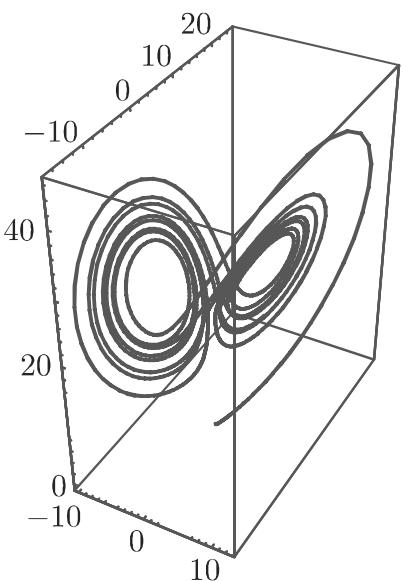
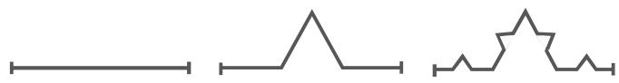
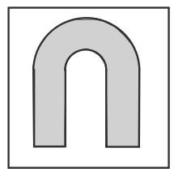
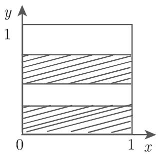
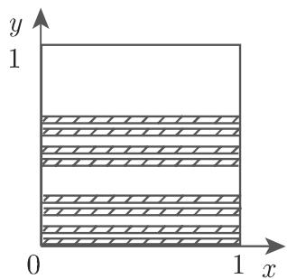
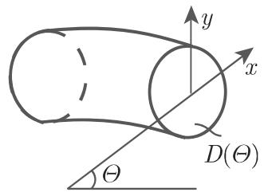
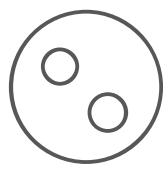

# 数学手册(原书第10版) 17.2.4 维数

本页是《数学手册（原书第10版）》第 17 章 17.2 节「吸引子的量化描述」第 4 小节「维数」的来源摘要页。该小节为 17.2 收尾：在 17.2.1（[[sources/10-数学手册原书第10版--14-1721-吸引子上的概率测度--qm9tb9]]）给出吸引子上的概率测度与熵之后，本节系统回答「当吸引子不再是点、曲线或环面时，如何定量刻画其大小」。OCR 转写讹误密度与 17.1.x、17.2.1 各节相当，其中两处具有数学实质（信息维数定义式疑脱负号、面包师映射 α 区间倒置），已立专辨；系统性讹误汇总于 [[queries/17-2-4全节系统性转写讹误清单]]。

## 内容结构

- **17.2.4.1 测度维数**：分形的动机性描述 → [[concepts/康托尔集]] 构造 → 由勒贝格体积的覆盖思想导出[[concepts/豪斯多夫测度与豪斯多夫维数]]（式 17.41，性质 HD1–HD6）→ 覆盖计数意义的[[concepts/盒维数（容量）]]（式 17.42，性质 BD1–BD4）→ [[concepts/自相似性]] 统一公式 $d_B=d_H=\ln p/\ln q$（康托尔集、科赫曲线、谢尔平斯基垫圈与地毯四例）。
- **17.2.4.2 由不变测度定义的维数**：[[concepts/点维数与测度的豪斯多夫维数]]（式 17.43 与杨氏定理）、[[concepts/信息维数]]（式 17.45–17.46）、[[concepts/相关维数]]（式 17.47，时序可计算）、[[concepts/广义维数（瑞尼维数谱）]]（式 17.48–17.49，$q=0/1/2$ 分别给出支撑容量、信息维数、相关维数）、[[concepts/李雅普诺夫维数]]（式 17.50 与勒德拉皮耶定理、式 17.51 启发式估计、式 17.52 埃农吸引子）。
- **17.2.4.3 来自杜阿迪和厄斯特勒的局部豪斯多夫维数**：[[concepts/杜阿迪—厄斯特勒定理与厄斯特勒维数]]（式 17.53），应用于洛伦茨吸引子（式 17.54）。
- **17.2.4.4 吸引子的例子**：[[concepts/马蹄映射]]（例 A，式 17.55）、[[concepts/耗散面包师映射]]（例 B，式 17.56a–d，维数与熵精确可算）、[[concepts/螺线管]]（例 C，式 17.57，双曲吸引子、结构稳定正例）。

## 关键公式逐字转录

```latex
% 豪斯多夫维数（17.41）
mu_{d,eps}(A) = inf{ sum_i (diam B_i)^d : A subset cup_i B_i, diam B_i <= eps }   (17.41a)
mu_d(A)       = lim_{eps->0} mu_{d,eps}(A) = sup_{eps>0} mu_{d,eps}(A)            (17.41b)
d_H(A)        = { +inf, 若 mu_d(A) != 0 对一切 d >= 0;  inf{ d >= 0 : mu_d(A) = 0 } }  (17.41c)
% 性质 HD1 d_H(空集)=0；HD2 A⊂ℝⁿ ⟹ 0≤d_H(A)≤n；HD3 单调；HD4 可数稳定
%      d_H(∪A_i)=sup_i d_H(A_i)；HD5 有限/可数集 d_H=0；
%      HD6 利普希茨映射下不增，双利普希茨下不变

% 盒维数／容量（17.42）
d̄_B(A) = limsup_{eps->0} ln N_eps(A) / ln(1/eps)                                (17.42a)
d_B(A)  = liminf_{eps->0} ln N_eps(A) / ln(1/eps)                                (17.42b)
% BD1 d_H(A) ≤ d_B(A)；BD2 光滑 m 维曲面 d_H=d_B=m；
% BD3 d_B(A)=d_B(闭包A)；BD4 可数稳定性对盒维数一般不成立【前句疑脱 HD4 对照】

% 自相似：康托尔集(p,q)=(2,3)、科赫曲线(4,3)、谢尔平斯基垫圈(3,2)、地毯(8,3)
d_B = d_H = ln p / ln q

% 点维数与杨氏定理（17.43–17.44）
b̄_mu(x) = limsup_{δ->0} ln mu(B_δ(x)) / ln δ                                    (17.43a)
b_mu(x)  = liminf_{δ->0} ln mu(B_δ(x)) / ln δ                                    (17.43b)
mu(B_δ(x)) ~ δ^n 且 d_H(mu) = n                                                  (17.44)

% 信息维数（17.45）与杨氏定理（17.46）
H(eps) = − sum_{i=1}^{n(eps)} p_i(eps) ln p_i(eps),  p_i(eps) = mu(Q_i(eps))     (17.45)
d_I(mu) = lim_{eps->0} H(eps)/ln eps        【源文无负号，疑脱；对照 (17.48b)】
alpha = d_H(mu) = d_I(mu)                                                        (17.46)

% 相关积分与相关维数（17.47）；dist_m(x_i,x_j)=max_{0<=s<=m}‖y_{i+s}−y_{j+s}‖
C^m(eps) = limsup_{N->inf} (1/N^2) sum_{i,j=1}^N Θ(eps − dist(x_i,x_j))          (17.47a)
d_K = lim_{eps->0} ln C^m(eps) / ln eps                                          (17.47b)

% 广义维数／瑞尼维数（17.48–17.49）
H_q(eps) = 1/(1−q) ln sum_{i=1}^{n(eps)} p_i(eps)^q                              (17.48a)
d_q = − lim_{eps->0} H_q(eps)/ln eps                                             (17.48b)
q=0: d_0 = d_C(supp mu);  q=1: d_1 = lim_{q->1} d_q = d_I(mu);  q=2: d_2 = d_K   (17.49a–c)

% 李雅普诺夫维数（17.50–17.52）；k 为满足 sum_{i<=k}λ_i>=0 且 sum_{i<=k+1}λ_i<0 的最大指标
d_L(mu) = k + (sum_{i=1}^k λ_i)/|λ_{k+1}|                                        (17.50)
d_B ≈ 1 − ln σ_1/ln σ_2 = 1 + λ_1/|λ_2|        （σ_1>1>σ_2 奇异值启发式）        (17.51)
d_L(mu) ≈ 1 + 0.42/1.62 ≈ 1.26                  （埃农吸引子）                    (17.52)

% 杜阿迪—厄斯特勒（17.53–17.54）；α_i 为对称化雅可比矩阵特征值
d_DO = { 0, α_1 ≤ 0;  sup{ d : 0≤d≤n, α_1+…+α_[d] + (d−[d])α_[d]+1 ≥ 0 } }      (17.53)
d_H(Λ) ≤ 3 − (σ+b+1)/κ,  κ = ½[σ+b+√((σ−b)² + (b/√(b−1)+2)σr)]                  (17.54a,b)

% 吸引子例子（17.55–17.57）
Λ = ∩_{k=0}^inf φ^k(M)                                                           (17.55)
φ(x,y) = { (2x, αy), 0≤x≤1/2;  (2x−1, αy+1/2), 1/2<x≤1 }       【α 区间疑为 (0,1/2)】(17.56a)
d_H(Λ) = 1 + ln2/(−ln α);  d_L(mu) = 1 + ln2/(−ln α) = d_H(Λ)                    (17.56b,c)
h_mu = sum_{λ_i>0} λ_i = ln 2                 （佩辛熵公式，源文以「此时」限定）(17.56d)
Θ_{k+1} = 2Θ_k,  (x,y)_{k+1} = ½(cos Θ_k, sin Θ_k) + α(x,y)_k                   (17.57)
% 螺线管：d_H(Λ) = 1 − ln2/ln α（= 1 + ln2/|lnα|）
```

## 数值复算

| 主体 | 断言 | 源文值 | 复算 | 判定 |
|---|---|---|---|---|
| 康托尔集 | $d_H=\ln2/\ln3$ | ≈0.6309 | 0.63093 | ✓ |
| $A=\{0,1,\tfrac12,\tfrac13,\dots\}$ | $d_H=0,\ d_B=\tfrac12$ | — | $N_\varepsilon\asymp\varepsilon^{-1/2}$（孤立点下界与聚点区间上界同为 $\varepsilon^{-1/2}$） | ✓ |
| $\mathbb{Q}\cap[0,1]$ | $d_H=0,\ d_B=1$ | — | 闭包 $=[0,1]$（BD3），可数（HD5） | ✓ |
| 埃农吸引子（$a=1.4,b=0.3$） | $\lambda_1+\lambda_2=\ln b$ | ≈−1.204 | $\ln 0.3=-1.20397$ | ✓ |
| 埃农吸引子 | $\lambda_2\approx-1.62$、$d_L\approx1.26$ | — | $-1.624$；$1+0.42/1.62=1.259$；文献 $\lambda_1\approx0.418$、$d_L\approx1.258$ | ✓ |
| 洛伦茨吸引子（$\sigma=10,b=8/3,r=28$） | $d_H\approx2.06$ | — | 文献值 ≈2.062 | ✓ |
| 洛伦茨吸引子 | DO 上界（17.54） | 未给数值 | $\kappa=23.597$，$3-13.6667/23.5970\approx2.421>2.06$ | 有效上界 ✓ |
| 耗散面包师映射 | $d_H=d_L=1+\ln2/|\ln\alpha|$ | 精确 | 代数核验；$d_H<2\iff\alpha<1/2$（佐证区间讹误） | ✓ |
| 螺线管 | $d_H=1-\ln2/\ln\alpha$ | 精确 | $=1+\ln2/|\ln\alpha|\in(1,2)$（$\alpha\in(0,\tfrac12)$） | ✓ |
| 自相似四例 | $\ln p/\ln q$ | 仅给 $p,q$ | 0.63093 / 1.26186 / 1.58496 / 1.89279 | ✓ |

## 断言与主体对照

- **康托尔集**：$\lambda(C)=0$、紧、不可数、完美；$d_H(C)=\ln2/\ln3$。
- **埃农吸引子（$a=1.4,b=0.3$）**：数值 $d_B\approx1.26$；可证其上支撑 SRB 测度；$\lambda_1\approx0.42$（数值）、$\lambda_1+\lambda_2=\ln b$、$\lambda_2\approx-1.62$、$d_L\approx1.26$（数值）。$d_L\approx d_B$ 的吻合是**数值层面**的，源文未表述为定理，不得外推。
- **洛伦茨吸引子（$\sigma=10,b=8/3,r=28$）**：数值 $d_H\approx2.06$；DO 上界对任意 $b>1,\sigma>0,r>0$ 成立。
- **耗散面包师映射**：$d_H=d_L=1+\ln2/|\ln\alpha|$（**精确**）；不变测度 $\mu\ne$ 勒贝格测度；$\lambda_1=\ln2$、$\lambda_2=\ln\alpha$；佩辛公式 $h_\mu=\ln2$（源文以「此时」限定于该系统）。
- **螺线管**：$d_H=1-\ln2/\ln\alpha$（精确）；有吸引邻域；$C^1$ 小扰动下结构稳定；为双曲吸引子之例。
- **例 A 马蹄型映射**：$\Lambda=\bigcap_k\varphi^k(M)$ 紧不变；源文称其吸引 $M$ 中除一点外所有点、局部为「直线×康托尔集」——与经典构造冲突，见 [[queries/马蹄例子吸引性与经典构造不符之辨]]。
- **一般原理**：HD1–HD6、BD1–BD4、$\ln p/\ln q$、杨氏定理两则、$d_0/d_1/d_2$ 特例、勒德拉皮耶 $d_H(\mu)\le d_L(\mu)$、DO 定理 $d_H(\Lambda)\le\sup d_{DO}$。

## 证据强度

定义与性质为标准结果，转录基本可靠（个别脱字）。四个定理（杨氏、勒德拉皮耶、杜阿迪—厄斯特勒、佩辛）为手册式断言，无证明；式 17.51 明示为「启发式的估计」。数值断言（埃农、洛伦茨）与公开文献一致，但手册未给计算细节（图 17.17 注明 Mathematica 生成），强度中等。面包师、螺线管与自相似分形的维数公式可完全复核。$\kappa$ 公式（17.54b）无法由本节文字独立推导，复算仅证其自洽且为有效上界（$2.421>2.06$），需对照印本与所引文献。

## 与既有 wiki 的联系

- **加强**：[[entities/埃农映射]]、[[concepts/埃农映射]]（吸引子维数、SRB、$\lambda_1+\lambda_2=\ln b$ 与既有雅可比判据衔接）；[[concepts/洛伦茨系统]]、[[entities/洛伦茨]]（$d_H\approx2.06$、上界 2.421）；[[concepts/SRB测度]]（埃农例）；[[concepts/测度熵]]（佩辛公式连接熵与李雅普诺夫指数）；[[concepts/结构稳定性]]（螺线管为正例，呼应 17.1.4 中「结构稳定系统在高维非通有」的张力）；[[concepts/横截同宿点]]、[[concepts/稳定流形与不稳定流形]]（例 A 引子）；[[concepts/勒贝格测度 λ]]（豪斯多夫测度构造、面包师不变测度）；[[methodology/离散映射耗散性雅可比行列式判据流程]]（面包师 $\det=2\alpha<1$、埃农 $\det=b$）；[[methodology/方体分割测度熵计算流程]]（$H(\varepsilon)$、$H_q(\varepsilon)$ 同一方体覆盖框架）。
- **延伸**：17.2.1 的自然测度/SRB/熵 → 完整维数谱系；[[concepts/伯努利转移映射]]、[[concepts/帐篷映射]]（面包师 $x$ 坐标为倍增映射、$h_\mu=\ln2$——此联系为**推断**，非源文明言）。
- **回指缺口**：17.2.2.2（第 1144 页方体覆盖）、17.2.3（李雅普诺夫指数定义）、参考文献 [17.8][17.20][17.4] 均未入库，见 [[queries/17-2-4未入库回指缺口]]；式 (17.1)(17.2)(17.3)(17.6) 已入库。

## 配图



其余配图（图 17.14–17.16 自相似分形、图 17.18 马蹄、图 17.19 面包师、图 17.20 螺线管）分别嵌入 [[concepts/自相似性]]、[[concepts/马蹄映射]]、[[concepts/耗散面包师映射]]、[[concepts/螺线管]] 页面。

<!-- llm-wiki:embedded-images -->
## Embedded Images

### Document













<!-- llm-wiki:embedded-images -->
