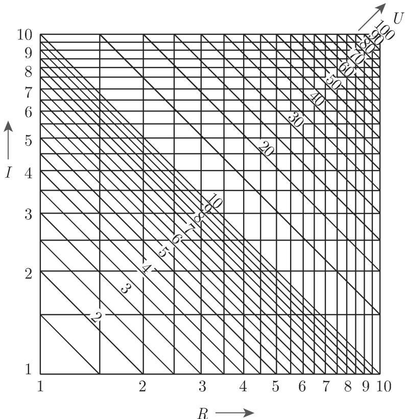

# 数学手册(原书第10版) 2.19 算图法

本页对应《数学手册(原书第10版)》第 2 章第 19 节「算图法」（卷末署名「胡俊美 译」）。全节建立「方程形式 → 算图类型」的构造理论：先以等高线构造网络算图（2.19.2），再以三点共线的行列式判据建立贯线算图及其三种构型（2.19.3），最后以辅助变量分解法处理三个以上变量的公式（2.19.4）。本节是第 2 章靠后的应用性小节，紧接 [[sources/10-数学手册原书第10版--11-216-经验曲线的确定--1bsif90]]（2.16 经验曲线的确定），向前依赖手册 2.17.1（标度，第 149–150 页）与 2.18.1.2（等高线，第 154 页），并跨章引用 (3.301)（三角形面积行列式，第 3 章）与 1.6.2.3（三次方程，第 1 章）——这些前置章节尚未纳入本维基（见 [[concepts/标度]]、[[concepts/等高线]] 桩页）。

## 2.19.1 算图（总纲）

算图是描述三个或更多个变量间函数对应关系的图示；由算图可以直接读出已知公式（关键公式）在定义域中各变量所对应的值。最常见的算图是**网络算图**与**贯线算图**。原文附时代注记：即使在计算机时代，实验室还常常使用网络算图，如用它们计算近似值或进行迭代时的初始推断——后者恰与 2.16 的非线性拟合初值选取（[[methodology/经验曲线确定三步法]]）互补。

## 2.19.2 网络算图

为表示由方程

$$F(x, y, z) = 0 \tag{2.292}$$

给出的各变量间的对应关系（多数情形可直接表示成 $z = f(x, y)$），把变量看成空间中的坐标：方程 (2.292) 定义一个曲面，利用**等高线**（参见 2.18.1.2）可在二维平面上将其直观化。每个变量被赋予一族曲线，构成一个网：平行于坐标轴的直线族表示变量 $x$ 与 $y$，等高线族表示变量 $z$。

**算例（[[concepts/欧姆定律|欧姆定律]] $U = R \cdot I$，图 2.108）**：电压 $U$ 用依赖于两个变量的等高线表示；把 $R$、$I$ 选为笛卡儿坐标时，对任意常数，方程 $U = $ 常数对应一条双曲线。通过图像可读出每对 $(I, R)$ 对应的 $U$、每对 $(R, U)$ 对应的 $I$、每对 $(I, U)$ 对应的 $R$；研究范围限于定义域 $0 < R < 10$、$0 < I < 10$、$0 < U < 100$。注 (1)：改变标度可把算图用于其他区域，例如定义域变为 $0 < I < 1$（$R$ 不变）时，$U$ 的双曲线标记变为 $U/10$。

图 2.108

注 (2)（标度化直原理）：利用标度（参见 2.17.1）有可能把复杂曲线的算图转换成直线算图。利用 $x, y$ 的等分标度，每个形如

$$r\,\varphi(z) + y\,\psi(z) + \chi(z) = 0 \tag{2.293}$$

的方程都能表示成由直线组成的算图；若利用函数标度 $x = f(z_2),\ y = g(z_2)$，对于变量 $z_1, z_2, z_3$，形如

$$f(z_2)\,\varphi(z_1) + g(z_2)\,\psi(z_1) + \chi(z_1) = 0 \tag{2.294}$$

的方程能够表示为平行于坐标轴的两族曲线和任意一族直线。（两式的转写疑点见 [[queries/式2-293的r是否应为x]] 与 [[queries/式2-294变量下标是否错乱]]。）

**算例（对数标度化直，图 2.109）**：对 $R \cdot I = U$ 取对数得 $\log R + \log I = \log U$；令 $x = \log R,\ y = \log I$，有 $x + y = \log U$，即 (2.294) 的特殊形式，得到直线算图。

图 2.109

## 2.19.3 贯线算图

变量 $z_1, z_2, z_3$ 间的关系图可通过赋予每个变量一个标度（参见 2.17.1）来实现。$z_i$ 的标度方程为

$$x_i = \varphi_i(z_i), \quad y_i = \psi_i(z_i) \quad (i = 1, 2, 3), \tag{2.295}$$

函数 $\varphi_i, \psi_i$ 应使得满足算图方程的三个变量位于同一直线上；为此三点构成的三角形面积必须为 0（参见 (3.301)），即必有

$$\begin{vmatrix} \varphi_1(z_1) & \psi_1(z_1) & 1 \\ \varphi_2(z_2) & \psi_2(z_2) & 1 \\ \varphi_3(z_3) & \psi_3(z_3) & 1 \end{vmatrix} = 0. \tag{2.296}$$

能够转化成形式 (2.296) 的三个变量间的任意关系都可用贯线算图表示。随后给出三个重要特例（构型）。

### 2.19.3.1 过一点具有三个直线标度的贯线算图

若零点是具有三个标度 $z_1, z_2, z_3$ 的直线的公共点（三条标度直线位于过原点的直线 $y = m_i x$ 上），则 (2.296) 化为 (2.297)，计算行列式得

$$\frac{m_2 - m_3}{\varphi_1(z_1)} + \frac{m_3 - m_1}{\varphi_2(z_2)} + \frac{m_1 - m_2}{\varphi_3(z_3)} = 0 \tag{2.298a}$$

或

$$\frac{C_1}{\varphi_1(z_1)} + \frac{C_2}{\varphi_2(z_2)} + \frac{C_3}{\varphi_3(z_3)} = 0, \quad C_1 + C_2 + C_3 = 0. \tag{2.298b}$$

算例：$\dfrac{1}{a} + \dfrac{1}{b} = \dfrac{2}{f}$ 是 (2.298b) 的一种特殊情况，在光学、电阻的并联等中是重要关系；相应的贯线算图由 3 条标度相同的直线构成。

### 2.19.3.2 具有两平行倾斜直线标度和一条倾斜直线标度的贯线算图

第一个标度在 $y$ 轴上，第二个在与它距离为 $d$ 的平行线上，第三个标度在直线 $y = mx$ 上，此时 (2.296) 化为 (2.299)；按第一列展开得

$$d\,(m\varphi_3(z_3) - \psi_1(z_1)) + \varphi_3(z_3)(\psi_1(z_1) - \psi_2(z_2)) = 0, \tag{2.300a}$$

因此 $\psi_1(z_1)\dfrac{\varphi_3(z_3) - d}{\varphi_3(z_3)} - (\psi_2(z_2) - md) = 0$ 或

$$f(z_1) \cdot g(z_3) - h(z_2) = 0. \tag{2.300b}$$

有时为使用方便引入分度标度 $E_1, E_2$（(2.300c)：$E_1 f(z_1) \cdot \frac{E_2}{E_1} g(z_3) - E_2 h(z_2) = 0$），则 $\varphi_3(z_3) = \dfrac{d}{1 - \frac{E_2}{E_1} g(z_3)}$；可选 $E_2 : E_1$ 使第三个标度接近或集中在某一点。令 $m = 0$，则第三个标度线穿过第一、第二标度的起点，此时两个标度必须被方向相反的标度划分取代，而第三个标度位于二者之间。

**算例（极角，图 2.110）**：$xOy$ 面上一点的笛卡儿坐标 $x, y$ 与极坐标角度 $\varphi$ 之间的关系为

$$y^2 = x^2 \tan^2 \varphi, \tag{2.301}$$

$x, y$ 的标度划分相同但方向相反；第三个标度与第一、第二标度的交点分别记为 $\varphi = 0^\circ$ 与 $\varphi = 90^\circ$。例如 $x = 3,\ y = 3.5$ 时 $\varphi \approx 49.5^\circ$。

图 2.110

（标题中第一个「倾斜」疑为衍文，见 [[queries/2-19-3-2标题两平行倾斜中的倾斜是否为衍文]]。）

### 2.19.3.3 具有两平行直线和一条曲线标度的贯线算图

一个直线标度在 $y$ 轴，另一个直线标度与它的距离为 $d$，则 (2.296) 化为 (2.302)，展开得 (2.303a)。设第一个标度分度为 $E_1$、第二个为 $E_2$（$\psi_1 = E_1 f,\ \psi_2 = E_2 g$），则化为

$$E_1 f(z_1) + E_2 g(z_2)\,\frac{E_1}{E_2} h(z_3) + E_1 k(z_3) = 0, \tag{2.303b}$$

且

$$\varphi_3(z_3) = \frac{d E_1 h(z_3)}{E_2 + E_1 h(z_3)}, \quad \psi_3(z_3) = -\frac{E_1 E_2 k(z_3)}{E_2 + E_1 h(z_3)}. \tag{2.303c}$$

**算例（简化的三次方程 $z^3 + p^* z + q^* = 0$，参见 1.6.2.3，图 2.111）**：其形式为 (2.303b)。经代换 $E_1 = E_2 = 1,\ f(z_1) = q^*,\ g(z_2) = p^*,\ h(z_3) = z$ 后，计算曲线标度坐标的公式为 $x = \varphi_3(z) = \dfrac{d \cdot z}{1 + z}$ 与 $y = \psi_3(z) = -\dfrac{z^3}{1 + z}$。图 2.111 仅示 $z$ 取正数时的曲线标度；若用 $-z$ 代替 $z$，确定方程 $z^3 + p^* z + q^* = 0$ 的正根后，可得到 $z$ 的负值（该句语序疑有错乱，见 [[queries/2-19-3-3负根句的表述是否错乱]]）。复根 $u + iv$ 也可由算图确定：实根总存在，记为 $z_1$，复根实部 $u = -\dfrac{z_1}{2}$，虚部 $v$ 由方程 $3u^3 - v^2 + p^* = \dfrac{3}{4} z_1^2 - v^2 + p^* = 0$ 得到（$3u^3$ 疑应为 $3u^2$，见 [[queries/复根公式的3u3是否应为3u2]]）。算例：$y^3 + 2y - 5 = 0$，即 $p^* = 2,\ q^* = -5$，有 $z_1 \approx 1.3$。

图 2.111

## 2.19.4 三个以上变量的网络算图

构造含三个以上变量公式的算图：借助辅助变量将表达式分解成几个公式，使每个公式仅含三个变量；每个辅助变量必须恰好包含在两个新的方程中；所有的方程都用一个贯线算图来表示，且共同的辅助变量具有相同的标度。（标题「网络算图」与正文「贯线算图」用词不一致，见 [[queries/2-19-4标题网络算图与正文贯线算图是否矛盾]]。）

## 独立复核摘要

- (2.297)→(2.298a) 的行列式展开经独立复核成立（整体差一个符号，不影响 = 0）。
- (2.299)→(2.300a)、(2.302)→(2.303a–c) 及三次方程曲线标度公式经独立代数复核一致。
- 数值复核：$\arctan(3.5/3) \approx 49.4^\circ$，与算图读数 $49.5^\circ$ 相符于算图精度；$y^3 + 2y - 5 = 0$ 的真根 $\approx 1.328$、复根 $\approx -0.664 \pm 1.823i$，算图读数 $1.3$ 符合其精度。
- 推注（非原文）：$\frac{1}{a} + \frac{1}{b} = \frac{2}{f}$ 即 $f = \frac{2ab}{a + b}$（$a, b$ 的调和平均）。
- 隐含限制（原文未言明）：复根确定式仅适用于「单实根 + 共轭复根」情形，三实根时 $v^2 < 0$。

## 相关页面

- 概念：[[concepts/算图]]、[[concepts/网络算图]]、[[concepts/贯线算图]]、[[concepts/欧姆定律]]、[[concepts/标度]]、[[concepts/等高线]]
- 发现：[[findings/网络算图的等高线构造与欧姆定律算例]]、[[findings/标度化直原理与对数直线算图]]、[[findings/贯线算图的共线行列式判据]]、[[findings/共点三直线标度与调和平均关系]]、[[findings/两平行一斜标度构型与极角算例]]、[[findings/两平行与曲线标度构型及三次方程算例]]、[[findings/多变量公式的辅助变量分解法]]
- 比较：[[comparisons/网络算图与贯线算图比较]]、[[comparisons/贯线算图三种构型比较]]
- 方法：[[methodology/算图构造与判型法]]

<!-- llm-wiki:embedded-images -->
## Embedded Images

### Document

<!-- llm-wiki:embedded-images -->
