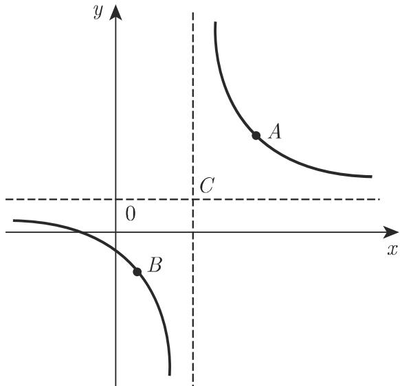
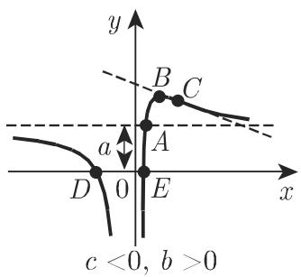
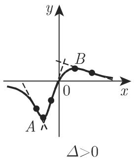
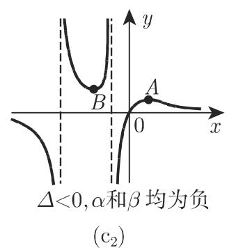

# 数学手册(原书第10版) 2.4 有理函数

《数学手册(原书第10版)》第 2 章第 4 节，是 [[entities/数学手册原书第10版]] 系列采集的第 7 份切片，紧接 [[sources/10-数学手册原书第10版--6-23-多项式--l0zhnw]]（2.3 多项式）之后由多项式自然过渡到有理函数。本节给出六个定义式（式 2.45–2.50），覆盖五类特殊有理函数族（反比 y = a/x 是线性分式函数的特款，手册单列一小节），对每一族给出完整的图像要素手册条目——曲线类型、渐近线、间断点、单调性、极值点、拐点、对称性以及与坐标轴的交点——并附显式坐标公式。注意：本节只覆盖分子、分母次数均不超过 2 的特型，不含部分分式分解等一般有理函数理论。

## 定义式（源文逐字保留）

```latex
y = a/x                                                    (2.45)
y = (a₁x+b₁)/(a₂x+b₂),  a₂ ≠ 0, Δ = |a₁ b₁; a₂ b₂| = a₁b₂−b₁a₂ ≠ 0    (2.46)
y = a + b/x + c/x² = (ax²+bx+c)/x²,  b ≠ 0, c ≠ 0          (2.47)
y = 1/(ax²+bx+c),  a ≠ 0                                   (2.48)
y = x/(ax²+bx+c),  a ≠ 0, b ≠ 0, c ≠ 0                     (2.49)
y = a/xⁿ = ax⁻ⁿ,  a ≠ 0, n 为大于零的整数                    (2.50)
```

## 五族图像要素总览

| 小节 | 函数族 | 曲线类型 | 渐近线 | 形态判据 |
|---|---|---|---|---|
| 2.4.1 | [[concepts/反比例函数]]（源文称「反比」） | [[concepts/等轴双曲线]] | 两条坐标轴 | a 的符号 |
| 2.4.2 | [[concepts/线性分式函数]] | 等轴双曲线 | x = −b₂/a₂ 与 y = a₁/a₂ | Δ = a₁b₂−b₁a₂ 的符号 |
| 2.4.3 | [[concepts/第I类三次曲线]] | 三次曲线（第I类） | x = 0 与 y = a | b、c 的符号；交点个数按 b²−4ac |
| 2.4.4 | [[concepts/第II类三次曲线]] | 三次曲线（第II类） | x 轴（另有对称轴 x = −b/(2a)） | a 与 Δ = 4ac−b² 的符号 |
| 2.4.5 | [[concepts/第III类三次曲线]] | 三次曲线（第III类） | x 轴 | Δ = 4ac−b²、b 的符号、根 α, β 的符号 |
| 2.4.6 | [[concepts/倒数幂]] | 双曲型曲线 | 两条坐标轴 | a 的符号、n 的奇偶 |

## 分族要点

### 2.4.1 反比（式 2.45）

y = a/x 的图像为中心在原点的等轴双曲线，渐近线为坐标轴，间断点 x = 0（y = ±∞）。a > 0 时两支均严格单调递减、位于一、三象限；a < 0 时均严格递增、位于二、四象限。顶点：a > 0 时为 (√a, √a)、(−√a, −√a)；a < 0 时为 (−√|a|, √|a|)、(√|a|, −√|a|)。无极值。手册注明双曲线的更详细说明见第 271 页 3.5.2.9（尚未采集）。详见 [[findings/反比函数的等轴双曲线要素]]。


### 2.4.2 线性分式函数（式 2.46）

中心 C(−b₂/a₂, a₁/a₂)；将中心平移至原点后化为式 2.45，参数对应 a ↦ −Δ/a₂²（Δ 为系数行列式 a₁b₂ − b₁a₂）。顶点为 ((−b₂ ± √|Δ|)/a₂, (a₁ + √|Δ|)/a₂) 与 ((−b₂ ± √|Δ|)/a₂, (a₁ − √|Δ|)/a₂)，Δ < 0 时取相同符号、Δ > 0 时取相反符号。间断点 x = −b₂/a₂；Δ < 0 时两支均递减、Δ > 0 时均递增；无极值。详见 [[findings/线性分式函数的中心顶点与参数对应]]。

### 2.4.3 第I类三次曲线（式 2.47）

两条渐近线 x = 0 与 y = a；两个分支中，一支上 y 在 a 与 +∞（或 −∞）之间单调变化，另一支穿过横坐标呈 1:2:3 比例的三个特征点：与渐近线 y = a 的交点 A(−c/b, a)、极值点 B(−2c/b, a − b²/(4c))、拐点 C(−3c/b, a − 2b²/(9c))。与 x 轴的交点：a ≠ 0 时为 ((−b ± √(b²−4ac))/(2a), 0)，按 b² − 4ac 大于/等于/小于 0 分为两个交点、一个切点（x 轴为切线）、无交点；a = 0 时唯一交点 (−c/b, 0)。退化：b = 0 时化为 y = a + c/x²（倒数幂平移型）；c = 0 时化为单应函数 y = (ax+b)/x，即式 2.46 的特例。详见 [[findings/第I类三次曲线的1-2-3三特征点与交点判别]]。

### 2.4.4 第II类三次曲线（式 2.48）

关于铅直直线 x = −b/(2a) 对称，x 轴为渐近线；形状取决于 a 与 Δ = 4ac − b² 的符号，a < 0 情形可经「系数全部变号再沿 x 轴反射」化为 a > 0。按 Δ 三情形：Δ > 0 时函数处处为正的连续函数，在 (−∞, −b/(2a)) 上递增并取得极大值 4a/Δ（极值点 A(−b/(2a), 4a/Δ)），再递减；拐点 B, C = (−b/(2a) ± √Δ/(2a√3), 3a/Δ)，拐点处切线斜率 tan φ = ∓a²(3/Δ)^{3/2}。Δ = 0 时 x₀ = −b/(2a) 为二重极点，两侧均趋于 +∞。Δ < 0 时有两个一重间断点 x = (−b ± √(−Δ))/(2a)，其间有极大值 4a/Δ（负值）。详见 [[findings/第II类三次曲线按判别式三情形的公式体系]]。

### 2.4.5 第III类三次曲线（式 2.49）

过原点，x 轴为渐近线；性状除 a 与 Δ = 4ac − b² 外，Δ = 0 时还与 b 的符号有关，Δ < 0 时还与方程 ax² + bx + c = 0 的根 α, β 的符号有关，共给出 6 种行为模式（含「α, β 符号互异时无极值」）。Δ > 0 时极值点 A, B = (±√(c/a), (−b ± 2√(ac))/Δ)（± 为同号配对，经推导确认），且曲线有三个拐点；其余各情形均只有一个拐点。详见 [[findings/第III类三次曲线的六种行为模式与极值点配对]]。

### 2.4.6 倒数幂（式 2.50）

y = a/xⁿ 的图像为双曲型曲线，坐标轴为渐近线，间断点 x = 0，无极值。n 为偶数时曲线关于 y 轴对称，n 为奇数时关于原点中心对称；n 越大，曲线趋近 x 轴的速度越快、趋近 y 轴的速度越慢。手册附 a = 1 时 n = 2 与 n = 3 的图像。详见 [[findings/倒数幂的奇偶对称与趋近速度]]。


## 验证状态

对本节全部特征点坐标公式（顶点、中心、交点、极值点、拐点及切线斜率）已做独立重推导，并以数值例双重验证（如式 2.48 取 a = 1, b = 0, c = 1 时，拐点 (±1/√3, 3/4) 与斜率 ∓3√3/8 经对 y = 1/(x²+1) 直接求导核对吻合），未发现数学错误。六个发现页均标注 confidence: high。其中式 2.46 的参数对应 a = −Δ/a₂² 与式 2.47 的 1:2:3 横坐标结构是最有复用价值的两个结果。

## 矛盾与张力

1. **节内判别式符号双约定（最重要）**：2.4.3 用标准形式 b² − 4ac 判交点个数，而 2.4.4/2.4.5 定义 Δ = 4ac − b²（反号）；加上 2.4.2 中 Δ 又表示系数行列式 a₁b₂ − b₁a₂，同一节内「Δ」有三重含义、二次判别式有两种符号约定。这是 [[queries/2-3-2与1-6的二次判别式符号约定是否一致]] 所记录分歧的第三组证据，表明手册的反号约定并非孤立笔误而是一贯用法。见 [[queries/2-4节内二次判别式两种符号约定为何并存]]。
2. **术语三名并存**：2.4.1 标题「分式线性函数」、2.4.2「线性分式函数」、2.4.3「单应函数」指同一家族。见 [[queries/单应函数与线性分式函数术语是否应统一]]。
3. **转写残留**：2.4.2「双曲线顶点 A ≠ 0, B」中的「≠ 0」疑为 OCR/转写残留，应为「顶点 A, B」。见 [[queries/2-4-2顶点A不等于0是否为转写残留]]。
4. **子图标号错乱**：图 2.18 四张子图中一张标号缺失；图 2.20 子图标号顺序与图片排布不符。见 [[queries/图2-18与图2-20子图标号错乱如何修复]]。
5. **± 配对方向未明示**：式 2.49 极值点公式的双重 ± 未写明配对方向（经推导应为同号配对），与 [[queries/三次极值点横坐标公式的负号位置是否转写有误]] 的模式类似。
6. **节内自引措辞**：2.4.5 情形 c) 两处写「与 2.4.5 中的情形 a) 类似的公式」，属节内自引，措辞怪异但不影响实质（公式确来自本节情形 a)）。
7. **与既有 wiki 无实质数学冲突**：间断点描述与 2.1.5 的 [[concepts/无穷间断点]] 框架一致；本节所有间断点均为定义域的内点极限点，不触发「终点」口径。

## 与现有 Wiki 的联系

- 续接源系列：与 [[sources/10-数学手册原书第10版--6-23-多项式--l0zhnw]]、[[sources/10-数学手册原书第10版--10-215-函数的连续性--5wewb6]] 构成同一书的连续章节采集。
- 2.4.4 情形 b/c 本质是分母根的重数分类（二重极点两侧同号趋于无穷；一重极点两侧变号跳跃），与 [[concepts/极点]] 的重数判据直接呼应。
- 为 [[concepts/拐点]]、[[concepts/极值]]、[[concepts/单调函数]]、[[concepts/奇函数]]、[[concepts/偶函数]] 提供带显式坐标公式的第二批实例。
- 为 [[concepts/判别式]] 新增 Δ = 4ac − b² 约定的又一实例及节内不一致证据。
- 倒数幂（式 2.50）与 [[concepts/n次抛物线]]（式 2.43–2.44）在奇偶对称、伸缩反射变换上结构平行，见 [[comparisons/倒数幂与n次抛物线比较]]。
- 「渐近线 + 特征点 + 符号情形分类」方法是 [[methodology/多项式图像绘制法]] 在有理函数上的推广，见 [[methodology/有理函数图像绘制法]]；三类三次曲线的并置分析见 [[comparisons/三类三次曲线比较]]。

<!-- llm-wiki:embedded-images -->
## Embedded Images

### Document














<!-- llm-wiki:embedded-images -->
