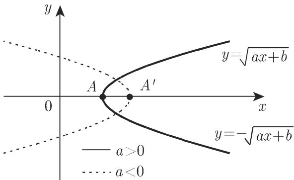
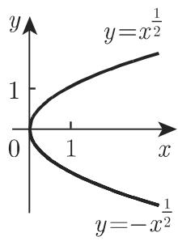
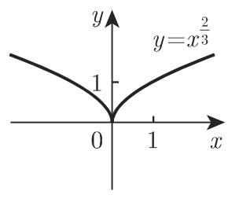
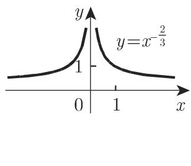

# 数学手册(原书第10版) 2.5 无理函数

本页对应 [[entities/数学手册(原书第10版)]] 第 2 章“函数”的第 2.5 节。该节讨论无理函数的三类基本形态：线性二项式的平方根、二次多项式的平方根与有理指数的幂函数。核心成果是三条“函数—曲线”对应关系——第一类平方根函数的联立曲线是抛物线，第二类是椭圆或双曲线（类型由 $a$ 与 $\Delta$ 的符号决定），幂函数曲线则按指数正负分为过原点型与双曲型两类。所有结论均可由初等代数变形直接验证。

## 2.5.1 线性二项式的平方根

两个函数联立的曲线

$$
y = \pm \sqrt {a x + b} \quad (a \neq 0)\tag{2.51}
$$

是关于 $x$ 轴对称的一条抛物线（见 [[concepts/抛物线]]）。顶点 $A$ 为 $\left(-\frac{b}{a}, 0\right)$，半焦弦（原书参见第275页 3.5.2.10）$p = \frac{a}{2}$；函数的定义域和曲线的形状与 $a$ 的符号有关：$a>0$ 时抛物线开口向右，$a<0$ 时开口向左（图2.22）。

验证：两边平方得 $y^2 = ax + b$，即抛物线的方程形式。

## 2.5.2 二次多项式的平方根

两个函数联立的曲线

$$
y = \pm \sqrt {a x ^ {2} + b x + c} \quad (a \neq 0,\ \Delta = 4 a c - b ^ {2} \neq 0)\tag{2.52}
$$

当 $a < 0$ 时是椭圆（见 [[concepts/椭圆]]）；当 $a > 0$ 时是双曲线（见 [[concepts/双曲线]]）。其中一条对称轴是 $x$ 轴，另一条对称轴是直线 $x = -\frac{b}{2a}$。

顶点 $A, C$ 和 $B, D$ 的坐标为：

$$
A, C:\ \left(-\frac{b \pm \sqrt{-\Delta}}{2a},\ 0\right),
\qquad
B, D:\ \left(-\frac{b}{2a},\ \pm \sqrt{\frac{\Delta}{4a}}\right),
\qquad \Delta = 4ac - b^2 .
$$

函数的定义域和曲线的形状与 $a$ 和 $\Delta$ 的符号有关（图2.23），汇总如下表：

| 符号情形 | 曲线 |
|---|---|
| $a<0,\ \Delta<0$ | 椭圆（图2.23(a)，四个顶点均为实点） |
| $a<0,\ \Delta>0$ | 无实曲线：根号下二次式恒负，函数仅取虚值（原书表述“函数仅有一个虚值”，据上下文应为“仅取虚值”） |
| $a>0,\ \Delta>0$ | 双曲线，上下开口，顶点为 $B, D$（图2.23(b)） |
| $a>0,\ \Delta<0$ | 双曲线，左右开口，顶点为 $A, C$（图2.23(c)） |

原书关于椭圆和双曲线更详尽的说明参见第267页 3.5.2.8 和第271页 3.5.2.9（尚未录入本 wiki）。

## 2.5.3 幂函数

原书分 $k > 0$ 和 $k < 0$ 两种情况（图2.24、图2.25）讨论幂函数（详见 [[concepts/幂函数]]）：

$$
y = a x ^ {k} = a x ^ {\pm m / n} \quad (m, n \text{ 为互素的正整数})\tag{2.53}
$$

原书仅考察 $a = 1$，因为 $a \neq 1$ 时只需把曲线 $y = x^k$ 沿 $y$ 轴方向拉伸 $|a|$ 倍，若 $a < 0$，再把该图像沿 $x$ 轴反射即可。

**情形 a) $k > 0$，$y = x^{\frac{m}{n}}$**：曲线形状可用与 $m, n$ 有关的四个特例说明（图2.24）。曲线过点 $(0,0)$ 和 $(1,1)$。若 $k > 1$，$x$ 轴是曲线在原点的切线（图2.24(d)）；若 $k < 1$，$y$ 轴是曲线在原点的切线（图2.24(a),(b),(c)）。当 $n$ 为偶数时，函数 $y = \pm x^{k}$ 的图像关于 $x$ 轴有两个对称的分支（图2.24(a),(d)）；当 $m$ 为偶数时，曲线关于 $y$ 轴对称（图2.24(c)）；若 $m, n$ 都是奇数，曲线关于原点对称（图2.24(b)）。因此曲线在原点处可能有一个顶点、一个尖点或拐点，但没有渐近线。

**情形 b) $k < 0$，$y = x^{-\frac{m}{n}}$**：曲线形状可用与 $m, n$ 有关的三个特例说明（图2.25）。曲线为双曲型曲线，渐近线为坐标轴，$x = 0$ 为间断点。$|k|$ 越大，曲线趋近 $x$ 轴的速度越快、趋近 $y$ 轴的速度越慢。曲线的对称性与 $k > 0$ 时相同，也由 $m, n$ 的奇偶性决定。函数没有极值。

对称性规则汇总（两种情形通用）：

| 条件 | 对称性 |
|---|---|
| $n$ 为偶数 | $y = \pm x^{k}$ 的图像关于 $x$ 轴有两个对称分支 |
| $m$ 为偶数 | 曲线关于 $y$ 轴对称 |
| $m, n$ 均为奇数 | 曲线关于原点对称 |

图2.24（$k>0$，四个特例）：

图2.25（$k<0$，三个特例）：

（图2.24、图2.25 各分图与 (a)–(d)、(a)–(c) 标号的对应关系，按原书“四个特例/三个特例”的说明整理。）

## 录入评注

- **判别式记号**：本节定义 $\Delta = 4ac - b^{2}$，与通行判别式 $b^{2} - 4ac$ 符号相反，引用本节结论时须注意换算。
- **顶点公式的适用条件**：$A, C$ 的坐标仅当 $\Delta < 0$ 时为实数；$B, D$ 的坐标仅当 $\Delta / a > 0$ 时为实数。原书正文并列给出两组坐标而未标注适用条件，须对照图2.23 使用。
- **图注差异**：图2.22 标注了 $A$ 与 $A'$ 两点（分别对应 $a>0$、$a<0$ 时的顶点位置），而正文只给出顶点 $A$；顶点坐标公式 $\left(-\frac{b}{a}, 0\right)$ 对两种情形均适用。
- **带符号的半焦弦**：$p = a/2$ 在 $a < 0$ 时为负值，本节采用有符号约定，与部分教材取正的约定不同。
- **章节归类张力**：幂函数置于“无理函数”一节，但整数指数情形（$y = x^2$ 为多项式、$y = x^{-1}$ 为有理函数）严格说并非无理函数；本节实际覆盖范围比标题更宽。
- **归属限制**：“无极值”仅指 $k<0$ 的幂曲线；“无渐近线”仅指 $k>0$ 的幂曲线；$\Delta$ 符号分析仅适用于 2.5.2 的二次根式，不可外推到 2.5.1 或一般幂函数。

## 与本 wiki 其他页面的联系

- 派生新页：[[concepts/无理函数]]、[[concepts/幂函数]]、[[concepts/抛物线]]、[[concepts/椭圆]]、[[concepts/双曲线]]、[[findings/二次多项式平方根曲线为椭圆或双曲线]]、[[findings/幂函数原点切线随k与1的大小切换]]。
- 本节补全 [[concepts/代数函数]] 分类中与 [[concepts/有理函数]] 相对的无理分支，并充实 [[concepts/初等函数]] 谱系。
- [[concepts/幂]] 与 [[concepts/根]] 是幂函数与根式曲线在运算层面的对应概念。
- 前向引用的 3.5.2.8（椭圆）、3.5.2.9（双曲线）、3.5.2.10（抛物线）为同书后续章节，尚未录入。

<!-- llm-wiki:embedded-images -->
## Embedded Images

### Document

<!-- llm-wiki:embedded-images -->
