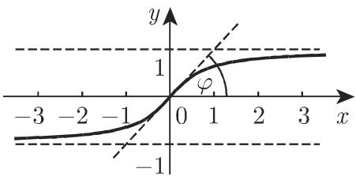
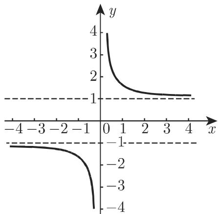

# 数学手册(原书第10版) 2.9 双曲函数

本页为 [[entities/数学手册原书第10版]] 第 2 章第 9 节「双曲函数」的内容记录。该节给出六个双曲函数（sinh、cosh、tanh、coth、sech、csch）的指数定义与倒数定义（式 2.166–2.171）、其中四个函数的图像性质（2.9.2）、以及式 2.172–2.198 的双曲恒等式体系，最后给出复辐角下三角函数与双曲函数间的八条互换关系（式 2.199–2.206）与由三角公式导出双曲公式的代换规则（例 A、B）。本节上承 [[concepts/三角函数]]（2.7 节）与 [[concepts/反三角函数]]（2.8 节），定义根基为 [[concepts/指数函数]]（2.6 节），并前向引用 3.1.2.2（第 172 页，双曲函数的几何定义）与 2.15.1（第 139 页，悬链线）。

## 2.9.1 双曲函数的定义

双曲正弦、双曲余弦、双曲正切定义如下：

$$
\sinh x = \frac {\mathrm{e} ^ {x} - \mathrm{e} ^ {- x}}{2},\tag{2.166}
$$

$$
\cosh x = \frac {\mathrm{e} ^ {x} + \mathrm{e} ^ {- x}}{2},\tag{2.167}
$$

$$
\tanh x = \frac {\mathrm{e} ^ {x} - \mathrm{e} ^ {- x}}{\mathrm{e} ^ {x} + \mathrm{e} ^ {- x}}.\tag{2.168}
$$

几何定义（参见第 172 页 3.1.2.2）与三角函数类似。

双曲余切、双曲正割和双曲余割定义成如上相应函数的倒数：

$$
\coth x = \frac {1}{\tanh x} = \frac {\mathrm{e} ^ {x} + \mathrm{e} ^ {- x}}{\mathrm{e} ^ {x} - \mathrm{e} ^ {- x}},\tag{2.169}
$$

$$
\operatorname{sech} x = \frac {1}{\cosh x} = \frac {2}{\mathrm{e} ^ {x} + \mathrm{e} ^ {- x}},\tag{2.170}
$$

$$
\operatorname{csch} x = \frac {1}{\sinh x} = \frac {2}{\mathrm{e} ^ {x} - \mathrm{e} ^ {- x}}.\tag{2.171}
$$

手册称「双曲函数曲线的形状如图 2.48~图 2.52 所示」，共五幅图；但 2.9.2 仅为 sinh、cosh、tanh、coth 四个函数设置小节（分别对应图 2.49–2.52），图 2.48 的内容手册未作说明（见 [[queries/图2-48是否为sech与csch的曲线]]）。

图 2.48（内容待确认）

图 2.49

图 2.50

## 2.9.2 双曲函数的图示

### 2.9.2.1 双曲正弦

y = sinh x（式 2.166）是严格单调递增的奇函数，值域为 −∞ 到 +∞（图 2.49）。原点既为对称中心，又为拐点，且此处切线的倾斜角 φ = π/4，无渐近线。详见 [[concepts/双曲正弦函数]]。

### 2.9.2.2 双曲余弦

y = cosh x（式 2.167）为偶函数：若 x < 0，函数值从 +∞ 到 1 严格单调递减；若 x > 0，函数值从 1 到 +∞ 严格单调递增（图 2.50）。当 x = 0 时取最小值 1（点 A(0,1)）；无渐近线。曲线关于 y 轴对称，且恒位于二次抛物曲线 y = 1 + x²/2（虚线）的上方。因为函数表现为一条悬链曲线，因此该曲线也称为悬链线（参见第 139 页 2.15.1）。详见 [[concepts/双曲余弦函数]]、[[concepts/悬链线]]。

（转写疑点：「(点 A(0,1) ;」处缺右括号，见 [[queries/式2-206的icot-iz是否为i-cot-iz粘连]]；「恒位于上方」在 x = 0 处两曲线相切于 A(0,1)，故应理解为含等号。）

### 2.9.2.3 双曲正切

y = tanh x（式 2.168）为奇函数，在 −∞ 到 +∞ 上，函数从 −1 到 1 严格单调递增（图 2.51）。原点既为对称中心，又为拐点，且此处切线的倾斜角 φ = π/4，渐近线为 y = ±1。详见 [[concepts/双曲正切函数]]。

图 2.51

图 2.52

### 2.9.2.4 双曲余切

y = coth x（式 2.169）为奇函数，在 x = 0 处不连续（图 2.52）。当 −∞ < x < 0 时，函数从 −1 到 −∞ 严格单调递减；当 0 < x < +∞ 时，函数从 +∞ 到 1 严格单调递减。函数无拐点和极值，渐近线为 x = 0 和 y = ±1。详见 [[concepts/双曲余切函数]]。

## 2.9.3 有关双曲函数的重要公式

手册指出：双曲函数之间存在着与三角函数之间类似的关系，利用双曲函数的定义可以直接证明接下来的公式成立；另外，由式 2.199~2.206，考虑到当自变量为复数时这些函数的定义和关系，可以利用已知的三角函数公式计算它们。

### 2.9.3.1 单变量双曲函数

$$
\cosh^ {2} x - \sinh^ {2} x = 1,\tag{2.172}
$$

$$
\coth^ {2} x - \operatorname{csch} ^ {2} x = 1,\tag{2.173}
$$

$$
\operatorname{sech} ^ {2} x + \tanh ^ {2} x = 1,\tag{2.174}
$$

$$
\tanh x \cdot \coth x = 1,\tag{2.175}
$$

$$
\frac {\sinh x}{\cosh x} = \tanh x,\tag{2.176}
$$

$$
\frac {\cosh x}{\sinh x} = \coth x.\tag{2.177}
$$

### 2.9.3.2 某一双曲函数用具有相同自变量的另一个双曲函数的表示

表 2.7（x > 0 时，具有相同自变量的两双曲函数间的关系；行函数用列函数表示）：

| | $\sinh x$ | $\cosh x$ | $\tanh x$ | $\coth x$ |
|---|---|---|---|---|
| $\sinh x$ | — | $\sqrt{\cosh^2 x - 1}$ | $\dfrac{\tanh x}{\sqrt{1 - \tanh^2 x}}$ | $\dfrac{1}{\sqrt{\coth^2 x - 1}}$ |
| $\cosh x$ | $\sqrt{\sinh^2 x + 1}$ | — | $\dfrac{1}{\sqrt{1 - \tanh^2 x}}$ | $\dfrac{\coth x}{\sqrt{\coth^2 x - 1}}$ |
| $\tanh x$ | $\dfrac{\sinh x}{\sqrt{\sinh^2 x + 1}}$ | $\dfrac{\sqrt{\cosh^2 x - 1}}{\cosh x}$ | — | $\dfrac{1}{\coth x}$ |
| $\coth x$ | $\dfrac{\sqrt{\sinh^2 x + 1}}{\sinh x}$ | $\dfrac{\cosh x}{\sqrt{\cosh^2 x - 1}}$ | $\dfrac{1}{\tanh x}$ | — |

（表中不含 sech/csch 的行列；「x > 0」条件对部分条目充分而不必要，见 [[queries/表2-7为何不含sech与csch]]。）

### 2.9.3.3 负角公式

$$
\sinh (- x) = - \sinh x,\tag{2.178}
$$

$$
\tanh (- x) = - \tanh x,\tag{2.179}
$$

$$
\cosh (- x) = \cosh x,\tag{2.180}
$$

$$
\coth (- x) = - \coth x.\tag{2.181}
$$

### 2.9.3.4 两自变量和与差的双曲函数（加法定理）

$$
\sinh (x \pm y) = \sinh x \cosh y \pm \cosh x \sinh y,\tag{2.182}
$$

$$
\cosh (x \pm y) = \cosh x \cosh y \pm \sinh x \sinh y,\tag{2.183}
$$

$$
\tanh (x \pm y) = \frac {\tanh x \pm \tanh y}{1 \pm \tanh x \tanh y},\tag{2.184}
$$

$$
\coth (x \pm y) = \frac {1 \pm \coth x \coth y}{\coth x \pm \coth y}.\tag{2.185}
$$

### 2.9.3.5 倍角的双曲函数

$$
\sinh 2 x = 2 \sinh x \cosh x,\tag{2.186}
$$

$$
\cosh 2 x = \sinh^ {2} x + \cosh^ {2} x,\tag{2.187}
$$

$$
\tanh 2 x = \frac {2 \tanh x}{1 + \tanh ^ {2} x},\tag{2.188}
$$

$$
\coth 2 x = \frac {1 + \coth ^ {2} x}{2 \coth x}.\tag{2.189}
$$

### 2.9.3.6 双曲函数的棣莫弗公式

$$
(\cosh x \pm \sinh x) ^ {n} = (\mathrm{e} ^ {\pm x}) ^ {n} = \mathrm{e} ^ {\pm n x} = \cosh n x \pm \sinh n x.\tag{2.190}
$$

### 2.9.3.7 半角的双曲函数

$$
\sinh {\frac {x}{2}} = \pm \sqrt {\frac {1}{2} (\cosh x - 1)},\tag{2.191}
$$

$$
\cosh {\frac {x}{2}} = \sqrt {\frac {1}{2} (\cosh x + 1)},\tag{2.192}
$$

当 x > 0 时，式 2.191 中平方根的符号为正；当 x < 0 时，符号为负。

$$
\tanh {\frac {x}{2}} = \frac {\cosh x - 1}{\sinh x} = \frac {\sinh x}{\cosh x + 1},\tag{2.193}
$$

$$
\coth {\frac {x}{2}} = \frac {\sinh x}{\cosh x - 1} = \frac {\cosh x + 1}{\sinh x}.\tag{2.194}
$$

### 2.9.3.8 双曲函数的和与差

$$
\sinh x \pm \sinh y = 2 \sinh {\frac {x \pm y}{2}} \cosh {\frac {x \mp y}{2}},\tag{2.195}
$$

$$
\cosh x + \cosh y = 2 \cosh {\frac {x + y}{2}} \cosh {\frac {x - y}{2}},\tag{2.196}
$$

$$
\cosh x - \cosh y = 2 \sinh \frac {x + y}{2} \sinh \frac {x - y}{2},\tag{2.197}
$$

$$
\tanh x \pm \tanh y = \frac {\sinh (x \pm y)}{\cosh x \cosh y}.\tag{2.198}
$$

### 2.9.3.9 复角 z 的双曲函数与三角函数间的关系

$$
\sin z = - \mathrm{i} \sinh \mathrm{i} z,\tag{2.199}
$$

$$
\cos z = \cosh \mathrm{i} z,\tag{2.200}
$$

$$
\tan z = - \mathrm{i} \tanh \mathrm{i} z,\tag{2.201}
$$

$$
\cot z = \mathrm{i} \coth \mathrm{i} z,\tag{2.202}
$$

$$
\sinh z = - \mathrm{i} \sin \mathrm{i} z,\tag{2.203}
$$

$$
\cosh z = \cos \mathrm{i} z,\tag{2.204}
$$

$$
\tanh z = - \mathrm{i} \tan \mathrm{i} z,\tag{2.205}
$$

$$
\coth z = \mathrm{icot} \mathrm{i} z.\tag{2.206}
$$

（式 2.206 的「icot」应为「i cot」的粘连，与式 2.202 的排版格式对照可知，见 [[queries/式2-206的icot-iz是否为i-cot-iz粘连]]。）

通过把 sin α 代换成 i sinh x，把 cos α 代换成 cosh x，利用相应的三角函数关系，可以得到关于 x 或 ax 但不能得到 ax + b 的双曲函数间的关系（此限制手册未加论证，见 [[queries/代换规则不能得到ax加b的限制含义]]；规则详述见 [[concepts/三角-双曲代换规则]]）。

■ A：cos²α + sin²α = 1，cosh²x + i²sinh²x = 1 或 cosh²x − sinh²x = 1。

■ B：sin 2α = 2 sin α cos α，i sinh 2x = 2i sinh x cosh x 或 sinh 2x = 2 sinh x cosh x。

## 核验记录

本次收录时对式 2.166–2.206 全部 41 条公式逐条作了指数定义下的代数核验，并核验了表 2.7 的全部 12 个有效条目，均无数学错误；图像性质陈述（单调性、渐近线、拐点、切线倾角 π/4）与定义自洽（φ = π/4 对应原点处斜率为 1，即 sinh′(0) = cosh(0) = 1、tanh′(0) = sech²(0) = 1，属核验时引入的导数推断）。编号 2.166–2.206 连续无缺，无此前各节出现的编号错乱问题。详见各 finding 页：

- [[findings/双曲函数的指数定义与倒数定义]]
- [[findings/四个双曲函数的图像性质体系]]
- [[findings/同角双曲函数基本关系与互表公式]]
- [[findings/双曲负角公式与加法定理]]
- [[findings/双曲倍角公式与棣莫弗公式]]
- [[findings/双曲半角公式及定号规则]]
- [[findings/双曲函数的和差化积]]
- [[findings/复角关系与三角双曲代换规则]]

## 转写疑点汇总

1. 式 2.206「coth z = icot iz」疑为「i cot iz」粘连；2.9.2.2「(点 A(0,1) ;」缺右括号——两处均似转写残留（[[queries/式2-206的icot-iz是否为i-cot-iz粘连]]）。
2. 五图（图 2.48–2.52）对应六函数，图 2.48 内容未说明（[[queries/图2-48是否为sech与csch的曲线]]）。
3. 「不能得到 ax + b」的范围限制未给出论证（[[queries/代换规则不能得到ax加b的限制含义]]）。
4. 表 2.7 冠以「x > 0」总条件，但部分条目对一切 x（或 x ≠ 0）成立；且不含 sech/csch 行列（[[queries/表2-7为何不含sech与csch]]）。
5. cosh「恒位于 y = 1 + x²/2 上方」在 x = 0 处两者相等（相切于 A(0,1)），「上方」应理解为含等号。

## 与其他节的联系

- 上承 2.6 [[concepts/指数函数]]：双曲函数即 e^±x 的线性组合与倒数。
- 平行于 2.7 [[concepts/三角函数]]：恒等式体系结构平行但符号有系统性差异（见 [[comparisons/双曲函数与三角函数比较]]、[[concepts/双曲恒等式]]）。
- 前向引用：3.1.2.2（双曲函数的几何定义）、2.15.1（悬链线）——待相应章节转写后补充。
- 可预期 2.10 为反双曲函数，与 2.8 [[concepts/反三角函数]] 体系对称。

<!-- llm-wiki:embedded-images -->
## Embedded Images

### Document

<!-- llm-wiki:embedded-images -->
