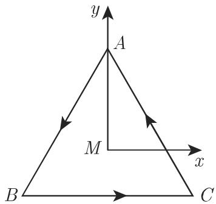
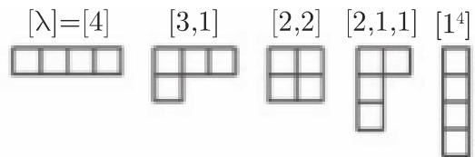

# 数学手册(原书第10版) 5.3.4 群表示

本节是 [[sources/10-数学手册原书第10版--9-53-经典代数结构--10cw2rs]]（5.3 经典代数结构）的子节，系统介绍**群表示论**基础：表示的定义与性质、特殊表示（恒等、伴随、酉、等价）、群元素的特征、表示的直和与直积、可约性与不可约性、第一 Schur 引理、Clebsch-Gordan 级数，以及对称群 $S_M$ 不可约表示的杨氏图分类。贯穿全节的具体对象是循环点群 $C_3$（例 A）与二面角群 $D_3$（例 B），另附原子/核物理壳层模型中组态 $\alpha^2\beta$ 的 $S_3$ 三维表示算例。

## 小节结构

| 小节 | 主题 | 关键公式 |
|---|---|---|
| 5.3.4.1 | 定义：表示、忠实表示、表示的性质 | (5.93)–(5.100) |
| 5.3.4.2 | 特殊表示：恒等、伴随、酉、等价；群元素的特征 | (5.101)–(5.106d) |
| 5.3.4.3 | 表示的直和 | (5.107)–(5.110) |
| 5.3.4.4 | 表示的直积（克罗内克积） | (5.111)–(5.113) |
| 5.3.4.5 | 可约与不可约表示 | (5.114)–(5.117) |
| 5.3.4.6 | 第一 Schur 引理 | — |
| 5.3.4.7 | Clebsch-Gordan 级数 | (5.118) |
| 5.3.4.8 | 对称群 $S_M$ 的不可约表示：分拆与杨氏图 | (5.119)–(5.120) |

## 核心定义与公式链

- **表示**（式 5.93）：$D(G): a \to D(a)$，群 $G$ 到 $n$ 维（实或复）向量空间 $V_n$ 上非奇异线性变换群的同态；$V_n$ 为表示空间，$n$ 为维数。基展开（式 5.94）、矩阵作用 $x'_i = \sum_k D_{ik}(a)x_k$（式 5.95）、基变换视角（式 5.96）、表示矩阵指派（式 5.97）；表示矩阵与基的选取有关。忠实表示 = 同构指派。
- **同态性质**（式 5.100）：$D(a\cdot b)=D(a)D(b)$，$D(a^{-1})=D^{-1}(a)$，$D(e)=I$。
- **特殊表示**：恒等表示（一维，$a \to I$，转写脱落维数）；伴随表示 $D^+(G)=\widetilde{D}^{\,*}(G)$（式 5.101，共轭转置，**非**李代数伴随表示）；酉表示 $D(G)\cdot D^+(G)=I$（式 5.102）；等价表示 $D'(a)=T^{-1}D(a)T$（式 5.103–5.104，同一相似变换）；特征 $\chi(a)=\operatorname{Tr}D(a)$（式 5.105），$\chi(e)=n$，等价表示特征相同。
- **直和**（式 5.107–5.110）：分块对角化，特征可加；**直积**（式 5.111–5.113）：克罗内克积，特征可乘。
- **可约性**（式 5.114–5.117）：真不变子空间 ⇒ 分块三角形；完全可约 ⇒ 分块对角。
- **第一 Schur 引理**：与不可约表示全体矩阵交换的算子 $C=\lambda I$，$\lambda\in\mathbb{C}$。
- **Clebsch-Gordan 级数**（式 5.118）：$D^{(1)}\otimes D^{(2)}=\sum_\alpha \oplus\, m_\alpha D^{(\alpha)}$。
- **$S_M$ 不可约表示分类**（式 5.119–5.120）：由分拆 $[\lambda]$ 唯一刻画，维数公式见 [[concepts/杨氏图]]。

## 例 A：$C_3$（式 5.98）

等边三角形绕中心旋转 $\varphi_k = 2\pi k/3$（$k=0,1,2$），满足 $R_2=R_1^2$、$R_1 R_2 = e$（式 5.98d），构成循环群 $C_3$（见 [[entities/c-n循环点群]]）。旋转矩阵 $R(\varphi)=\begin{pmatrix}\cos\varphi & -\sin\varphi\\ \sin\varphi & \cos\varphi\end{pmatrix}$（式 5.98e）给出忠实二维表示（式 5.98f–g）：

```text
D(e)  = R(0)    = [[1, 0], [0, 1]]
D(R₁) = R(2π/3) = [[-1/2, -√3/2], [√3/2, -1/2]]
D(R₂) = R(4π/3) = [[-1/2,  √3/2], [-√3/2, -1/2]]
```



## 例 B：$D_3$（式 5.99）

三个反射 $S_A, S_B, S_C$（式 5.99a，均为对合）与 $C_3$ 一起构成 6 阶二面角群 $D_3$（见 [[entities/d-3二面角群]]）。群表 (5.99d)（行 × 列 = 乘积，原样保留）：

| | e | R₁ | R₂ | S_A | S_B | S_C |
|---|---|---|---|---|---|---|
| **e** | e | R₁ | R₂ | S_A | S_B | S_C |
| **R₁** | R₁ | R₂ | e | S_C | S_A | S_B |
| **R₂** | R₂ | e | R₁ | S_B | S_C | S_A |
| **S_A** | S_A | S_B | S_C | e | R₁ | R₂ |
| **S_B** | S_B | S_C | S_A | R₂ | e | R₁ |
| **S_C** | S_C | S_A | S_B | R₁ | R₂ | e |

由 $S_A S_B = R_1$（式 5.99c）知反射不构成子群。反射表示矩阵（式 5.99e–g）：

```text
D(S_A) = [[-1, 0], [0, 1]]
D(S_B) = D(R₂)·D(S_A) = [[ 1/2,  √3/2], [ √3/2, -1/2]]
D(S_C) = D(R₁)·D(S_A) = [[ 1/2, -√3/2], [-√3/2, -1/2]]
```


## 壳层模型 $S_3$ 三维表示（式 5.106）

组态 $\alpha^2\beta$ 的三个波函数 $\psi_1,\psi_2,\psi_3$（式 5.106a）张成 $S_3$ 三维表示；矩阵元由群元对基元坐标下标的作用求出（式 5.106b，方法见 [[methodology/由群作用构造表示矩阵流程]]）：

```text
D(e)  = [[1,0,0],[0,1,0],[0,0,1]]
D(p₁) = [[0,1,0],[1,0,0],[0,0,1]]
D(p₂) = [[0,0,1],[0,1,0],[1,0,0]]
D(p₃) = [[1,0,0],[0,0,1],[0,1,0]]
D(p₄) = [[0,1,0],[0,0,1],[1,0,0]]
D(p₅) = [[0,0,1],[1,0,0],[0,1,0]]
```

特征（式 5.106d）：$\chi(e)=3$，$\chi(p_1)=\chi(p_2)=\chi(p_3)=1$，$\chi(p_4)=\chi(p_5)=0$。经基变换（式 5.117）分离出一维恒等表示与二维表示，故可约。

## 杨氏图与 $S_4$（式 5.119–5.120）

$S_M$ 的不等价不可约表示由 $M$ 的分拆 $[\lambda_1,\dots,\lambda_M]$（$\sum\lambda_i=M$，$\lambda_1\geq\dots\geq\lambda_M\geq 0$）唯一刻画；维数公式（转写下标 $\prod_{i<j<k}$ 应为 $\prod_{i<j\leq k}$）：

$$n^{[\lambda]} = M!\,\frac{\prod_{i<j\leq k}(\lambda_i-\lambda_j+j-i)}{\prod_{i=1}^{k}(\lambda_i+k-i)!}$$

对 $S_4$ 得到（转写脱落数词「五」）5 个杨氏图：



## 已复算内容与证据强度

本 wiki 独立复算并确认（详见各 finding 页）：

- $C_3$ 三个表示矩阵及行列式（det = +1），$D(R_1)^2 = D(R_2)$、$D(R_1)D(R_2)=D(e)$（[[findings/c3二维旋转表示算例]]）；
- $D_3$ 群表全部 36 项按展示 $\langle r,s\mid r^3=s^2=e,\ srs=r^{-1}\rangle$ 逐项核验；$D(S_B),D(S_C)$ 乘积复算，det = −1（[[findings/d3群表与二维表示算例]]）；
- $S_3$ 六个置换矩阵与特征（依赖对 $p_1$–$p_5$ 的**推断**识别，待 5.3.3 入库锚定；[[findings/壳层模型s3三维表示与特征]]）；
- 基变换算例 (5.117)（[[findings/可约性分块化简与s3基变换算例]]）；
- 维数公式在 $S_3$ 三个分拆与 $S_4$ 各分拆上的验证（[[findings/对称群不可约表示由分拆刻画与维数公式]]）。

原书以断言给出、未附证明的定理（标准结果，证据强度中等）：「有限群的任何表示等价于酉表示」「有限群不等价不可约表示个数有限」、Schur 引理、CG 定理（[[findings/特殊表示与等价性定义组]]）。

## 转写讹误

转写本存在系统性 OCR 讹误（脱字、「千/于」、「兀/π」、「[入]/[λ]」、「旋子/自旋」、(5.98h) 与 (5.99c) 的逻辑不一致等），完整清单见 [[queries/5-3-4全节系统性转写讹误清单]]；两处关键复原讨论见 [[queries/式5-98h首项是否应为D-R1的平方]] 与 [[queries/式5-99c中间结果应为BCA还是CAB]]。

## 与既有 wiki 的联系

- **延伸** [[concepts/相似变换]]（4.6）：等价表示 (5.103) 即表示矩阵间的相似变换；迹不变 ⇒ 等价表示特征相同。
- **延伸** [[concepts/映射]]、[[concepts/等价关系]]（5.2）：表示是到线性变换群的同态；表示等价是等价关系。
- **落实** [[concepts/代数结构]]、[[concepts/结合律]]、[[concepts/中性元素]]（5.3.1，[[sources/10-数学手册原书第10版--6-531-运算--9qo5tf]]）：式 (5.100) 是运算性质在矩阵层面的体现。
- **关联** [[entities/so3三维旋转群与-so3]]（4.4.3）：$C_3$ 的旋转矩阵是平面旋转群的有限子群实例。
- 术语张力：本节「特征」（character = 迹）≠ [[concepts/特征值与特征向量]] 的「特征值」；「伴随表示」指共轭转置而非李理论伴随表示；「二面角群」通行译名为「二面体群」。

## 交叉引用缺口

本节引用的未入库章节：5.3.3（(5.84) 置换定义、5.3.3.2 循环群）、5.3.2（群的一般概念）、4.1.5.9（克罗内克积）、12.1.3.2（向量空间）、3.1.5（正多边形）、3.5.3.3.3 与 (3.432)（旋转矩阵），见 [[queries/5-3-2与5-3-3未入库对5-3-4的依赖缺口]]。

<!-- llm-wiki:embedded-images -->
## Embedded Images

### Document


<!-- llm-wiki:embedded-images -->
