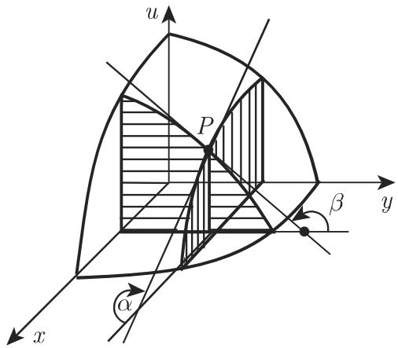

# 数学手册(原书第10版) 6.2.1 偏导数

## 概要

本节是《数学手册(原书第10版)》第 6.2 章的首个小节，把 6.1 章建立的一元微分学推广到多元函数，在「[[concepts/微商]]（6.1.1）→ [[concepts/偏导数]] → [[concepts/偏微分]] → 全微分（后续小节）」的定义链条中处于起点与枢纽位置。全节为定义性/教程性内容（非论证性），分五个子小节：

1. **6.2.1.1 函数的偏导数**：n 元函数偏导数的极限定义（式 6.35）、四种记号、n 个一阶偏导数的存在性，以及「可利用与一元函数相同的求导法则来计算偏导数」的操作性结论；附 u = x²y/z 的三个一阶偏导数算例。
2. **6.2.1.2 二元函数的几何意义**：曲面被平行于 uOx 面（对称地 yOu 面）的平面所截，交曲线切线倾角的正切即偏导数（式 6.36a–b，图 6.14）；末尾前向引用向量分析（13.2.1.3）中的方向导数。
3. **6.2.1.3 f(x) 的微分**：一元函数微分的三个定义式（式 6.37a–c）及几何意义（dy 为切线纵坐标增量、Δy 为曲线纵坐标增量，回引图 6.1）。
4. **6.2.1.4 微分的基本性质**：性质 1 为一阶微分形式不变性（式 6.38）；性质 2 为「量的阶」——Δy 与 dy 等价无穷小、其差为高阶小量（式 6.39），并指出由此可把小增量的计算简化为微分的计算，常用于近似计算（前向引用 6.1.4.4 与 16.4.2.1）。
5. **6.2.1.5 偏微分**：多元函数对单一变元的偏微分定义（式 6.40），收束全节。

注意：6.2.1.3–6.2.1.4 实为一元函数内容，却被置于「偏导数」节名之下，结构上疑为原书为引出偏微分与全微分所作铺垫（见 [[queries/一元微分内容置于偏导数节下的结构问题]]）。

## 公式逐字转录

（按源文逐字转录，含编号；正文文字层的转写讹误不影响公式本体，复原见 [[queries/6-2-1全节系统性转写讹误清单]]。）

**式 6.35（偏导数定义）**

$$
\frac {\partial u}{\partial x _ {1}} = \lim _ {\Delta x _ {1} \rightarrow 0} \frac {f (x _ {1} + \Delta x _ {1} , x _ {2} , x _ {3} , \cdots , x _ {n}) - f (x _ {1} , x _ {2} , x _ {3} , \cdots , x _ {n})}{\Delta x _ {1}}\tag{6.35}
$$

**算例（无编号）**

$$
u = \frac {x ^ {2} y}{z}, \frac {\partial u}{\partial x} = \frac {2 x y}{z}, \frac {\partial u}{\partial y} = \frac {x ^ {2}}{z}, \frac {\partial u}{\partial z} = - \frac {x ^ {2} y}{z ^ {2}}.
$$

**式 6.36a–b（偏导数的几何意义）**

$$
\frac {\partial u}{\partial x} = \tan \alpha ,\tag{6.36a}
$$

$$
\frac {\partial u}{\partial y} = \tan \beta .\tag{6.36b}
$$

**式 6.37a–c（一元微分三式）**

$$
\mathrm{d} x = \Delta x,\tag{6.37a}
$$

$$
\mathrm{d} y = f ^ {\prime} (x) \mathrm{d} x,\tag{6.37b}
$$

$$
\Delta y = f (x + \Delta x) - f (x).\tag{6.37c}
$$

**式 6.38（一阶微分形式不变性）**

$$
\mathrm{dy} = f ^ {\prime} (x) \mathrm{dx}.\tag{6.38}
$$

**式 6.39（量的阶与近似计算）**

$$
\lim _ {\Delta x \to 0} \frac {\Delta y}{\mathrm{d} y} = 1, \quad \Delta y \approx \mathrm{d} y = f ^ {\prime} (x) \mathrm{d} x,\tag{6.39}
$$

**式 6.40（偏微分定义）**

$$
\mathrm{d} _ {x} u = \mathrm{d} _ {x} f = \frac {\partial u}{\partial x} \mathrm{d} x.\tag{6.40}
$$

## 插图

图 6.14：二元函数偏导数几何意义示意图（曲面 u = f(x, y)、过点 P 且平行于 uOx 面的截平面、交曲线切线与 x 轴正半轴所成角 α）。

## 复算与验证情况

- u = x²y/z 的三个一阶偏导数经独立复算全部正确（见 [[findings/偏导数定义与记号-式6-35]]）。
- 式 6.38 可由 [[concepts/链式法则]] 独立推导复核（见 [[findings/微分形式不变性-式6-38]]）。
- 式 6.39 的无条件极限陈述与原文括号例外「（除非 dy = 0）」之间存在内部张力，已立案追踪（[[queries/式6-39极限是否隐含dy非零条件]]）。
- 式 6.36 的角度定义句转写损坏较重（脱落轴名 x、杂讯「α_{;}」「β : 1」），完整原文待回查（[[queries/6-2-1全节系统性转写讹误清单]]）。

## 与既有条目的关系

- 本节是 [[concepts/微商]]（6.1.1）向多元情形的直接推广：式 6.35 ↔ 式 6.1（[[findings/微商与导函数的定义-式6-1]]），式 6.36 ↔ 式 6.2（[[findings/导数的几何意义-式6-2]]）。
- 「可利用与一元函数相同的求导法则来计算偏导数」把 [[concepts/微分法则]]（6.1.2）的法则体系显式扩展到偏导数。
- 本节给出的偏导数标准记号（∂u/∂x、u′ₓ、∂f/∂x、f′ₓ）可为 [[queries/偏导数f等于Fy之f是否衍文]]（6.1.2 遗留的记号问题）提供参照。
- 式 6.37 与「量的阶」的讨论是 [[concepts/可微性]] 的操作性内容。
- 前向引用的 13.2.1.3（向量分析、方向导数）与 16.4.2.1（近似计算）尚未入库（[[queries/6-2后续小节未入库缺口]]），两处页码粘连见 [[queries/6-2-1交叉引用粘连讹误]]。
- 6.2.1.3(4) 回引图 6.1，而 6.1.1 入库时未著录该图，见 [[queries/图6-1回引与6-1-1未著录内容关系]]。

## 转写质量

本节转写讹误与 5.9.x、6.1.x 各节完全同型：OCR 将「于」误作「千」贯穿全节（关千、平行千、等千、千是、常用千）；「面」误作「而」（uOx 而的平而）；「量」误作「最」（变最）；「几何」误作「儿何」；多处脱落变量字母 n 与 x 及点 P；两处交叉引用页码粘连。完整清单见 [[queries/6-2-1全节系统性转写讹误清单]] 与 [[queries/6-2-1交叉引用粘连讹误]]。

## 本节派生的条目

- 概念：[[concepts/偏导数]]、[[concepts/偏微分]]、[[concepts/微分]]、[[concepts/一阶微分形式不变性]]
- 发现：[[findings/偏导数定义与记号-式6-35]]、[[findings/偏导数几何意义-式6-36-图6-14]]、[[findings/微分定义三式-式6-37a-6-37c]]、[[findings/微分形式不变性-式6-38]]、[[findings/微分与增量等价关系-式6-39]]、[[findings/偏微分定义-式6-40]]
- 比较：[[comparisons/一元导数与偏导数比较]]、[[comparisons/偏导数与偏微分比较]]、[[comparisons/增量与微分比较]]
- 方法：[[methodology/偏导数计算流程]]、[[methodology/微分近似计算流程]]
- 待查：[[queries/6-2-1全节系统性转写讹误清单]]、[[queries/式6-39极限是否隐含dy非零条件]]、[[queries/6-2-1交叉引用粘连讹误]]、[[queries/图6-1回引与6-1-1未著录内容关系]]、[[queries/6-2后续小节未入库缺口]]、[[queries/一元微分内容置于偏导数节下的结构问题]]

<!-- llm-wiki:embedded-images -->
## Embedded Images

### Document

<!-- llm-wiki:embedded-images -->
