# 数学手册(原书第10版) 8.4 多重积分

## 内容概览

本节是《数学手册(原书第10版)》第 8 章第 4 节，把积分概念从区间推广到平面区域与空间区域：8.4.1 讲**二重积分**，8.4.2 讲**三重积分**（又称体积积分）。每部分均按「概念（定义、存在定理、几何意义）→ 计算（笛卡儿坐标、特殊曲线坐标、任意曲线坐标）→ 应用（公式表）」三层展开，含 14 个编号公式（式 8.134–8.147）、4 张表（表 8.8–8.11）、6 个算例、14 幅插图（图 8.30–8.43）。

引言指出：积分区域为空间平面或曲面上的区域时称**曲面积分**，为一部分空间时称**体积积分**；但曲面积分在本节并未展开（见 [[queries/8-4未入库回指缺口]]）。

本节最强的统一性论断：极坐标（D=ρ）、柱面坐标（D=ρ）、球面坐标（D=r²sinϑ）下的积分公式全部是任意曲线坐标换元公式（二维式 8.139、三维式 8.147b）的特例，枢纽为雅可比行列式的绝对值 |D|（[[concepts/雅可比行列式]]、[[concepts/曲线坐标系下的积分换元]]）。

## 小节结构

| 小节 | 主题 | 关键公式与表 |
|---|---|---|
| 8.4.1.1 | 二重积分的概念：定义、存在定理、几何意义 | 式 8.134–8.135b |
| 8.4.1.2 | 二重积分的计算：笛卡儿 / 极坐标 / 任意曲线坐标 u,v | 式 8.136a–c、8.137a–b、8.138–8.140b |
| 8.4.1.3 | 二重积分的应用 | 表 8.8、表 8.9 |
| 8.4.2.1 | 三重积分的概念 | 式 8.141–8.142 |
| 8.4.2.2 | 三重积分的计算：笛卡儿 / 柱面 / 球面 / 任意曲线坐标 u,v,w | 式 8.143a–b、8.144a–b、8.145a–b、8.146–8.147b |
| 8.4.2.3 | 三重积分的应用 | 表 8.10、表 8.11 |

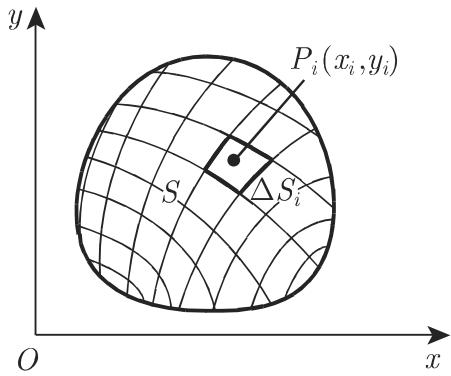

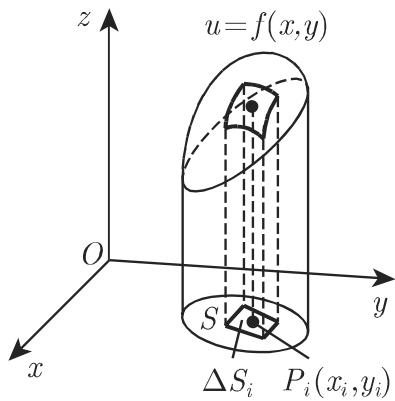

## 编号公式实录

```latex
(8.134)   ∫_S f(x,y) dS = ∬_S f(x,y) dy dx
(8.135a)  Σ_{i=1}^{n} f(x_i, y_i) ΔS_i
(8.135b)  ∫_S f(x,y) dS = lim_{ΔS_i→0, n→∞} Σ_{i=1}^{n} f(x_i, y_i) ΔS_i
(8.136a)  ∫_S f dS = ∫_a^b ∫_{φ1(x)}^{φ2(x)} f(x,y) dy dx
(8.136b)  dS = dx dy
(8.136c)  ∫_S f dS = ∫_α^β ∫_{ψ1(y)}^{ψ2(y)} f(x,y) dx dy
(8.137a)  dS = ρ dρ dφ
(8.137b)  ∫_S f(ρ,φ) dS = ∫_{φ1}^{φ2} ∫_{ρ1(φ)}^{ρ2(φ)} f(ρ,φ) ρ dρ dφ
(8.138)   x = x(u,v),  y = y(u,v)
(8.139)   ∫_S f(u,v) dS = ∫_{u1}^{u2} ∫_{v1(u)}^{v2(u)} f(u,v) |D| dv du
(8.140a)  D = D(x,y)/D(u,v) = det[∂x/∂u ∂x/∂v; ∂y/∂u ∂y/∂v]
(8.140b)  dS = |D| dv du
(8.141)   ∫_V f(x,y,z) dV = ∭_V f(x,y,z) dz dy dx
(8.142)   ∫_V f dV = lim_{ΔV_i→0, n→∞} Σ_{i=1}^{n} f(x_i, y_i, z_i) ΔV_i
(8.143a)  ∫_V f dV = ∫_a^b ∫_{φ1(x)}^{φ2(x)} ∫_{ψ1(x,y)}^{ψ2(x,y)} f(x,y,z) dz dy dx
(8.143b)  a ≤ x ≤ b,  φ1(x) ≤ y ≤ φ2(x),  ψ1(x,y) ≤ z ≤ ψ2(x,y)
(8.144a)  dV = ρ dz dρ dφ
(8.144b)  ∫_V f(ρ,φ,z) dV = ∫_{φ1}^{φ2} ∫_{ρ1(φ)}^{ρ2(φ)} ∫_{z1(ρ,φ)}^{z2(ρ,φ)} f(ρ,φ,z) ρ dz dρ dφ
(8.145a)  dV = r² sinϑ dr dϑ dφ
(8.145b)  ∫_V f(r,φ,ϑ) dV = ∫_{φ1}^{φ2} ∫_{ϑ1(φ)}^{ϑ2(φ)} ∫_{r1(ϑ,φ)}^{r2(ϑ,φ)} f(r,φ,ϑ) r² sinϑ dr dϑ dφ
(8.146)   x = x(u,v,w),  y = y(u,v,w),  z = z(u,v,w)
(8.147a)  D = det[∂x/∂u ∂x/∂v ∂x/∂w; ∂y/∂u ∂y/∂v ∂y/∂w; ∂z/∂u ∂z/∂v ∂z/∂w]
(8.147b)  ∫_V f(u,v,w) dV = ∫_{u1}^{u2} ∫_{v1(u)}^{v2(u)} ∫_{w1(u,v)}^{w2(u,v)} f(u,v,w) |D| dw dv du
```

## 表格逐字转录

### 表 8.8 平面面积微元（正文回指「699 页的表 8.8」）

| 坐标 | 面积微元 |
|---|---|
| 笛卡儿坐标 x,y | dS = dy dx |
| 极坐标 ρ,φ | dS = ρ dρ dφ |
| 任意曲线坐标 u,v | dS = \|D\| du dv（D 为雅可比行列式） |

### 表 8.9 二重积分的应用

完整说明与注记见 [[entities/表8-9二重积分的应用]]：

| 一般公式 | 笛卡儿坐标 | 极坐标 |
|---|---|---|
| **1. 平面图形的面积** | | |
| $S=\int_S \mathrm{d}S$ | $=\iint \mathrm{d}y\,\mathrm{d}x$ | $=\iint \rho\,\mathrm{d}\rho\,\mathrm{d}\varphi$ |
| **2. 曲面面积** | | |
| $S_O=\int_S \dfrac{\mathrm{d}S}{\cos\gamma}$ | $=\iint\sqrt{1+\left(\frac{\partial z}{\partial x}\right)^2+\left(\frac{\partial z}{\partial y}\right)^2}\,\mathrm{d}y\,\mathrm{d}x$ | $=\iint\sqrt{\rho^2+\rho^2\left(\frac{\partial z}{\partial \rho}\right)^2+\left(\frac{\partial z}{\partial\varphi}\right)^2}\,\mathrm{d}\rho\,\mathrm{d}\varphi$ |
| **3. 柱体体积** | | |
| $V=\int_S z\,\mathrm{d}S$ | $=\iint z\,\mathrm{d}y\,\mathrm{d}x$ | $=\iint z\rho\,\mathrm{d}\rho\,\mathrm{d}\varphi$ |
| **4. 平面图形关于 x 轴的转动惯量** | | |
| $I_x=\int_S y^2\,\mathrm{d}S$ | $=\iint y^2\,\mathrm{d}y\,\mathrm{d}x$ | $=\iint \rho^3\sin^2\varphi\,\mathrm{d}\rho\,\mathrm{d}\varphi$ |
| **5. 平面图形关于极点 0 的转动惯量** | | |
| $I_0=\int_S \rho^2\,\mathrm{d}S$ | $=\iint (x^2+y^2)\,\mathrm{d}y\,\mathrm{d}x$ | $=\iint \rho^3\,\mathrm{d}\rho\,\mathrm{d}\varphi$ |
| **6. 密度函数为 ϱ 的平面图形的质量** | | |
| $M=\int_S \varrho\,\mathrm{d}S$ | $=\iint \varrho\,\mathrm{d}y\,\mathrm{d}x$ | $=\iint \varrho\varrho\,\mathrm{d}\rho\,\mathrm{d}\varphi$ |
| **7. 质地均匀的平面图形的重心坐标** | | |
| $x_C=\dfrac{\int_S x\,\mathrm{d}S}{S}$ | $=\dfrac{\iint x\,\mathrm{d}y\,\mathrm{d}x}{\iint \mathrm{d}y\,\mathrm{d}x}$ | $=\dfrac{\iint \rho^2\cos\varphi\,\mathrm{d}\rho\,\mathrm{d}\varphi}{\iint \rho\,\mathrm{d}\rho\,\mathrm{d}\varphi}$ |
| $y_C=\dfrac{\int_S y\,\mathrm{d}S}{S}$ | $=\dfrac{\iint y\,\mathrm{d}y\,\mathrm{d}x}{\iint \mathrm{d}y\,\mathrm{d}x}$ | $=\dfrac{\iint \rho^2\sin\varphi\,\mathrm{d}\rho\,\mathrm{d}\varphi}{\iint \rho\,\mathrm{d}\rho\,\mathrm{d}\varphi}$ |

注：第 6 行极坐标列「ϱϱ」为转写撞形——第一个 ϱ 为密度、第二个应为极径 ρ（据表 8.10 同行柱面列「ϱρ」判定原书两字符有别）。

### 表 8.10 三重积分的应用

完整说明与注记见 [[entities/表8-10三重积分的应用]]：

| 一般公式 | 笛卡儿坐标 | 柱面坐标 | 球面坐标 |
|---|---|---|---|
| **1. 立体的体积** | | | |
| $V=\int_V \mathrm{d}V=$ | $\iiint \mathrm{d}z\,\mathrm{d}y\,\mathrm{d}x$ | $\iiint \rho\,\mathrm{d}z\,\mathrm{d}\rho\,\mathrm{d}\varphi$ | $\iiint r^2\sin\vartheta\,\mathrm{d}r\,\mathrm{d}\vartheta\,\mathrm{d}\varphi$ |
| **2. 关于 z 轴的轴向转动惯量** | | | |
| $I_z=\int_V \rho^2\,\mathrm{d}V=$ | $\iiint (x^2+y^2)\,\mathrm{d}z\,\mathrm{d}y\,\mathrm{d}x$ | $\iiint \rho^3\,\mathrm{d}z\,\mathrm{d}\rho\,\mathrm{d}\varphi$ | $\iiint r^4\sin^3\vartheta\,\mathrm{d}r\,\mathrm{d}\vartheta\,\mathrm{d}\varphi$ |
| **3. 密度函数为 ϱ 的立体的质量** | | | |
| $M=\int_V \varrho\,\mathrm{d}V=$ | $\iiint \varrho\,\mathrm{d}z\,\mathrm{d}y\,\mathrm{d}x$ | $\iiint \varrho\rho\,\mathrm{d}z\,\mathrm{d}\rho\,\mathrm{d}\varphi$ | $\iiint \varrho r^2\sin\vartheta\,\mathrm{d}r\,\mathrm{d}\vartheta\,\mathrm{d}\varphi$ |
| **4. 质地均匀的立体的中心坐标** | | | |
| $x_C=\dfrac{\int_V x\,\mathrm{d}V}{V}=$ | $\dfrac{\iiint x\,\mathrm{d}z\,\mathrm{d}y\,\mathrm{d}x}{\iiint \mathrm{d}z\,\mathrm{d}y\,\mathrm{d}x}$ | $\dfrac{\iiint \rho^2\cos\varphi\,\mathrm{d}\rho\,\mathrm{d}\varphi\,\mathrm{d}z}{\iiint \rho\,\mathrm{d}\rho\,\mathrm{d}\varphi\,\mathrm{d}z}$ | $\dfrac{\iiint r^3\sin^2\vartheta\cos\varphi\,\mathrm{d}r\,\mathrm{d}\vartheta\,\mathrm{d}\varphi}{\iiint r^2\sin\vartheta\,\mathrm{d}r\,\mathrm{d}\vartheta\,\mathrm{d}\varphi}$ |
| $y_C=\dfrac{\int_V y\,\mathrm{d}V}{V}=$ | $\dfrac{\iiint y\,\mathrm{d}z\,\mathrm{d}y\,\mathrm{d}x}{\iiint \mathrm{d}z\,\mathrm{d}y\,\mathrm{d}x}$ | $\dfrac{\iiint \rho^2\sin\varphi\,\mathrm{d}\rho\,\mathrm{d}\varphi\,\mathrm{d}z}{\iiint \rho\,\mathrm{d}\rho\,\mathrm{d}\varphi\,\mathrm{d}z}$ | $\dfrac{\iiint r^3\sin^2\vartheta\sin\varphi\,\mathrm{d}r\,\mathrm{d}\vartheta\,\mathrm{d}\varphi}{\iiint r^2\sin\vartheta\,\mathrm{d}r\,\mathrm{d}\vartheta\,\mathrm{d}\varphi}$ |
| $z_C=\dfrac{\int_V z\,\mathrm{d}V}{V}=$ | $\dfrac{\iiint z\,\mathrm{d}z\,\mathrm{d}y\,\mathrm{d}x}{\iiint \mathrm{d}z\,\mathrm{d}y\,\mathrm{d}x}$ | $\dfrac{\iiint \rho z\,\mathrm{d}\rho\,\mathrm{d}\varphi\,\mathrm{d}z}{\iiint \rho\,\mathrm{d}\rho\,\mathrm{d}\varphi\,\mathrm{d}z}$ | $\dfrac{\iiint r^3\sin\vartheta\cos\vartheta\,\mathrm{d}r\,\mathrm{d}\vartheta\,\mathrm{d}\varphi}{\iiint r^2\sin\vartheta\,\mathrm{d}r\,\mathrm{d}\vartheta\,\mathrm{d}\varphi}$ |

### 表 8.11 体积微元（正文回指「第 705 页表 8.11」）

| 坐标 | 体积微元 |
|---|---|
| 笛卡儿坐标 x,y,z | dV = dx dy dz |
| 柱面坐标 ρ,φ,z | dV = ρ dρ dφ dz |
| 球坐标 r,θ,φ | dV = r² sin θ dr dθ dφ |
| 任意曲线坐标 u,v,w | dV = \|D\| du dv dw（D 为雅可比行列式） |

注：表 8.11 坐标列记「球坐标 r,θ,φ」，而正文（式 8.145a–b）用 (r, φ, ϑ) 且 ϑ 为极角——内容一致、书写顺序不一。

## 六个算例与复算状态

本次入库对全部六个算例做了独立复算，数值与步骤均通过：

| # | 算例 | 积分区域 | 书给结果 | 复算 | 对应公式 |
|---|---|---|---|---|---|
| 1 | ∫_S xy² dS（两序对照） | y=x² 与 y=2x 围域（图 8.33） | 32/5 | ✓ 两序均 32/5 | 式 8.136a/c |
| 2 | ∫_S ρ sin²φ dS | 半圆面 ρ=3cosφ, 0≤φ≤π/2（图 8.35） | 6/5 | ✓ = 9∫sin²φcos³φdφ | 式 8.137b |
| 3 | 星形线域上一般 f 的换元 | x=ucos³v, y=usin³v（图 8.37） | D=3u sin²v cos²v | ✓ 坐标线族亦复算成立 | 式 8.139–8.140 |
| 4 | ∫_V (y²+z²) dV | 坐标面与 x+y+z=1 围成的四面体 | 1/30 | ✓ 化为 ∫₀¹(1−x)⁴/6 dx | 式 8.143a |
| 5 | ∫_V dV（体积） | xOy 面、zOx 面、柱面 x²+y²=ax、球面 x²+y²+z²=a² 围域（图 8.41） | a³(3π−4)/18 | ✓ 内层积出 (a³/3)(1−sin³φ) | 式 8.144b |
| 6 | ∫_V cosϑ/r² dV | 顶点原点、z 轴对称、顶角 2α、高 h 的圆锥（图 8.43） | 2πh(1−cosα) | ✓ r 上限 h/cosϑ 与区域一致 | 式 8.145b |

唯一例外在转写层：算例 1 第二序中间步骤的外层积分限作 ∫₀²，与同行首尾两处 ∫₀⁴ 及结果 32/5 直接矛盾，复算判定应为 ∫₀⁴（[[queries/算例二外层积分限是0到2还是0到4]]）。

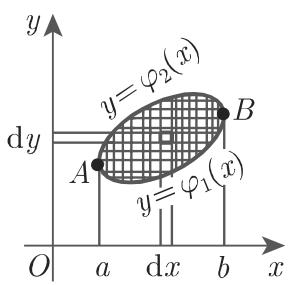

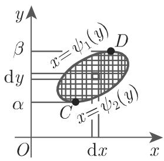

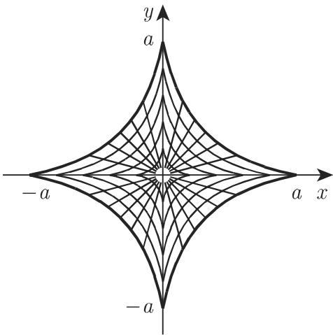

其余插图：图 8.33（抛物线围域）、8.34（极坐标分割）、8.35（半圆面）、8.36（曲线坐标网格）、8.38（三维区域分割）、8.39（笛卡儿三重积分）、8.40（柱面坐标）、8.41（球柱围域）、8.42（球面坐标）、8.43（圆锥），存于本源 media 目录。

## 与既有 wiki 的联系

- **补齐前向引用缺口**：[[queries/表8-9与表8-10及前向引用未入库缺口]] 所指的表 8.9、表 8.10 即在本源中，该 query 的表格部分可结案（小节回指部分仍开放，并入 [[queries/8-4未入库回指缺口]] 跟踪）。
- **定义模式的平移**：式 8.135b / 8.142 是 [[concepts/定积分]]（参见 [[findings/式8-37至8-39定义组逐字转录与存在性]]）的「Riemann 和极限 + 连续为充分非必要条件」定义模式向二维、三维的平移。
- **微元法的升维**：dS、dV 即 [[concepts/微元法]] 在二维/三维的实现；表 8.9/8.10 是微元法的成表应用。
- **力学公式的多重积分版本**：[[concepts/重心的积分公式]] 与 [[concepts/转动惯量的积分公式]]（源自 8.2.2）在此获得平面图形与立体的多重积分形式及多坐标系平行式。
- **曲面面积**：表 8.9 第 2 行（$S_O=\int_S \mathrm{d}S/\cos\gamma$）与 [[concepts/旋转曲面的面积]] 相接；第 1 行极坐标 ∬ρdρdφ 与 [[concepts/曲边梯形与曲边扇形的面积]] 中 (1/2)∫ρ²dφ 相接。
- **换元法的升维**：[[concepts/换元积分法]] 的一元代换 dx=φ′(t)dt 推广为 dV=|D|du dv dw。
- **与 [[concepts/积分符号下的积分]] 相邻而不同**：8.2.4 讨论含参积分的换序（需一致收敛型条件），本节讨论几何区域上累次积分的换序（连续 + 正规区域即可），见 [[concepts/累次积分]] 的区分注记。

## 转写讹误与内部张力

本 OCR 文档存在系统性讹误（完整清单见 [[queries/8-4全节系统性转写讹误清单]]）：于→千、几→儿、面→而，「表」字在四处表题与正文回指中整体脱漏，区域符号 S、V 与变元大面积脱漏，边界曲线下标乱码，式 8.139 前一整句乱码等。数学内容层面的张力：

1. 算例二第二序 ∫₀² 与结果矛盾（见上）。
2. 表 8.9 第 6 行极坐标列「ϱϱ」撞形（密度 ϱ 与极径 ρ，据表 8.10「ϱρ」判定原书有别）。
3. 8.4.1.3 称表 8.8 给出「笛卡儿坐标系和极坐标系」两种微元，而表实含任意曲线坐标第三行。
4. 严谨性缺口（原书层面）：式 8.139/8.147b 未陈述换元的单射性与 |D|≠0 条件；星形线算例中 D 恰在射线族坐标线上为零（仅测度零集，不影响结果），书未说明。
5. 「任何积分限都可能仅含有外侧积分变量」中「可能」疑为「只能」之译。

## 开放问题

1. 8.3 节内容为何？章内编号 8.1、8.2、8.4 已入库而 8.3 缺位，是否即曲线积分/曲面积分所在节？
2. 式 8.139 前「如沿 v = νμ/H ⊗」一句的原文语义（曲线坐标下的求和方向）？
3. 边界曲线记号「(AB) 肛 / (AB)_F」的下标原文（疑为上、下边界 upper/lower 之标）？
4. 表 8.9 极坐标质量行的「ϱϱ」在原书是否确为 ϱρ 两字符？
5. 算例二的 ∫₀² 是 OCR 之误还是原书排印之误？
6. 「与 x 的值无关」是否脱漏 y（关系到与极坐标微元位置依赖性的对比表述）？

<!-- llm-wiki:embedded-images -->
## Embedded Images

### Document


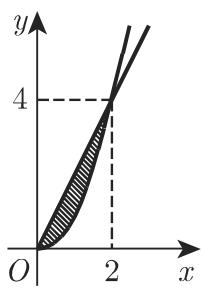
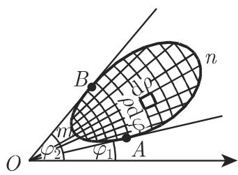


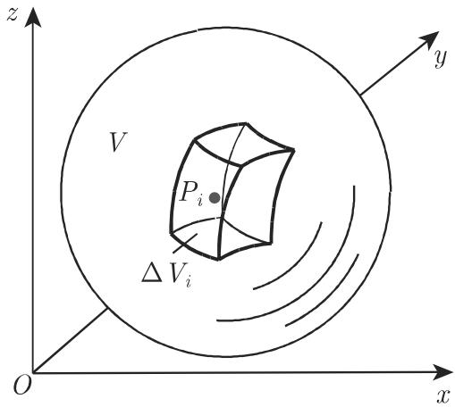
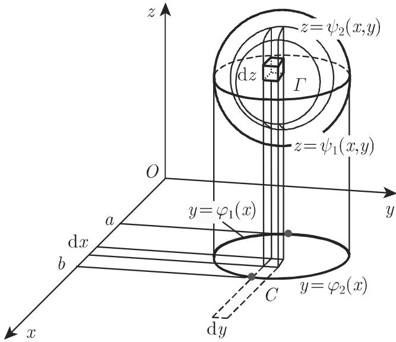
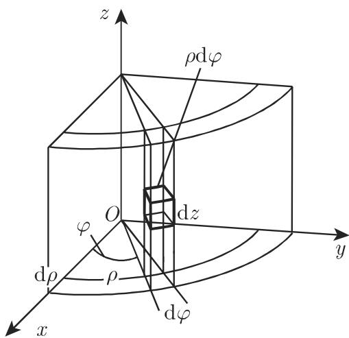

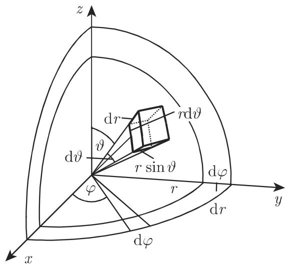
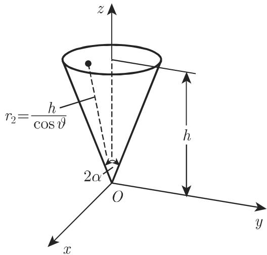
<!-- llm-wiki:embedded-images -->
