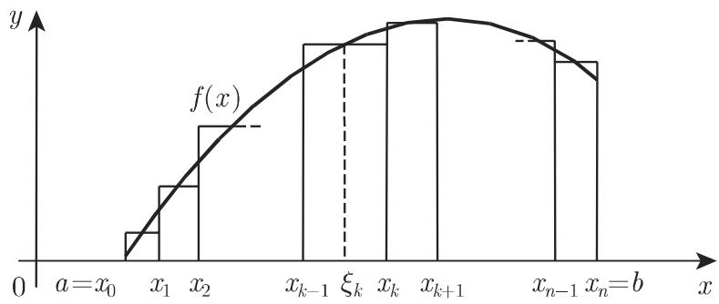

# 数学手册(原书第10版) 第8章 积分学（章节目录页）

本页是 [[数学手册原书第10版]] 第8章「积分学」的章节目录页：仅含三条导引论断、五小节索引与图 8.1，无小节实质内容；它是后续 8.1–8.5 各小节内容文件入库时的结构锚点。小节编号体系（如正文回指「8.2.1.2, 1.」所示）承袭德文母作品 [[taschenbuch-der-mathematik数学手册母作品]] 的层级结构。

## 章结构登记

第8章由五个小节构成（目录页链接原文）：

```
- 8.1 不定积分
- 8.2 定积分
- 8.3 线积分
- 8.4 多重积分
- 8.5 曲面积分
```

五个小节在目录页中仅为链接标签，无实质内容；各小节实质内容待其内容文件入库时另行登记，齐备性核对见 [[第8章小节文件齐备性之辨]]。

## 三条导引论断（原文迻录）

原文含 LaTeX 数学记法，此处以易读形式迻录，脱字与标点悉依原文：

> (1) 积分与不定积分　在下述意义下积分是微分的逆运算：若微分计算的是给定函数 (x) 的导数 f′(x)，积分则是要确定一个函数，使其导数为前面给出的 f′(x) 因积分结果不唯一，故要引出不定积分的概念．
>
> (2) 定积分　从积分学的图形问题出发，要确定曲线 y = f(x) 轴围成的图形面积，需要用一些小矩形来近似（图 8.1)，由此引出定积分的概念．
>
> (3) 定积分与不定积分之间的关系　两个积分之间的关系是微积分基本定理（参见第 659 8.2.1.2, 1.).

三条均为教科书式陈述，非原创研究；其中若干脱字疑点见下节。注意数学上「积分是微分的逆运算」与「积分结果不唯一（原函数族差常数）」系两层表述，将来立概念页时应予区分。

## 图 8.1

小矩形近似曲边梯形面积示意图，说明定积分的面积（黎曼和）起源。

- media 路径：`media/10-数学手册原书第10版--7-第8章-积分学--1iz0ey2/001-94abe8da22f3b3656f728f92a8774fe7bdecd99497a9976f910f4cdcaf999ba0.jpg`
- 源内相对路径：`images/94abe8da22f3b3656f728f92a8774fe7bdecd99497a9976f910f4cdcaf999ba0.jpg`

media 路径是否有效可达待核。

## 转写疑点（推断级，待对勘原书）

| # | 位置 | 现文 | 疑点 | 拟正 |
|---|---|---|---|---|
| 1 | 论断 (1) | 「给定函数 (x) 的导数」 | 脱函数名 f | 给定函数 f(x) 的导数 |
| 2 | 论断 (1) | 「…前面给出的 f′(x) 因积分结果不唯一…」 | 两句间疑脱句号 | …f′(x)。因积分结果不唯一… |
| 3 | 论断 (2) | 「曲线 y = f(x) 轴围成的图形面积」 | 疑脱「与 x」 | 曲线 y = f(x) 与 x 轴围成… |
| 4 | 论断 (2) | 「（图 8.1)」 | 括号全半角不配对（轻微） | （图 8.1） |
| 5 | 论断 (3) | 「参见第 659 8.2.1.2, 1.」 | 脱「页」字 | 参见第 659 页 8.2.1.2, 1. |
| 6 | 论断 (3) | 括号全半角不配对，末句以半角「.)」收束 | 与 (1)(2) 全角「．」不一（轻微） | …1.）． |

疑点 5 与既有 [[参见第1068脱页字之辨]]、[[参见第1075脱页字之辨]]、[[参见第1076脱页字之辨]]、[[参见第1100脱页字之辨]] 同一模式，是「参见第 N＋页码脱『页』字」系统性转写讹误在数值表章（第21章）之外的新实例，已另立 [[参见第659脱页字之辨]] 追踪，对勘原书确认后可升格为 finding。疑点 1–4、6 暂记于本页，待 8.1–8.5 小节内容入库后汇总为「第8章全节系统性转写讹误清单」类 query 统一清点。

## 回指核对

- 正文回指「第 659 8.2.1.2, 1.」落于 8.2 定积分小节内部；8.2 内容文件尚未入库，回指链暂悬空；「659」与原书实际页码是否相符待对勘。
- 目录页五小节链接（`8.1 不定积分.md` 至 `8.5 曲面积分.md`）的目标文件齐备性见 [[第8章小节文件齐备性之辨]]。
- 命名区分：语料另有第 21.8 节「定积分」（[[10-数学手册原书第10版--7-218-定积分--1rtpy2p]]），与本章 8.2「定积分」同名异节，入库与回指时不得混淆。

## 与既有维基的关联

- **理论—数值表对证**：第 21.8 节及其 [[定积分表]] 是定积分的数值表侧（[[Wallis积分公式]]、[[Gamma函数（第二型欧拉积分）]]、[[Beta函数（第一型欧拉积分）]]、[[Fresnel积分]] 等皆属该侧）；本章（尤其 8.2）为其理论侧，两厢互链成「理论—数值表」对证关系。注意：第 21.8 节数值表的既有复算 findings 属该表，不得移接至本章理论内容。
- **前置概念**：函数与导数见 [[10-数学手册原书第10版--6-第2章-函数--1e0xyfg]]。
- **系统性讹误谱系**：[[参考文献全节系统性转写讹误清单]] 及诸「参见第N脱页字之辨」。
- **母书**：[[数学手册原书第10版]]。注意库中另有疑似重复实体页 [[数学手册-原书第10版]]，两者宜合并；合并后应将第8章及其五小节补入存续页的章结构。

## 待办

- 待 8.1–8.5 各小节内容文件入库：补登小节页回指；建「不定积分」「定积分」「微积分基本定理」概念页（暂缓以避免薄页），并与 [[定积分表]] 互链；汇总本章全节转写讹误清单。
- 对勘原书验证疑点 1–6；核对 media 路径有效性。

<!-- llm-wiki:embedded-images -->
## Embedded Images

### Document


<!-- llm-wiki:embedded-images -->
