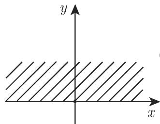
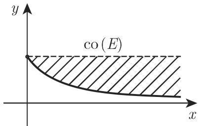
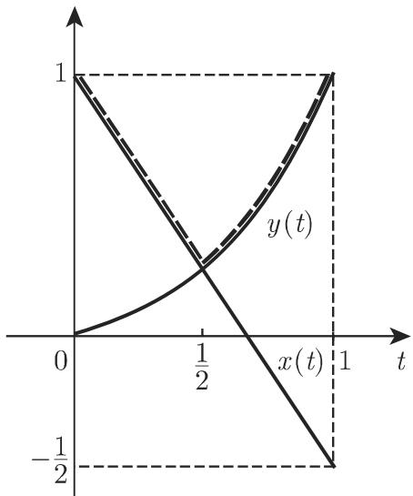
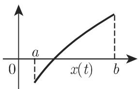
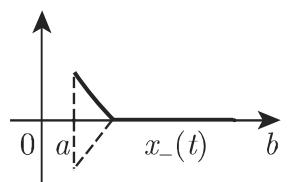
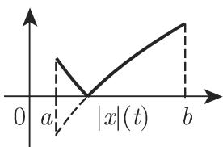

# 数学手册(原书第10版) 12.1 向量空间

## 来源定位

本节是《数学手册(原书第10版)》第 12 章「泛函分析」的首节，为整章奠定代数基础：**空间**（向量空间及其两大例子族）、**算子**（线性算子、线性泛函、同构与复化）、**序结构**（锥、有序向量空间、向量格与 K 空间）。对本库而言，它同时是第 11 章（积分方程）的抽象上层框架：积分算子是线性算子的特例，[[concepts/皮卡迭代法]] 与 [[concepts/诺伊曼级数]] 的逐次逼近依赖线性性，而 [[entities/连续函数空间]] 正是第 11 章的隐性工作空间。

## 结构脉络

| 小节 | 主题 | 公式范围 |
|---|---|---|
| 12.1.1 | 向量空间概念与公理 (V1)–(V8) | (12.1)–(12.8) |
| 12.1.2 | 线性子空间、仿射子空间、线性包；序列空间例 A–G 与函数空间例 A–E | (12.9)–(12.14) |
| 12.1.3 | 线性无关、哈梅尔基与维数 | (12.15) |
| 12.1.4 | 凸集、凸包、凸锥 | (12.16)–(12.18) |
| 12.1.5 | 映射、线性算子、泛函、同构 | (12.19)–(12.22) |
| 12.1.6 | 实向量空间的复化 | (12.23)–(12.24) |
| 12.1.7 | 有序向量空间：锥↔偏序、序有界、正算子、向量格 | (12.25)–(12.39) |

## 一、向量空间公理（12.1.1）

非空集 V 配上加法与标量乘法（标量域 𝔽 为 ℝ 或 ℂ），满足八条公理：

```
(V1) x + (y + z) = (x + y) + z                     (12.1)
(V2) 存在零元 0 ∈ V，使得 x + 0 = x                (12.2)
(V3) 对任意 x ∈ V，存在 −x 使得 x + (−x) = 0        (12.3)
(V4) x + y = y + x                                 (12.4)
(V5) 1·x = x，0·x = 0                              (12.5)
(V6) α(βx) = (αβ)x                                 (12.6)
(V7) (α + β)x = αx + βx                            (12.7)
(V8) α(x + y) = αx + αy                            (12.8)
```

导出性质：零元唯一；αx = βx ∧ x ≠ 0 ⟹ α = β；αx = αy ∧ α ≠ 0 ⟹ x = y；−(αx) = α·(−x)。差定义为 x − y = x + (−y)；方程 x + y = z 对任意 y, z 可解，解为 x = z − y。转录问题：(V2)、(V3) 缺「∀x」量词；(12.8) 出现双标签。详见 [[findings/式12-1至12-8向量空间公理与导出性质转录复算]] 与 [[concepts/向量空间公理]]。

## 二、两大例子族与包含链（12.1.2）

序列空间（例 A–G）：𝔽ⁿ、s（全部序列）、φ = c₀₀（有限支撑）、m = ℓ^∞（有界）、c（收敛）、c₀（零序列）、ℓ^p（p 幂可和）。函数空间（例 A–E）：F(T)（全部函数）、B(T) = M(T)（有界）、C([a,b])（连续）、C^(k)([a,b])（k 阶连续可微）及 C([a,b]) 的消没子空间 {x : x(t₀) = 0}。

两条包含链是本节最重要的可复用结构化数据：

```
φ ⊂ c₀ ⊂ c ⊂ m ⊂ s，   φ ⊂ ℓ^p ⊂ ℓ^q ⊂ c₀，   1 ≤ p < q < ∞    (12.12)
C^(k)([a,b]) ⊂ C([a,b]) ⊂ B([a,b]) ⊂ F([a,b])                      (12.14)
```

ℓ^p 对加法的封闭性由闵可夫斯基不等式保证（回指 1.4.2.13，未入库）。比较见 [[comparisons/序列空间包含链与函数空间包含链比较]]。

## 三、基与维数（12.1.3）

- 每个非平凡空间 V ≠ {0} 都有哈梅尔基（代数基）；任一线性无关子集可扩充成基；任意两基同基数，维数 dim(V) 为不变量。
- 𝔽ⁿ 是 n 维；lin({1, t, t²}) 是三维。
- 正文断言「在例 B∼E 中所有其他的空间都是无穷维」——按序列例子编号字面涵盖 s、φ、m、c，而 c₀（例 F）与 ℓ^p（例 G）未在内，疑应为「B∼G」，见 [[queries/例b至e范围是否应为b至g]]。
- 基存在性隐含选择公理式论证，源中未注明；哈梅尔基须与后续章节的拓扑基相区别。见 [[concepts/哈梅尔基与维数]]。

## 四、凸性与锥（12.1.4）

凸集由线段封闭性定义 (12.16)；凸包 co(E) 为有穷凸组合全体（λᵢ ∈ [0,1]，Σλᵢ = 1）；线性和仿射子空间总凸。凸锥满足三条件（凸、正齐次、尖），且「条件 (3) + (12.17)」给出等价刻画：

```
x, y ∈ K 且 λ, μ ≥ 0  ⟹  λx + μy ∈ K                              (12.17)
```

正例：ℝ₊ⁿ、C₊（非负连续函数）、非负序列锥；反例：ℓ^p 中的球集 C = {{ξₙ} : Σ|ξₙ|^p ≤ a}（12.18）是凸集但不是锥——**该断言仅关于此球集，不可外推至 ℓ^p 空间本身**。译者注约定：本章「锥」均指凸锥。见 [[concepts/凸集与凸包]]、[[concepts/凸锥]]。

## 五、线性算子与复化（12.1.5–12.1.6）

内射 (12.19)、满射 (12.20)；线性算子满足 T(αx + βy) = αTx + βTy（12.21）；核 N(T) = ker(T) = {x : Tx = 0}，值域 R(T)（亦记 Im(T)）；线性内射在 R(T) 上有线性逆（12.22）；Y = 𝔽 时称线性泛函；同构为「双内射」（疑为「双射」之讹，见 [[queries/双内射是否应为双射]]）。注意「核」一词在本节（算子零空间）与 [[concepts/积分方程的核]]（核函数 K(x,y)）中同词异义。

复化构造：Ṽ = {(x, y) : x, y ∈ V}，运算按 (12.23a)/(12.23b)，可验证 i(y,0) = (0,y)，从而 (x,y) 可写作 x + iy；V 中无关组与基在 Ṽ 中保持，dim V = dim Ṽ。见 [[concepts/实向量空间的复化]]。

## 六、序结构与向量格（12.1.7）

核心等价定理：锥 C 诱导偏序 x ≥ y ⟺ x − y ∈ C，且满足序公理 (O1)–(O4)（自反、传递、正齐次、加法保序，式 12.26–12.29）的序与正锥 V₊ = {x ≥ 0}（12.30）一一对应。生成锥满足 V = C − C。序区间 [x,y]（12.32）与 (o) 有界集；正算子 T(X₊) ⊂ Y₊（12.33）。向量格（里斯空间）中任意两元有上确界 x∨y；戴德金完备的向量格称 K 空间（康托洛维奇空间）。F([a,b]) 中上确界逐点计算 (12.34)；C([a,b])、B([a,b]) 是向量格，而 C^(1)([a,b]) 不是（max/min 一般不可微）。正部、负部、模由 (12.37)–(12.39) 给出。

![图 12.2：F([a,b]) 中两函数上确界的逐点构造](../media/10-数学手册原书第10版--8-121-向量空间--hguslx/004-766b61873c8cc253b5284062144870ff655d8cec1fa4ec130bd0009e87987d39.jpg)

## 七、两处实质数学讹误（已判定）

1. **式 (12.35)**：正文设 x(t) = 1 − (1/3)t，与式内分段函数 1 − (3/2)t 矛盾。交点复算：t = 1/2 处 1 − 3/4 = 1/4 = (1/2)²，式 (12.35) 自洽，故正文系数「1/3」应为「3/2」之讹。见 [[findings/式12-35正文xt系数与式内不一致之判定]]、[[queries/式12-35前xt定义系数不一致]]。
2. **式 (12.38b) 首不等式**：转录为 (x+y)₊ ≤ x₊ + x₋，在 ℝ 中取 x = y = 1 得 2 ≤ 1，为假；标准结论应为 (x+y)₊ ≤ x₊ + y₊（同式次项与三角不等式无误）。见 [[findings/式12-38b首不等式疑误之反例判定]]、[[queries/式12-38b首不等式正部相加对象疑误]]。

## 八、断言—主体对应（防跨主体转移）

| 断言 | 严格限定于 |
|---|---|
| 「不是向量格（max/min 一般不可微）」 | 仅 C^(1)([a,b])；F([a,b])、C([a,b])、B([a,b]) 均是格 |
| 「凸但非锥」 | 仅 ℓ^p 中的球集 (12.18) |
| 「(o)有界 ⟺ 通常有界」 | 仅 ℝ¹ |
| 「无穷维」 | 序列空间 s、φ、m、c（及存疑的 c₀、ℓ^p）；𝔽ⁿ 为 n 维 |
| 「1, sin nt, cos nt 无关 / 1, cos 2t, cos²t 相关」 | C([0,π]) 中 |

## 九、与既有维基的连接

- 第 11 章各页（如 [[concepts/第二类弗雷德霍姆积分方程]]、[[concepts/皮卡迭代法]]）可回指本节获得代数框架；[[entities/连续函数空间]] 是两章共享的工作空间。
- [[concepts/L2空间与平方可积函数]]：ℓ^p 为其序列离散对应物，比较见 [[comparisons/lp空间与l2平方可积函数空间比较]]。
- [[concepts/规范正交系与完全性]]：规范正交系的线性无关性是 12.1.3 的特例。
- [[entities/哈密顿算子]]（9.2.4）：作为线性算子与本征值问题可置于本节框架下。

## 十、转写讹误与回指缺口

系统性转写噪声（「放射」代「仿射」、「千」代「于」、符号乱码 IF/叹/芷/冗/乒/民等）集中收录于 [[queries/12-1全节系统性转写讹误清单]]；未入库回指（5.3.8.1/5.3.8.2、1.4.2.13、7.1.2、2.1.5.1、6.1、9.1.2.3、式 (2.97)、图 12.5 及文献 [12.2] [12.3] [12.20] [12.22]）见 [[queries/12-1未入库回指缺口]]。

<!-- llm-wiki:embedded-images -->
## Embedded Images

### Document









<!-- llm-wiki:embedded-images -->
