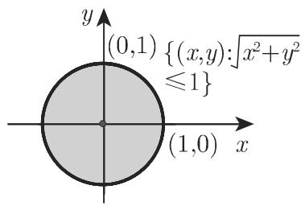
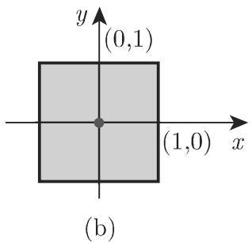
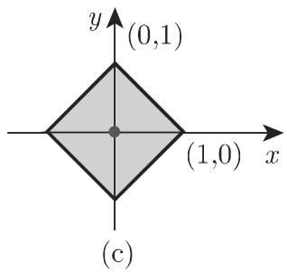

# 数学手册(原书第10版) 12.2 距离空间

## 内容概览

本节是《数学手册(原书第10版)》第 12 章（泛函分析）的首个入库小节，系统给出距离空间（度量空间）的公理化定义与八类距离算例（12.2.1）、球/邻域/开集/闭集等拓扑基础与序列收敛的距离依赖（12.2.1.1–12.2.1.4）、柯西序列与完备性及完备空间三大基本定理（球套定理、贝尔纲定理、巴拿赫不动点定理，12.2.2.1–12.2.2.3）、压缩映射原理的四个应用（线性方程组迭代解法、第二类弗雷德霍姆积分方程、第二类沃尔泰拉积分方程、皮卡—林德勒夫定理，12.2.2.4）、距离空间的完备化（12.2.2.5）以及连续算子与等距同构（12.2.3）。

本源为本库第 12 章首源，将既有第 9、11 章内容（[[concepts/第二类弗雷德霍姆积分方程]]、[[concepts/第二类沃尔泰拉积分方程]]、[[concepts/皮卡迭代法]]）纳入统一的距离空间/不动点框架。

## 度量公理（式 12.40–12.42）

```
(M1) ρ(x,y) ⩾ 0 且 ρ(x,y) = 0 ⟺ x = y   （非负性）        (12.40)
(M2) ρ(x,y) = ρ(y,x)                     （对称性）        (12.41)
(M3) ρ(x,y) ⩽ ρ(x,z) + ρ(z,y)            （三角形不等式）  (12.42)
```

满足公理的 $\rho:X\times X\to\mathbb{R}$ 称为度量或距离，偶对 $X=(X,\rho)$ 称为距离空间；$\rho$ 限制在 $Y\times Y$ 上得子空间 $(Y,\rho)$。见 [[concepts/距离空间]]。

## 八类距离算例（式 12.43–12.50）

| 式号 | 空间 | 距离定义 | 名称 |
|---|---|---|---|
| (12.43) | $\mathbb{R}^n$、$\mathbb{C}^n$ | $\rho=\sqrt{\sum_k(\xi_k-\eta_k)^2}$ | 欧几里得距离 |
| (12.44) | $\mathbb{R}^n$、$\mathbb{C}^n$ | $\rho=\max_{1\le k\le n}\lvert\xi_k-\eta_k\rvert$ | 最大距离 |
| (12.45) | $\mathbb{R}^n$、$\mathbb{C}^n$ | $\rho=\sum_k\lvert\xi_k-\eta_k\rvert$ | 绝对值距离 |
| — | 定长 0-1 字（编码理论） | 相异坐标计数 | 汉明距离 |
| (12.46) | $m$ 及 $c_0$（定义见 12.1，未入库） | $\rho=\sup_k\lvert\xi_k-\eta_k\rvert$ | — |
| (12.47) | $\ell^p$（$1\le p<\infty$） | $\rho=(\sum_k\lvert\xi_k-\eta_k\rvert^p)^{1/p}$ | — |
| (12.48) | $C([a,b])$ | $\rho=\max_{t\in[a,b]}\lvert x(t)-y(t)\rvert$ | 上确界距离 |
| (12.49) | $C^{(k)}([a,b])$ | $\rho=\sum_{\ell=0}^k\max_t\lvert x^{(\ell)}(t)-y^{(\ell)}(t)\rvert$ | — |
| (12.50) | $L^p(\Omega)$（$1\le p<\infty$） | $\rho=(\int_\Omega\lvert x-y\rvert^p\,d\mu)^{1/p}$ | — |

$n=1$ 时 (12.43)–(12.45) 均退化为绝对值 $\lvert x-y\rvert$；汉明算例 $\rho((1110),(0100))=2$。详见 [[concepts/Rn上的三种距离]]、[[concepts/汉明距离]]、[[concepts/lp序列空间]]、[[concepts/Lp函数空间]]、[[concepts/连续函数空间C与Ck]]。

## 拓扑基础与收敛（式 12.51–12.55）

开球/闭球 (12.51)/(12.52)、邻域与内点、开集及开集公理（任意并、有限交、$\emptyset$ 开）；闭集（补集刻画）、闭包 $\overline A$、边界点；本节术语「极限点」＝每个邻域都与 $A$ 相交的点（即通行教材的接触点），「聚点」才对应通行的极限点（见 [[queries/极限点术语即接触点辨析]]）。收敛的距离依赖：$\mathbb{R}^n$ 中＝坐标收敛；$B([a,b])$、$C([a,b])$ 中由 (12.48) 诱导＝一致收敛；$L^2(\Omega)$ 中由 (12.50) 诱导＝二次平均收敛 (12.54)。见 [[concepts/开球闭球与邻域]]、[[concepts/开集与闭集]]、[[concepts/一致收敛]]、[[concepts/平均收敛]]。

## 完备性（式 12.56–12.57）

柯西序列 (12.56)；收敛必为柯西，逆不成立——反例：$\ell^1$ 赋以 $m$ 的距离 (12.46) 时，$x^{(n)}=(1,\tfrac12,\dots,\tfrac1n,0,\dots)$ 是柯西列但不收敛（坐标极限 $(1,\tfrac12,\tfrac13,\dots)\notin\ell^1$，调和级数发散）。完备空间清单：$m$、$\ell^p$、$c$、$\mathcal{B}(T)$、$C([a,b])$、$C^{(k)}([a,b])$、$L^p(a,b)$（$1\le p<\infty$）。见 [[concepts/柯西序列与完备距离空间]]、[[comparisons/lp空间两种距离完备性比较]]。

## 三大基本定理（式 12.57–12.61）

球套定理 (12.57)（含刻画完备性的逆命题）、贝尔纲定理、巴拿赫不动点定理（压缩映射原理）及其误差估计 (12.61)：

$$
\rho(x^*,x_n)\le\frac{q^n}{1-q}\,\rho(x_1,x_0).
$$

见 [[concepts/球套定理]]、[[concepts/贝尔纲定理]]、[[concepts/巴拿赫不动点定理]]。

## 压缩映射原理的四个应用（式 12.62–12.75）

| 应用 | 不动点算子 | 转写给出的压缩条件 | 式号 |
|---|---|---|---|
| 线性方程组 | $Tx=x-Ax+b$ | (12.65) 三数之一 < 1（复算疑应为 $\lVert I-A\rVert$ 型三数，见下） | (12.62)–(12.65) |
| 第二类弗雷德霍姆方程 | $(T\varphi)(x)=\int_a^b K(x,y)\varphi(y)\,dy+f(x)$ | $\max_x\int_a^b\lvert K(x,y)\rvert\,dy<1$ | (12.66)–(12.67) |
| 第二类沃尔泰拉方程 | $T\varphi=f+V\varphi$，$(V\varphi)(x)=\int_a^x K(x,y)\varphi(y)\,dy$ | 未给出 | (12.68)–(12.69) |
| 皮卡—林德勒夫 | $T\varphi(t,x)=\tilde x+\int_{t_0}^t f(s,\varphi(s,\tilde x))\,ds$ | 未明示 | (12.70)–(12.75) |

线性方程组部分判据 (12.65) 与算子 (12.63) 复算不符：由 $Tx-Ty=(I-A)(x-y)$，压缩判据应针对 $\delta_{jk}-a_{jk}$ 型三数（Frobenius 范数/行和/列和），而非 $a_{jk}$ 本身；取 $A=-\varepsilon I$（$0<\varepsilon<1/\sqrt n$）满足转写版三条件，但 $T$ 以 $1+\varepsilon$ 膨胀、迭代发散。详见 [[findings/式12-62至12-65线性方程组压缩判据复算与反例]] 与 [[queries/式12-65压缩判据对象疑为I减A]]。

## 完备化、连续算子与等距（式 12.76–12.77）

完备化在等距意义下唯一（性质 a)–d)，见 [[concepts/距离空间的完备化]]）；连续算子的四等价刻画 (12.76 a–d)（序列式、开集/闭集原像、$T(\overline A)\subset\overline{T(A)}$），见 [[concepts/连续算子]]；等距同构 (12.77)，见 [[concepts/等距同构]]。图 12.4（三种距离下 $\mathbb{R}^2$ 的单位球）见 [[comparisons/Rn三种距离与单位球比较]]。

## 转写讹误与疑点

本节转写存在系统性 OCR 讹误（「千/于」、「厌/良/贮」代 $\mathbb{R}$/$\mathbb{R}^n$、「儿乎」代「几乎」、「宇」代「字」、「瓦」代 $\overline A$、「O」代 $\emptyset$、大量主语缺失、(12.60) 空编号等），汇总于 [[queries/12-2全节系统性转写讹误清单]]；未入库回指（12.1、12.3.1、12.9、19.2.1、19.6、7.3.2、7.2.1.1、9.1.1.1）汇总于 [[queries/12-2未入库回指缺口]]。

## 与既有内容的联系

- 强化 [[concepts/第二类弗雷德霍姆积分方程]]、[[concepts/第二类沃尔泰拉积分方程]]：12.2.2.4 给出二者的不动点化视角，与 11.2、11.4 的逐次逼近互为表里（参见 [[entities/诺伊曼级数]]、[[concepts/迭代核]]），条件比较见 [[comparisons/压缩映射条件与诺伊曼级数收敛条件比较]]、[[comparisons/弗雷德霍姆与沃尔泰拉不动点化条件比较]]。
- 扩展 [[concepts/L2空间与平方可积函数]]：(12.50)/(12.54) 将其推广到 $L^p$ 框架并给出平均收敛的度量刻画。
- 扩展 [[concepts/皮卡迭代法]] 与 [[methodology/初值问题积分化流程]]：(12.72)↔(12.73) 等价与 (12.75) 算子正是二者的抽象形式，见 [[concepts/皮卡-林德勒夫定理]]。
- 稠密性与可分性论断由 [[concepts/魏尔斯特拉斯逼近定理]] 支撑。

<!-- llm-wiki:embedded-images -->
## Embedded Images

### Document




<!-- llm-wiki:embedded-images -->
