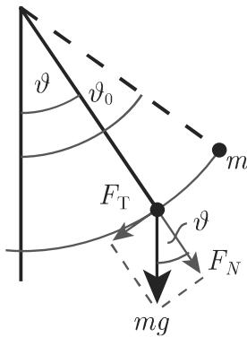
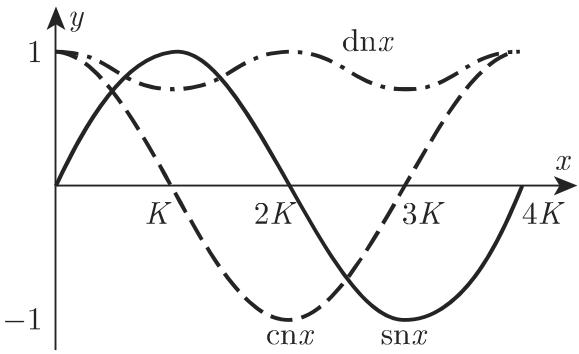

# 数学手册(原书第10版) 14.6 椭圆函数

## 文献与范围

《数学手册（原书第 10 版）》第 14 章第 6 节，是 [[椭圆函数]] 的专门论述（该条目此前仅由 14.3 顺带建立）。全节四小节：

- **14.6.1 与椭圆积分的关系**——以 [[数学摆]] 为算例，确立“椭圆函数是椭圆积分的反函数”这一组织思想；
- **14.6.2 雅可比函数**——定义 sn/cn/dn，给出周期/零点/极点表（表 14.3）与恒等式 (14.110)–(14.112)；
- **14.6.3 θ 函数**——源文小节标题“μ函数”系 ϑ 的 OCR 误读，应为“θ函数”（正文括注英文 theta functions 可证）；给出 ϑ₁–ϑ₄ 级数及雅可比函数的 θ 商表示；
- **14.6.4 魏尔斯特拉斯函数**——格点级数定义 ℘、ζ、σ 及其性质。

译文末行署“（陆柱家译）”，其后为下一章标题“15 章 积分变换”（不属于本节内容）。本节未提供出版信息，authors/year 暂空。

## 核心内容与复算结论

经逐式复算（详见各 finding 页），下列内容与标准理论一致：

- 反函数类比 (14.100)–(14.101) 与数学摆推导 (14.102a)–(14.102c)；
- 雅可比函数定义 (14.103)–(14.105)、双周期性 (14.106)–(14.108)、记号 (14.109)、表 14.3、恒等式与加法定理 (14.110)–(14.112)；
- θ 级数 (14.113) 及雅可比函数的 θ 表示 (14.114)–(14.115)（正确性依赖约定 (14.114) 的变量 π 缩放）；
- 魏尔斯特拉斯定义与关系式 (14.116)–(14.121)、(14.123)–(14.125)。

五处实质疑点（详见对应 query 页）：

1. (14.102d) 数学摆周期系数不自洽——[[式14-102d摆周期系数2T与4T之辨]]；
2. ℘ 性质 (1) “周期 ω₁ 和 ω₂”与格点定义矛盾，应为 2ω₁、2ω₂——[[魏尔斯特拉斯wp周期omega与2omega之辨]]；
3. (14.122) “ζ(z) = ln σ(z)”疑丢求导记号——[[式14-122zeta等于lnsigma疑丢求导记号]]；
4. ζ/σ 性质 (5) “每个椭圆函数是 ℘ 和 ζ 的有理函数”按字面为假，标准定理为 ℘ 与 ℘′ 的有理函数——[[魏尔斯特拉斯性质5wp与zeta有理表示之辨]]；
5. 定义句“全纯的双周期函数被称为椭圆函数”疑为“亚纯”——[[椭圆函数定义句全纯疑为亚纯之辨]]。

系统性转写讹误与未入库回指另见 [[14-6全节系统性转写讹误清单]]、[[14-6未入库回指缺口]]。

## 结构化数据转录

### 表 14.3 雅可比函数的周期、根和极点

（m、n 为任意整数；原表表头“根”应为“零点”；“极点”一栏三函数共用，原表以合并单元格呈现）

| 函数 | 周期 ω₁, ω₂ | 零点 | 极点 |
|---|---|---|---|
| sn z | 4K, 2iK′ | 2mK + 2niK′ | 2mK + (2n+1)iK′ |
| cn z | 4K, 2(K+iK′) | (2m+1)K + 2niK′ | 2mK + (2n+1)iK′ |
| dn z | 2K, 4iK′ | (2m+1)K + (2n+1)iK′ | 2mK + (2n+1)iK′ |

### 14.6.1 椭圆积分的反函数与数学摆

```latex
% (14.100)-(14.101) 反函数类比
\int_0^u (1-t^2)^{-1/2}\,dt = x \quad(|u|\le 1)
u=\sin x \Leftrightarrow x=\arcsin u\quad
\left(-\frac{\pi}{2}\le x\le\frac{\pi}{2},\ -1\le u\le 1\right)

% (14.102a) 摆方程（由切向力 -mg sin(vartheta) = ml vartheta(ddot) 而得）
\frac{d^2\vartheta}{dt^2}+\frac{g}{l}\sin\vartheta=0,\quad
\vartheta(0)=\vartheta_0,\ \dot\vartheta(0)=0

% (14.102b) 分离变量（t0 为摆首次位于最低位置的时刻，vartheta(t0)=0）
t-t_0=\sqrt{\frac{l}{g}}\int_0^{\vartheta}
\frac{d\Theta}{\sqrt{2(\cos\Theta-\cos\vartheta_0)}}

% (14.102c) 半角代换（源文代换式中 theta 疑为 Theta 之误）
\sin\frac{\Theta}{2}=k\sin\psi,\quad k=\sin\frac{\vartheta_0}{2}
\Longrightarrow\quad
t-t_0=\sqrt{\frac{l}{g}}\int_0^{\varphi}
\frac{d\psi}{\sqrt{1-k^2\sin^2\psi}}=\sqrt{\frac{l}{g}}\,F(k,\varphi)

% (14.102d) 周期（系数存疑，见 query 页）
T=\sqrt{\frac{l}{g}}\,F\!\left(k,\frac{\pi}{2}\right)=\sqrt{\frac{l}{g}}\,K
```

注：源文称 ϑ(t) 为周期 2T 的周期函数、T 为两相继极端位置（dϑ/dt = 0）间的时间、小振幅时 T = 2π√(l/g)；四断言不相容。数学事实：全程周期 4√(l/g)K，两极端间隔 2√(l/g)K。

### 14.6.2 雅可比函数

```latex
% (14.103) F 的严格单调性（0<k<1）
\frac{dF}{d\varphi}=\left(1-k^2\sin^2\varphi\right)^{-1/2}>0

% (14.104) 振幅函数 = F(k,phi) 的反函数
\varphi=\operatorname{am}(k,u);\qquad
u=\int_0^{\varphi}\frac{d\psi}{\sqrt{1-k^2\sin^2\psi}}

% (14.105) 雅可比函数定义
\operatorname{sn}u=\sin\operatorname{am}(k,u)
\operatorname{cn}u=\cos\operatorname{am}(k,u)
\operatorname{dn}u=\sqrt{1-k^2\operatorname{sn}^2u}

% (14.106)-(14.107) 双周期性（omega1/omega2 非实数）
f(z+\omega_1)=f(z),\quad f(z+\omega_2)=f(z)
f(z+m\omega_1+n\omega_2)=f(z)\quad(m,n\in\mathbb{Z})

% (14.108) 周期平行四边形
\{z_0+\alpha_1\omega_1+\alpha_2\omega_2:\ 0\le\alpha_1,\alpha_2<1\}

% (14.109) 记号
k'^2=1-k^2,\qquad
K=F\!\left(k,\frac{\pi}{2}\right),\qquad
K'=F\!\left(k',\frac{\pi}{2}\right)

% (14.110) 基本恒等式
\operatorname{sn}^2z+\operatorname{cn}^2z=1,\qquad
k^2\operatorname{sn}^2z+\operatorname{dn}^2z=1

% (14.111) 加法定理
\operatorname{sn}(u+v)=
\frac{\operatorname{sn}u\,\operatorname{cn}v\,\operatorname{dn}v
+\operatorname{sn}v\,\operatorname{cn}u\,\operatorname{dn}u}
{1-k^2\operatorname{sn}^2u\,\operatorname{sn}^2v}
\operatorname{cn}(u+v)=
\frac{\operatorname{cn}u\,\operatorname{cn}v
-\operatorname{sn}u\,\operatorname{dn}u\,\operatorname{sn}v\,\operatorname{dn}v}
{1-k^2\operatorname{sn}^2u\,\operatorname{sn}^2v}
\operatorname{dn}(u+v)=
\frac{\operatorname{dn}u\,\operatorname{dn}v
-k^2\operatorname{sn}u\,\operatorname{cn}u\,\operatorname{sn}v\,\operatorname{cn}v}
{1-k^2\operatorname{sn}^2u\,\operatorname{sn}^2v}

% (14.112) 导数公式
(\operatorname{sn}z)'=\operatorname{cn}z\,\operatorname{dn}z
(\operatorname{cn}z)'=-\operatorname{sn}z\,\operatorname{dn}z
(\operatorname{dn}z)'=-k^2\operatorname{sn}z\,\operatorname{cn}z
```

### 14.6.3 θ 函数（原题“μ函数”系误读）

```latex
% (14.113) 级数定义（|q|<1 时对每个复变量 z 收敛）
\vartheta_1(z,q)=2q^{1/4}\sum_{n=0}^{\infty}(-1)^n q^{n(n+1)}\sin(2n+1)z
\vartheta_2(z,q)=2q^{1/4}\sum_{n=0}^{\infty}q^{n(n+1)}\cos(2n+1)z
\vartheta_3(z,q)=1+2\sum_{n=1}^{\infty}q^{n^2}\cos 2nz
\vartheta_4(z,q)=1+2\sum_{n=1}^{\infty}(-1)^n q^{n^2}\cos 2nz

% (14.114) 记号约定（关键：变量先乘 pi 再简写）
\vartheta_k(z):=\vartheta_k(\pi z,q)\quad(k=1,2,3,4)

% (14.115) 雅可比函数的 theta 表示
\operatorname{sn}z=2K\,\frac{\vartheta_4(0)}{\vartheta_1'(0)}\,
\frac{\vartheta_1(z/2K)}{\vartheta_4(z/2K)}
\operatorname{cn}z=\frac{\vartheta_4(0)}{\vartheta_2(0)}\,
\frac{\vartheta_2(z/2K)}{\vartheta_4(z/2K)}
\operatorname{dn}z=\frac{\vartheta_4(0)}{\vartheta_3(0)}\,
\frac{\vartheta_3(z/2K)}{\vartheta_4(z/2K)}
q=\exp\!\left(-\pi\frac{K'}{K}\right),\qquad
k=\left(\frac{\vartheta_2(0)}{\vartheta_3(0)}\right)^{\!2}
```

### 14.6.4 魏尔斯特拉斯函数

```latex
% (14.116)-(14.117) 定义（带撇求和表示忽略 m=n=0 项）
\wp(z)=\wp(z,\omega_1,\omega_2),\quad
\zeta(z)=\zeta(z,\omega_1,\omega_2),\quad
\sigma(z)=\sigma(z,\omega_1,\omega_2)
\omega_{mn}=2(m\omega_1+n\omega_2)\quad(m,n\in\mathbb{Z})
\wp(z)=z^{-2}+\sum_{m,n}'\Big[(z-\omega_{mn})^{-2}-\omega_{mn}^{-2}\Big]

% (14.118) 微分方程与不变量
\wp'^2=4\wp^3-g_2\wp-g_3
g_2=60\sum_{m,n}'\omega_{mn}^{-4},\qquad
g_3=140\sum_{m,n}'\omega_{mn}^{-6}

% (14.119) 反函数刻画
z=\int_u^{\infty}\frac{dt}{\sqrt{4t^3-g_2t-g_3}}

% (14.120) wp 加法定理
\wp(u+v)=\frac{1}{4}\left[\frac{\wp'(u)-\wp'(v)}{\wp(u)-\wp(v)}\right]^2
-\wp(u)-\wp(v)

% (14.121) zeta 与 sigma
\zeta(z)=z^{-1}+\sum_{m,n}'\Big[(z-\omega_{mn})^{-1}
+\omega_{mn}^{-1}+\omega_{mn}^{-2}z\Big]
\sigma(z)=z\exp\!\left(\int_0^z[\zeta(t)-t^{-1}]\,dt\right)
=z\prod_{m,n}'\Big(1-\frac{z}{\omega_{mn}}\Big)
\exp\!\left(\frac{z}{\omega_{mn}}+\frac{z^2}{2\omega_{mn}^2}\right)

% (14.122)-(14.125) 关系式
\zeta'(z)=-\wp(z),\qquad
\zeta(z)=\ln\sigma(z)\ \text{（疑丢求导号）}
\zeta(-z)=-\zeta(z),\qquad \sigma(-z)=-\sigma(z)
\zeta(z+2\omega_1)=\zeta(z)+2\zeta(\omega_1),\qquad
\zeta(z+2\omega_2)=\zeta(z)+2\zeta(\omega_2)
\zeta(u+v)=\zeta(u)+\zeta(v)
+\frac{1}{2}\frac{\wp'(u)-\wp'(v)}{\wp(u)-\wp(v)}
```

℘ 的性质（源文）：(1) 是有周期 ω₁ 和 ω₂ 的椭圆函数（疑应为 2ω₁、2ω₂）；(2) 级数 (14.117b) 对每个 z ≠ ω_mn 收敛；(3) 满足微分方程 (14.118a)，g₂、g₃ 称为不变量；(4) 是积分 (14.119) 的反函数；(5) 加法定理 (14.120)。ζ、σ 的关系：(1) (14.122)；(2) 奇偶性 (14.123)；(3) 拟周期 (14.124)；(4) 加法定理 (14.125)；(5) “每个椭圆函数是 ℘(z) 和 ζ(z) 的有理函数”（有疑点）。

## 插图



*图 14.54 数学摆（力的分解）*


*图 14.55 周期平行四边形*


*图 14.56 雅可比函数 sn z、cn z、dn z 的图形*

## 与既有维基内容的联系

- [[椭圆函数]]：本节为其主要扩充来源（定义、双周期性、实例）；
- [[亚纯函数]]：sn/cn/dn/℘ 为具体实例，源文交叉回指 14.3.5.2；
- [[刘维尔定理]]：本节“有界双周期⟹常数”为其环面形式；
- [[解析延拓]]：雅可比函数经延拓到 z 平面而得亚纯性；
- 方法论：[[退化极限与原点展开检验法]]（本节复算所用）；
- 对照页：[[雅可比函数与魏尔斯特拉斯函数比较]]、[[sn-cn-dn周期零点极点比较]]、[[椭圆函数与三角函数比较]]。

<!-- llm-wiki:embedded-images -->
## Embedded Images

### Document



<!-- llm-wiki:embedded-images -->
