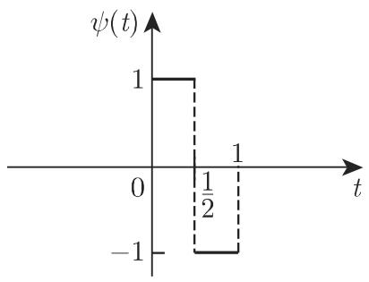
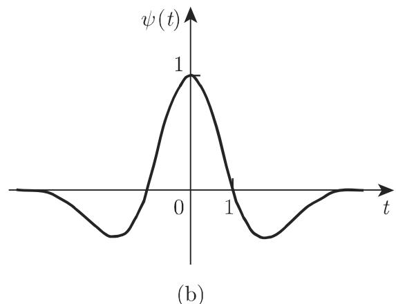

# 数学手册(原书第10版) 15.5 小波变换

《数学手册（原书第10版）》第 15 章第 5 节，主题为小波变换，是继 15.1–15.3（[[concepts/积分变换]]、拉普拉斯变换、[[concepts/傅里叶变换]]）之后本章的又一节。全节共五小节：15.5.1 信号、15.5.2 小波、15.5.3 小波变换、15.5.4 离散小波变换（下分 15.5.4.1 快速小波变换与 15.5.4.2 离散哈尔小波变换）、15.5.5 加博变换；含编号公式 (15.143)–(15.158) 与插图 15.28–15.29。

## 小节结构与要点

- **15.5.1 信号**：提出 [[concepts/信号分析与信号合成]] 的框架——分析即把描述信号的函数或数列映射到另一个函数或数列以把握典型性质（同时会丢失一些信息），合成即其逆过程；以傅里叶变换对 (15.143a)/(15.143b) 为例证。
- **15.5.2 小波**：动机为傅里叶变换缺乏定位性——信号在一处改变则变换处处改变，因其把信号分解为全长以相同周期振荡的平面波（三角函数）。随后定义 [[concepts/小波]]：二次可积（通译平方可积）且其傅里叶变换 Ψ(ω) 使积分 (15.147) 为正的有限值；给出均值条件 (15.148)、矩与阶 (15.149)，以及哈尔、墨西哥草帽两个例子（图 15.28）。
- **15.5.3 小波变换**：由平移–伸缩生成基函数族 (15.150)–(15.151)，定义 [[concepts/小波变换]] (15.152a) 及其逆变换 (15.152b)；哈尔小波算例 (15.153) 解释为相邻区间均值之差；(1) 给出二进（源译「二元」）基 (15.154)；(2) 定义正交小波；(3) 点名 [[concepts/多贝西小波]]。
- **15.5.4 离散小波变换**：15.5.4.1 说明 (15.152b) 的冗余性，引出多尺度分析与标架（通译「框架」）并外引 [15.10][15.1]，与 FFT 类比地点名 FWT（快速小波变换）；15.5.4.2 给出 [[concepts/离散小波变换]] 的哈尔实例 (15.155)–(15.156)。
- **15.5.5 加博变换**：以时频表征为动机引入窗口傅里叶变换（WFT），取高斯窗 (15.157)（图 15.29），定义 [[concepts/加博变换]] (15.158)，并给出复振幅解释。

## 结构化数据（逐字转录）

```latex
% ---- 15.5.1 信号分析与合成 ----
F(\omega) = \int_{-\infty}^{\infty} \mathrm{e}^{-\mathrm{i}\omega t} f(t)\,\mathrm{d}t                     (15.143a)
f(t) = \frac{1}{2\pi} \int_{-\infty}^{\infty} \mathrm{e}^{\mathrm{i}\omega t} F(\omega)\,\mathrm{d}\omega   (15.143b)

% ---- 15.5.2 小波定义 ----
\psi = \left\{ \begin{array}{ll} 1, & 0 \leqslant x < \frac{1}{2}, \\ -1, & \frac{1}{2} \leqslant t \leqslant 1, \\ 0, & \text{其他}. \end{array} \right.   % (15.144) 自变量 x/t 混用，源文档原样
\psi(x) = -\frac{\mathrm{d}^{2}}{\mathrm{d}x^{2}} \mathrm{e}^{-x^{2}/2}                                    (15.145)
\psi(x) = (1 - x^{2})\,\mathrm{e}^{-x^{2}/2}                                                              (15.146)
\int_{-\infty}^{\infty} \frac{|\varPsi(\omega)|}{|\omega|}\,\mathrm{d}\omega  % 「正的有限积分」；|Ψ| 疑应为平方   (15.147)
\int_{-\infty}^{\infty} \psi(t)\,\mathrm{d}t = 0                                                           (15.148)
\mu_k = \int_{-\infty}^{\infty} t^k \psi(t)\,\mathrm{d}t                                                    (15.149)

% ---- 15.5.3 连续小波变换 ----
\psi_a(t) = \frac{1}{\sqrt{|a|}} \psi\!\left(\frac{t}{a}\right) \quad (a \neq 0)                            (15.150)
\psi_{a,b}(t) = \frac{1}{\sqrt{|a|}} \psi\!\left(\frac{t-b}{a}\right) \quad (a,b \in \mathbb{R};\ a \neq 0)  (15.151)
\mathcal{L}_\psi f(a,b) = c \int_{-\infty}^{\infty} f(t)\,\psi_{a,b}(t)\,\mathrm{d}t
 = \frac{c}{\sqrt{|a|}} \int_{-\infty}^{\infty} f(t)\,\psi\!\left(\frac{t-b}{a}\right)\mathrm{d}t            (15.152a)
f(t) = c \int_{-\infty}^{\infty} \int_{-\infty}^{\infty} \mathcal{L}_\psi f(t)\,\psi_{a,b}(t)\,\frac{1}{a^{2}}\,\mathrm{d}a\,\mathrm{d}b  % 宗量 (t) 疑应为 (a,b)  (15.152b)

% 哈尔基函数（算例代入）
\psi\!\left(\frac{t-b}{a}\right) = \left\{ \begin{array}{ll} 1, & b \leqslant t < b + a/2, \\ -1, & b + a/2 \leqslant t < b + a, \\ 0, & \text{其他}. \end{array} \right.

\mathcal{L}_\psi f(a,b) = \frac{1}{\sqrt{|a|}} \left(\int_b^{b+a/2} f(t)\,\mathrm{d}t - \int_{b+a/2}^{b+a} f(t)\,\mathrm{d}t\right)
 = \frac{\sqrt{|a|}}{2} \left(\frac{2}{a} \int_b^{b+a/2} f(t)\,\mathrm{d}t - \frac{2}{a} \int_{b+a/2}^{b+a} f(t)\,\mathrm{d}t\right)   (15.153)

\psi_{i,j}(t) = \frac{1}{\sqrt{2^{i}}} \psi\!\left(\frac{t - 2^{i} j}{2^{i}}\right)                          (15.154)

% ---- 15.5.4 离散哈尔变换 ----
s_i = \frac{1}{\sqrt{2}} (f_{2i-1} + f_{2i}), \quad d_i = \frac{1}{\sqrt{2}} (f_{2i-1} - f_{2i})            (15.155)
s_i^{(n+1)} = \frac{1}{\sqrt{2}} (s_{2i-1}^{(n)} + s_{2i}^{(n)}), \quad
d_i^{(n+1)} = \frac{1}{\sqrt{2}} (s_{2i-1}^{(n)} - s_{2i}^{(n)})                                            (15.156)

% ---- 15.5.5 加博变换 ----
g(t) = \frac{1}{\sqrt{2\pi}\,\sigma}\, \mathrm{e}^{-t^{2}/(2\sigma^{2})}                                    (15.157)
\mathcal{G} f(\omega, s) = \int_{-\infty}^{\infty} f(t)\, g(t-s)\,\mathrm{e}^{-\mathrm{i}\omega t}\,\mathrm{d}t   (15.158)
```

## 三种小波对照

| 小波 | 定义式 | 阶 n | 支撑 | 源内正交性断言 |
|---|---|---|---|---|
| 哈尔 | (15.144) | 1（已复算 μ₁ = −1/4） | [0,1] 紧支撑 | 未明言（外部事实：二进族正交） |
| 墨西哥草帽 | (15.145)–(15.146) | 2（偶函数 ⟹ μ₁ = 0） | 非紧支撑（指数衰减） | 无 |
| 多贝西 | 无闭式（[15.10]） | 有限 | 紧支撑 | 正交 ✓ |

## 插图

图 15.28（哈尔小波与墨西哥草帽小波波形）：





图 15.29（高斯窗 g(t)）：


注意：源文档版面中图 15.28 的 (b) 标签先于 (a) 出现，与正文「哈尔小波（图 15.28(a)）」「墨西哥草帽小波（图 15.28(b)）」的指称错位，两幅图与 (a)/(b) 的具体对应需人工核对。

## 转写疑点概览

- [[queries/15-5全节系统性转写讹误清单]] — 「千」代「于」、ψ 讹作「心」「ς」等系统性讹误与脱字
- [[queries/15-5未入库回指缺口]] — 多尺度分析、标架、FWT/FFT 交叉引用、[15.10][15.1]、15.4 节缺档
- [[queries/式15-147容许条件Ψ模一次幂疑为平方]] — 容许性条件疑缺平方
- [[queries/式15-152常数c双重出现一致性之辨]] — 正逆变换中常数 c 的约定
- [[queries/式15-150压缩条件疑为绝对值a小于1]] — 压缩条件之辨
- [[queries/具体数值具体向量疑为细节之辨]] — 「具体」疑为「细节」
- [[queries/时域分析疑为时频分析]] — 15.5.5 开篇术语之辨

## 逐式转录与复算结论

- [[findings/式15-143至15-148信号与小波定义容许条件转录复算]] — 信号定义、傅里叶对、小波定义与容许条件；哈尔 n=1、墨西哥草帽 n=2 复算成立
- [[findings/式15-149至15-153矩阶小波变换与哈尔算例转录复算]] — 矩、阶、CWT 定义与哈尔均值差算例，第二等号代数验证成立
- [[findings/式15-154至15-156二进正交小波与离散哈尔变换转录复算]] — 二进基保范换元验证、s/d 能量守恒验证
- [[findings/式15-157至15-158加博变换窗函数转录复算]] — 高斯窗单位质量验证与变换式转录

## 与既有页面的联系

- 本节把 15.1 的单参数核 K(s,t) 框架（[[concepts/积分变换]]）扩展为**双参数**基函数族：小波变换的 (a,b) 与加博变换的 (ω,s)；二者均不在表 15.1 的十二种单变量积分变换之列。
- (15.143a)/(15.143b) 复用 15.3 的约定（正变换无前置因子、逆变换带 1/2π），见 [[concepts/指数型傅里叶变换]] 与 [[concepts/逆变换]]；前一节 source 为 [[sources/10-数学手册原书第10版--9-153-傅里叶变换--7jrerb]]。
- 「傅里叶变换无定位性」的批评是 [[concepts/傅里叶变换]] 页内容的延伸评价，见 [[comparisons/傅里叶变换与小波变换定位性能比较]]。
- 加博振幅解释 |𝒢f(ω,s)| 与 [[concepts/频谱（振幅谱与相位谱）]] 的振幅概念相衔接。

<!-- llm-wiki:embedded-images -->
## Embedded Images

### Document


<!-- llm-wiki:embedded-images -->
