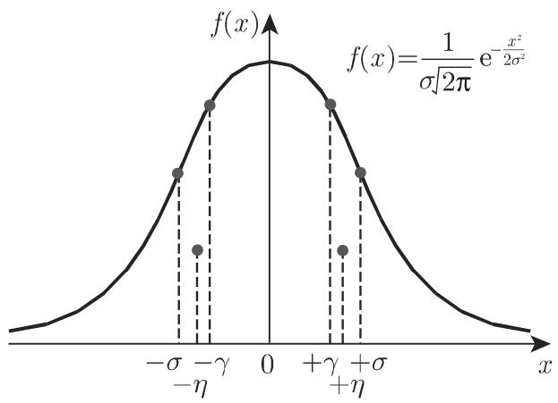

# 数学手册(原书第10版) 16.4 误差验算

## 文献定位

本文件是《数学手册(原书第10版)》第 16 章第 4 节「误差验算」的全量转录，含 16.4.1「测量误差及其分布」（16.4.1.1–16.4.1.6）与 16.4.2「误差传播和误差分析」（16.4.2.1–16.4.2.2）。文末署名「（聂淑媛译）」；转录末尾混入下章标题「17 动力系统与混沌」，属边界伪影，不属于本节内容。上一节见 [[sources/10-数学手册原书第10版--9-163-数理统计学--wxthf9]]；本节多处回指 16.2.4 的分布工具（[[sources/10-数学手册原书第10版--9-1624-连续分布--1ktbozm]]）。

## 纲领与结构

引言给出误差论总纲：无论多么细心，任何科学测量到一定次数都存在误差与不确定性，其成分为观察误差、测量方法的误差、仪器误差以及通常源于被测现象内在随机性的误差；测量过程中出现的所有测量误差称为偏差；以有限有效数字表示的测量值只能通过统计意义上的舍入误差给出，称为结果的不确定性。测量结果有随机性，可视为具有概率分布的统计样本，「测量误差可看作样本误差」。两条纲领：

1. 测量过程的偏差应保持尽可能小——借助平滑方法估计最佳逼近，该方法起源于高斯的最小二乘法（[[concepts/最小二乘法]]、[[entities/高斯]]）；
2. 尽可能好地估计不确定性——借助数理统计方法。

小节地图：16.4.1.1 三类误差划分（[[concepts/测量误差]]）；16.4.1.2 误差密度函数与正态误差（[[concepts/误差密度函数性质]]、[[concepts/正态误差]]、[[concepts/正态误差特征参数]]）；16.4.1.3 量化特征（[[concepts/真实误差与表观误差]]、[[concepts/绝对误差与相对误差]]、[[concepts/最大误差界]]）；16.4.1.4 误差界与 t 置信限；16.4.1.5 等精度算例；16.4.1.6 加权估计（[[concepts/加权平均与权重因子]]）；16.4.2.1 [[concepts/高斯误差传播定律]]；16.4.2.2 [[concepts/误差分析]]。

## 核心公式清单（原样保留）

```text
(16.189)  E(|X|) = ∫|x| f(x) dx < ∞
(16.190a) f(x) = 1/(σ√(2π)) · e^(−x²/(2σ²))
(16.190b) F(x) = Φ(x/σ)
(16.191)  h = 1/(σ√2)
(16.192)  η = E(|X|) = 2∫₀^∞ x f(x) dx = √(2/π)·σ
(16.193a) P(|X| ≤ γ) = 1/2；  (16.193c) γ/σ ≈ 0.6745
(16.194)  P(|X| ≤ a) = 2Φ(a/σ) − 1
(16.195a) η = √(2/π)σ；  (16.195b) γ = 0.6745σ；  (16.195c) h = 1/(2√σ)  ← 与 (16.191) 冲突
(16.196a) x̄ = (1/n)Σxᵢ
(16.198)  εᵢ = x_w − xᵢ；  (16.199) vᵢ = x̄ − xᵢ
(16.200c) σ̃ = √(Σvᵢ²/(n−1))；  (16.200d) P(|ε| ≤ σ̃) = 2Φ(1) − 1 = 0.6826
(16.202b) P(|ε| ≤ η) = 2Φ(√(2/π)) − 1 ≈ 0.5751
(16.203)  σ̃_AM = √(Σvᵢ²/[n(n−1)]) = σ̃/√n
(16.204)  γ̃_AM = 0.6745·σ̃/√n；  (16.205) η̃_AM = 0.7979·σ̃/√n
(16.206a) δxᵢ = Δxᵢ/x ≈ Δxᵢ/x̄
(16.207)  Δz_max = Σ|∂f/∂xᵢ|·Δxᵢ；  (16.208) δz_max = Δz_max/z ≈ Δz_max/z̄
(16.209a) x = xᵢ ± Δx ≈ xᵢ ± σ̃
(16.210)  μ = x̄ ± t_{α/2;f}·σ̃_AM， f = n−1
(16.212)  gᵢ = σ̃²/σ̃ᵢ²
(16.213)  σ̃⁽ᵍ⁾ = √(Σgᵢvᵢ²/(n−1))
(16.215)  σ̃_AM⁽ᵍ⁾ = σ̃⁽ᵍ⁾/√(Σgᵢ)
(16.216b) Δf ≈ df = Σ(∂f/∂xⱼ)dxⱼ = Σaⱼdxⱼ
(16.217)  σ_f² = Σaⱼ²σ²_{xⱼ}   （原转写作「∂f²」，应为 σ_f²）
(16.218)  σ̃²_{x̄ⱼ} = Σₗ(xⱼₗ − x̄ⱼ)²/[nⱼ(nⱼ−1)]
(16.219)  σ̃_f² = Σaⱼ²σ̃²_{x̄ⱼ}   ← 高斯误差传播定律
(16.220)  σ̃_f = √(σ̃₁²+…+σ̃ₖ²)；(16.221) σ̃_f = √(σ̃²_Str + σ̃²_Det + σ̃²_el)
(16.222)  z = a·x₁^{b₁}·…·xₖ^{bₖ}
(16.224)  σ̃_f/f = √(Σ(bⱼ·σ̃_{x̄ⱼ}/x̄ⱼ)²)
```

## 等精度算例数据（16.4.1.5，n=10）

| $x_i$ | 1.592 | 1.581 | 1.574 | 1.566 | 1.603 | 1.580 | 1.591 | 1.583 | 1.571 | 1.559 |
|---|---|---|---|---|---|---|---|---|---|---|
| $v_i\cdot10^3$ | −12 | −1 | +6 | +14 | −23 | 0 | −11 | −3 | +9 | +21 |
| $v_i^2\cdot10^6$ | 144 | 1 | 36 | 196 | 529 | 0 | 121 | 9 | 81 | 441 |

## 表 16.6 加权算例数据（n=5，x₀=1.585，σ̃=0.009）

| $\bar{x}_i$ | $\tilde{\sigma}_{AM_i}$ | $\tilde{\sigma}_{AM_i}^2$ | $g_i$ | $z_i$ | $g_i z_i$ | $z_i^2$ | $g_i z_i^2$ |
|---|---|---|---|---|---|---|---|
| 1.573 | 0.010 | 1.0·10⁻⁴ | 0.81 | −1.2·10⁻² | −9.7·10⁻³ | 1.44·10⁻⁴ | 1.16·10⁻⁴ |
| 1.580 | 0.004 | 1.6·10⁻⁵ | 5.06 | −5.0·10⁻³ | −2.5·10⁻² | 2.50·10⁻⁵ | 1.26·10⁻⁴ |
| 1.582 | 0.005 | 2.5·10⁻⁵ | 3.24 | −3.0·10⁻³ | −9.7·10⁻³ | 9.0·10⁻⁶ | 2.91·10⁻⁵ |
| 1.589 | 0.009 | 8.1·10⁻⁵ | 1.00 | +4.0·10⁻³ | 4.0·10⁻³ | 1.6·10⁻⁵ | 1.6·10⁻⁵ |
| 1.591 | 0.011 | 1.21·10⁻⁴ | 0.66 | +6.0·10⁻³ | 3.9·10⁻³ | 3.6·10⁻⁵ | 2.37·10⁻⁵ |
| $(\bar{x}_i)_m=1.583$ | $\tilde\sigma=0.009$ |  | $\sum g_i=10.7$ |  | $\sum g_iz_i=3.6\cdot10^{-2}$（脱负号） |  | $\sum g_iz_i^2=3.1\cdot10^{-4}$ |

## 复算核验结论

- **16.4.1.5 等精度算例全通过**：Σx_i=15.800 → x̄=1.5800；Σv_i=0；Σv_i²=1.558×10⁻³ → σ̃=√(1.558×10⁻³/9)=0.01316≈0.0131；σ̃_AM=0.01316/√10=0.00416（文中作 0.004，舍入偏粗，精确值 0.0042）。最终结果 x=1.580±0.004 复算成立（[[findings/等精度直接测量算例转录复算]]）。
- **表 16.6 加权算例部分通过**：各 g_i、Σg_i≈10.7、各 g_i z_i 复算吻合；σ̃_x=0.0088/√10.77=0.0027 与正文自洽；但存在三处内部不一致（z̄=−0.0036 与复算 −0.0034；最终结果中心值 1.585 与正文自算 1.582 矛盾；σ̃⁽ᵍ⁾=0.0088 恰为按 z_i 而非 v_i 计算之值），且 σ̃=0.009 的选取与「通常取最小 σ̃_i」约定不符（最小者 0.004），详见 [[findings/式16-211至16-215与表16-6加权算例转录复算]]。
- **正态误差参数常数全部复算吻合**：γ/σ=0.6745、η/σ=√(2/π)≈0.7979、P(|ε|≤σ)=0.6826、P(|ε|≤η)=2Φ(0.7979)−1≈0.5751（[[findings/式16-189至16-195c误差密度与正态误差参数转录复算]]）。
- **(16.195c) 与 (16.191) 直接冲突**：h=1/(2√σ) 量纲不合，判为转写讹误，辨析见 [[queries/式16-195c精确度公式与16-191冲突之辨]]。
- **高斯误差传播定律及两算例复算无误**（[[findings/式16-216至16-224高斯误差传播定律转录复算]]）。

## 归属边界（引用须知）

所有概率常数（0.6745、0.7979、0.6826、0.5751）仅归属于正态误差假设；(16.210) 的 t 置信限归属于正态总体 N(μ,σ²)；(16.219)/(16.224) 归属于「变量独立 + 可微 + 一阶近似」；σ̃ 的定义式 (16.200c) 对任意分布成立，但 0.6745/0.7979 换算系数仅正态情形成立，不得互相移植。本节 v_i=x̄−x_i 与常用残差 x_i−x̄ 反号，平方后无影响，引用线性式时应注明。

## 与既有维基的关系

- **强化**：[[concepts/正态分布]]、[[concepts/标准正态分布]]（16.190 即 16.70/16.73a 的 μ=0 应用）；[[concepts/学生t分布]]（16.210 引用 16.96/16.97b，给出真值估计应用场景，见 [[findings/式16-93至16-99费希尔F分布与学生t分布转录复算]]）；[[concepts/置信区间与置信限]]、[[concepts/显著性水平]]、[[concepts/自由度]]、[[concepts/分位数]]；[[concepts/样本方差]]（σ̃ 即 Bessel 修正样本标准差）；[[concepts/样本均值的分布]]（σ̃_AM=σ̃/√n 再验证）；[[concepts/期望]]（η=E|X|）；[[concepts/数理统计学]]（「测量误差可看作样本误差」框架）。
- **扩展**：[[findings/式16-54至16-58加权平均均匀分布与切比雪夫不等式转录复算]]（16.197/16.211 深化 16.54，给出权重取法 g_i=σ̃²/σ̃_i²）。
- **转写系统性问题扩展**：[[queries/千于字形系统性混淆之辨]]、[[queries/第106216.2.2.2页码节号粘连之辨]]、[[queries/16-3-2数学符号系统性脱落]]。

## 疑点索引

- [[queries/16-4全节系统性转写讹误清单]]
- [[queries/16-4未入库回指缺口]]
- [[queries/式16-195c精确度公式与16-191冲突之辨]]
- [[queries/表16-6最终结果1-585与1-582之辨]]
- [[queries/表16-6加权z值之辨]]
- [[queries/表16-6加权标准差按zi而非vi计算之辨]]
- [[queries/表16-6取σ009与最小约定之辨]]
- [[queries/置信区间长度按1n减小断言之辨]]
- [[queries/式16-196b频率口径之辨]]

## 图版



图 16.18(a) 正态误差密度函数（标出拐点 ±σ 与重心）


图 16.18(b) 不同方差对应的密度函数

<!-- llm-wiki:embedded-images -->
## Embedded Images

### Document


<!-- llm-wiki:embedded-images -->
