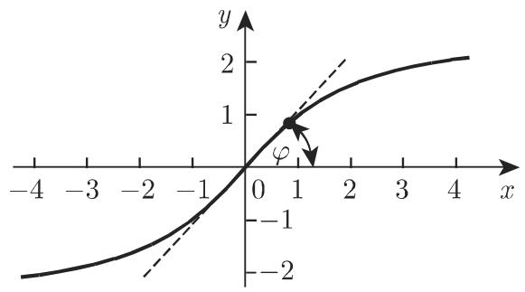
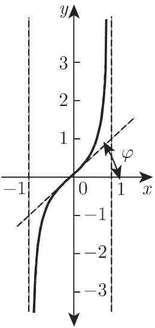
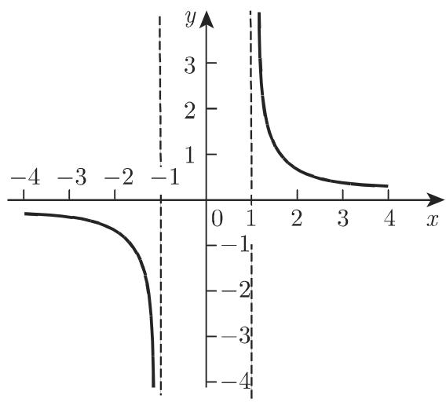

# 数学手册(原书第10版) 2.10 面积函数

本来源为 [[entities/数学手册原书第10版]] 第 2 章第 2.10 节「面积函数」，是 [[concepts/双曲函数]]（2.9 节）的直接后续：面积函数即双曲函数的反函数（反双曲函数）。全节给出式 2.207–2.224 共 18 组公式与表 2.8，覆盖定义、对数表示、互表关系、和差公式与负角公式五个层次，补齐「指数定义 → 双曲函数 → 面积函数」链条的最后一环。

## 节结构

| 小节 | 主题 | 公式编号 |
|---|---|---|
| 2.10.1 | 定义：面积正弦、面积余弦、面积正切、面积余切 | 式 2.207–2.210、表 2.8 |
| 2.10.2 | 利用自然对数对面积函数的确定 | 式 2.211–2.214 |
| 2.10.3 | 不同面积函数间的关系 | 式 2.215–2.218 |
| 2.10.4 | 面积函数的和与差 | 式 2.219–2.221 |
| 2.10.5 | 负角公式 | 式 2.222–2.224 |

## 核心主张

- **定义**：面积函数是双曲函数的反函数。「面积」一词意指这些函数的几何意义是某些双曲线扇形的面积（原书前引第 172 页 3.1.2.2；本节仅此一句提及，未展开推导）。
- **反函数存在性**：手册称 $\sinh x$、$\tanh x$ 和 $\coth x$ 均严格单调，因此「没有任何限制地具有唯一反函数」；$\cosh x$ 有两个单调区间，因此存在两个反函数 $y = \operatorname{Arcosh} x$ 与 $y = -\operatorname{Arcosh} x$。
- **记号**：使用 Ar- 前缀（Arsinh、Arcosh、Artanh、Arcoth），区别于反三角函数的 arc- 前缀，命名理据见 [[concepts/面积函数]]。
- **范围**：仅定义四种面积函数；面积正割（Arsech）与面积余割（Arcsch）既未定义亦未列入表 2.8（见 [[queries/表2-8为何不含面积正割与面积余割]]）。

## 公式体系（原文转写）

定义（式 2.207–2.210）：

```latex
y = \operatorname{Arsinh} x                                                              (2.207)
y = \operatorname{Arcosh} x \quad {\text {and}} \quad y = - \operatorname{Arcosh} x       (2.208)
y = \operatorname{Artanh} x                                                              (2.209)
y = \operatorname{Arcoth} x                                                              (2.210)
```

自然对数表示（式 2.211–2.214）：

```latex
\operatorname{Arsinh} x = \ln \left(x + \sqrt {x ^ {2} + 1}\right)                                               (2.211)
\operatorname{Arcosh} x = \ln \left(x + \sqrt {x ^ {2} - 1}\right) = \ln \left(\frac {1}{x - \sqrt {x ^ {2} - 1}}\right) \ (x \geqslant 1)   (2.212)
\operatorname{Artanh} x = \frac {1}{2} \ln \frac {1 + x}{1 - x} \quad (| x | < 1)                                (2.213)
\operatorname{Arcoth} x = \frac {1}{2} \ln \frac {x + 1}{x - 1} \quad (| x | > 1)                                (2.214)
```

不同面积函数间的关系（式 2.215–2.218）：

```latex
\begin{array}{r l}
& {\operatorname{Arsinh} x = (\operatorname{sign} x) \operatorname{Arcosh} \sqrt {x ^ {2} + 1} = \operatorname{Artanh} \frac {x}{\sqrt {x ^ {2} + 1}}} \\
& {\qquad = \operatorname{Arcoth} \frac {\sqrt {x ^ {2} + 1}}{x} (| x | < \infty),}
\end{array}\tag{2.215}

\begin{array}{r l}
& {\operatorname{Arcosh} x = \operatorname{Arsinh} \sqrt {x ^ {2} - 1} = \operatorname{Artanh} \frac {\sqrt {x ^ {2} - 1}}{x}} \\
& {\qquad = \operatorname{Arcoth} \frac {x}{\sqrt {x ^ {2} - 1}} (| x | \geqslant 1),}
\end{array}\tag{2.216}

\begin{array}{r l}
& {\operatorname{Artanh} x = \operatorname{Arsinh} \frac {x}{\sqrt {1 - x ^ {2}}} = \operatorname{Arcoth} \frac {1}{x}} \\
& {\qquad = (\operatorname{sign} x) \operatorname{Arcosh} \frac {1}{\sqrt {1 - x ^ {2}}} \qquad (| x | < 1),}
\end{array}\tag{2.217}

\begin{array}{r l}
& {\operatorname{Arcoth} x = \operatorname{Artanh} \frac {1}{x} = (\operatorname{sign} x) \operatorname{Arsinh} \frac {1}{\sqrt {x ^ {2} - 1}}} \\
& {\qquad = (\operatorname{sign} x) \operatorname{Arcosh} \frac {| x |}{\sqrt {x ^ {2} - 1}} (| x | > 1).}
\end{array}\tag{2.218}
```

面积函数的和与差（式 2.219–2.221）：

```latex
\operatorname{Arsinh} x \pm \operatorname{Arsinh} y = \operatorname{Arsinh} \left(x \sqrt {1 + y ^ {2}} \pm y \sqrt {1 + x ^ {2}}\right)   (2.219)
\operatorname{Arcosh} x \pm \operatorname{Arcosh} y = \operatorname{Arcosh} \left(x y \pm \sqrt {(x ^ {2} - 1) (y ^ {2} - 1)}\right)       (2.220)
\operatorname{Artanh} x \pm \operatorname{Artanh} y = \operatorname{Artanh} \frac {x \pm y}{1 \pm x y}                                     (2.221)
```

负角公式（式 2.222–2.224）：

```latex
\operatorname{Arsinh} (- x) = - \operatorname{Arsinh} x    (2.222)
\operatorname{Artanh} (- x) = - \operatorname{Artanh} x    (2.223)
\operatorname{Arcoth} (- x) = - \operatorname{Arcoth} x    (2.224)
```

## 表 2.8 面积函数的定义域和值域（原文转写）

| 面积函数 | 定义域 | 值域 | 具有相同意义的双曲函数 |
|---|---|---|---|
| 面积正弦 | | | |
| y = Arsinh x | −∞ < x < ∞ | −∞ < y < ∞ | x = sinh y |
| 面积余弦 | | | |
| y = Arcosh x | | 0 ≤ y < ∞ | |
| y = −Arcosh x | 1 ≤ x < ∞ | −∞ < y ≤ 0 | x = cosh y |
| 面积正切 | | | |
| y = Artanh x | \|x\| < 1 | −∞ < y < ∞ | x = tanh y |
| 面积余切 | | | |
| y = Arcoth x | \|x\| > 1 | −∞ < y < 0 | x = coth y |
| | | 0 < y < ∞ | |

转写说明：原表为跨行合并单元格排版，转写中被拆散——Arcosh 首行的定义域（1 ≤ x < ∞）与「x = cosh y」单元格被置空，Arcoth 的第二值域行（0 < y < ∞）成为孤立行，分支与值域的对应关系不可见。补出对应关系的重构表见 [[findings/面积函数的定义与定义域值域表]]，错位修复方案见 [[queries/表2-8合并单元格转写错位如何修复]]。

## 图像

本节含四幅函数图像（手册以此呈现各曲线要素，见 [[methodology/面积函数图像绘制法]]）：







## 疑误与张力

1. 正文 2.10.1.3 称 Artanh「仅在 $|x| \leqslant 1$ 时有定义」，与表 2.8 及式 2.213 的 $|x| < 1$ 矛盾（$x = \pm 1$ 为铅直渐近线所在）——见 [[queries/正文Artanh定义域绝对值小于等于1是否应为小于1]]。
2. 「coth 严格单调故唯一反函数」论证欠严：coth 在 $\mathbb{R}\setminus\{0\}$ 上跨间断点不单调，且表 2.8 与 2.10.1.4 实按两分支呈现 Arcoth——见 [[queries/coth严格单调故唯一反函数的表述是否欠严]]。
3. 式 2.220 减法形式需左边非负（$x \geqslant y$），手册未注明——见 [[queries/式2-220减法形式是否漏注x大于等于y]]。
4. 式 2.215 末项与式 2.217 中项含 $1/x$，在 $x = 0$ 处失义，但声明域涵盖 $x = 0$——见 [[queries/式2-215与2-217含1除x等式是否应排除x等于0]]。
5. 2.10.5 标题「负角公式」对反函数名不副实——实为奇性公式 $f(-x) = -f(x)$，系循 2.7–2.9 的平行标题样式；正文「Artanhx」「Arcothx」为转写粘连残留，与 [[queries/式2-206的icot-iz是否为i-cot-iz粘连]] 同类现象。

本节为全新知识面，不与任何已入库内容相抵触。

## 与现有维基的联系

- [[concepts/双曲函数]] 及 [[concepts/双曲正弦函数]]、[[concepts/双曲余弦函数]]、[[concepts/双曲正切函数]]、[[concepts/双曲余切函数]]：本节补齐其反函数一侧。
- [[findings/双曲函数的指数定义与倒数定义]]：式 2.211–2.214 的对数表示由 2.9.1 的指数定义（式 2.166–2.171，第 115 页）直接推出。
- [[concepts/反三角函数]]、[[concepts/主值]]：平行对照对象——反三角函数按主值区间取单值，而 Arcosh 直接并列两支且未称任何一支为主值，见 [[comparisons/面积函数与反三角函数比较]]。
- [[concepts/对数函数]]：对数表示使面积函数成为对数函数的复合应用实例。
- [[queries/表2-7为何不含sech与csch]]：表 2.8 同样不含 Arsech 与 Arcsch，是同一现象的平行证据。
- 本节入库后，第 2 章主干（2.1、2.3、2.4、2.6–2.10）基本齐备，仅缺 2.2、2.5，为后续初等函数总览型 synthesis 创造条件。

## 派生页面

- 概念：[[concepts/面积函数]]、[[concepts/面积正弦]]、[[concepts/面积余弦]]、[[concepts/面积正切]]、[[concepts/面积余切]]
- 发现：[[findings/面积函数的定义与定义域值域表]]、[[findings/面积函数的自然对数表示]]、[[findings/面积函数间的互表关系]]、[[findings/面积函数的和差公式]]、[[findings/面积函数的负角公式与奇函数性质]]
- 比较：[[comparisons/面积函数与反三角函数比较]]、[[comparisons/四种面积函数性质比较]]、[[comparisons/面积正切与面积余切比较]]
- 方法：[[methodology/面积函数图像绘制法]]

<!-- llm-wiki:embedded-images -->
## Embedded Images

### Document



<!-- llm-wiki:embedded-images -->
