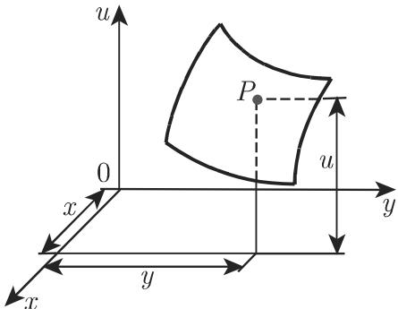
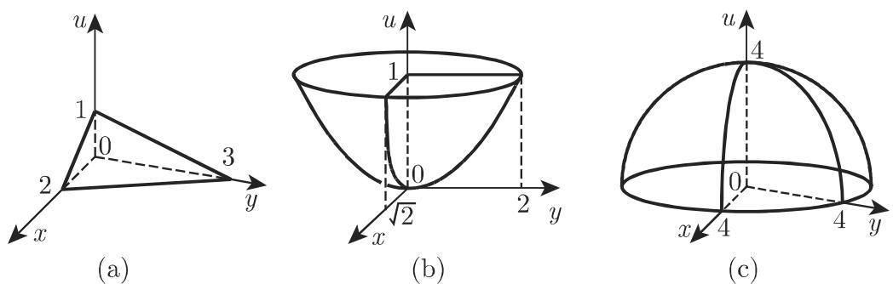
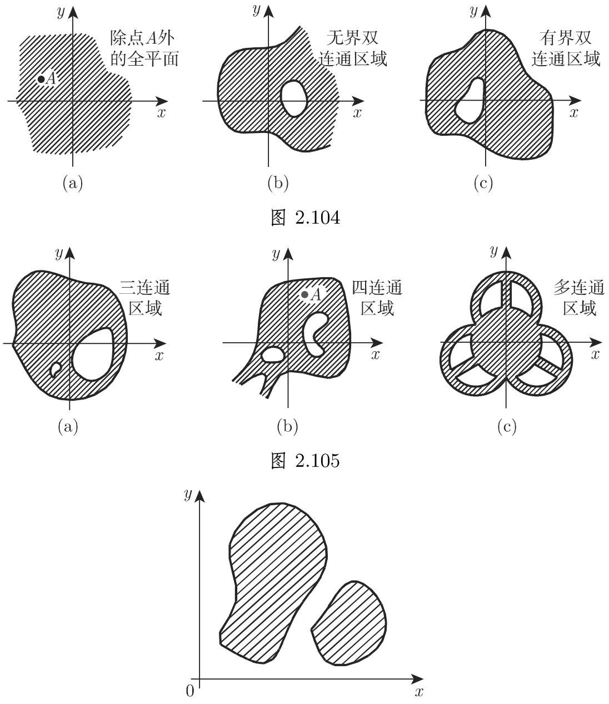
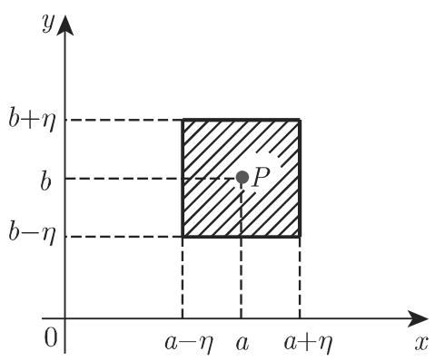

# 数学手册(原书第10版) 2.18 多元函数

本源是《数学手册(原书第10版)》第 2 章第 2.18 节，主题为多元函数。它是本 wiki 已收录的 2.7–2.15 各节（如 [[sources/10-数学手册原书第10版--10-215-各种其他曲线--pzek1r]]、[[sources/10-数学手册原书第10版--7-29-双曲函数--145kavb]]）的下一环，并把主题从一元函数与平面曲线推进到多元分析，是 wiki 的新领域。全节为手册式的定义–定理陈述，不含证明，但配有大量可直接验算的算例，覆盖式 2.276–2.291 与图 2.100–2.107。

## 小节结构

| 小节 | 主题 | 关键式号/图 |
|---|---|---|
| 2.18.1 | 定义及其表示 | 式 2.276；图 2.100–2.101 |
| 2.18.2 | 平面中的不同区域：定义域、区域分类、确定函数的方法、表示形式、齐次性、相关性 | 图 2.102–2.106；式 2.277–2.283 |
| 2.18.3 | 极限（重极限与累次极限） | 式 2.284–2.286；图 2.107 |
| 2.18.4 | 连续性 | 式 2.287 |
| 2.18.5 | 连续函数的性质（四大定理） | 式 2.288–2.291 |

## 五组核心内容

**一、定义与几何表示（2.18.1）**：$n$ 元函数的定义（式 2.276），变量数组视为 $n$ 维空间中的点；二元函数用三维曲面表示（图 2.100），三个曲面实例为平面 $u = 1 - x/2 - y/3$、椭圆抛物面 $u = x^2/2 + y^2/4$、半径 4 的半球面 $u = \sqrt{16 - x^2 - y^2}$（图 2.101）。详见 [[findings/多元函数的定义与曲面表示]]。

**二、区域与定义域形态（2.18.2.1–2.18.2.4）**：开的连通点集称为区域，按边界归属分开/闭区域，按洞数分单连通、双连通、多连通、非连通（图 2.102–2.106）；定义域四例（全平面、开圆盘、闭条形、单位正方形上方点集）与分段例，详见 [[findings/定义域的四类典型形态]] 与 [[concepts/区域与连通性]]。

**三、表示形式与齐次性（2.18.2.4–2.18.2.5）**：显式（2.277）、隐式（2.278）、参数式（2.279a–b）、数表（复式表）与分段公式；齐次函数定义（2.280）及 $m=2$、$m=0$ 两例。详见 [[findings/函数的四种表示形式]]、[[findings/齐次函数的定义与齐性次数]]。

**四、相关性与雅可比判别（2.18.2.6）**：相依/独立函数的定义（式 2.281–2.282），实例 $u = v^4$ 与 $v = u^2 - 2w$；独立性判据为雅可比行列式不恒为零与偏导数矩阵的秩（式 2.283a–c，含 $m > n$ 时至多 $n$ 个独立的结论）。详见 [[findings/函数相关性的定义与相依判据]]、[[findings/函数独立性的雅可比判别与秩]]。

**五、极限、累次极限、连续性与四大定理（2.18.3–2.18.5）**：重极限的 ε-η 方形邻域定义（式 2.284–2.285，图 2.107，手册以 $\eta$ 而非 $\delta$ 记邻域半径）；累次极限及 $B = -1$、$C = +1$ 的反例（式 2.286）；连续性定义（式 2.287）；四大定理（式 2.288–2.291），条件上“连通区域”与“有界闭区域”形成对照。详见 [[findings/二元函数极限的ε-η定义]]、[[findings/累次极限的次序依赖性与反例]]、[[findings/多元函数的连续性定义]]、[[findings/连通区域上连续函数的四大定理]]。

## 结构化数据（照录）

分段例 C（2.18.2.4.2，式前“Φ ■ C:”标记疑为转写残留）：

```latex
u = \begin{cases}
x + y, & x \geqslant 0,\ y \geqslant 0,\\
x - y, & x \geqslant 0,\ y < 0,\\
-x + y, & x < 0,\ y \geqslant 0,\\
-x - y, & x < 0,\ y < 0.
\end{cases}
```

四大定理（2.18.5）：

| 式号 | 定理 | 条件 | 结论 |
|---|---|---|---|
| 2.288 | 波尔查诺零点定理 | 在一连通区域有定义且连续；两点取值异号 | 至少存在一点 $(x_3,y_3)$ 使 $f(x_3,y_3)=0$ |
| 2.289 | 介值定理 | 同上；$A = f(x_1,y_1)$、$B = f(x_2,y_2)$，$A \ne B$ | 对介于 $A$、$B$ 之间的任意 $C$，至少存在一点使 $f(x_3,y_3) = C$ |
| 2.290 | 有界性定理 | 在一有界闭区域上连续 | 存在 $m, M$ 使 $m \leqslant f(x,y) \leqslant M$ |
| 2.291 | 魏尔斯特拉斯定理（最大最小值存在定理） | 在一有界闭区域上连续 | 存在 $(x',y')$、$(x'',y'')$ 使 $f(x',y') \geqslant f(x,y) \geqslant f(x'',y''))$ |

## 已识别的转写与记号问题

1. 齐次函数例 B 的 $u(x,y) = \frac{x+z}{2x-3y}$ 声明为二元却含变量 $z$，见 [[queries/式2-280例B含变量z是否为误]]。
2. 式 2.283a/b/c 三个编号与公式内容的对应错位（“矩阵 (2.283c)”的正文引用对不上转写后的公式块），见 [[queries/式2-283abc的编号与内容是否错位]]。
3. 正文引用图 2.104（双连通）与图 2.105（多连通），但所附图像文件中缺这两图，见 [[queries/图2-104与图2-105图像是否缺失]]。
4. 式 2.285 的 ε-η 定义未去心（字面含点 $(a,b)$），与 2.18.3.1 允许 $f$ 在该点无定义的陈述矛盾，见 [[queries/式2-285极限定义是否应排除点ab]]。
5. 轻微残留：分段例 C 前的“Φ ■ C:”标记、式 2.288 编号悬置于文字之后，见 [[queries/式2-288编号悬置与分段例C标记是否为转写残留]]。
6. 结构性张力（非错误）：节题“平面中的不同区域”下含三维/多维区域（2.18.2.3）及函数表示方法（2.18.2.4–2.18.2.6），标题偏窄，疑与原书一致，仅作记录。

## 与现有 wiki 的联系

- **系列延续**：本节是 2.7–2.15 系列（[[sources/10-数学手册原书第10版--10-215-各种其他曲线--pzek1r]] 等）的下一环；2.16–2.17 两节尚未入 wiki。
- **参数式呼应**：式 2.279 的参数表示是 [[concepts/摆线]]、[[concepts/圆的渐伸线]]、[[concepts/螺线]] 等页中参数方程的一般化框架。
- **arcsin 复用**：定义域例 C、D 直接调用 [[concepts/反正弦函数]] 的值域知识（$-1 \leqslant$ 输入 $\leqslant 1$）；该页可补一条“应用于多元函数定义域判定（2.18 例 C、D）”的回链。
- **纯增量**：本节不与既有任何页面矛盾。

## 前向引用（未来节点，尚未入 wiki）

3.6.3.1（曲面，第 350 页）、3.5.3.10（平面，第 293 页）、3.5.3.13,5.（椭圆抛物面，第 303 页）、4.1.4,7（矩阵的秩，第 367 页）、21.9（椭圆函数积分数表，第 1424 页）、2.1.4.3（柯西收敛条件，第 69 页）。处理相应章节时应回链本源。

## 关联页面

概念：[[concepts/多元函数]]、[[concepts/等高线]]、[[concepts/区域与连通性]]、[[concepts/函数的表示形式]]、[[concepts/齐次函数]]、[[concepts/函数的相关性]]、[[concepts/雅可比行列式]]、[[concepts/多元函数的极限]]、[[concepts/累次极限]]、[[concepts/多元函数的连续性]]。比较：[[comparisons/重极限与累次极限比较]]、[[comparisons/零点介值定理与有界最值定理的条件比较]]。方法：[[methodology/多元函数曲面与区域图像绘制法]]。

<!-- llm-wiki:embedded-images -->
## Embedded Images

### Document







<!-- llm-wiki:embedded-images -->
