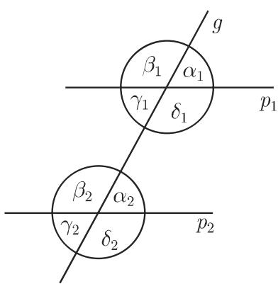

# 数学手册(原书第10版) 3.1.1 基本概念

本页对应《数学手册(原书第10版)》第 3 章开篇分节 3.1.1「基本概念」，是 wiki 收录的首个第 3 章（几何学）分节。全节由定义性与公理性陈述构成，给出平面几何的原始对象（点、直线、射线、线段）、角及其方向约定与分类、两类角偶对关系，以及角的三种度量制（度制、弧度制、新度制）；它是原书 3.2 三角学的直接基础。本节未出现具名人物或机构。

## 章节结构

| 子节 | 主题 | 对应页面 |
|---|---|---|
| 3.1.1.1 | 点、直线、射线、线段；平行与正交 | [[射线与线段]]、[[平行与正交直线]] |
| 3.1.1.2 | 角的定义、方向约定与名称（表 3.1） | [[角]] |
| 3.1.1.3 | 两条相交直线间的夹角（邻角、对顶角、余角、补角） | [[相交直线的角偶对]] |
| 3.1.1.4 | 截平行线所成的角偶对（交错角、同位角、相对角） | [[平行线的角偶对]] |
| 3.1.1.5 | 以度和弧度度量的角；新度评论 | [[弧度]]、[[度分秒]]、[[新度]] |

## 核心内容（原文转写）

### 点、直线、射线、线段（3.1.1.1）

点和直线在今天的数学中不加定义，其关系仅由公理确定；一个点可以理解为两条直线的交。射线是直线上恰好位于给定点 $O$ 一侧的点集（含 $O$）；线段 $\overline{AB}$ 是直线上位于两给定点 $A$、$B$ 之间的点集（含端点），是平面上两点间的最短连接；有向线段 $\overrightarrow{AB}$ 始于 $A$ 终于 $B$。平行直线沿相同方向伸展、无公共点（记 $g \parallel g'$）；正交直线相交成直角。

### 角（3.1.1.2）


角由同一点 $S$ 发出的两条射线 $a$、$b$ 定义，使它们通过旋转可以彼此变换到另一条。$S$ 为顶点，$a$、$b$ 为边；若 $A$ 在 $a$ 上、$B$ 在 $b$ 上，角记作 $(a,b)$ 或 $\angle ASB$。逆时针为正、顺时针为负：

$$\angle ASB = -\angle BSA \ \ (0^{\circ} \leqslant \angle ASB \leqslant 180^{\circ}); \qquad \angle ASB = 360^{\circ} - \angle BSA \ \ (180^{\circ} \leqslant \angle ASB \leqslant 360^{\circ}).$$

表 3.1 以度和弧度给出的角的名称（原文转写，适用于 $0^{\circ} \leqslant \alpha \leqslant 360^{\circ}$；图 3.2 的图像未随本节导入文件提供）：

| 角的名称 | 度 | 弧度 | 角的名称 | 度 | 弧度 |
|---|---|---|---|---|---|
| 周(全)角 | $\alpha = 360^{\circ}$ | $\alpha = 2\pi$ | 直角 | $\alpha = 90^{\circ}$ | $\alpha = \pi/2$ |
| 凸角 | $\alpha > 180^{\circ}$ | $\pi < \alpha < 2\pi$ | 锐角 | $0^{\circ} < \alpha < 90^{\circ}$ | $0^{\circ} < \alpha < \pi/2$ |
| 平角 | $\alpha = 180^{\circ}$ | $\alpha = \pi$ | 钝角 | $90^{\circ} < \alpha < 180^{\circ}$ | $\pi/2 < \alpha < \pi$ |

评论（原文）：大地测量学中旋转正方向定义为顺时针方向（参见原书第 192 页 3.2.2.1，待入库）。

### 相交直线的角偶对（3.1.1.3）


两条直线 $g_1, g_2$ 的交点处存在四个角 $\alpha, \beta, \gamma, \delta$，可区分出：

- 邻角（和 $180^{\circ}$）：$(\alpha,\beta)$、$(\beta,\gamma)$、$(\gamma,\delta)$、$(\alpha,\delta)$
- 对顶角（相等）：$(\alpha,\gamma)$、$(\beta,\delta)$
- 余角：两角之和 $90^{\circ}$
- 补角（和 $180^{\circ}$）：原文例列 $(\alpha,\beta)$、$(\gamma,\delta)$

### 截平行线所成的角偶对（3.1.1.4）



用截线 $g$ 截两条平行直线 $p_1, p_2$ 得到八个角。除同顶点的邻角与对顶角外，有不同顶点的三类角偶对：

- 交错角（相等）：外错 $(\alpha_1,\gamma_2)$、$(\beta_1,\delta_2)$；内错 $(\gamma_1,\alpha_2)$、$(\delta_1,\beta_2)$
- 同位角（相等）：$(\alpha_1,\alpha_2)$、$(\beta_1,\beta_2)$、$(\gamma_1,\gamma_2)$、$(\delta_1,\delta_2)$
- 相对角（同旁内角与同旁外角，和 $180^{\circ}$）：同旁外角 $(\alpha_1,\delta_2)$、$(\beta_1,\gamma_2)$；同旁内角 $(\gamma_1,\beta_2)$、$(\delta_1,\alpha_2)$

### 弧度与换算（3.1.1.5，式 3.1–3.2）

$$\alpha = \frac{l}{r} \tag{3.1}$$

换算常数（原文转写）：

```text
1 rad = 57°17′44.8″ = 57.2958°
1°   = 0.017453 rad
1′   = 0.000291 rad
1″   = 0.000005 rad
```

$$\alpha^{\circ} = \varrho \alpha = 180^{\circ}\frac{\alpha}{\pi}, \qquad \alpha = \frac{\alpha^{\circ}}{\varrho} = \frac{\pi}{180^{\circ}}\alpha^{\circ}, \qquad \varrho = \frac{180^{\circ}}{\pi} \tag{3.2}$$

特殊值：$360^{\circ} = 2\pi$，$180^{\circ} = \pi$，$90^{\circ} = \pi/2$，$270^{\circ} = 3\pi/2$。

换算算例（原文转写）：

```text
■ A:  52°37′23″ = 52·0.017453 + 37·0.000291 + 23·0.0000005 = 0.918447 rad
■ B:  5.645 rad = 323·0.017453 + 26·0.000291 + 5·0.0000005 = 323°26′05″
      该结果得自
      5.645 : 0.017453     = 323 + 0.007611
      0.007611 : 0.000291  = 26 + 0.000025
      0.000025 : 0.0000005 = 5
```

当文中明显可看出数值指角的弧度时，标记 rad 通常被省略。

评论（原文）：大地测量学中一个全角被分成 400 等份，称为新度；一个直角是 100 新度（gon），一新度被划分成 100 新分（正文记作 mgon，记号存疑）。计算器上 DEG 用于度、GRAD 用于新度、RAD 用于弧度；不同度量之间的换算参见原书第 193 页表 3.5（待入库）。

## 独立验算与转写疑点

换算常数经独立复算全部正确；算例 B 最终结果正确（精确值 $323.4347^{\circ} = 323^{\circ}26'04.8''$）；算例 A 最终结果 $0.918447$ 与精确值 $0.9184456$（$52^{\circ}37'23''$ 的弧度值）在末位相差约 $1.4\times10^{-6}$ rad。两算例的中间算式均与所列系数不自洽。已立疑问页跟踪：

- [[表3-1凸角缺上界与锐角弧度栏度符号是否为误]]
- [[算例A系数与结果不自洽是否为讹误]]
- [[算例B除法链数字是否为讹误]]
- [[一新分符号mgon是否应为cgon]]
- [[角记号not-subset是否为angle之误]]
- [[相对角术语是否应作同旁角]]

次要疑点（未单独立页）：图 3.3 补角例仅列 $(\alpha,\beta)$、$(\gamma,\delta)$，未列同为补角偶的 $(\beta,\gamma)$、$(\alpha,\delta)$；$\angle ASB = -\angle BSA$ 的分段式在 $180^{\circ}$ 处两支同时适用（仅在模 $360^{\circ}$ 意义下一致）。

## 前向引用（待入库回填）

- 原书 3.2.2.1（第 192 页）：大地测量学旋转正方向为顺时针
- 原书 3.2.2.2 与表 3.5（第 193 页）：以新度度量及不同度量之间的换算

## 元数据说明

本节文本不含作者、出版年与出版社信息，来源页的 authors/venue 字段暂空；书目元数据待依原书版权页查证或从第 2 章同类来源页复制补录。

<!-- llm-wiki:embedded-images -->
## Embedded Images

### Document


<!-- llm-wiki:embedded-images -->
