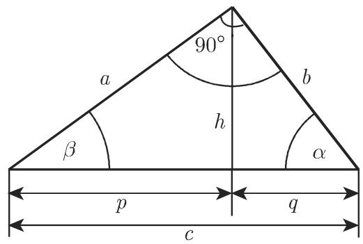
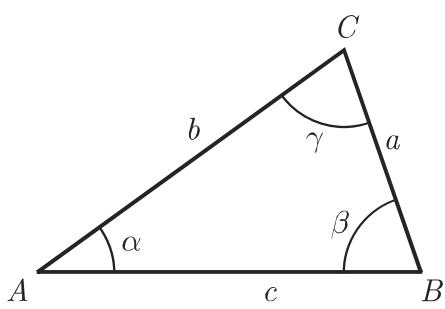
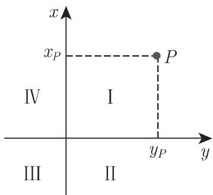
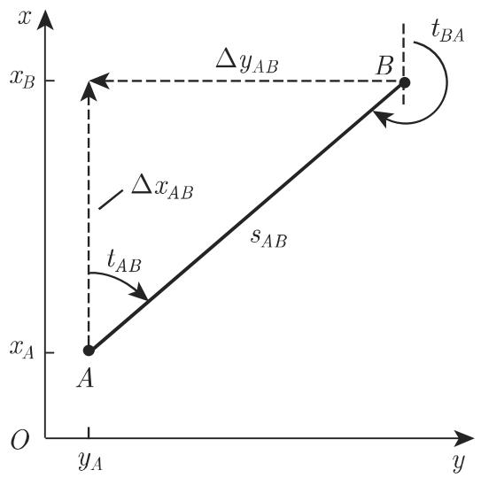
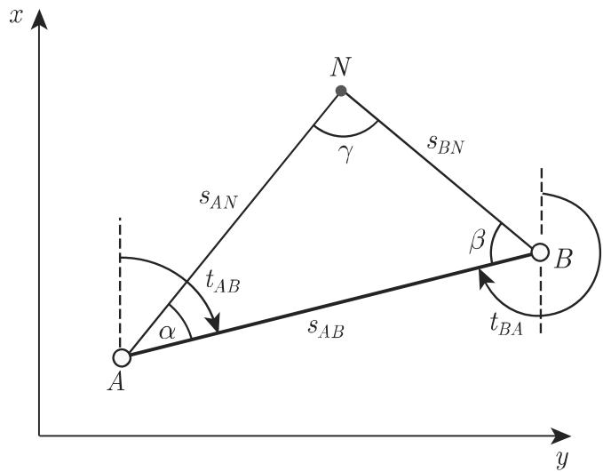
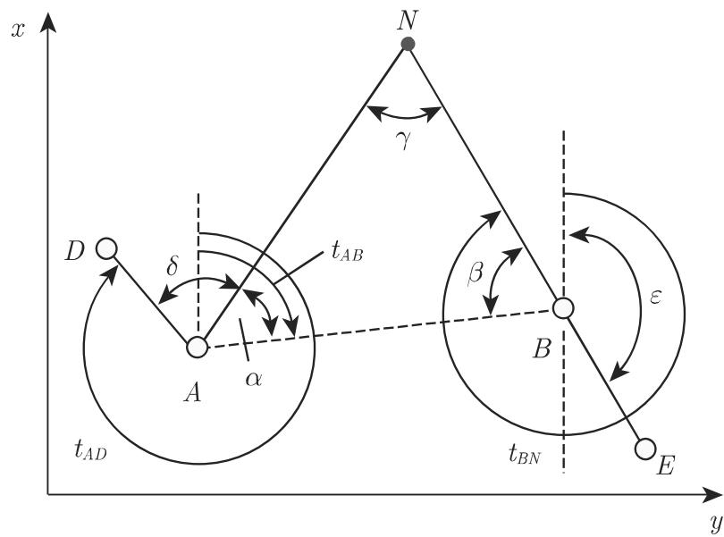
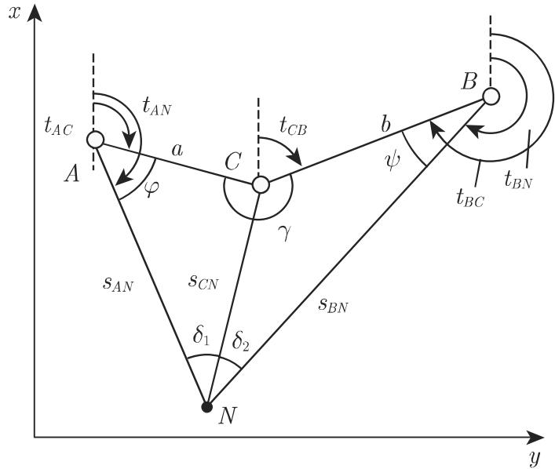
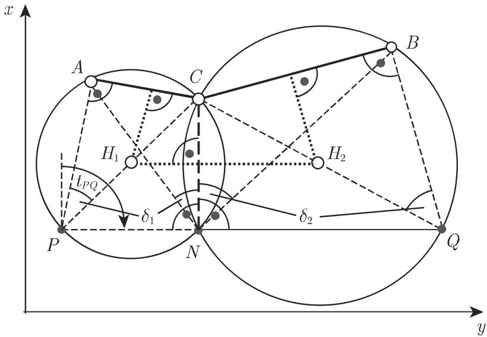
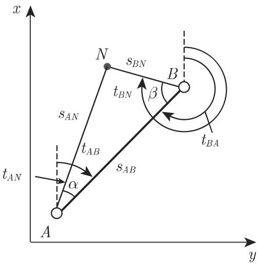

# 数学手册(原书第10版) 3.2 平面三角学

《数学手册(原书第10版)》第 3.2 节（母著作见 [[entities/数学手册原书第10版]]），分为两大部分：**3.2.1 三角形**（平面直角三角形与一般斜三角形的解算理论）与 **3.2.2 大地测量学应用**（测地坐标、新度与方位角、坐标变换、交会定位法）。本源是本 wiki 首次摄入大地测量学内容的来源，同时为既有三角形相关页面补充了系统公式。转写文本存在系统性符号缺失与多处疑似公式讹误（见文末「转写讹误与悬空引用」及各 query 页）。

## 3.2.1.1 平面直角三角形中的计算

记号（图 3.31）：$c$ 为斜边；$a, b$ 为两直角边；$\alpha, \beta$ 为边 $a, b$ 分别所对的角；$h$ 为斜边上的高；$p, q$ 为高在斜边上分出的线段；$S$ 为面积。（记号段符号在转写中缺失，见 [[queries/平面三角学记号段符号缺失是否为讹误]]。）

内角之和、边的计算与面积（见 [[findings/直角三角形基本公式与表3-3定义量]]、[[concepts/直角三角形]]）：

$$\alpha + \beta + \gamma = 180^\circ,\quad \gamma = 90^\circ \tag{3.83}$$

$$a = c\sin\alpha = c\cos\beta = b\tan\alpha = b\cot\beta \tag{3.84}$$

$$S = \frac{ab}{2} = \frac{a^2}{2}\tan\beta = \frac{c^2}{4}\sin 2\beta \tag{3.87}$$

[[concepts/勾股定理]]（源文作「毕达哥拉斯（勾股）定理」）：

$$a^2 + b^2 = c^2 \tag{3.85}$$

[[concepts/欧几里得定理]]（直角三角形射影定理）：

$$h^2 = pq,\quad a^2 = pc,\quad b^2 = qc \tag{3.86}$$

[[concepts/泰勒斯定理]]：半圆中以直径为底的所有内接三角形的顶角是直角，即半圆中直径上的所有圆周角是直角（图 3.32；源文引 (3.65b)，3.1.5 节尚未摄入）。

直角三角形有六个定义量（三角及其对边），其中一个角已知为 $90^\circ$，故只能再给定两个量，其余三个量由三角函数（3.3 节，尚未摄入）以及 (3.15)、(3.83) 确定。表 3.3（逐字保留）：

| 已知 |  | 其他量的计算 |  |
|---|---|---|---|
| 例如 a, α | β = 90° − α | b = a cot α | c = a/sin α |
| 例如 b, α | β = 90° − α | a = b tan α | c = b/cos α |
| 例如 c, α | β = 90° − α | a = c sin α | b = c cos α |
| 例如 a, b | a/b = tan α | c = a/sin α | β = 90° − α |

## 3.2.1.2 一般（斜）平面三角形中的计算

记号（图 3.33）：$a, b, c$ 为边；$\alpha, \beta, \gamma$ 为其对角；$S$ 为面积；$R$ 为外接圆半径；$r$ 为内切圆半径；$s = (a+b+c)/2$ 为半周长。

**轮换**：斜三角形无特殊的边或角，故从每个含边角的公式出发，可按图 3.34 通过边和角的轮换得到另外两个公式（例如由 $a/b = \sin\alpha/\sin\beta$ 得 $b/c = \sin\beta/\sin\gamma$ 与 $c/a = \sin\gamma/\sin\alpha$）。

边角定律集（式 3.88–3.92，见 [[findings/斜三角形边角定律集]]、[[concepts/正弦定律]]、[[concepts/余弦定律]]、[[concepts/正切定律]]）：

$$\frac{a}{\sin\alpha} = \frac{b}{\sin\beta} = \frac{c}{\sin\gamma} = 2R \tag{3.88}$$

$$c = a\cos\beta + b\cos\alpha \tag{3.89}$$

$$c^2 = a^2 + b^2 - 2ab\cos\gamma \tag{3.90}$$

$$\text{莫尔韦德等式：}\quad (a+b)\sin\frac{\gamma}{2} = c\cos\frac{\alpha-\beta}{2},\quad (a-b)\cos\frac{\gamma}{2} = c\sin\frac{\alpha-\beta}{2} \tag{3.91a,b}$$

$$\frac{a+b}{a-b} = \frac{\tan\frac{\alpha+\beta}{2}}{\tan\frac{\alpha-\beta}{2}} \tag{3.92}$$

半角公式与附加关系（式 3.93–3.95，见 [[findings/半角公式与附加关系]]）：

$$\tan\frac{\alpha}{2} = \sqrt{\frac{(s-b)(s-c)}{s(s-a)}},\quad \tan\alpha = \frac{a\sin\beta}{c - a\cos\beta} = \frac{a\sin\gamma}{b - a\cos\gamma} \tag{3.93, 3.94}$$

$$\sin\frac{\alpha}{2} = \sqrt{\frac{(s-b)(s-c)}{bc}},\quad \cos\frac{\alpha}{2} = \sqrt{\frac{s(s-a)}{bc}} \tag{3.95a,b}$$

高、中线、角平分线、外接圆半径、内切圆半径与面积（式 3.96–3.102，见 [[findings/三角形高中线角平分线长度公式]]、[[findings/外接圆内切圆半径与面积公式]]、[[concepts/海伦公式]]）：

$$h_a = b\sin\gamma = c\sin\beta \tag{3.96}$$

$$m_a = \frac{1}{2}\sqrt{b^2 + c^2 + 2bc\cos\alpha} \tag{3.97}$$

$$l_\alpha = \frac{2bc\cos\frac{\alpha}{2}}{b+c} \tag{3.98}$$

$$R = \frac{a}{2\sin\alpha} = \frac{b}{2\sin\beta} = \frac{c}{2\sin\gamma} \tag{3.99}$$

$$r = \sqrt{\frac{(s-a)(s-b)(s-c)}{s}} = s\tan\frac{\alpha}{2}\tan\frac{\beta}{2}\tan\frac{\gamma}{2} = 4R\sin\frac{\alpha}{2}\sin\frac{\beta}{2}\sin\frac{\gamma}{2} \tag{3.100–3.101}$$

$$S = \frac{1}{2}ab\sin\gamma = 2R^2\sin\alpha\sin\beta\sin\gamma = rs = \sqrt{s(s-a)(s-b)(s-c)} \tag{3.102}$$

源文明言：$S = \sqrt{s(s-a)(s-b)(s-c)}$ 称为海伦公式。

表 3.4 一般三角形的定义量，基本问题（逐字保留，见 [[findings/一般三角形四个基本问题与SSA分支]]）：

| # | 已知量 | 用于计算其他量的公式 |
|---|---|---|
| (1) | 1 边及 2 角 (a, α, β) | γ = 180° − α − β, b = a sinβ/sinα, c = a sinγ/sinα, S = ½ab sinγ |
| (2) | 2 边及其夹角 (a, b, γ) | tan((α−β)/2) = ((a−b)/(a+b))·cot(γ/2), (α+β)/2 = 90° − γ/2；α、β 由 α+β 与 α−β 得出，c = a sinγ/sinα, S = ½ab sinγ |
| (3) | 2 边及其中一边的对角 (a, b, α) | 若 a ⩾ b，则 β < 90° 且唯一确定；若 a < b：① b sinα < a 时 β 有两值（β₂ = 180° − β₁）；② b sinα = a 时 β 恰一值（90°）；③ b sinα > a 时不存在这样的三角形。γ = 180° − (α+β), c = a sinγ/sinα, S = ½ab sinγ |
| (4) | 3 边 (a, b, c) | r = √((s−a)(s−b)(s−c)/s), tan(α/2) = r/(s−a), tan(β/2) = r/(s−b), tan(γ/2) = r/(s−c), S = rs = √(s(s−a)(s−b)(s−c)) |

关键论断（主体：平面三角形，勿移用于球面三角形）：根据全等定理（前向引用 3.1.3.2），一个三角形由三个独立的量确定，其中必须至少有一边；**与球面三角学（表 3.9 第二基本问题，未摄入）形成对照，在一个平面三角形中任何一边都无法只从角得到**。见 [[findings/平面三角形边不可仅由角得到]]。

## 3.2.2 大地测量学应用

### 3.2.2.1 测地坐标

几何学通常用右手坐标系；大地测量学相反，使用左手坐标系（详见 [[concepts/测地坐标]]、[[findings/测地左手坐标系定则]]）。平面左手系（图 3.37）中横坐标 x 轴朝上、纵坐标 y 轴朝右，角按顺时针为正，象限按顺时针编号；三维测地坐标 $(y, x, z)$ 中 z 轴指向天顶（图 3.36）。测地极坐标以方位角 t 与到极点的距离定点位；高度用天顶角或仰角（该段为残句）。长距离测量大都使用佐德纳或高斯—克吕格坐标系（前向引用 3.4.1.2，未摄入）。

比例尺（式 3.103–3.104，见 [[concepts/比例尺]]、[[findings/比例尺换算公式]]）：

$$M = 1:m = s_K : s_N,\qquad s_{K_1}:s_{K_2} = m_2:m_1 \tag{3.103a,b}$$

$$F_N = F_K m^2,\qquad F_{K_1}:F_{K_2} = m_2^2:m_1^2 \tag{3.104a,b}$$

### 3.2.2.2 大地测量学中的角

**新度**：全角对应 400 gon，换算见表 3.5（逐字保留，扩充 [[concepts/新度]]）：

| 换算 |
|---|
| 1 全角 = 360° = 2π rad = 400 gon |
| 1 直角 = 90° = π/2 rad = 100 gon |
| 1 gon = π/200 rad = 1000 mgon |

**方位角**与象限判定（见 [[concepts/方位角]]、[[findings/方位角象限判定与反方位角]]）。表 3.6（逐字保留，含疑似讹误）：

| 象限 | I | II | III | IV |
|---|---|---|---|---|
| 计算器中的显示 | + | − | − | + |
| Δy/Δx | tan > 0 | tan < 0 | tan > 0 | tan < 0 |
| 方位角 t | t₀ gon | t₀ + 200 gon | t₀ + 200 gon | t₀ + 400 gon |

**坐标变换**：直角坐标↔极坐标（3.105a–d，含 $t_{BA} = t_{AB} \pm 200\,\mathrm{gon}$）；支站法与比例因子 q 校正（3.106–3.107）；两直角坐标系间的相似变换（旋转 φ、比例 q、平移 $y_0, x_0$，3.108a–l，其中 k、l 为检验式）及 AB 落于 x′ 轴的特例（3.109a–f）。见 [[findings/坐标互化与比例因子校正]]、[[findings/两直角坐标系相似变换]]。

### 3.2.2.3 测量中的应用

确定由三角测量定位的一点 N 的坐标：解决方法有交会法、后方交会法、弧交会法、自由设站法和导线测量；**后两种源文明言在此不做讨论**。

- **交会法**（三角测量第一基本问题，式 3.110a–h）及不可见变体（经参考方向 D、E，式 3.111a–j）：见 [[concepts/交会法]]、[[findings/交会法两变体公式]]。
- **后方交会法**（三角测量第二基本问题）：斯涅耳问题（式 3.112a–o）与卡西尼法（式 3.113a–h，含危险圆）：见 [[concepts/后方交会法]]、[[concepts/危险圆]]、[[findings/斯涅耳后方交会解算]]、[[findings/卡西尼后方交会与危险圆]]。
- **弧交会法**（式 3.114a–k）：见 [[concepts/弧交会法]]、[[findings/弧交会法解算]]。
- 三法对照见 [[comparisons/交会定位三法比较]]；「已知—所测—所求—解」范式与双路检核见 [[methodology/交会定位计算流程]]。

## 转写讹误与悬空引用（采信前须核对）

1. 表 3.6 三、四象限的计算器显示符号疑颠倒 → [[queries/表3-6三四象限显示符号是否颠倒]]
2. 卡西尼法 (3.113a–d) 与自身几何矛盾（垂直性推导与数值反例）、(3.113e–f) 的 cot/tan 不自洽 → [[queries/卡西尼法式3-113符号与cot是否转写有误]]
3. (3.110h) 左端疑应为 $x_N$ → [[queries/式3-110h左端是否应为xN]]
4. (3.109a) 分母疑应为 $x'_B$，(3.109e–f) 疑遗漏分母 → [[queries/式3-109a分母与3-109ef是否遗漏分母]]
5. (3.111) 系列下标与符号疑错乱 → [[queries/式3-111系列下标与符号是否错乱]]
6. 记号段系统性符号缺失与「角刃/心/15/邓」等残句 → [[queries/平面三角学记号段符号缺失是否为讹误]]
7. 交叉引用页码-节号粘连（「第 1733.1.3.1」「第 185 (3.65b)」「第 216 3.4.1.2」「第 280 3.5.3.1」「第 170 3.1.1.5」「第 175 3.1.3.2」「第 106 (2.115)(2.116)」）→ [[queries/平面三角学节交叉引用页码节号是否粘连]]

悬空前向引用（均未摄入）：3.3（三角函数，含 (2.115)(2.116)）、3.4（球面三角学，表 3.9）、3.4.1.2（佐德纳/高斯—克吕格坐标系）、3.5.3.1（左手和右手坐标系）、3.1.5（圆周角 (3.65b)）。

## 与既有 wiki 的联系

- 表 3.4(3) 的 SSA 分支判定（$a \geqslant b$ 时唯一）扩充 [[findings/三角形的唯一确定条件与SSA多解性]]，并为 [[queries/唯一确定清单为何不含SSA较长边]] 提供正面证据。
- 表 3.5 的「1 gon = 1000 mgon」为 [[queries/一新分符号mgon是否应为cgon]] 提供佐证。
- 海伦公式与 [[findings/内接四边形半周长面积公式]]（婆罗摩笈多公式）构成三角形↔内接四边形的跨节呼应。
- 左手系顺时针约定延伸 [[concepts/图形的定向]] 与 [[findings/角的方向约定与反角关系]]；式 (3.83) 为 [[findings/三角不等式与内角和]] 的直角特例。
- [[concepts/内切圆]]、[[concepts/外接圆]] 获 R、r 公式（3.99–3.101）；[[concepts/三角形的高与垂心]]、[[concepts/三角形的中线与重心]]、[[concepts/角平分线]] 获长度公式（3.96–3.98）；[[concepts/全等三角形]]（四基本问题的理论根据）、[[concepts/相似三角形]]（「边不可仅由角得」的根据）获得新支撑。

单位制说明：3.2.1 小节用 180° 制、3.2.2 小节用 gon，属文体特征而非矛盾；跨小节引用公式时必须区分并按表 3.5 换算。

<!-- llm-wiki:embedded-images -->
## Embedded Images

### Document

<!-- llm-wiki:embedded-images -->
