# 数学手册(原书第10版) 3.3 立体几何学

本页是 [[entities/数学手册原书第10版]] 3.3 节「立体几何学」的源摘要。该节以公式汇编的形式覆盖三维几何的位置关系、角量体系、多面体与曲面界立体，式号区间为 (3.115)–(3.173)（含 a/b/c 子号共 59 个编号式），并含表 3.7（棱长为 a 的正多面体数据）。本节将 wiki 对该手册的覆盖自平面几何（3.1.x，见 [[concepts/多边形]] 等）推进到三维。文末另附 3.4「球面三角学」的引言段（大地测量动机；公认球面几何学的创始人是希帕科斯，约公元前 150 年），该段属 3.4 源文件的范畴，此处仅存目。本节含图 3.47–3.80，共 38 个媒体文件（归档于 media/10-数学手册原书第10版--8-33-立体几何学--1skqvyc/）。

## 章节结构

| 小节 | 主题 | 式号 |
|---|---|---|
| 3.3.1 | 空间中的直线与平面 | — |
| 3.3.2 | 棱角（二面角）、隅角（多面角）、立体角 | 3.115a–b |
| 3.3.3 | 多面体（棱柱族、棱锥族、四面体、方尖形、正多面体、欧拉定理） | 3.116–3.136、表 3.7 |
| 3.3.4 | 由曲面所界的立体（柱体族、锥体族、球、环面、桶状体） | 3.137–3.173 |

## 3.3.1 空间中的直线与平面

- **两条直线**：同一平面中的两条直线要么有一个交点要么没有交点（后者平行）；不包含在任何同一平面中的两条直线为**相错直线**（[[concepts/相错直线]]）。相错直线的夹角用过同一点且分别平行于它们的两条直线的夹角定义（图 3.47）；其距离用与两直线都垂直的线段定义——总存在唯一一条横截线与两条相错直线垂直并与之相交。
- **两个平面**：相交于一条直线或无公共点（后者平行）。平行的两条判定：同垂直于一条直线；其中之一平行于另一平面中的两条相交直线。
- **直线与平面**：线面夹角用该直线与其在平面上的正交投影之间的夹角度量（图 3.48）；若投影退化为一点——即直线垂直于平面内两条相交直线——则直线与平面垂直（正交）。

## 3.3.2 棱角、隅角、立体角

- [[concepts/二面角]]（棱角）：从同一条直线出发的两个半平面；以平面棱角 ABC（位于两半平面内、过点 B 且与棱 DE 垂直的两条半直线之夹角）度量。
- [[concepts/多面角]]（隅角）OABCDE：过公共顶点 O 的若干侧面构成，侧面分别交于直线 OA、OB、…；含全等/对称隅角、凸性、面角和定理与三面角全等四判定。**注意**：本小节三处「多面体」按字面读为假命题，疑均应作「多面角」（见 [[queries/3-3-2-2正文三处多面体是否应作多面角]]）。
- [[concepts/立体角]]：从同一点出发（并与一条封闭曲线相截）的一束射线；单位为球面度（sr）。

$$\varOmega = \frac{S}{r^{2}}\tag{3.115a}$$
$$1\,\mathrm{sr} = \frac{1\,\mathrm{m}^{2}}{1\,\mathrm{m}^{2}}\tag{3.115b}$$

源内算例：全立体角 Ω = 4πr²/r² = 4π；顶角 α = 120° 的锥面确定 Ω = 2πr²(1 − cos(α/2))/r² = π（前向引用球冠公式 3.163）。详见 [[findings/立体角定义与球面度]]。

## 3.3.3 多面体

记号：V 体积、S 表面积、M 侧面积、h 高、A_G 底面积（引言中 V、S、M、h 四个符号在转写中脱落）。覆盖对象：[[concepts/棱柱]]（3.116–3.120）、[[concepts/平行六面体]]–[[concepts/长方体]]–[[concepts/立方体]]（3.121–3.126）、[[concepts/棱锥]]与 [[concepts/截棱锥]]（3.127–3.132）、[[concepts/四面体]]（3.133）、方尖形与名称脱落的无名立体（3.134–3.135，见 [[queries/3-3-3-10无名立体名称是否为楔形]]）、[[concepts/正多面体]]（表 3.7）与 [[concepts/欧拉多面体定理]]（3.136）。

四面体行列式体积公式（本节最具特色的公式，逐字保真）：

$$
V ^ {2} = \frac {1}{2 8 8} \left| \begin {array}{ccccc} 0 & r ^ {2} & q ^ {2} & a ^ {2} & 1 \\ r ^ {2} & 0 & p ^ {2} & b ^ {2} & 1 \\ q ^ {2} & p ^ {2} & 0 & c ^ {2} & 1 \\ a ^ {2} & b ^ {2} & c ^ {2} & 0 & 1 \\ 1 & 1 & 1 & 1 & 0 \end {array} \right|\tag{3.133}
$$

欧拉定理：e − k + f = 2（式 3.136）。

### 表 3.7（棱长为 a 的正多面体的有关数据，逐字保真）

| 名称 | 面的数目和形状 | 棱数 | 顶点数 | 表面积 S/a² | 体积 V/a³ |
|---|---|---|---|---|---|
| 正四面体 | 4个正三角形 | 6 | 4 | √3 = 1.7321 | √2/12 = 0.1179 |
| 立方体 | 6个正方形 | 12 | 8 | 6 = 6.0 | 1 = 1.0 |
| 正八面体 | 8个正三角形 | 12 | 6 | 2√3 = 3.4641 | √2/3 = 0.4714 |
| 正十二面体 | 12个正五边形 | 30 | 20 | 3√(5(5+2√5)) = 20.6457 | (15+7√5)/4 = 7.6631 |
| 正二十面体 | 20个正三角形 | 30 | 12 | 5√3 = 8.6603 | 5(3+√5)/12 = 2.1817 |

（表标题中「棱长为」后的 a 在转写中脱落。）

## 3.3.4 由曲面所界的立体

记号同 3.3.3（同样存在符号脱落）。覆盖对象：[[concepts/母线与准线]] 生成框架、[[concepts/柱体族]]（一般柱体 3.137–3.138、直圆柱 3.139–3.141、斜截圆柱 3.142–3.144、柱段 3.145–3.146、空心圆柱 3.147）、[[concepts/锥体族]]（一般锥 3.148、直圆锥 3.149–3.151、直锥台 3.152–3.155）、[[concepts/球]]（3.156–3.158）及其部分（[[concepts/球心角体]] 3.159–3.160、[[concepts/球冠]] 3.161–3.164、[[concepts/球层]] 3.165–3.169）、[[concepts/环面]]（3.170–3.171）与 [[concepts/桶状体]]（3.172–3.173）。圆锥截面一条交叉引用「参见第 277 3.5.2.11」页码脱落（与 [[queries/质心交叉引用页码与节号是否错乱]] 同型）。

## 公式总目（逐字保真）

```latex
% 3.3.2 立体角
\varOmega = S / r^2                                        (3.115a)
1 sr = 1 m^2 / 1 m^2                                       (3.115b)

% 3.3.3 多面体
V = A_G h                                                  (3.116)
M = p l                                                    (3.117)
S = M + 2 A_G                                              (3.118)
V = (a + b + c) Q / 3                                      (3.119)
V = l Q                                                    (3.120)
d^2 = a^2 + b^2 + c^2                                      (3.121)
V = a b c                                                  (3.122)
S = 2 (ab + bc + ca)                                       (3.123)
d^2 = 3 a^2                                                (3.124)
V = a^3                                                    (3.125)
S = 6 a^2                                                  (3.126)
V = A_G h / 3                                              (3.127)
M = (1/2) p h_s                                            (3.128)
SA_1/A_1A = SB_1/B_1B = SC_1/C_1C = ... = SO_1/O_1O        (3.129)
面积ABCDEF / 面积A_1B_1C_1D_1E_1F_1 = (SO/SO_1)^2           (3.130)
V = (1/3) h [A_G + A_D + sqrt(A_G A_D)]
  = (1/3) h A_G [1 + a_D/a_G + (a_D/a_G)^2]                (3.131)
M = (p_D + p_G) h_s / 2                                    (3.132)
V^2 = (1/288) det(5x5，见式 3.133)                          (3.133)
V = h/6 [(2a+a_1)b + (2a_1+a)b_1]
  = h/6 [ab + (a+a_1)(b+b_1) + a_1 b_1]                    (3.134)
V = (2a + a_1) b h / 6                                     (3.135)
e - k + f = 2                                              (3.136)

% 3.3.4 曲面界立体
V = A_G h = Q l                                            (3.137)
M = p h = s l                                              (3.138)
V = pi R^2 h                                               (3.139)
M = 2 pi R h                                               (3.140)
S = 2 pi R (R + h)                                         (3.141)
V = pi R^2 (h_1 + h_2)/2                                   (3.142)
M = pi R (h_1 + h_2)                                       (3.143)
S = pi R [h_1 + h_2 + R + sqrt(R^2 + ((h_2 - h_1)/2)^2)]   (3.144)
V = h/(3b) [a(3R^2 - a^2) + 3R^2(b - R) alpha]
  = h R^3/b (sin alpha - sin^3 alpha/3 - alpha cos alpha)  (3.145)
M = 2 R h / b [(b - R) alpha + a]                          (3.146)
V = pi h (R^2 - r^2) = pi h delta(2R - delta)
  = pi h delta(2r + delta) = 2 pi h delta rho              (3.147)
V = h A_G / 3                                              (3.148)
V = (1/3) pi R^2 h                                         (3.149)
M = pi R l = pi R sqrt(R^2 + h^2)                          (3.150)
S = pi R (R + l)                                           (3.151)
l = sqrt(h^2 + (R - r)^2)                                  (3.152)
M = pi l (R + r)                                           (3.153)
V = pi h/3 (R^2 + r^2 + R r)                               (3.154)
H = h + h r / (R - r)                                      (3.155)
S = 4 pi R^2 = 12.57 R^2                                   (3.156a)
S = pi D^2 = 3.142 D^2                                     (3.156b)
S = (36 pi V^2)^(1/3) = 4.836 (V^2)^(1/3)                  (3.156c)
V = (4/3) pi R^3 = 4.189 R^3                               (3.157a)
V = pi D^3 / 6 = 0.5236 D^3                                (3.157b)
V = (1/6) sqrt(S^3/pi) = 0.09403 sqrt(S^3)                 (3.157c)
R = (1/2) sqrt(S/pi) = 0.2821 sqrt(S)                      (3.158a)
R = (3V/(4 pi))^(1/3) = 0.6204 V^(1/3)                     (3.158b)
S = pi R (2h + a)                                          (3.159)
V = 2 pi R^2 h / 3                                         (3.160)
a^2 = h (2R - h)                                           (3.161)
V = (1/6) pi h (3a^2 + h^2) = (1/3) pi h^2 (3R - h)        (3.162)
M = 2 pi R h = pi (a^2 + h^2)                              (3.163)
S = pi (2Rh + a^2) = pi (h^2 + 2a^2)                       (3.164)
R^2 = a^2 + ((a^2 - b^2 - h^2)/(2h))^2                     (3.165)
V = (1/6) pi h (3a^2 + 3b^2 + h^2)                         (3.166)
M = 2 pi R h                                               (3.167)
S = pi (2Rh + a^2 + b^2)                                   (3.168)
V - V_1 = (1/6) pi h l^2                                   (3.169)
S = 4 pi^2 R r = 39.48 R r                                 (3.170a)
S = pi^2 D d = 9.870 D d                                   (3.170b)
V = 2 pi^2 R r^2 = 19.74 R r^2                             (3.171a)
V = (1/4) pi^2 D d^2 = 2.467 D d^2                         (3.171b)
V ~= 0.262 h (2D^2 + d^2)                                  (3.172a)
V ~= 0.0873 h (2D + d)^2                                   (3.172b)
V = pi h/15 (2D^2 + Dd + (3/4) d^2)
  = 0.05236 h (8D^2 + 4Dd + 3d^2)                          (3.173)
```

## 证据强度与内部核验

ingest 分析对本节做了独立核验，证据强度评为**高**——全部为标准数学结果，编号公式主体在转写中完好：

- 表 3.7 五行数值（根式与小数）经独立核算全部正确；
- 欧拉定理对五种正多面体逐一成立（e = 顶点、k = 棱、f = 面）；
- 式 3.134 两形式代数恒等；式 3.131 两形式可互相转换且两端极限退化自洽；
- 球公式组系数互推自洽（4.836 = ∛(36π)、0.09403 = 1/(6√π)、0.2821 = 1/(2√π)、0.6204 = ∛(3/(4π)) 等）；
- 桶状体系数自洽（0.262 = π/12、0.0873 = π/36、0.05236 = π/60）。

各公式组的逐条核验记录见对应 finding 页。

## 转写讹误（集中登记）

1. 「千」系统性错位：「垂直千/平行千/位千/交千/属千」应为「垂直于/平行于/位于/交于/属于」；另有「多而体」「球面儿何」等连字讹变。
2. **变量符号成片脱落**：3.3.3/3.3.4 引言的 V、S、M、h；直圆柱的 R；母线长 l；立体角的 Ω 与 S；棱锥的 n 与 p；表 3.7 标题的 a；欧拉定理旁白的 e、k、f；3.120 的 l 与 Q；柱段（3.145–3.146）记号绑定不完整。见 [[queries/3-3全节符号成片脱落是否为转写丢字]]。
3. 3.3.2(2) 三处「多面体」疑为「多面角」之讹，且面角和定理的「小于」二字脱落。见 [[queries/3-3-2-2正文三处多面体是否应作多面角]]。
4. 3.3.3(10) 立体名称整体脱落。见 [[queries/3-3-3-10无名立体名称是否为楔形]]。
5. 式 3.119 与 3.120 的前置条件在转写中几乎同文，原始分界疑似丢失。见 [[queries/式3-119与3-120适用条件是否混淆]]。
6. 交叉引用页码脱落：「参见第 277 3.5.2.11」「参见第 213 3.4.1.1」，与 [[queries/质心交叉引用页码与节号是否错乱]] 同型。
7. 式 3.130 后的乱码残留「成 $\underline{\vec{\mathbf{\Pi}}}$」疑为「成比」或排版残留。

## 与既有 Wiki 的联系

- 扩展 [[entities/数学手册原书第10版]] 的覆盖：增列 3.3 与式号区间 3.115–3.173。
- 平面—立体衔接：正十二面体以 [[concepts/正五边形]] 为面、正十二面体/正二十面体数据含 √5，回链 [[concepts/正凸多边形]]、[[concepts/黄金分割]]（与 [[findings/表3-2五种正多边形根式性质]] 呼应）；立方体回链 [[concepts/正方形]]。
- 2D/3D 对偶：凸多面角面角和 < 360° 与 [[findings/一般多边形角和对角线公式]]（外角和 360°）构成对偶，见 [[comparisons/多边形角和与多面角面角和比较]]。
- 讹误模式强化：符号成片脱落与 [[queries/3-1-5-2正文单变量脱落是否为转写丢字]]、[[queries/梯形段行内变量符号是否缺失]] 一脉相承，支持「语料存在系统性 OCR 丢字」的判断。
- 缺口：式号 3.58–3.114 属 3.2 节，wiki 尚无该源；本节自 3.115 起恰好衔接。文末 3.4 引言段预告球面三角学源文件。

## 本源派生页面

- 概念：[[concepts/相错直线]]、[[concepts/二面角]]、[[concepts/多面角]]、[[concepts/立体角]]、[[concepts/多面体]]、[[concepts/棱柱]]、[[concepts/平行六面体]]、[[concepts/长方体]]、[[concepts/立方体]]、[[concepts/棱锥]]、[[concepts/截棱锥]]、[[concepts/四面体]]、[[concepts/正多面体]]、[[concepts/欧拉多面体定理]]、[[concepts/母线与准线]]、[[concepts/柱体族]]、[[concepts/锥体族]]、[[concepts/球]]、[[concepts/球冠]]、[[concepts/球层]]、[[concepts/球心角体]]、[[concepts/环面]]、[[concepts/桶状体]]。
- 发现：[[findings/立体角定义与球面度]]、[[findings/多面角全等对称与面角和]]、[[findings/三面角全等四判定]]、[[findings/棱柱族公式]]、[[findings/平行六面体至立方体公式]]、[[findings/棱锥与截棱锥公式]]、[[findings/四面体行列式体积公式]]、[[findings/方尖形与楔形体积公式]]、[[findings/表3-7五种正多面体数据]]、[[findings/欧拉多面体定理公式与验证]]、[[findings/柱体族公式]]、[[findings/锥体族公式]]、[[findings/球及球部分公式组]]、[[findings/环面与桶状体公式]]。
- 对比与疑问：[[comparisons/五种正多面体比较]]、[[comparisons/棱柱族分类层级比较]]、[[comparisons/球的三部分比较]]、[[comparisons/多边形角和与多面角面角和比较]]；[[queries/3-3-2-2正文三处多面体是否应作多面角]]、[[queries/3-3-3-10无名立体名称是否为楔形]]、[[queries/式3-119与3-120适用条件是否混淆]]、[[queries/3-3全节符号成片脱落是否为转写丢字]]。

<!-- llm-wiki:embedded-images -->
## Embedded Images

### Document

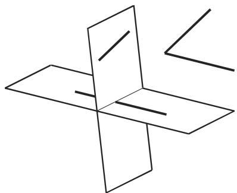

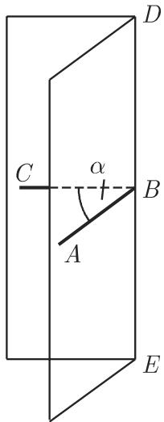
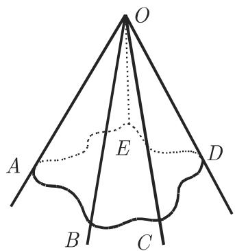

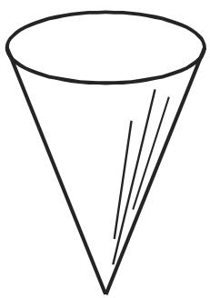

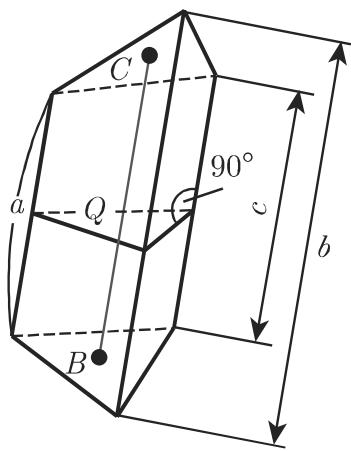

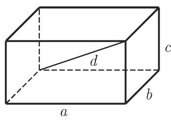

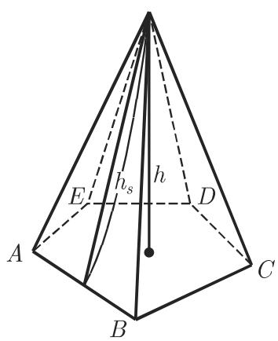
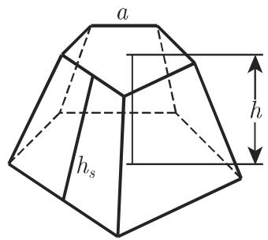
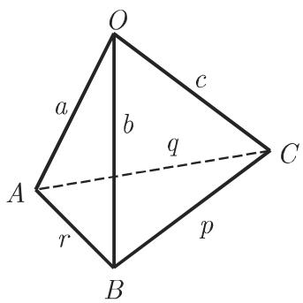

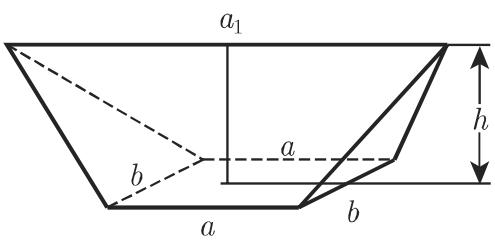


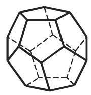


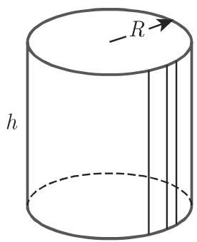

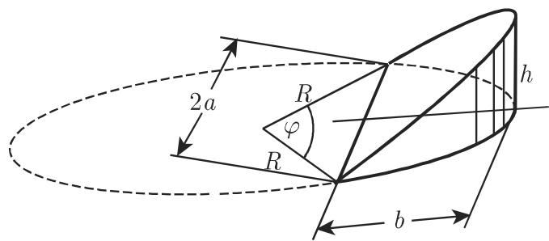
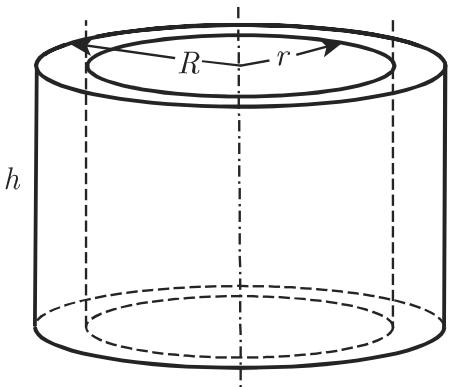

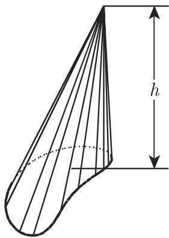


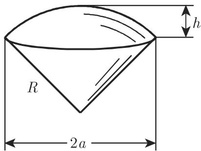


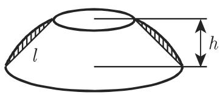


<!-- llm-wiki:embedded-images -->
