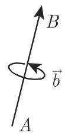
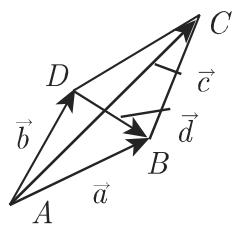
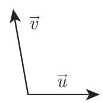
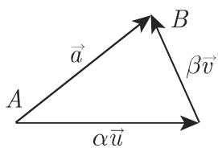
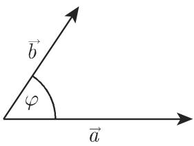

# 数学手册(原书第10版) 3.5.1 向量代数

本页是《数学手册(原书第10版)》3.5.1 节「向量代数」的转写入库，覆盖式 (3.233)–(3.285)、表 3.13–3.18 与图 3.113–3.119。本节是全书由初等几何（3.1–3.4）过渡到解析方法的枢纽，自成体系的递进链条为：定义（3.5.1.1）→ 线性运算（3.5.1.2）→ 坐标（3.5.1.3–3.5.1.4）→ 乘积（3.5.1.5–3.5.1.6）→ 方程（3.5.1.7）→ 共变/反变坐标（3.5.1.8）→ 几何应用（3.5.1.9）。本页汇录其结构化数据（公式组与六张表），并记录独立重算验证结果与转写疑点。

（背景说明：本手册属 Bronstein–Semendyajew 一系德文《Taschenbuch der Mathematik》传统的第 10 版中译本，此为可独立核实的背景信息；出版年份与版权页细节待人工补录。）

## 章节结构与页内导航

| 小节 | 主题 | 对应 wiki 页 |
|---|---|---|
| 3.5.1.1 | 向量的定义（标量/向量、极/轴、模与方向、相等、自由/固定/滑动、特殊向量） | [[concepts/向量]]、[[concepts/标量]]、[[concepts/极向量与轴向量]]、[[concepts/自由向量-固定向量-滑动向量]]、[[concepts/特殊向量]]、[[findings/向量定义与规范正交条件]] |
| 3.5.1.2 | 向量的计算法则（和、差、数乘、线性组合、分解） | [[findings/向量线性运算律与分解]]、[[concepts/线性组合]]、[[concepts/向量的分解]]、[[concepts/三角不等式]] |
| 3.5.1.3 | 向量的坐标（笛卡儿、仿射） | [[concepts/笛卡儿坐标]]、[[concepts/仿射坐标]] |
| 3.5.1.4 | 方向系数 | [[concepts/方向系数]] |
| 3.5.1.5 | 标量积与向量积（定义、性质、例 A/B、标量不变量） | [[concepts/标量积]]、[[concepts/向量积]]、[[concepts/标量不变量]]、[[findings/向量乘积定义性质与算例]] |
| 3.5.1.6 | 向量乘积的组合（二重积、混合积、拉格朗日恒等式、笛卡儿/仿射乘积公式、互反基） | [[concepts/二重向量积]]、[[concepts/混合积]]、[[concepts/拉格朗日恒等式]]、[[findings/向量乘积组合公式]]、[[findings/笛卡儿坐标乘积公式组]]、[[findings/仿射坐标乘积公式与互反基]] |
| 3.5.1.7 | 向量方程 | [[concepts/向量方程]]、[[findings/向量方程解集八类]] |
| 3.5.1.8 | 共变坐标和反变坐标 | [[concepts/共变坐标与反变坐标]]、[[concepts/互反基向量]]、[[concepts/度量系数]]、[[concepts/爱因斯坦求和约定]]、[[findings/共变与反变坐标公式组]] |
| 3.5.1.9 | 几何应用 | [[findings/向量代数几何应用公式]] |

## 一、定义与规范正交条件（式 3.233–3.236）

| 式号 | 内容 |
|---|---|
| (3.233) | $\overrightarrow{AB}=\vec a$，$\overrightarrow{BA}=-\vec a$，但是 $\lvert\overrightarrow{AB}\rvert=\lvert\overrightarrow{BA}\rvert$ |
| (3.234) | $\vec a=\vec e\,\lvert\vec a\rvert$（$\vec e=\vec a^{0}$ 为与 $\vec a$ 同向的单位向量） |
| (3.235) | $\vec e_i\vec e_j=\vec e_i\vec e_k=\vec e_j\vec e_k=0$ |
| (3.236) | $\vec e_i\vec e_i=\vec e_j\vec e_j=\vec e_k\vec e_k=1$（即规范正交） |

## 二、线性运算律与分解（式 3.237–3.239）

| 式号 | 内容 |
|---|---|
| (3.237a) | $\vec a+\vec b=\vec b+\vec a$，$\lvert\vec a+\vec b\rvert\leqslant\lvert\vec a\rvert+\lvert\vec b\rvert$ |
| (3.237b) | $\sum_{i=1}^{n}\vec a_i=\vec f$（折线封闭） |
| (3.237c) | $\vec a+\vec b+\vec c=\vec c+\vec b+\vec a$，$(\vec a+\vec b)+\vec c=\vec a+(\vec b+\vec c)$ |
| (3.237d) | $\vec a-\vec b=\vec a+(-\vec b)=\vec d$ |
| (3.237e) | $\vec a-\vec a=\vec 0$，$\lvert\vec a-\vec b\rvert\geqslant\big\lvert\lvert\vec a\rvert-\lvert\vec b\rvert\big\rvert$ |
| (3.238a) | $\alpha\vec a=\vec a\alpha$，$\alpha\beta\vec a=\beta\alpha\vec a$，$(\alpha+\beta)\vec a=\alpha\vec a+\beta\vec a$，$\alpha(\vec a+\vec b)=\alpha\vec a+\alpha\vec b$ |
| (3.238b) | $\vec k=\alpha\vec a+\beta\vec b+\dots+\delta\vec d$ |
| (3.239a) | $\vec a=\alpha\vec u+\beta\vec v+\gamma\vec w$（按三个非共面向量唯一分解） |
| (3.239b) | $\vec a=\alpha\vec u+\beta\vec v$（共面退化） |

## 三、坐标与方向系数（式 3.240–3.247）

| 式号 | 内容 |
|---|---|
| (3.240a) | $\vec a=a_x\vec i+a_y\vec j+a_z\vec k=a_x\vec e_i+a_y\vec e_j+a_z\vec e_k$ |
| (3.240b) | $\vec a=\{a_x,a_y,a_z\}$ 或 $\vec a(a_x,a_y,a_z)$ |
| (3.241) | $k_x=\alpha a_x+\beta b_x+\dots+\delta d_x$（$k_y,k_z$ 同理） |
| (3.242a) | $\vec c=\vec a\pm\vec b$ |
| (3.242b) | $c_x=a_x\pm b_x$，$c_y=a_y\pm b_y$，$c_z=a_z\pm a_z$（sic，见 [[queries/式3-242b的cz项是否应为az加减bz]]） |
| (3.243) | $r_x=x$，$r_y=y$，$r_z=z$；$\vec r=x\vec i+y\vec j+z\vec k$ |
| (3.244a) | $\vec a=a^{1}\vec e_1+a^{2}\vec e_2+a^{3}\vec e_3$ |
| (3.244b) | $\vec a=\{a^{1},a^{2},a^{3}\}$ 或 $\vec a(a^{1},a^{2},a^{3})$ |
| (3.245) | $k^{1}=\alpha a^{1}+\beta b^{1}+\dots+\delta d^{1}$（$k^{2},k^{3}$ 同理） |
| (3.246) | $c^{1}=a^{1}\pm b^{1}$，$c^{2}=a^{2}\pm b^{2}$，$c^{3}=a^{3}\pm b^{3}$ |
| (3.247) | $a_b=\vec a\,\vec b^{0}=\lvert\vec a\rvert\cos\varphi$，其中 $\vec b^{0}=\vec b/\lvert\vec b\rvert$ |

## 四、乘积的定义与性质（式 3.248–3.257）

| 式号 | 内容 |
|---|---|
| (3.248) | $\vec a\cdot\vec b=\vec a\vec b=(\vec a\vec b)=\lvert\vec a\rvert\lvert\vec b\rvert\cos\varphi$ |
| (3.249a) | $\vec a\times\vec b=\lvert\vec a\vec b\rvert=\vec c$（sic，中间项疑衍文） |
| (3.249b) | $\lvert\vec c\rvert=\lvert\vec a\rvert\lvert\vec b\rvert\sin\varphi$ |
| (3.250) | $\vec a\vec b=\vec b\vec a$ |
| (3.251) | $\vec a\times\vec b=-(\vec b\times\vec a)$ |
| (3.252a) | $\alpha(\vec a\vec b)=(\alpha\vec a)\vec b$ |
| (3.252b) | $\alpha(\vec a\times\vec b)=(\alpha\vec a)\times\vec b$ |
| (3.253a) | $\vec a(\vec b\vec c)\neq(\vec a\vec b)\vec c$ |
| (3.253b) | $\vec a\times(\vec b\times\vec c)\neq(\vec a\times\vec b)\times\vec c$ |
| (3.254a) | $\vec a(\vec b+\vec c)=\vec a\vec b+\vec a\vec c$ |
| (3.254b) | $\vec a\times(\vec b+\vec c)=\vec a\times\vec b+\vec a\times\vec c$；$(\vec b+\vec c)\times\vec a=\vec b\times\vec a+\vec c\times\vec a$ |
| (3.255) | $\vec a\vec b=0\iff\vec a\perp\vec b$（$\vec a,\vec b\neq\vec 0$） |
| (3.256) | $\vec a\times\vec b=\vec 0\iff\vec a\parallel\vec b$（$\vec a,\vec b\neq\vec 0$） |
| (3.257) | $\vec a\vec a=\vec a^{2}=a^{2}$，$\vec a\times\vec a=\vec 0$ |

## 五、乘积的组合（式 3.258–3.262）

| 式号 | 内容 |
|---|---|
| (3.258) | $\vec a\times(\vec b\times\vec c)=\vec b(\vec a\vec c)-\vec c(\vec a\vec b)$ |
| (3.259) | $(\vec a\times\vec b)\vec c=\vec a(\vec b\times\vec c)=\vec a\vec b\vec c=\vec b\vec c\vec a=\vec c\vec a\vec b=-\vec a\vec c\vec b=-\vec b\vec a\vec c=-\vec c\vec b\vec a$ |
| (3.260) | $\vec a(\vec b\times\vec c)=0$（共面） |
| (3.261) | $(\vec a\times\vec b)(\vec c\times\vec d)=(\vec a\vec c)(\vec b\vec d)-(\vec b\vec c)(\vec a\vec d)$（拉格朗日恒等式） |
| (3.262) | $\vec a\vec b\vec c\cdot\vec e\vec f\vec g=\begin{vmatrix}\vec a\vec e&\vec a\vec f&\vec a\vec g\\ \vec b\vec e&\vec b\vec f&\vec b\vec g\\ \vec c\vec e&\vec c\vec f&\vec c\vec g\end{vmatrix}$ |

## 六、笛卡儿坐标乘积公式（式 3.263–3.266）

| 式号 | 内容 |
|---|---|
| (3.264) | $\vec a\vec b=a_xb_x+a_yb_y+a_zb_z$ |
| (3.265) | $\vec a\times\vec b=(a_yb_z-a_zb_y)\vec i+(a_zb_x-a_xb_z)\vec j+(a_xb_y-a_yb_x)\vec k=\begin{vmatrix}\vec i&\vec j&\vec k\\ a_x&a_y&a_z\\ b_x&b_y&b_z\end{vmatrix}$ |
| (3.266) | $\vec a\vec b\vec c=\begin{vmatrix}a_x&a_y&a_z\\ b_x&b_y&b_z\\ c_x&c_y&c_z\end{vmatrix}$ |

## 七、仿射坐标乘积公式与互反基（式 3.267–3.276）

| 式号 | 内容 |
|---|---|
| (3.267) | $\vec a=a^{1}\vec e_1+a^{2}\vec e_2+a^{3}\vec e_3$，$\vec b=b^{1}\vec e_1+b^{2}\vec e_2+b^{3}\vec e_3$ |
| (3.268) | $\vec a\vec b=a^{1}b^{1}\vec e_1\vec e_1+a^{2}b^{2}\vec e_2\vec e_2+a^{3}b^{3}\vec e_3\vec e_3+(a^{1}b^{2}+a^{2}b^{1})\vec e_1\vec e_2+(a^{2}b^{3}+a^{3}b^{2})\vec e_2\vec e_3+(a^{3}b^{1}+a^{1}b^{3})\vec e_3\vec e_1$ |
| (3.269a) | $\vec a\times\vec b=(a^{2}b^{3}-a^{3}b^{2})\vec e_2\times\vec e_3+(a^{3}b^{1}-a^{1}b^{3})\vec e_3\times\vec e_1+(a^{1}b^{2}-a^{2}b^{1})\vec e_1\times\vec e_2$ |
| (3.269b) | $\vec e_1\times\vec e_1=\vec e_2\times\vec e_2=\vec e_3\times\vec e_3=\vec 0$ |
| (3.270) | $g_{mn}=\vec e_m\vec e_n$（六个度量系数，$g_{ki}=g_{ik}$） |
| (3.271a) | $\vec e^{1}=\varOmega(\vec e_2\times\vec e_3)$，$\vec e^{2}=\varOmega(\vec e_3\times\vec e_1)$，$\vec e^{3}=\varOmega(\vec e_1\times\vec e_2)$ |
| (3.271b) | $\varOmega=1/(\vec e_1\vec e_2\vec e_3)$ |
| (3.272a–c) | 笛卡儿特例：$\vec e_1=\vec i$ 等；$g_{11}=g_{22}=g_{33}=1$，$g_{12}=g_{23}=g_{31}=0$，$\varOmega=1$；$\vec e^{1}=\vec i$，$\vec e^{2}=\vec j$，$\vec e^{3}=\vec k$ |
| (3.273) | $\vec a\vec b=\sum_{m=1}^{3}\sum_{n=1}^{3}g_{mn}a^{m}b^{n}=g_{\alpha\beta}a^{\alpha}b^{\beta}$ |
| (3.274) | $g_{\alpha\beta}a^{\alpha}b^{\beta}=g_{11}a^{1}b^{1}+g_{12}a^{1}b^{2}+g_{13}a^{1}b^{3}+g_{21}a^{2}b^{1}+g_{22}a^{2}b^{2}+g_{23}a^{2}b^{3}+g_{31}a^{3}b^{1}+g_{32}a^{3}b^{2}+g_{33}a^{3}b^{3}$ |
| (3.275) | $\vec a\times\vec b=\vec e_1\vec e_2\vec e_3\begin{vmatrix}\vec e^{1}&\vec e^{2}&\vec e^{3}\\ a^{1}&a^{2}&a^{3}\\ b^{1}&b^{2}&b^{3}\end{vmatrix}$ |
| (3.276) | $\vec a\vec b\vec c=\vec e_1\vec e_2\vec e_3\begin{vmatrix}a^{1}&a^{2}&a^{3}\\ b^{1}&b^{2}&b^{3}\\ c^{1}&c^{2}&c^{3}\end{vmatrix}$ |

## 八、共变与反变坐标（式 3.277–3.285）

| 式号 | 内容 |
|---|---|
| (3.277) | $\vec a=a^{1}\vec e_1+a^{2}\vec e_2+a^{3}\vec e_3=a^{\alpha}\vec e_{\alpha}$（反变坐标） |
| (3.278) | $\vec a=a_{1}\vec e^{1}+a_{2}\vec e^{2}+a_{3}\vec e^{3}=a_{\alpha}\vec e^{\alpha}$（共变坐标） |
| (3.279) | $a_{1}=\vec a\vec e_1$，$a_{2}=\vec a\vec e_2$，$a_{3}=\vec a\vec e_3$ |
| (3.280) | $a^{1}=\vec a\vec e^{1}$，$a^{2}=\vec a\vec e^{2}$，$a^{3}=\vec a\vec e^{3}$ |
| (3.281) | $a_x=\vec a\vec i$，$a_y=\vec a\vec j$，$a_z=\vec a\vec k$（笛卡儿系中共变=反变） |
| (3.282) | $\vec a\vec b=g^{\alpha\beta}a_{\alpha}b_{\beta}$，其中 $g^{mn}=\vec e^{m}\vec e^{n}$ |
| (3.283) | $g^{mn}=\dfrac{(-1)^{m+n}A^{mn}}{\begin{vmatrix}g_{11}&g_{12}&g_{13}\\ g_{21}&g_{22}&g_{23}\\ g_{31}&g_{32}&g_{33}\end{vmatrix}}$（$A^{mn}$ 为划掉 $g_{mn}$ 所在行和列所得子式） |
| (3.284) | $\vec a\vec b=a^{1}b_{1}+a^{2}b_{2}+a^{3}b_{3}=a^{\alpha}b_{\alpha}$ |
| (3.285) | $\vec a\vec b=a_{\alpha}b^{\alpha}$ |

## 表 3.13–3.18（结构化数据转录）

**表 3.13 基向量的标量积**（$g_{ki}=g_{ik}$）：

| · | $\vec e_1$ | $\vec e_2$ | $\vec e_3$ |
|---|---|---|---|
| $\vec e_1$ | $g_{11}$ | $g_{12}$ | $g_{13}$ |
| $\vec e_2$ | $g_{21}$ | $g_{22}$ | $g_{23}$ |
| $\vec e_3$ | $g_{31}$ | $g_{32}$ | $g_{33}$ |

**表 3.14 基向量的向量积**（转写行列错位；下表为据式 3.271a 的唯一复原，见 [[queries/3-5-1全节系统性转写讹误]]）：

| × | $\vec e_1$ | $\vec e_2$ | $\vec e_3$ |
|---|---|---|---|
| $\vec e_1$ | $\vec 0$ | $\vec e^{3}/\varOmega$ | $-\vec e^{2}/\varOmega$ |
| $\vec e_2$ | $-\vec e^{3}/\varOmega$ | $\vec 0$ | $\vec e^{1}/\varOmega$ |
| $\vec e_3$ | $\vec e^{2}/\varOmega$ | $-\vec e^{1}/\varOmega$ | $\vec 0$ |

**表 3.15 互反基向量的标量积（笛卡儿特例）**：

| · | $\vec i$ | $\vec j$ | $\vec k$ |
|---|---|---|---|
| $\vec i$ | 1 | 0 | 0 |
| $\vec j$ | 0 | 1 | 0 |
| $\vec k$ | 0 | 0 | 1 |

**表 3.16 互反基向量的向量积（笛卡儿特例）**：

| × | $\vec i$ | $\vec j$ | $\vec k$ |
|---|---|---|---|
| $\vec i$ | $\vec 0$ | $\vec k$ | $-\vec j$ |
| $\vec j$ | $-\vec k$ | $\vec 0$ | $\vec i$ |
| $\vec k$ | $\vec j$ | $-\vec i$ | $\vec 0$ |

**表 3.17 向量方程**：

| 方程 | 解 |
|---|---|
| (1) $\vec x+\vec a=\vec b$ | $\vec x=\vec b-\vec a$ |
| (2) $\alpha\vec x=\vec a$ | $\vec x=\vec a/\alpha$ |
| (3) $\vec x\vec a=\alpha$ | 不定方程；同起点满足方程的所有 $\vec x$ 的终点构成垂直于 $\vec a$ 的平面——**平面的向量方程** |
| (4) $\vec x\times\vec a=\vec b$（$\vec b\perp\vec a$） | 不定方程；终点构成平行于 $\vec a$ 的直线——**直线的向量方程** |
| (5) $\vec x\vec a=\alpha$ 且 $\vec x\times\vec a=\vec b$（$\vec b\perp\vec a$） | $\vec x=\dfrac{\alpha\vec a+\vec a\times\vec b}{a^{2}}$（$a=\lvert\vec a\rvert$） |
| (6) $\vec x\vec a=\alpha$、$\vec x\vec b=\beta$、$\vec x\vec c=\gamma$ | $\vec x=\dfrac{\alpha(\vec b\times\vec c)+\beta(\vec c\times\vec a)+\gamma(\vec a\times\vec b)}{\vec a\vec b\vec c}=\alpha\tilde{\vec a}+\beta\tilde{\vec b}+\gamma\tilde{\vec c}$（互反向量） |
| (7) $\vec d=x\vec a+y\vec b+z\vec c$ | $x=\dfrac{\vec d\vec b\vec c}{\vec a\vec b\vec c}$，$y=\dfrac{\vec a\vec d\vec c}{\vec a\vec b\vec c}$，$z=\dfrac{\vec a\vec b\vec d}{\vec a\vec b\vec c}$ |
| (8) $\vec d=x(\vec b\times\vec c)+y(\vec c\times\vec a)+z(\vec a\times\vec b)$ | $x=\dfrac{\vec d\vec a}{\vec a\vec b\vec c}$，$y=\dfrac{\vec d\vec b}{\vec a\vec b\vec c}$，$z=\dfrac{\vec d\vec c}{\vec a\vec b\vec c}$ |

**表 3.18 向量代数的几何应用**：

| 确定 | 向量公式 | 笛卡儿坐标公式 |
|---|---|---|
| 向量 $\vec a$ 的长度 | $a=\sqrt{\vec a^{2}}$ | $a=\sqrt{a_x^{2}+a_y^{2}+a_z^{2}}$ |
| $\vec a,\vec b$ 确定的平行四边形面积 | $S=\lvert\vec a\times\vec b\rvert$ | $S=\sqrt{\begin{vmatrix}a_y&a_z\\ b_y&b_z\end{vmatrix}^{2}+\begin{vmatrix}a_z&a_x\\ b_z&b_x\end{vmatrix}^{2}+\begin{vmatrix}a_x&a_y\\ b_x&b_y\end{vmatrix}^{2}}$ |
| $\vec a,\vec b,\vec c$ 确定的平行六面体体积 | $V=\lvert\vec a\vec b\vec c\rvert$ | $V=\left\lvert\begin{vmatrix}a_x&a_y&a_z\\ b_x&b_y&b_z\\ c_x&c_y&c_z\end{vmatrix}\right\rvert$ |
| $\vec a$ 与 $\vec b$ 的夹角 | $\cos\varphi=\dfrac{\vec a\vec b}{\sqrt{\vec a^{2}\vec b^{2}}}$ | $\cos\varphi=\dfrac{a_xb_x+a_yb_y+a_zb_z}{\sqrt{a_x^{2}+a_y^{2}+a_z^{2}}\sqrt{b_x^{2}+b_y^{2}+b_z^{2}}}$ |

## 例 A、例 B 与标量不变量三例

- **例 A（标量积）**：$(3\vec a+5\vec b-2\vec c)(\vec a-2\vec b-4\vec c)=3\vec a^{2}-10\vec b^{2}+8\vec c^{2}-\vec a\vec b-14\vec a\vec c-16\vec b\vec c$——经独立重算完全正确（$\vec a\vec b$ 系数 $-6+5=-1$）。
- **例 B（向量积）**：$(3\vec a+5\vec b-2\vec c)\times(\vec a-2\vec b-4\vec c)=11\vec b\times\vec a+10\vec c\times\vec a+24\vec c\times\vec b$——终式经重算正确，但源文中间步骤转写损坏。
- **标量不变量三例**：A——坐标不是标量不变量（不同坐标系下值不同）；B——模是（不同坐标系下值相同）；C——标量积是（$\vec a\vec a=\lvert\vec a\rvert^{2}\cos\varphi=\lvert\vec a\rvert^{2}$，$\varphi=0$）。

## 独立重算验证

以下内容经独立重算复核一致：例 A（全程）、例 B（终式）、表 3.17 (5)–(8) 的解、式 3.268/3.273/3.275/3.276 的展开、表 3.14 的复原（据 3.271a）、式 3.283 的余子式公式（矩阵求逆的伴随公式）。整体证据强度：高——全部为参考手册式标准结果，转写损坏限于文字层与个别符号，数学结构基本完好。

## 转写疑点（摘要）

1. 式 3.242b 第三分量 $c_z=a_z\pm a_z$ 疑应为 $a_z\pm b_z$（[[queries/式3-242b的cz项是否应为az加减bz]]）；
2. 全节系统性讹误：编号与数字脱落、同音字替换、OCR 噪声残片、页码-节号粘连、表 3.14 行列错位、式 3.274 双重标签、式 3.284 正文指派与公式指标互换（[[queries/3-5-1全节系统性转写讹误]]）；
3. 式 3.249a 中间项疑衍文；「轴向量具有相反和相同的旋转方向」句语义脱落（[[queries/式3-249a中间项与轴向量句是否原书损坏]]）。

人名「拉格朗日」「笛卡儿」仅作恒等式与坐标的冠名出现，本源无独立论述，故不设人物页。

## 与既有维基的联系

- **同书序列**：延续 3.1.x→3.4.2 的来源页链条（[[sources/10-数学手册原书第10版--8-33-立体几何学--1skqvyc]]、[[sources/10-数学手册原书第10版--8-34-球面三角学--8twnfs]] 等），并再现同样的转写通病（页码-节号粘连、符号脱落）。
- **3.3 立体几何**：表 3.18 体积公式与式 3.266 同 [[findings/平行六面体至立方体公式]]、[[findings/四面体行列式体积公式]] 形成「综合几何 vs 向量方法」对照；[[concepts/三面角]] 与混合积的右手系定向呼应。
- **3.2 平面三角**：[[findings/两直角坐标系相似变换]] 与本节坐标/向径概念衔接；[[concepts/测地坐标]]、[[concepts/方位角]] 提供应用背景。
- **3.4.1 球面几何**：[[concepts/地理坐标]]、[[concepts/佐德纳坐标]]、[[concepts/高斯-克吕格坐标]] 属测量坐标系族；本节笛卡儿/仿射坐标及共变/反变坐标扩展维基「坐标系」主题群。
- **前向预留**：矩阵记号（下划线 a）、4.3.1 张量计算、3.5.3.10 空间解析几何的交叉引用为未来章节预留链接（尚未入库）。

<!-- llm-wiki:embedded-images -->
## Embedded Images

### Document

<!-- llm-wiki:embedded-images -->
