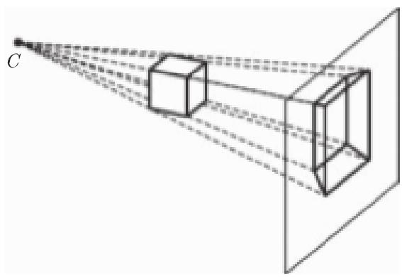
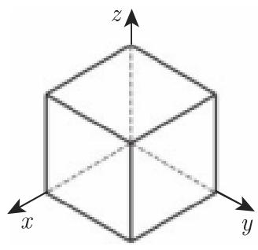
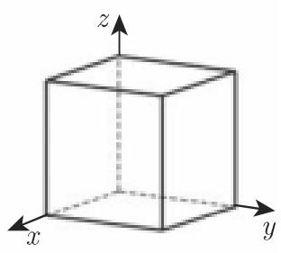
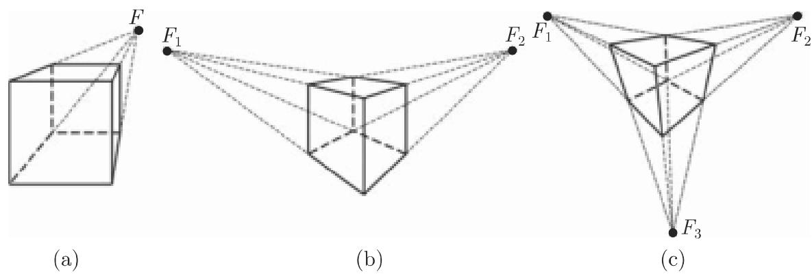
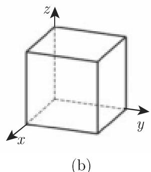
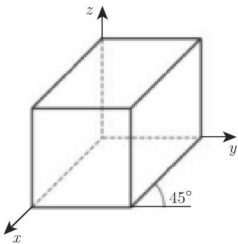

# 数学手册(原书第10版) 3.5.5 平面投影

本节是 [[sources/10-数学手册原书第10版--13-35-向量代数与解析几何学--1uj7znc|3.5 向量代数与解析几何学]] 的末小节，处理“使三维对象在二维媒介中可视化”的问题（节首引文献 [3.22]，为无辨识信息的过路引用）。核心对象是**平面投影**：一个映射，三维空间中的点被指派到平面上的一点（像点），该像点是平面与“连接观察者和空间点之射线”的交点；该平面称为**投影平面**（**画面**），射线称为**投影线**，其方向称为**投影方向**。

全节以矩阵形式体系为主线：3.5.5.1 分类 → 3.5.5.2 构造图像坐标系（式 3.473）→ 3.5.5.3 主投影（式 3.474–3.475）→ 3.5.5.4 轴测投影三分类 → 3.5.5.5 等距投影矩阵链（式 3.476–3.478）→ 3.5.5.6 斜平行投影与两个立方体算例（式 3.479–3.480）→ 3.5.5.7 透视投影与没影点（式 3.481–3.482）。

## 投影分类（3.5.5.1）

- **中心投影**（透视投影）：投影线发自一个公共中心点；距中心较远的物体成像较小；不与画面平行的平行线相交于没影点。
- **平行投影**：投影线相互平行；不平行于画面的线段变短，角通常被扭曲。
  - **正交平行投影**（投影方向垂直于画面）：画面还垂直于某坐标轴 → **正投影/主投影**；投影方向不垂直于任何坐标轴 → **轴测投影**（等距、双度量、三度量）。
  - **斜平行投影**（投影方向不平行于画面法向量）：特例为**斜等轴测投影**与**斜角立体投影**。

原文附注：平行投影有时保持尺寸的比例，但似乎并不比透视表示更真实。

## 图像坐标系（3.5.5.2，式 3.473）

投影平面由参考点 $R(x_r,y_r,z_r)$ 与单位法向量 $\vec n=\{n_x,n_y,n_z\}$ 给定。图像坐标系以 $R$ 为原点、$x'y'$ 平面即投影平面，表示“直视画面的观看者”所见的投影。取世界坐标系中的“朝上”向量 $\vec u$（其在画面上的投影定义 $y'$ 方向）：

$$\vec{e}'_k=\vec{n},\qquad \vec{e}'_i=\frac{\vec{u}\times\vec{n}}{\|\vec{u}\times\vec{n}\|},\qquad \vec{e}'_j=\vec{e}'_k\times\vec{e}'_i.\tag{3.473}$$

到世界坐标系的变换矩阵及其逆由 3.5.4 节的 (3.464)(3.465) 代入 $R$ 与 $\vec e'_i,\vec e'_j,\vec e'_k$ 得到（该节尚未入库）。

## 主投影（3.5.5.3，式 3.474–3.475）

点 $P(x_P,y_P,z_P)$ 到平行于 $x,y$ 平面、方程 $z=z_0$ 的投影平面的正交投影：

$$\begin{pmatrix}x'_P\\y'_P\\z'_P\\1\end{pmatrix}=\begin{pmatrix}1&0&0&0\\0&1&0&0\\0&0&0&z_0\\0&0&0&1\end{pmatrix}\begin{pmatrix}x_P\\y_P\\z_P\\1\end{pmatrix}\tag{3.474}$$

取 $z_0=0$ 时到三个坐标面的投影矩阵：

$$P_x=\begin{pmatrix}0&0&0&0\\0&1&0&0\\0&0&1&0\\0&0&0&1\end{pmatrix},\quad P_y=\begin{pmatrix}1&0&0&0\\0&0&0&0\\0&0&1&0\\0&0&0&1\end{pmatrix},\quad P_z=\begin{pmatrix}1&0&0&0\\0&1&0&0\\0&0&0&0\\0&0&0&1\end{pmatrix}\tag{3.475}$$

依投影方向与观看方向，画面上形成平面图、俯视图或侧视图（工业设计语境）。

## 轴测投影三分类（3.5.5.4）

法向量 $\vec n$ 不平行于任何坐标轴的正交投影，按 $|n_i|$ 的相等关系分三类：**等距投影**（$|n_x|=|n_y|=|n_z|$，投影坐标轴夹角 $120^\circ$，平行于坐标轴的线段具有相同扭曲因子）、**双度量投影**（$n$ 的坐标中有两个绝对值相同，沿这两方向相等的距离仍相等）、**三度量投影**（三轴夹角互不相同，扭曲因子各不相同）。

## 等距投影矩阵链（3.5.5.5，式 3.476–3.478）

取投影平面过原点、$\vec n=(1,1,1)/\sqrt3$、朝上向量 $\vec u=(0,0,1)$（于是 $z$ 轴映射到 $y'$ 轴），基向量为 $\vec e'_i=\{-\tfrac{1}{\sqrt2},\tfrac{1}{\sqrt2},0\}$、$\vec e'_j=\{-\tfrac{1}{\sqrt6},-\tfrac{1}{\sqrt6},\tfrac{2}{\sqrt6}\}$、$\vec e'_k=\{\tfrac{1}{\sqrt3},\tfrac{1}{\sqrt3},\tfrac{1}{\sqrt3}\}$：

$$\overline{M}_A=\begin{pmatrix}-\frac{1}{\sqrt2}&-\frac{1}{\sqrt6}&\frac{1}{\sqrt3}&0\\ \frac{1}{\sqrt2}&-\frac{1}{\sqrt6}&\frac{1}{\sqrt3}&0\\ 0&\frac{2}{\sqrt6}&\frac{1}{\sqrt3}&0\\ 0&0&0&1\end{pmatrix},\qquad \overline{M}_A^{-1}=\overline{M}_A^{\mathrm T}\tag{3.476}$$

$$P_A=P_z\overline{M}_A^{-1}=\begin{pmatrix}-\frac{1}{\sqrt2}&\frac{1}{\sqrt2}&0&0\\ -\frac{1}{\sqrt6}&-\frac{1}{\sqrt6}&\frac{2}{\sqrt6}&0\\ 0&0&0&0\\ 0&0&0&1\end{pmatrix}\tag{3.477}$$

$$P=\overline{M}_A P_z \overline{M}_A^{-1}=\frac{1}{3}\begin{pmatrix}2&-1&-1&0\\ -1&2&-1&0\\ -1&-1&2&0\\ 0&0&0&3\end{pmatrix}\tag{3.478}$$

## 斜平行投影（3.5.5.6，式 3.479–3.480）

投影线与画面以角 $\beta$ 相交；$d=L/z=1/\tan\beta$ 为垂直于画面的线段的缩放因子，$\alpha$ 为 $x$ 轴与垂直线段投影像之间的夹角（转写中 $\beta$、$L$、$\alpha$、$x$ 等符号成片脱落）：

$$x'_P=x_P-z_P d\cos\alpha,\quad y'_P=y_P-z_P d\sin\alpha,\quad z'_P=0\tag{3.479}$$

$$\begin{pmatrix}x'_P\\y'_P\\z'_P\\1\end{pmatrix}=\begin{pmatrix}1&0&-d\cos\alpha&0\\0&1&-d\sin\alpha&0\\0&0&0&0\\0&0&0&1\end{pmatrix}\begin{pmatrix}x_P\\y_P\\z_P\\1\end{pmatrix}\tag{3.480}$$

两算例（不位于 $x,y$ 平面的四个顶点 $(0,0,1),(1,0,1),(0,1,1),(1,1,1)$ 按列排成矩阵）：

斜等轴测投影（$\alpha=45^\circ$，$d=1$，$\beta=45^\circ$；垂直线段不变短，图 3.215）：

$$\begin{pmatrix}-\frac{1}{\sqrt2}&-\frac{1}{\sqrt2}&1-\frac{1}{\sqrt2}&1-\frac{1}{\sqrt2}\\ -\frac{1}{\sqrt2}&1-\frac{1}{\sqrt2}&-\frac{1}{\sqrt2}&1-\frac{1}{\sqrt2}\\ 0&0&0&0\\ 1&1&1&1\end{pmatrix}=\begin{pmatrix}1&0&-\frac{1}{\sqrt2}&0\\0&1&-\frac{1}{\sqrt2}&0\\0&0&0&0\\0&0&0&1\end{pmatrix}\begin{pmatrix}0&1&0&1\\0&0&1&1\\1&1&1&1\\1&1&1&1\end{pmatrix}$$

斜角立体投影（$\alpha=30^\circ$，$d=\tfrac12$，$\beta=63.4^\circ$；垂直线段减半，图 3.216）：

$$\begin{pmatrix}-\frac{\sqrt3}{4}&1-\frac{\sqrt3}{4}&-\frac{\sqrt3}{4}&1-\frac{\sqrt3}{4}\\ -\frac14&-\frac14&\frac34&\frac34\\ 0&0&0&0\\ 1&1&1&1\end{pmatrix}=\begin{pmatrix}1&0&-\frac{\sqrt3}{4}&0\\0&1&-\frac14&0\\0&0&0&0\\0&0&0&1\end{pmatrix}\begin{pmatrix}0&1&0&1\\0&0&1&1\\1&1&1&1\\1&1&1&1\end{pmatrix}$$

## 透视投影（3.5.5.7，式 3.481–3.482）

图像坐标系中取投影中心位于 $z'$ 轴上（画面 $z'=0$，中心 $(0,0,z_0)$）。由截距定理（3.1.3.2）：

$$\frac{x'_P}{x_P}=\frac{z_0}{z_0-z_P}=\frac{1}{1-\frac{z_P}{z_0}},\qquad \frac{y'_P}{y_P}=\frac{1}{1-\frac{z_P}{z_0}},\qquad z'_P=0$$

原坐标与像坐标之间的关系非线性，但利用齐次坐标（3.5.4.2）可写成矩阵形式：

$$\begin{pmatrix}x'_P\\y'_P\\z'_P\\1\end{pmatrix}=\begin{pmatrix}x_P\\y_P\\0\\1-\frac{z_P}{z_0}\end{pmatrix}=\begin{pmatrix}1&0&0&0\\0&1&0&0\\0&0&0&0\\0&0&-\frac{1}{z_0}&1\end{pmatrix}\begin{pmatrix}x_P\\y_P\\z_P\\1\end{pmatrix}\tag{3.481}$$

主点（主没影点）坐标（**符号存疑**，见下）：

$$F_x\Big(x_c+\frac{d}{n_x},y_c,z_c\Big),\quad F_y\Big(x_c,y_c+\frac{d}{n_y},z_c\Big),\quad F_z\Big(x_c,y_c,z_c+\frac{d}{n_z}\Big)\tag{3.482a}$$

$$d=(\vec c-\vec r)\cdot\vec n=(x_c-x_r)n_x+(y_c-y_r)n_y+(z_c-z_r)n_z\tag{3.482b}$$

若法向量的某坐标为零，则该方向没有主点；主点个数等于与画面相交的坐标轴个数（一点、两点、三点透视，图 3.218）。

## 验证状态

- 式 (3.473)–(3.481) 及全部算例经独立复算数值一致（见各 finding 页），且均为标准教科书结果，证据强度高。
- 结构性核验：等距投影总矩阵 (3.478) 满足 $\boldsymbol P=\boldsymbol I-\vec n\,\vec n^{\mathrm T}$（因 $\overline M_A$ 第三列为 $\vec n$），九个元素逐一复算一致；$P e_x$ 的模 $\sqrt6/3=\sqrt{2/3}\approx0.8165$ 为经典等距缩短因子，投影轴夹角复算恰为 $120^\circ$。
- **式 (3.482a) 符号存疑**：几何推导给出 $F=C-(d/n_i)e_i$；反例 $C=(0,0,2)$、画面 $z=0$、$n=(0,0,1)$ 时 $d=2$，正确主点应为 $(0,0,0)$，而 (3.482a) 给出 $(0,0,4)$。详见 [[queries/式3-482a主点坐标符号是否应为减d比n分量]] 与 [[findings/主没影点坐标公式]]。

## 转写讹误

本节延续全书的系统性转写噪声（参见 [[queries/3-5-1全节系统性转写讹误]]、[[queries/3-5-2节符号成片脱落与λ转写为入是否为转写丢字]]）：“于”系统性讹为“千”；$\vec n$ 被转写为“计”（3.5.5.4 三处、3.5.5.7 一处）；“向量忒”为 $\vec e'_i$ 附近讹字；3.5.5.6 的 $\beta$、$L$、$\alpha$、$x$ 等符号成片脱落；$d=L/z$ 缺下标 $P$；3.5.5.2 中 $e_k$ 与 $e'_k$ 记号不一致。详见 [[queries/向量n转写为计与向量忒等讹误清单]]、[[queries/3-5-5-6节β-L-α符号成片脱落是否为转写丢字]]。

## 依赖缺口

本节多处依赖尚未入库的章节（见 [[queries/3-5-3与3-5-4节未入库对式3-464-3-465的依赖缺口]]）：3.5.4 节的一般坐标变换公式 (3.464)(3.465)、3.5.4.2 的齐次坐标（[[concepts/齐次坐标]] 暂为占位页）、3.1.3.2 的截距定理（[[concepts/截距定理]] 暂为占位页）、3.5.3 空间解析几何。

## 本节产出的页面

- 概念：[[concepts/平面投影]]、[[concepts/中心投影]]、[[concepts/平行投影]]、[[concepts/正投影]]、[[concepts/轴测投影]]、[[concepts/等距投影]]、[[concepts/双度量投影]]、[[concepts/三度量投影]]、[[concepts/斜投影]]、[[concepts/没影点]]、[[concepts/图像坐标系]]、[[concepts/齐次坐标]]、[[concepts/截距定理]]
- 发现：[[findings/投影分类体系与图像坐标系构造]]、[[findings/主投影与坐标面投影矩阵]]、[[findings/轴测投影三分类判据]]、[[findings/等距投影矩阵链]]、[[findings/斜平行投影公式与立方体两算例]]、[[findings/透视投影齐次坐标矩阵]]、[[findings/主没影点坐标公式]]
- 方法：[[methodology/图像坐标系构造流程]]、[[methodology/投影矩阵的变换投影逆变换合成流程]]
- 比较：[[comparisons/中心投影与平行投影比较]]、[[comparisons/等距双度量三度量投影比较]]、[[comparisons/斜等轴测与斜角立体投影比较]]

<!-- llm-wiki:embedded-images -->
## Embedded Images

### Document

<!-- llm-wiki:embedded-images -->
