# 数学手册(原书第10版) 3.6.1 平面曲线

《数学手册(原书第10版)》第 3.6 章（微分几何）的第一节。本节以平面曲线的四种表示（隐式、显式、参数式、极坐标）为分档框架，系统汇辑：曲线的局部元素（弧微分、切线与法线、斜率角、切线/法线线段与次切距/次法距、两曲线夹角、凸凹性、曲率与曲率半径、曲率圆与曲率中心）；特殊点（拐点、顶点、奇点十分类、多重点的 Δ 判别）；渐近线的三种求法；曲线的一般讨论与作图流程；渐屈线与渐伸线；以及曲线族的包络。这是**公式手册型**来源：以成套编号公式（式 3.483–3.522 与表 3.26）配合可复核算例呈现，不含论证性推导。约 20 个算例经独立符号推导与数值代入复核全部通过，数学内容置信度高；主要风险集中在转写质量（见「转写质量」节）。

## 章节结构

| 小节 | 主题 | 主要公式 |
|---|---|---|
| 3.6.1.1 | 定义平面曲线的方法：四种表示与正方向 | (3.483)–(3.486) |
| 3.6.1.2 | 局部元素：弧微分、切线与法线、凸凹、曲率、曲率圆与曲率中心 | (3.487)–(3.507)，表 3.26 |
| 3.6.1.3 | 特殊点：拐点、顶点、奇点（十分类）与多重点 Δ 判别 | (3.508)–(3.514) |
| 3.6.1.4 | 渐近线：定义与参数/显式/隐式三种求法 | (3.515)–(3.519) |
| 3.6.1.5 | 由方程给出的曲线的一般讨论（显式与隐式作图流程） | — |
| 3.6.1.6 | 渐屈线与渐伸线 | (3.520) |
| 3.6.1.7 | 曲线族的包络：特征点与包络方程 | (3.521)–(3.522) |

## 核心公式组（按原文保真）

### 四种表示与正方向（式 3.483–3.486）

$$F(x,y)=0\ (\text{隐式})，\qquad y=f(x)\ (\text{显式})，\qquad x=x(t),\ y=y(t)\ (\text{参数式})，\qquad \rho=f(\varphi)\ (\text{极坐标})$$

正方向 = 参数增大的方向：显式以 $x$ 为参数（横坐标增加方向）；极坐标以 $\varphi$ 为参数（逆时针）。图 3.219 三例：$x=t^2,y=t^3$、$y=\sin x$、$\rho=a\varphi$。详见 [[concepts/平面曲线的四种表示]]。

### 弧微分（式 3.487–3.489）

$$\Delta s\approx\mathrm{d}s=\begin{cases}\sqrt{1+\left(\dfrac{\mathrm{d}y}{\mathrm{d}x}\right)^2}\,\mathrm{d}x & \text{形式(3.484)}\\[6pt] \sqrt{x'^2+y'^2}\,\mathrm{d}t & \text{形式(3.485)}\\[6pt] \sqrt{\rho^2+\rho'^2}\,\mathrm{d}\varphi & \text{形式(3.486)}\end{cases}$$

（源文此段排版错乱：残缺 cases 块与孤立编号 (3.488)(3.489)，主式首行 $(\mathrm{d}/\mathrm{d}x)^2$ 丢失 y，见 [[queries/弧微分三式编号是否原为三条独立公式]]。）见 [[concepts/弧微分]]、[[findings/弧微分公式组]]。

### 切线与法线方程（表 3.26）

| 方程类型 | 切线方程 | 法线方程 |
|---|---|---|
| (3.483) | $\dfrac{\partial F}{\partial x}(X-x)+\dfrac{\partial F}{\partial y}(Y-y)=0$ | $\dfrac{X-x}{\partial F/\partial x}=\dfrac{Y-y}{\partial F/\partial y}$ |
| (3.484) | $Y-y=\dfrac{\mathrm{d}y}{\mathrm{d}x}(X-x)$ | $Y-y=-\dfrac{1}{\mathrm{d}y/\mathrm{d}x}(X-x)$ |
| (3.485) | $\dfrac{Y-y}{y'}=\dfrac{X-x}{x'}$ | $x'(X-x)+y'(Y-y)=0$ |

（$x,y$ 为切点坐标，$X,Y$ 为切线/法线上动点坐标，导数在切点处取值。）见 [[concepts/切线与法线]]、[[findings/切线法线方程表与三算例]]。

### 斜率角与局部线段（式 3.490–3.492）

$$\tan\alpha=\frac{\mathrm{d}y}{\mathrm{d}x},\quad \cos\alpha=\frac{\mathrm{d}x}{\mathrm{d}s},\quad \sin\alpha=\frac{\mathrm{d}y}{\mathrm{d}s};\qquad \tan\mu=\frac{\rho}{\mathrm{d}\rho/\mathrm{d}\varphi},\quad \cos\mu=\frac{\mathrm{d}\rho}{\mathrm{d}s},\quad \sin\mu=\rho\frac{\mathrm{d}\varphi}{\mathrm{d}s}$$

$$\overline{PT}=\left|\frac{y}{y'}\sqrt{1+y'^2}\right|,\quad \overline{PN}=\left|y\sqrt{1+y'^2}\right|,\quad \overline{P'T}=\left|\frac{y}{y'}\right|,\quad \overline{P'N}=|yy'|$$

$$\overline{PT'}=\left|\frac{\rho}{\rho'}\sqrt{\rho^2+\rho'^2}\right|,\quad \overline{PN'}=\left|\sqrt{\rho^2+\rho'^2}\right|,\quad \overline{OT'}=\left|\frac{\rho^2}{\rho'}\right|,\quad \overline{ON'}=|\rho'|$$

见 [[concepts/切线线段法线线段次切距与次法距]]、[[findings/切距法距与斜率公式组]]。

### 两曲线的夹角（式 3.493–3.494）

$$\tan\beta=\tan(\alpha_2-\alpha_1)=\frac{\tan\alpha_2-\tan\alpha_1}{1+\tan\alpha_1\tan\alpha_2}$$

见 [[concepts/两曲线的夹角]]、[[findings/两曲线夹角算例]]。

### 曲率与曲率半径（式 3.495–3.501）

$$K=\lim_{\widehat{PN}\to0}\frac{\delta}{\widehat{PN}},\qquad R=\frac{1}{|K|},\qquad K=\frac{\mathrm{d}\alpha}{\mathrm{d}s},\quad R=\left|\frac{\mathrm{d}s}{\mathrm{d}\alpha}\right|$$

$$K=\frac{y''}{(1+y'^2)^{3/2}};\qquad K=\frac{\begin{vmatrix}x'&y'\\x''&y''\end{vmatrix}}{(x'^2+y'^2)^{3/2}};\qquad K=\frac{\begin{vmatrix}F_{xx}&F_{xy}&F_x\\F_{yx}&F_{yy}&F_y\\F_x&F_y&0\end{vmatrix}}{(F_x^2+F_y^2)^{3/2}};\qquad K=\frac{\rho^2+2\rho'^2-\rho\rho''}{(\rho^2+\rho'^2)^{3/2}}$$

（定义句在源文中 $K,P,N,\delta$ 成片脱落，见 [[queries/曲率定义句符号脱落与弧长下飞之讹]]。）见 [[concepts/曲率与曲率半径]]、[[findings/曲率公式组与四算例]]。

### 曲率中心（式 3.502–3.507）

$$x_C=x-\frac{y'(1+y'^2)}{y''},\qquad y_C=y+\frac{1+y'^2}{y''}\tag{3.502}$$

$$x_C=x-\frac{y'(x'^2+y'^2)}{\begin{vmatrix}x'&y'\\x''&y''\end{vmatrix}},\qquad y_C=y+\frac{x'(x'^2+y'^2)}{\begin{vmatrix}x'&y'\\x''&y''\end{vmatrix}}\tag{3.503}$$

$$x_C=\rho\cos\varphi-\frac{(\rho^2+\rho'^2)(\rho\cos\varphi+\rho'\sin\varphi)}{\rho^2+2\rho'^2-\rho\rho''},\qquad y_C=\rho\sin\varphi-\frac{(\rho^2+\rho'^2)(\rho\sin\varphi-\rho'\cos\varphi)}{\rho^2+2\rho'^2-\rho\rho''}\tag{3.504}$$

$$x_C=x+\frac{F_x(F_x^2+F_y^2)}{\begin{vmatrix}F_{xx}&F_{xy}&F_x\\F_{yx}&F_{yy}&F_y\\F_x&F_y&0\end{vmatrix}},\qquad y_C=y+\frac{F_y(F_x^2+F_y^2)}{\begin{vmatrix}F_{xx}&F_{xy}&F_x\\F_{yx}&F_{yy}&F_y\\F_x&F_y&0\end{vmatrix}}\tag{3.505}$$

$$x_C=x-R\sin\alpha,\ y_C=y+R\cos\alpha;\qquad x_C=x-R\frac{\mathrm{d}y}{\mathrm{d}s},\ y_C=y+R\frac{\mathrm{d}x}{\mathrm{d}s}\tag{3.506–3.507}$$

（(3.506)–(3.507) 需带符号的 $R$ 才与 (3.502) 一致，见 [[queries/式3-506至3-507的R是否应取带符号值]]。）见 [[concepts/曲率圆与曲率中心]]、[[findings/曲率中心坐标公式组]]。

### 拐点条件（式 3.508–3.511）

$$f''(x)=0;\qquad \begin{vmatrix}x'&y'\\x''&y''\end{vmatrix}=0;\qquad \rho^2+2\rho'^2-\rho\rho''=0;\qquad F=0\ \text{且}\ \begin{vmatrix}F_{xx}&F_{xy}&F_x\\F_{yx}&F_{yy}&F_y\\F_x&F_y&0\end{vmatrix}=0$$

判定：第一个非零高阶导数为奇数阶，或 $f''$ 变号（含 $y''=\infty$ 情形）。见 [[concepts/拐点]]、[[findings/拐点判定条件组与六算例]]。

### 多重点 Δ 判别（式 3.512–3.514）

$$\Delta=\begin{vmatrix}F_{xx}&F_{xy}\\F_{yx}&F_{yy}\end{vmatrix}\Big|_{(x_1,y_1)}$$

$\varDelta<0$ 自交（切线斜率解 $F_{yy}k^2+2F_{xy}k+F_{xx}=0$）；$\varDelta>0$ 孤立点；$\varDelta=0$ 尖点或密切点（$\tan\alpha=-F_{xy}/F_{yy}$）。见 [[concepts/多重点的Δ判别]]、[[findings/多重点Δ判别与三算例]]、[[methodology/多重点判定流程]]。

### 渐近线三法（式 3.515–3.519）

- 参数式：$k=\lim_{t\to t_i}y(t)/x(t)$，$b=\lim_{t\to t_i}[y(t)-kx(t)]$ → $y=kx+b$；及水平/垂直特例 (3.515a)(3.515b)；
- 显式 (3.516)：垂直渐近线位于无穷跳跃间断点处；$k=\lim_{x\to\infty}f(x)/x$，$b=\lim_{x\to\infty}[f(x)-kx]$；
- 隐式多项式：最高次项分离为 $\varPhi(x,y)$（式 3.517，构成句符号脱落见 [[queries/式3-517前Φ构成句符号脱落]]）；代入 $y=kx+b$ 按 $x$ 幂次排列 $F(x,kx+b)\equiv f_1(k,b)x^m+f_2(k,b)x^{m-1}+\cdots$（3.518），令 $f_1(k,b)=f_2(k,b)=0$（3.519）。

见 [[concepts/渐近线]]、[[findings/渐近线三法与两算例]]。

### 渐屈线与渐伸线（式 3.520）

$$\widehat{CC_1}=\overline{P_1C_1}-\overline{PC}$$

（渐屈线弧长 = 渐伸线曲率半径增量。）见 [[concepts/渐屈线与渐伸线]]、[[findings/抛物线渐屈线与悬链线曳物线关系]]。

### 包络（式 3.521–3.522）

$$F(x,y,\alpha)=0;\\qquad F=0,\quad \frac{\partial F}{\partial\alpha}=0\ (\text{消去}\ \alpha)$$

（解集未必是包络：可为边界曲线或两者的组合。）见 [[concepts/曲线族的包络]]、[[findings/滑线段族包络星形线]]。

## 算例总目与复核状态

本节算例经独立推导/数值复核**全部通过**（直接证据：符号推导与代入计算，非第三方复现）：

- **切线/法线**：圆 $x^2+y^2=25$ 在 $(3,4)$（切线 $3X+4Y=25$，法线 $Y=\tfrac43X$）；$y=\sin x$ 在原点（$Y=X$ 与 $Y=-X$）；$x=t^2,y=t^3$ 在 $t=-2$（$Y=-3X+4$ 与 $X-3Y=28$）。
- **斜率角**：$y=\sin x$、$x=t^2,y=t^3$（$\alpha$ 的六个三角量）；$\rho=a\varphi$（$\tan\mu=\varphi$ 等）。
- **局部线段**：$y=\cosh x$（四量）；$\rho=a\varphi$（极四量，$\overline{ON'}=a$）。
- **夹角**：$y=\sqrt x$ 与 $y=x^2$ 在 $(1,1)$：$\tan\beta=3/4$。
- **曲率**：$y=\cosh x$（$K=1/\cosh^2x$）；$x=t^2,y=t^3$（$K=6/[t(4+9t^2)^{3/2}]$，带符号）；$y^2-x^2=a^2$（$K=a^2/(x^2+y^2)^{3/2}$）；$\rho=a\varphi$。
- **拐点**：$y=1/(1+x^2)$（$(\pm1/\sqrt3,\,3/4)$）；$y=x^4$（无）；$y=x^{5/3}$（原点，$y''=\infty$）；短摆线（$\cos t_k=1/2$，无穷多拐点）；$\rho=1/\sqrt\varphi$（$\varphi=1/2$）；$x^2-y^2=a^2$（无）。
- **顶点**：$y=\ln x$（$E(1/\sqrt2,\,-\ln2/2)$）；椭圆四顶点 $A,B,C,D$。
- **多重点**：[[entities/双纽线]]（$\varDelta=-16a^4<0$，切线 $y=\pm x$）；$x^3+y^3-x^2-y^2=0$（$\varDelta=4>0$，孤立点）；$(y-x^2)^2-x^5=0$（$\varDelta=0$，$\tan\alpha=0$，第二类尖点）。
- **奇点杂例**：$y=x/(1+\mathrm{e}^{1/x})$（原点为角点）；$y=1/(1+\mathrm{e}^{1/(x-1)})$（间断点 $(1,0),(1,1)$）；对数螺线 $\rho=a\mathrm{e}^{k\varphi}$（原点为渐近点）。
- **渐近线**：$x=m/\cos t,\ y=n(\tan t-t)$（$y=\tfrac nm x-\tfrac{n\pi}2$ 及对称支）；[[entities/笛卡儿叶形线]]（$y=-x-a$）。
- **作图**：$y=(2x^2+3x-4)/x^2$（定义域、$y\to2$ 两侧趋近、零点 $x\approx0.85,-2.35$、极大 $(8/3,2.56)$、拐点 $(4,2.5)$ 及 $\tan\alpha=-\tfrac1{16}$、与渐近线交 $(4/3,2)$，全部数值复核）。
- **渐屈线**：$y=x^2$（$X=-4x^3,\ Y=(1+6x^2)/2$，即 $Y=\tfrac12+3(X/4)^{2/3}$）；[[entities/悬链线]]—[[entities/曳物线]]互为渐屈/渐伸。
- **包络**：长 $l$ 的滑线段族 → [[entities/星形线]] $x^{2/3}+y^{2/3}=l^{2/3}$。

## 内部张力（非转写问题）

1. **R 的符号**：(3.506)–(3.507) 中 $x_C=x-R\,\mathrm{d}y/\mathrm{d}s$ 需带符号的 $R=(1+y'^2)^{3/2}/y''$ 才与 (3.502) 一致（$y''<0$ 时若取绝对值，曲率中心落到法线错误一侧）；而正文说 $R$「应像 (3.498)–(3.501) 中那样计算」，该处 $R$ 为绝对值。
2. **带符号曲率约定**：正文明确 $K$ 可正可负（朝法线正半侧弯为正；例 B 给出 $t<0$ 时 $K<0$），同时又说「有时曲率仅被看成正的量，于是上述极限取绝对值」——两套约定并存。

## 转写质量

本节转写讹误密集且成系统：千↔于、巾↔由/用、兀↔x、$f^{TV}\leftrightarrow f^{(IV)}$、孤立字符 ι、句内记号成片脱落（$K,P,N,\delta$、顶点 D、点名 $A_1$ 等）、多重点三情形标题被成片 Δ/Σ 覆盖、弧微分排版错乱、「假分式的整式部分」句残缺等，分见 [[queries/3-6-1全节系统性转写讹误]]、[[queries/曲率定义句符号脱落与弧长下飞之讹]]、[[queries/弧微分三式编号是否原为三条独立公式]]、[[queries/多重点三情形标题ΔΣ覆盖是否为情形一二三]]、[[queries/渐近线小节假分式整式部分句残缺原意]]、[[queries/式3-517前Φ构成句符号脱落]]。

## 与既有 Wiki 的联系

- 延续手册 3.x 来源链（本节为 3.6 微分几何开篇）：[[sources/10-数学手册原书第10版--13-354-几何变换和坐标变换--xovn3r]]、[[sources/10-数学手册原书第10版--10-353-空间解析几何--7spsxw]]、[[sources/10-数学手册原书第10版--10-352-平面解析几何--gvtv12]]。
- 扩展 [[concepts/极坐标]]：新增极坐标曲线表示 (3.486)、极切线角 $\mu$、极弧微分、极曲率与极切线/法线线段四量。
- 扩展 [[concepts/椭圆]]（四顶点）、[[concepts/双曲线]]（$y^2-x^2=a^2$ 的曲率与 $x^2-y^2=a^2$ 的无拐点结论）、[[concepts/抛物线]]（$y=x^2$ 的渐屈线、与 $y=\sqrt x$ 的夹角）。
- 与 [[comparisons/坐标变换与几何变换比较]] 主题正交但相关：正方向约定依赖曲线的表示形式。

## 本源派生页面

概念：[[concepts/平面曲线的四种表示]]、[[concepts/弧微分]]、[[concepts/切线与法线]]、[[concepts/切线线段法线线段次切距与次法距]]、[[concepts/两曲线的夹角]]、[[concepts/曲线的凸性与凹性]]、[[concepts/曲率与曲率半径]]、[[concepts/曲率圆与曲率中心]]、[[concepts/拐点]]、[[concepts/顶点]]、[[concepts/曲线的奇点]]、[[concepts/多重点的Δ判别]]、[[concepts/渐近线]]、[[concepts/渐屈线与渐伸线]]、[[concepts/曲线族的包络]]；实体：[[entities/双纽线]]、[[entities/笛卡儿叶形线]]、[[entities/星形线]]、[[entities/悬链线]]、[[entities/曳物线]]；发现：[[findings/弧微分公式组]]、[[findings/切线法线方程表与三算例]]、[[findings/切距法距与斜率公式组]]、[[findings/两曲线夹角算例]]、[[findings/曲率公式组与四算例]]、[[findings/曲率中心坐标公式组]]、[[findings/拐点判定条件组与六算例]]、[[findings/多重点Δ判别与三算例]]、[[findings/渐近线三法与两算例]]、[[findings/有理函数作图算例]]、[[findings/抛物线渐屈线与悬链线曳物线关系]]、[[findings/滑线段族包络星形线]]、[[findings/对数曲线顶点算例]]；方法：[[methodology/显式曲线作图流程]]、[[methodology/隐式曲线讨论流程]]、[[methodology/多重点判定流程]]；比较：[[comparisons/四种表示下局部公式比较]]。

<!-- llm-wiki:embedded-images -->
## Embedded Images

### Document

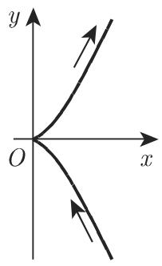

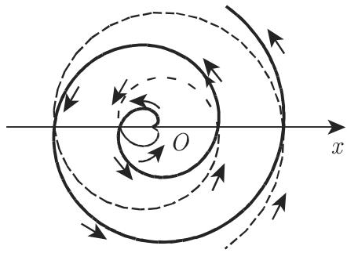
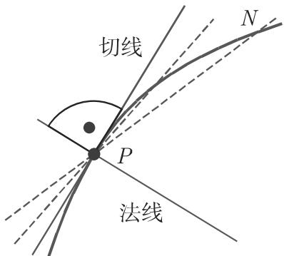

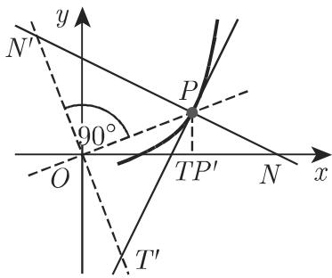
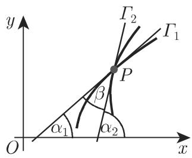

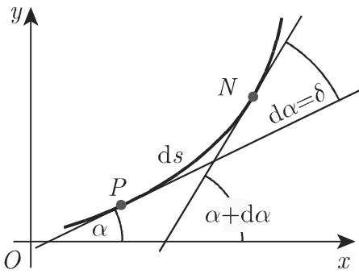
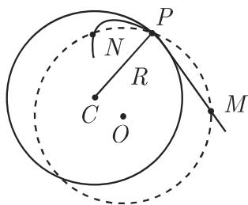

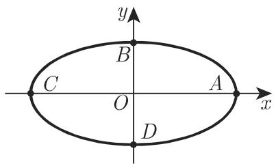

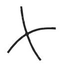
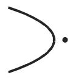

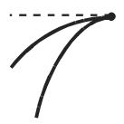

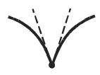
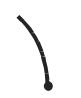

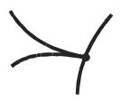

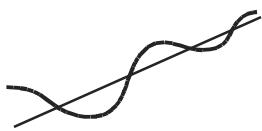
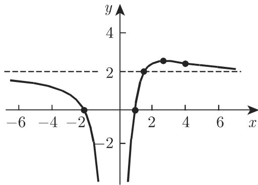

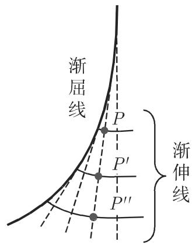
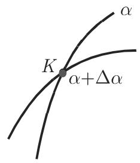

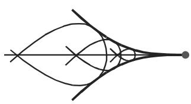

<!-- llm-wiki:embedded-images -->
