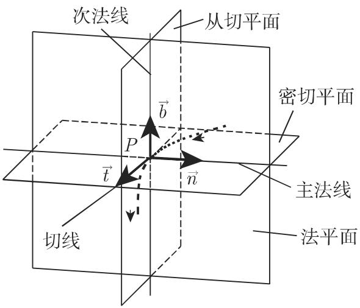
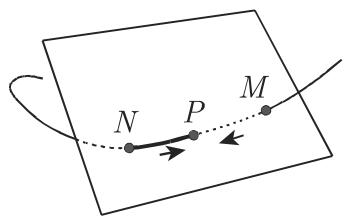
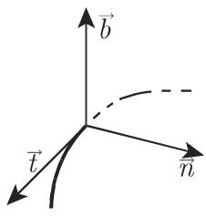
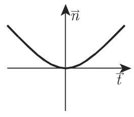
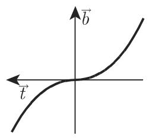
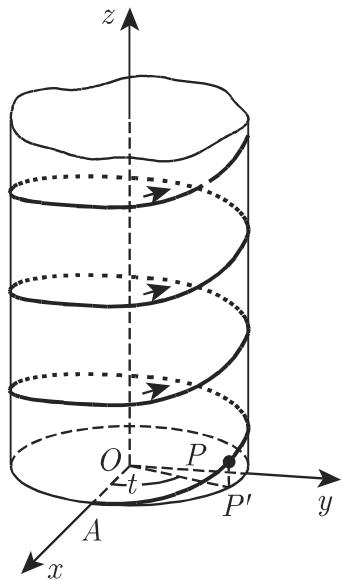

# 数学手册(原书第10版) 3.6.2 空间曲线

本页为《数学手册(原书第10版)》第 3.6 章（微分几何）3.6.2 节「空间曲线」的入库摘要，覆盖式 (3.523)–(3.543) 与表 3.27、表 3.28，主题为空间曲线的定义方式、活动三面形、曲率与挠率、弗雷内公式与达布向量。这是本 wiki 首次进入第 3.6 章：上一入库节 3.5.5 止于式 (3.482)，其后的式 (3.483)–(3.522) 属 3.6.1 平面曲线（未入库，缺口见 [[queries/3-6-1平面曲线未入库的依赖缺口]]）。

## 小节结构

- **3.6.2.1 空间曲线的定义方式**：两曲面交线 (3.523)、一般参数式 (3.524)、弧长参数式 (3.525a/b)、向量方程 (3.526)/(3.527) 与正方向约定。
- **3.6.2.2 活动三面形**：六要素定义与定向 (3.528)、曲线相对三面形的局部形态、隐式曲线的切线与法平面 (3.529)/(3.530)、一般参数下的六要素方程（表 3.27）与弧长参数下的简化方程（表 3.28）。
- **3.6.2.3 曲率和挠率**：曲率与曲率半径 (3.531)–(3.534)、螺旋线及其曲率算例 (3.535)、挠率与挠率半径 (3.536)–(3.539)、螺旋线挠率算例、弗雷内公式 (3.540)、达布向量与全曲率 (3.541)–(3.543)。

## 核心公式一览

- (3.523) 两曲面交线：$F(x,y,z)=0,\ \Phi(x,y,z)=0$
- (3.524) 一般参数式；(3.525a/b) 弧长参数式：$s=\int_{t_0}^{t}\sqrt{x'^2+y'^2+z'^2}\,\mathrm{d}t$
- (3.526)/(3.527) 向量方程 $\vec{r}=\vec{r}(t)$ 或 $\vec{r}(s)$，其中 $\vec{r}=x\vec{i}+y\vec{j}+z\vec{k}$
- (3.528) $\vec{b}=\vec{t}\times\vec{n}$
- (3.529)/(3.530) 隐式曲线的切线与法平面
- (3.531)–(3.534) 曲率 $K=\mathrm{d}\vec{t}/\mathrm{d}s$ 与曲率半径 $\rho=1/K$
- (3.535) 右手螺旋线 $x=a\cos t,\ y=a\sin t,\ z=bt\ (a>0,b>0)$
- (3.536)–(3.539) 挠率 $T=\mathrm{d}\vec{b}/\mathrm{d}s$ 与挠率半径 $\tau=1/|T|$
- (3.540) 弗雷内公式
- (3.541)–(3.543) 达布公式、达布向量 $\vec{d}=\frac{1}{\tau}\vec{t}+\frac{1}{\rho}\vec{b}$ 与全曲率 $\lambda=\sqrt{1/\rho^2+1/\tau^2}$

## 表 3.27 三面形要素的向量方程和坐标方程（逐字保留）

```markdown
| 向量方程 | 坐标方程 |
|---|---|
| **切线:** | |
| $\vec{R}=\vec{r}+\lambda\frac{\mathrm{d}\vec{r}}{\mathrm{d}t}$ | $\frac{X-x}{x'}=\frac{Y-y}{y'}=\frac{Z-z}{z'}$ |
| **法平面:** | |
| $(\vec{R}-\vec{r})\frac{\mathrm{d}\vec{r}}{\mathrm{d}t}=0$ | $x'(X-x)+y'(Y-y)+z'(Z-z)=0$ |
| **密切平面:** | |
| $(\vec{R}-\vec{r})\frac{\mathrm{d}\vec{r}}{\mathrm{d}t}\frac{\mathrm{d}^2\vec{r}}{\mathrm{d}t^2}=0^*$ | $\begin{vmatrix}X-x&Y-y&Z-z\\x'&y'&z'\\x''&y''&z''\end{vmatrix}=0$ |
| **次法线:** | |
| $\vec{R}=\vec{r}+\lambda\left(\frac{\mathrm{d}\vec{r}}{\mathrm{d}t}\times\frac{\mathrm{d}^2\vec{r}}{\mathrm{d}t^2}\right)$ | $\frac{X-x}{\left|\begin{array}{cc}y'&z'\\y''&z''\end{array}\right|}=\frac{Y-y}{\left|\begin{array}{cc}z'&x'\\z''&x''\end{array}\right|}=\frac{Z-z}{\left|\begin{array}{cc}x'&y'\\x''&y''\end{array}\right|}$ |
| **从切平面:** | |
| $(\vec{R}-\vec{r})\frac{\mathrm{d}\vec{r}}{\mathrm{d}t}\left(\frac{\mathrm{d}\vec{r}}{\mathrm{d}t}\times\frac{\mathrm{d}^2\vec{r}}{\mathrm{d}t^2}\right)=0^*$ | $\begin{vmatrix}X-x&Y-y&Z-z\\x'&y'&z'\\l&m&n\end{vmatrix}=0$，其中 $l=y'z''-y''z'$，$m=z'x''-z''x'$，$n=x'y''-x''y'$ |
| **主法线:** | |
| $\vec{R}=\vec{r}+\lambda\frac{\mathrm{d}\vec{r}}{\mathrm{d}t}\times\left(\frac{\mathrm{d}\vec{r}}{\mathrm{d}t}\times\frac{\mathrm{d}^2\vec{r}}{\mathrm{d}t^2}\right)$ | $\frac{X-x}{\left|\begin{array}{cc}y'&z'\\m&n\end{array}\right|}=\frac{Y-y}{\left|\begin{array}{cc}z'&x'\\n&l\end{array}\right|}=\frac{Z-z}{\left|\begin{array}{cc}x'&y'\\l&m\end{array}\right|}$ |

注：$\vec{r}$ 空间曲线的位置向量，$\vec{R}$ 活动三面形的位置向量。
＊关于三向量的混合积，参见第 249 页，3.5.1.6, 2.
```

## 表 3.28 三面形要素作为弧长函数的向量方程和坐标方程（逐字保留）

```markdown
| 三面形的要素 | 向量方程 | 坐标方程 |
|---|---|---|
| 主法线 | $\vec{R}=\vec{r}+\lambda\frac{\mathrm{d}^{2}\vec{r}}{\mathrm{d}s^{2}}$ | $\frac{X-x}{x''}=\frac{Y-y}{y''}=\frac{Z-z}{z''}$ |
| 从切平面 | $(\vec{R}-\vec{r})\frac{\mathrm{d}^{2}\vec{r}}{\mathrm{d}s^{2}}=0$ | $x''(X-x)+y''(Y-y)+z''(Z-z)=0$ |

注：$\vec{r}$ 空间曲线的位置向量，$\vec{R}$ 活动三面形的位置向量
```

## 主要算例：螺旋线的曲率与挠率

对右手螺旋线 (3.535)，曲率与挠率皆为常数：

$$K=\frac{a}{a^2+b^2},\quad \rho=\frac{a^2+b^2}{a},\quad T_R=\frac{b}{a^2+b^2},\quad \tau=\frac{a^2+b^2}{b},\quad T_L=-\frac{b}{a^2+b^2}$$

其中 $T_R$、$T_L$ 分别为右手、左手螺旋线的挠率。两组结果均经两条独立路径复算验证（弧长代换 $s=t\sqrt{a^2+b^2}$ 后走式 (3.533)/(3.538)，或直接走式 (3.534)/(3.539)，其中三阶行列式 $\det=a^2b$），且 $a,b>0$ 时 $T_R>0$ 与「T>0 右旋」的挠率符号约定相互印证。

## 与既有 wiki 的联系

- **回接 3.5.1 向量代数**：[[concepts/混合积]]（表 3.27 两处星号脚注回指第 249 页 3.5.1.6, 2）、[[concepts/向量积]] 与 [[concepts/二重向量积]]（次法线、主法线方向）、[[concepts/拉格朗日恒等式]]（式 (3.534) 分子即 $|\vec{r}'\times\vec{r}''|^2$）、[[concepts/特殊向量]]（向径，回指第 243 页 3.5.1.1, 6）、[[concepts/向量方程]]、[[concepts/右手系与左手系]]（三面形定向与左右螺旋线判别）。
- **回接 3.5.3 空间解析几何**：三直线要素的方程即 [[findings/直线五式与两种距离公式]] 的对称式（点向式）；三平面要素即 [[findings/平面九式与平面束]] 的点法式；(3.523) 两曲面交线定义衔接 [[findings/曲面曲线方程与柱面旋转面]]。
- **回接 3.5.2**：[[findings/椭圆理论公式组]] 中已出现平面曲线曲率，本节将其推广到空间曲线并新增挠率。

## 转写讹误与悬空回指

本节存在与 3.5.1–3.5.5 各节模式一致的系统性转写讹误（点符号 M、N、P 成片脱落，$\bar{n}$→「冗」，λ→「入」，「于」→「千」，「→」→「----+」，「挠率圆」措辞疑衍，两处残损语句），详见 [[queries/3-6-2全节转写讹误清单]]；定义式 (3.531)/(3.536) 的记号张力见 [[queries/式3-531与3-536的定义记号是否为角度增量且K取模T带号]]。

## 本节派生页面

- 概念：[[concepts/空间曲线]]、[[concepts/活动三面形]]、[[concepts/切线]]、[[concepts/法平面]]、[[concepts/密切平面]]、[[concepts/主法线]]、[[concepts/次法线]]、[[concepts/从切平面]]、[[concepts/弧长参数]]、[[concepts/曲率]]、[[concepts/挠率]]、[[concepts/弗雷内公式]]、[[concepts/达布向量]]、[[concepts/螺旋线]]
- 发现：[[findings/空间曲线三种定义与弧长参数]]、[[findings/活动三面形六要素与局部三投影形态]]、[[findings/隐式曲线切线与法平面方程]]、[[findings/三面形六要素向量与坐标方程]]、[[findings/弧长参数下主法线与从切平面简化方程]]、[[findings/曲率定义与两种参数公式]]、[[findings/螺旋线曲率算例]]、[[findings/挠率定义公式与符号约定]]、[[findings/螺旋线挠率算例]]、[[findings/弗雷内公式与达布向量及全曲率]]
- 方法：[[methodology/活动三面形要素方程的构造与参数选择流程]]
- 比较：[[comparisons/任意参数与弧长参数三面形方程比较]]、[[comparisons/曲率与挠率比较]]
- 疑问：[[queries/3-6-2全节转写讹误清单]]、[[queries/式3-531与3-536的定义记号是否为角度增量且K取模T带号]]、[[queries/3-6-1平面曲线未入库的依赖缺口]]

<!-- llm-wiki:embedded-images -->
## Embedded Images

### Document










<!-- llm-wiki:embedded-images -->
