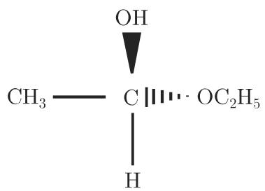
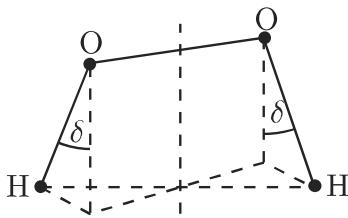

# 数学手册(原书第10版) 5.3.5 群的应用

本节是 [[sources/10-数学手册原书第10版--5-533-群--1q86d70]]（5.3.3 群）的应用续篇：在化学和物理学中，群被用来刻画相应个体（分子、晶体、固体结构或量子力学系统）的“对称性”。全节由一条公理式的纲领原理统领——**冯·诺伊曼原理**（原文无证明，仅作归属，见 [[concepts/冯-诺伊曼原理]]）：

> 如果一个系统有某个对称运算群，那么这个系统的每个物理观察量必有相同的对称性。

## 节结构

- **5.3.5.1 对称运算、对称元素**：Schoenflies 记号（$C_n$、$\sigma_h/\sigma_v/\sigma_d$、$S_n$、$i$），见 [[concepts/对称运算与对称元素]]。
- **5.3.5.2 对称群或点群**：对称运算成群，式 (5.121)–(5.123)，见 [[concepts/点群]]。
- **5.3.5.3 分子的对称运算**：无轴→恰一轴→多轴的分类决策树与成组同构断言，见 [[entities/分子点群]]、[[methodology/分子对称群确定流程]]。
- **5.3.5.4 晶体学中的对称群**：格结构、平移群、14 布拉维格、32 晶体学点群、230 空间群、7 晶体系，见 [[concepts/平移群]]、[[entities/布拉维格]]、[[entities/晶体学点群]]、[[entities/空间群]]、[[entities/晶体系]]。
- **5.3.5.5 量子力学中的对称群**：对称性导致能级退化与群表示，式 (5.129)–(5.133)，见 [[concepts/量子力学中的对称群]]。
- **5.3.5.6 群论在物理学中的其他应用**：U(1) 至 SU(5)（GUT）的李群应用清单，见 [[findings/物理学李群应用一览]]。

## 对称运算与对称元素（5.3.5.1）

空间个体的**对称运算**是空间到自身的映射，保持线段长度不变并将个体变到与自身相适应的位置；其不动点集合 $\operatorname{Fix}(S)$ 称为 $S$ 的**对称元素**。Schoenflies 记号用于表示对称运算（原文译名「申弗利斯／申弗莱斯」前后不一）。

对称元素分两类：**无不动点运算**（如平移；对有界的空间个体不可能出现）与**至少有一个不动点的运算**：

1. 绕轴旋转角 $\varphi=2\pi/n$：旋转轴与旋转本身记作 $C_n$，轴称 $n$ 阶（原文「称作 阶的」脱落 $n$）；
2. 对平面的反射 $\sigma$：垂直于（画成直立的）主旋转轴的反射平面记 $\sigma_h$（horizontal），过轴的反射平面记 $\sigma_v$（vertical）或 $\sigma_d$（dihedral，平分某些角）；
3. 非正常正交映射 $S_n$：旋转 $C_n$ 后紧接 $\sigma_h$；旋转与反射交换，轴称 $n$ 阶非正常旋转轴（实施 $S_n$ 时只有对称中心不变）。$n=2$ 时为点反射／反演，记 $i$（参见原书 4.3.5.1，未入库）。

## 点群（5.3.5.2）

对每个对称运算 $S$ 存在逆运算 $S^{-1}$（把 $S$ 的作用“返回”；原文此处讹作“$S^{\epsilon}$ 返回”），使

$$SS^{-1} = S^{-1}S = \epsilon, \tag{5.121}$$

其中 $\epsilon$ 为保持整个空间不变的恒等运算。一族空间个体的对称运算对相继实施形成（一般非交换的）对称群。原文另给出四条乘积关系：

- a) 每个旋转是两个反射之积；两个反射平面的交是旋转轴。
- b) 两个反射 $\sigma,\sigma‘$ 当且仅当反射平面恒同或互相垂直时可交换：

$$\sigma\sigma' = \sigma'\sigma, \tag{5.122}$$

  （平面恒同时积为 $\epsilon$，互相垂直时积为 $C_2$。）
- c) 旋转轴相交的两个旋转之积仍是旋转，其轴通过两给定轴的交点。
- d) 旋转轴相同或互相垂直的两个 $C_2$ 旋转可交换：

$$C_2 C_2' = C_2' C_2. \tag{5.123}$$

## 分子对称群分类（5.3.5.3）

原文按「无旋转轴 → 恰一个旋转轴（三情形）→ 多个旋转轴」给出决策树（详见 [[methodology/分子对称群确定流程]]、[[findings/分子对称群分类决策树与同构类型]]、[[entities/分子点群]]）：

1. **无轴**：无任何对称元素 → $G=\{\epsilon\}$（例：半缩醛〔原文讹作“半乙缩酪”〕，非平面，有 3 个不同的原子群〔原文脱「3」〕）；若 $\sigma$ 是反射或 $i$ 是反演（原文两处脱符号）→ $C_s=\{\epsilon,\sigma\}$ 或 $C_i=\{\epsilon,i\}$，均 $\cong\mathbb{Z}_2$（例：酒石酸可对中心反射）。
2. **恰一轴**：
   - a) $C_\infty$（可旋转任意角度，分子长条形，群无限）：无水平反射 → $C_{\infty v}$（NaCl）；有水平反射 → $D_{\infty h}$（O₂）。
   - b) 轴为 $n$ 阶 $C_n$、非 $2n$ 阶非正常轴：$G=\langle d\rangle\cong\mathbb{Z}_n=:C_n$（$d$ 为绕轴转角 $2\pi/n$ 的旋转；原文作“$\pi/n$”，疑脱「2」，见 [[queries/cn生成旋转转角是否脱落2]]）；加垂直反射 $\sigma_v$ → $\langle d,\sigma_v\rangle\cong D_n=:C_{nv}$（H₂O $\cong D_2\cong V_4$）；加水平反射 $\sigma_h$ → $\langle d,\sigma_h\rangle\cong\mathbb{Z}_n\times\mathbb{Z}_2=:C_{nh}$，$n$ 奇时循环（H₂O₂ 在 $0<\delta<\pi/2$、$\delta=0$、$\delta=\pi/2$ 时出现阶的三种情形〔原文脱「3」〕）。
   - c) 轴为 $n$ 阶 $C_n$ 且兼为 $2n$ 阶非正常轴：无垂直反射 → $G\cong\mathbb{Z}_{2n}=:S_{2n}$（例：四羟基丙二烯 $C_3(OH)_4$〔原文讹作“四胫基”“$C_3(OH)_{\div}$”〕）；有垂直反射 → $4n$ 阶群 $D_{2n}$（$n=2$ 得 $D_4$，即 8 阶二面体群〔原文脱「8」〕，例：丙二烯）。
3. **多轴（$n\geqslant 3$）**：四面体群 $T_d\cong S_4$（$\operatorname{ord}T_d=24$，例：甲烷〔原文讹作“甲烧”〕）；八面体群 $O_h\cong S_4\times\mathbb{Z}_2$（$\operatorname{ord}O_h=48$）；二十面体群 $I_h$（$\operatorname{ord}I_h=120$，同构类型原文未给出）。这些是正多面体的对称群（参见原书 3.3.3，未入库），见 [[entities/多面体群-td-oh-ih]]。

## 晶体学中的对称群（5.3.5.4）

### 格结构与平移群

基本（单位）胞腔由从一个格点出发的 3 个不共面基向量 $\vec a_i$（$i=1,2,3$；原文脱「3」）确定；实施所有本原平移 $\vec t_{\pmb n}$ 产生无限几何格结构：

$$\vec t_{\pmb n} = n_1\vec a_1 + n_2\vec a_2 + n_3\vec a_3,\quad \pmb n=(n_1,n_2,n_3),\ n_i\in\mathbb{Z}; \tag{5.124}$$

全体格向量平移构成平移群 $T$：元素 $T(\vec t_{\pmb n})$，逆 $T^{-1}(\vec t_{\pmb n})=T(-\vec t_{\pmb n})$，合成律 $T(\vec t_{\pmb n})*T(\vec t_{\pmb m})=T(\vec t_{\pmb n}+\vec t_{\pmb m})$，作用于位置向量：

$$T(\vec t_{\pmb n})\,\vec r = \vec r + \vec t_{\pmb n}. \tag{5.125}$$

### 布拉维格

按基向量相对长度与夹角（特别地 $90^\circ$ 与 $120^\circ$）的可能组合得 7 种本原胞腔（表 5.4 原样），借助 7 个非本原基本胞腔（面／体对角线交点处增加格点，保持基本胞腔对称性；单侧面中心化、体中心化、全侧面中心化）扩充为 **14 种布拉维格**（见 [[entities/布拉维格]]）。

**表 5.4 本原布拉维格（原样收录）**

| 基本胞腔 | 基向量长度关系 | 基向量夹角 |
|---|---|---|
| 三斜晶 | $a_1 \neq a_2 \neq a_3$ | $\alpha \neq \beta \neq \gamma \neq 90^\circ$ |
| 单斜晶 | $a_1 \neq a_2 \neq a_3$ | $\alpha = \gamma = 90^\circ \neq \beta$ |
| 菱形晶 | $a_1 \neq a_2 \neq a_3$ | $\alpha = \beta = \gamma = 90^\circ$ |
| 三角晶 | $a_1 = a_2 = a_3$ | $\alpha = \beta = \gamma < 120^\circ (\neq 90^\circ)$ |
| 六方晶 | $a_1 = a_2 \neq a_3$ | $\alpha = \beta = 90^\circ, \gamma = 120^\circ$ |
| 正方晶 | $a_1 = a_2 \neq a_3$ | $\alpha = \beta = \gamma = 90^\circ$ |
| 立方晶 | $a_1 = a_2 = a_3$ | $\alpha = \beta = \gamma = 90^\circ$ |

（注：「菱形晶」行数据对应通常所称正交晶 orthorhombic，「三角晶」行对应菱方／三方 rhombohedral——译名疑错位，见 [[queries/表5-4菱形晶与三角晶译名是否错位]]；表 5.4 与表 5.5 的三角／六方行序亦不同。）

### 晶体学点群

并非所有点群都是晶体学点群：群元素对格向量的作用必须保持格点封闭，即

$$P = \{R:\ R\,\vec t_{\pmb n}\in L\},\quad \vec t_{\pmb n}\in L, \tag{5.126}$$

其中 $L$ 为所有格点的集合，$R$ 为真旋转算子（$R\in\mathrm{SO}(3)$）或非正常旋转算子（$R=IR'\in O(3)$，$R'\in\mathrm{SO}(3)$，$I$ 为反演算子 $I\vec r=-\vec r$；原文「0(3)」为 $O(3)$ 之讹、「其中 表示真旋转算子」脱 $R$）。仅 $n=1,2,3,4,6$ 重旋转轴与格结构相容，故共有 **32 个晶体学点群**（见 [[entities/晶体学点群]]）。

### 空间群

空间格的对称群还可含同时表示旋转与本原平移作用的算子：**滑动反射**（平面反射＋平行于该平面的平移）与**螺旋式旋转**（旋转 $2\pi/n$ 并平移 $m\vec a/n$，$m=1,\dots,n-1$）——统称**非本原平移** $\vec V(R)$（“分数”平移）。使晶体格不变的空间群 $G$ 的元素由晶体学点群 $P$、本原平移 $T(\vec t_{\pmb n})$ 及非本原平移 $\vec V(R)$ 组成：

$$G = \bigl\{\{R \mid \vec V(R) + \vec t_{\pmb n}\}:\ R\in P,\ \vec t_{\pmb n}\in L\bigr\}; \tag{5.127}$$

单位元为 $\{e\mid 0\}$；$\{e\mid\vec t_{\pmb n}\}$ 表示本原平移，$\{R\mid 0\}$ 表示旋转或反射。作用于位置向量：

$$\{R \mid \vec t_{\pmb n}\}\,\vec r = R\,\vec r + \vec t_{\pmb n}. \tag{5.128}$$

由 14 个布拉维格、32 个晶体点群与容许的非本原平移可构造 **230 个空间群**（见 [[entities/空间群]]）。

### 晶体系（全对称）

32 个晶体点群对应 32 个晶体类；其中有 7 个群不是其他点群的子群、却含其他点群作为子群，每一个构成一个**晶体系（全对称）**，其对称性反映在 14 个布拉维格的对称性中（原文多处脱数字「7」「14」）。

**表 5.5 布拉维格、晶体系及晶体类（原样收录；表题原文作“布拉瓦格”）**

| 格型 | 晶体系（全对称） | 晶体类 |
|---|---|---|
| 三斜晶 | $C_i$ | $C_1, C_i$ |
| 单斜晶 | $C_{2h}$ | $C_2, C_h, C_{2h}$ |
| 菱形晶 | $D_{2h}$ | $C_{2v}, D_2, D_{2h}$ |
| 正方晶 | $D_{4h}$ | $C_4, S_4, C_{4h}, D_4, C_{4v}, D_{2d}, D_{4h}$ |
| 六方晶 | $D_{6h}$ | $C_6, C_{3h}, C_{6h}, D_6, C_{6v}, D_{3h}, D_{6h}$ |
| 三角晶 | $D_{3d}$ | $C_3, S_6, D_3, C_{3v}, D_{3d}$ |
| 立方晶 | $O_h$ | $T, T_h, T_d, O, O_h$ |

记号（原样）：$C_n$ 绕 $n$ 重旋转轴的旋转（原文「绕 $_n$ 重」脱 $n$），$D_n$ 二面体群，$T_n$ 四面体群，$O_n$ 八面体群，$S_n$ $n$ 重轴的镜旋转（原文作“n-n 重”）。单斜行的 $C_h$ 为非标准 Schoenflies 符号，疑应为 $C_s$（见 [[queries/表5-5单斜体类ch是否应为cs]]）。

空间群 (5.127) 是“空”格的对称群；真实晶体将原子／离子排列在格位上，其排列显示自身对称性，故一般真实晶体的对称群 $G_0$ 有 $G\supset G_0$（对称性较低）。

## 量子力学中的对称群（5.3.5.5）

保持量子力学系统哈密顿算子 $\hat H$（参见原书 9.2.4，未入库）不变的线性坐标变换构成对称群，其元素 $g$ 与 $\hat H$ 交换：

$$[g,\hat H] = g\hat H - \hat H g = 0,\quad g\in G; \tag{5.129}$$

由此算子作用顺序任意：

$$g(\hat H\varphi) = \hat H(g\varphi); \tag{5.130}$$

若 $\varphi_{E_\alpha}$（$\alpha=1,\dots,n$）是 $\hat H$ 的具有 $n$ 重退化的能量特征值的特征态：

$$\hat H\,\varphi_{E_\alpha} = E\,\varphi_{E_\alpha}\quad(\alpha=1,2,\dots,n), \tag{5.131}$$

则变换态 $g\varphi_{E_\alpha}$ 也是属于相同特征值 $E$ 的特征态：

$$g\hat H\varphi_{E_\alpha} = \hat H g\varphi_{E_\alpha} = E\,g\varphi_{E_\alpha}; \tag{5.132}$$

于是可写成特征态的线性组合：

$$g\,\varphi_{E_\alpha} = \sum_{\beta=1}^{n} D_{\beta\alpha}(g)\,\varphi_{E_\beta}. \tag{5.133}$$

结论：特征态 $\varphi_{E_\alpha}$ 形成对称群 $G$ 的表示 $D(G)$ 的 $n$ 维表示空间的基（原文行文称表示矩阵为 $D_{\alpha\beta}(g)$，与式 (5.133) 的 $D_{\beta\alpha}(g)$ 指标顺序不一致）；**如果不存在“隐藏的”对称性，这个表示是不可约的**（条件性断言）。能量特征态可用哈密顿对称群不可约表示的符号差作为标志；选择法则遭摄动破坏时退化能量水平分裂。详见 [[concepts/量子力学中的对称群]]、[[findings/对称性能级退化与群表示论证]]。

## 群论在物理学中的其他应用（5.3.5.6）

原文以清单形式引述特殊连续群（李群）的应用：U(1)（电动力学，原文作“度规变换”疑为“规范变换”之讹）、SU(2)（自旋与同位旋）、SU(3)（重子介子分类、核多体问题）、SO(3)（角动量代数）、SO(4)（氢光谱退化）、SU(4)（Wigner 超多重谱线、味多重谱线）、SU(6)、U(n)、SU(2)⊗U(1)（电弱标准模型）、SU(5)⊃SU(3)⊗SU(2)⊗U(1)（GUT）。完整清单与讹误复原注记见 [[findings/物理学李群应用一览]]。SU(n)、SO(n) 是李群（连续群），参见原书 5.3.6（未入库）。

## 插图（媒体文件）

- 图 5.11 半缩醛分子的立体化学记号（说明句原文残缺）：
- 图 5.12 酒石酸分子（反演中心）：
- 图 5.13 过氧化氢 H₂O₂（δ 三情形）：
- 图 5.14 四羟基丙二烯 $C_3(OH)_4$：
- 图 5.15 丙二烯：
- 图 5.16 甲烷（$T_d$）：
- 图 5.17 基本胞腔与格：

## 转写讹误与存疑

本节转写讹误密度较高，延续 5.1–5.3 各节模式（见 [[queries/5-3全节系统性转写讹误清单]]）：系统性脱字脱数、OCR 讹形（「九」「叶」「『」「f3)」「o)」「U(l)」「S0(3)」「SU J(5)」「®」等）、化学名讹误（甲烧→甲烷、四胫基→四羟基、半乙缩酪→疑为半缩醛）、译名不一致（申弗利斯/申弗莱斯、布拉维/布拉瓦）。主清单见 [[queries/5-3-5全节系统性转写讹误清单]]。

## 依赖与交叉引用

- **前驱（已入库）**：5.3.3 群（[[sources/10-数学手册原书第10版--5-533-群--1q86d70]]；文中“参见 5.3.3.1／5.3.3.2”的交叉引用指向该节内容，如 [[entities/二面体群dn]]、[[concepts/群的直积]]、[[entities/克莱因四元群]]）。
- **未入库依赖**：5.3.4（在 5.3.3 与 5.3.5 之间缺失）、5.3.6（李群）、3.3.3（正多面体，图 3.63）、9.2.4（哈密顿算子）、4.3.5.1（反演）、文献 [5.14]–[5.27]，见 [[queries/5-3-4与5-3-6等未入库依赖缺口]]。

<!-- llm-wiki:embedded-images -->
## Embedded Images

### Document

<!-- llm-wiki:embedded-images -->
