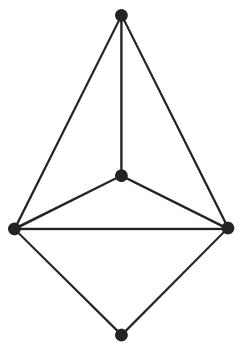
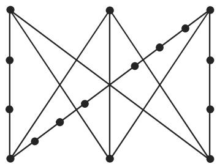

# 数学手册(原书第10版) 5.8.5 可平面图

本页是《数学手册(原书第10版)》5.8「图论算法」（父源 [[10-数学手册原书第10版--7-58-图论算法--wf3s74]]）第五小节「可平面图」的入库页。本节紧接 5.8.4 匹配（[[10-数学手册原书第10版--6-584-匹配--fcxne8]]），图号 5.56–5.59 与前节图 5.55 连续衔接。全节为手册式「定义—判例—定理」结构：四个编号部分、五项断言，均无证明、无算例；唯一成果性内容是 [[库拉托夫斯基定理]]（细分版刻画）。

## 章节结构

1. **可平面图** — 平面图/可平面图定义对与 G₁/G₂ 判例（图 5.56–5.57）→ [[可平面图]]
2. **非可平面图** — [[完全图k5]] 与 [[完全二部图k33]] 的非可平面断言 → [[k5与k33非可平面断言]]
3. **细分** — 细分定义与自反性，图 5.58/5.59 → [[细分]]、[[细分定义与自反性]]
4. **库拉托夫斯基 (Kuratowski) 定理** — 非可平面图的细分刻画 → [[库拉托夫斯基定理细分刻画]]

## 原文逐字转录

保真转录（含全部转写讹误，清单见 [[5-8-5全节系统性转写讹误清单]]）。数学记号保留源文件中的 LaTeX 形式；［…］为图像占位标记，图版见下节。

```text
#### 5.8.5 可平面图

因为有向图是可平面图，当且仅当相应的无向图是可平面图所以我们在此限千考虑无向图

1. 可平面图

称为平面图，当且仅当 可以画在一个平面上，并且它的边仅在 的顶

点相交．与平面图同构的图称作可平面图．

5.56 给出平面图 $G _ { 1 }$ 5.57 中的图 $G _ { 2 }$ 同构千 $G _ { 1 }$ ，它不是平面图，但是一个可平面图，因为它与 $G _ { 1 }$ 同构．

［图 5.56：平面图 G₁］［图 5.57：图 G₂］

2. 非可平面图

完全图 $K _ { 5 }$ 和完全二部图 $K _ { 3 , 3 }$ 是非可平面图

3. 细分

如果将二次顶点插入 的边中，那么我们就可得到图 的一个细分．每个图都是它自身的细分．图 5.58 和图 5.59 给出 $K _ { 5 }$ 和 $K _ { 3 , 3 }$ 的某些细分．

［图 5.58：K₅ 的某些细分］［图 5.59：K₃,₃ 的某些细分］

4. 库拉托夫斯基 (Kuratowski) 定理

一个图是非可平面的，当且仅当它含有一个子图是完全二部图 $K _ { 3 , 3 }$ 或完全图$K _ { 5 }$ 的细分
```

## 五项断言

1. **归约断言**：有向图是可平面图，当且仅当相应的无向图是可平面图；据此本节只考虑无向图（「限千考虑」为「限于考虑」之讹）。
2. **定义对与判例**：平面图＝「（G）可以画在一个平面上，并且它的边仅在（G 的）顶点相交」的图（转写中图符号 G 脱落）；可平面图＝与平面图同构的图。判例：G₂（图 5.57）同构于平面图 G₁（图 5.56），「它不是平面图，但是一个可平面图，因为它与 G₁ 同构」→ [[g1与g2同构判例图5-56-5-57]]。
3. **非可平面断言**：「完全图 K₅ 和完全二部图 K₃,₃ 是非可平面图」，分别归属两图，不得互移 → [[k5与k33非可平面断言]]。
4. **细分定义与自反性**：将 2 次顶点（转写作「二次顶点」）插入图的边中可得原图的一个细分；「每个图都是它自身的细分」→ [[细分定义与自反性]]。
5. **库拉托夫斯基定理**：「一个图是非可平面的，当且仅当它含有一个子图是完全二部图 K₃,₃ 或完全图 K₅ 的细分」→ [[库拉托夫斯基定理细分刻画]]。

## 图版






图 5.58/5.59 与 K₅/K₃,₃ 的对应按正文「图 5.58 和图 5.59 给出 K₅ 和 K₃,₃ 的某些细分」的语序推定；四图的具体结构（顶点、边、画法）有待比对图像文件后核实。

## 证据强度与局限

- 五项断言均为标准图论结果，外部文献可独立验证，整体可靠性高；但**本源内部零证明、零推导**（手册体裁）。
- 判例 G₁/G₂ 与图 5.58/5.59 的内容依赖图像，转写文本本身无法自证。
- 定义句动词「可以画在」与判例「G₂ 不是平面图」存在内部张力，已立 [[平面图定义可以画在与g2判例矛盾]] 待核。
- 本节无表格、无公式编号、无结构化数据；需保真的是定义句与定理句，已逐字转录如上。

## 与既有 wiki 内容的关系

- **扩展**：[[完全图]] 与 [[二部图与完全二部图]] 此前仅含一般定义，本源首次赋予 K₅、K₃,₃ 非可平面性实质断言（由 [[完全图k5]]、[[完全二部图k33]] 分别承载）。
- **强化**：[[图的同构]]——「同构保持可平面性」的具体应用（G₂ 判例）。
- **引用**：[[子图导出子图部分图与因子]]（定理中的「子图」）、[[顶点次数与正则图]]（「2 次顶点」）、[[图与关联函数]]（有向/无向图框架，支撑开头归约）。
- 5.8.1–5.8.4 已入库；与既有内容无冲突。

<!-- llm-wiki:embedded-images -->
## Embedded Images

### Document


<!-- llm-wiki:embedded-images -->
