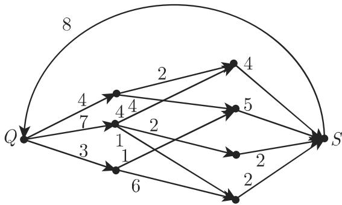
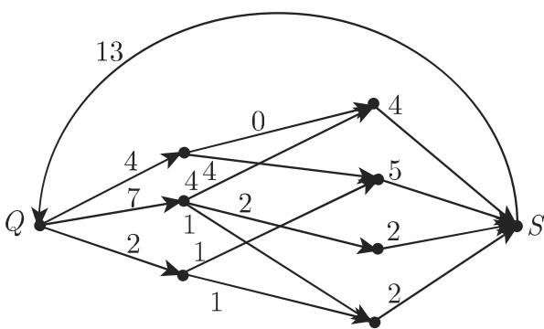

# 数学手册(原书第10版) 5.8.7 运输网络

《数学手册（原书第10版）》5.8「图论算法」章的第七小节，也是本 wiki 首次收录的流论（网络流）内容。全节由三部分组成：运输网络的定义（含流、流的强度、容量相容性与极大流，式 5.325a–b）；福特 (Ford)－富尔克森 (Fulkerson) 极大流标号算法（步骤 a–c 与终止判定）；以及三个图示——图 5.62 的容量网络、图 5.63 中强度 13 的极大流算例、图 5.64 的供求可行性模型。本节是 5.8 章继克鲁斯卡尔算法（5.8.3）、丹齐格算法（5.8.6）之后收录的第三个具名图算法。福特与富尔克森在本节中仅作算法冠名出现，无生平信息。

## 内容结构

1. **运输网络**：连通有向图 + 加标号顶点 Q（源点）、S（汇点）+ 弧容量指派；流、流的强度、容量相容性的定义。
2. **福特－富尔克森极大流算法**：通过给顶点标号判定给定的相容流是否极大，并给出可改进量 ε(S)。
3. **图示**：图 5.62（容量网络，权紧贴边写）、图 5.63（强度 13 的相容流，断言为极大流）、图 5.64（供求模型三层图）。

## 定义部分（逐字转录）

转录文本残缺严重（内联符号脱落、乱码），以下为原文公式与关键定义的逐字保留（[?] 与 [G] 为标注的脱落符号）：

```
运输网络：一个连通有向图称为运输网络，如果它有两个加标号的顶点 Q（称为源点）和 S（称为汇点），具有下列性质：
a) 存在一条从 Q 的弧 u₁，其中 u₁ 是仅有的以 [?] 为始点及仅有的以 Q 为终点的弧
b) 每个与 u₁ 不同的弧 uᵢ 被指派一个实数 c(uᵢ) ⩾ 0。这个数称为它的容量。弧 u₁ 有容量 ∞。

流：若函数 φ 对每条弧指派一个实数，并且对于每个顶点 v，等式
    Σ_{(u,v)∈G} φ(u,v) = Σ_{(v,w)∈G} φ(v,w)        (5.325a)
成立，则称它为 [G] 上的流。将和
    Σ_{(Q,v)∈G} φ(Q,v)                             (5.325b)
称为流的强度。如果对于 [G] 的每条弧 uᵢ 有 0 ⩽ φ(uᵢ) ⩽ c(uᵢ)，那么称 φ 是与容量相容的。
```

定义 a) 中始点符号脱落，且「从 Q 的弧 u₁」与「仅有的以 Q 为终点的弧」方向矛盾——重构假设 u₁ = (S,Q) 为 S→Q 回弧，属**假设而非定论**，追踪见 [[queries/运输网络定义弧u1是否为s到q回弧]]。原文另有一条交叉引用「关于运输网络的例子，见 553 页」，该页码落在本章页码区间（约 581–587）之外，疑指向书中别处或德文原版页码。

## 算法部分

手册表述：「应用极大流算法我们可以确认给定的流 φ 是否极大。[G] 是运输网络，φ 是与容量相容的强度为 v₁ 的流。下面给出的算法包含给顶点标号后的步骤，以及完成这些步骤后我们可以了解基于所选取的标号步骤有多少流的强度可以改进。」

步骤 a–c（[ ] 内为补回的脱落符号）：

```
a) 对源点 [Q] 标号，并令 ε(Q) = ∞
b) 如果存在弧 uᵢ = (x, y)，其中 [x] 被标号而 [y] 未标号，并且 φ(uᵢ) < c(uᵢ)，
   那么给 [y] 标号，并且令 ε(y) = min{ε(x), c(uᵢ) − φ(uᵢ)}，
   然后重复步骤 b)，不然实施步骤 c)。
c) 如果存在弧 uᵢ = (x, y)，其中 [x] 未标号而 [y] 被标号，并且 φ(uᵢ) > 0 以及 uᵢ ≠ u₁，
   那么给 [x] 标号，令 ε(x) = min{ε(y), φ(uᵢ)}，
   并返回继续实施步骤 b)（如果此步骤可行），不然算法结束。
判定：若 [G] 的汇点 [S] 被标号，那么 [G] 中的流可以改进适当的量 ε(S)。
     如果汇点未被标号，那么这个流是极大的。
```

完整流程与符号重构讨论见 [[methodology/福特-富尔克森标号算法流程]]，算法整体介绍见 [[entities/福特-富尔克森算法]]。

## 算例与供求模型

**图 5.62–5.63（极大流算例）**。原文：「极大流：对于图 5.62 中的图，权是紧贴着边写的。图 5.63 中的加权图给出一个与这些容度相容的强度 13 的流。它是一个极大流。」（「容度」为「容量」之讹。）仅为断言，图像内容未解析，无法从转录复核，见 [[findings/图5-62-5-63强度13极大流算例]]。





**图 5.64（供求模型）**。某种产品由 p 个企业 F₁,…,F_p 生产，有 q 个用户 V₁,…,V_q。参数记号：

| 记号 | 含义 |
|---|---|
| F₁, F₂, …, F_p | p 个生产企业 |
| V₁, V₂, …, V_q | q 个用户 |
| s_i | F_i 在该期间生产的产品数量（单位） |
| t_j | V_j 需要的产品数量（单位） |
| c_ij | 该期间可由 F_i 向 V_j 运送的产品数量（单位） |

原文提出的问题：「在此期间是否可能满足所有要求？对应的图见图 5.64。」手册只设问并给图，未明说判定准则，见 [[concepts/供求可行性的极大流模型]] 与 [[findings/供求可行性极大流模型图5-64]]。


## 转录质量

本节转录存在与 5.8.1–5.8.6 各节一致的系统性 OCR 讹误（完整清单见 [[queries/5-8-7全节系统性转写讹误清单]]）：

- 「于」系统性误转为「千」：如「对千每个顶点」「关千运输网络」「基千所选取的标号步骤」「极大流对千图 5.62」。
- 「容量」误作「容度」：「与这些容度相容」。
- 衍字与乱码：「生产织 s_i」「称 φ 中是」「并且中 φ(uᵢ) > 0」的孤立「中」字、两处多余「｝」、「$\vec{\cal P}$」乱码及词序错乱、「$Q\iota$」乱码。
- 大量内联符号（Q、S、G、x、y）脱落，包括算法前提句「[G] 是运输网络」的主语。
- 定义 a) 中弧 u₁ 的方向表述自相矛盾。

## 论证缺口与注意事项

- 终止判定「汇点未标号 ⇒ 流是极大的」未给出证明；本节未陈述也未证明极大流-极小割定理。
- 图 5.63 的强度 13 与极大性断言未经复核。
- 本节以供求问题设问收尾，原文是否有后续解算文字不明（完整性存疑）。
- 手册「回弧 u₁ + 守恒对所有顶点成立」的表述与通行教科书「仅中间顶点守恒、无回弧」的表述不同，未来入库他源时须注意区分（见 [[concepts/流与流的强度]]）。

## 与其他页面的联系

- 章节序列：[[sources/10-数学手册原书第10版--7-58-图论算法--wf3s74]]；5.8.1–5.8.4、5.8.6 已入库，5.8.5 仍缺（[[queries/5-8-5未入库缺口]]）。
- 概念依赖：[[concepts/图与关联函数]]（有向图）、[[concepts/连通与强连通]]、[[concepts/加权图]]（容量即权）、[[concepts/有向链]]（标号通路的通路基础）。
- 算法家族：与 [[entities/丹齐格算法]]、[[entities/克鲁斯卡尔算法]] 并列，见 [[comparisons/克鲁斯卡尔-丹齐格-福特-富尔克森算法比较]]。

<!-- llm-wiki:embedded-images -->
## Embedded Images

### Document


<!-- llm-wiki:embedded-images -->
