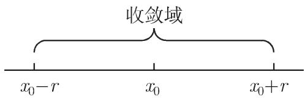

# 数学手册(原书第10版) 7.3 函数项级数

《数学手册（原书第10版）》第 7 章第 3 节，系统阐述函数项级数理论：先给出定义组（收敛域、和函数、余项），随后以「N 是否与 x 无关」为核心区分一致收敛与非一致收敛并引入魏尔斯特拉斯审敛法；在此基础上展开全书最重要的函数项级数——幂级数（三情形定理、收敛半径、阿贝尔定理、幂级数运算与反级数、泰勒级数与麦克劳林级数），给出常用近似公式表（表 7.3），最后引入渐近幂级数以处理 |x| 较大时的函数值计算。本节是第 6 章微分学向无穷级数的自然延伸：有限泰勒公式（[[泰勒定理]]，式 6.31）在此被无穷化为泰勒级数（式 7.95–7.97），并新增积分余项形式。

本源为中文转写版，存在系统性 OCR 讹误（汇总见 [[7-3全节系统性转写讹误清单]]）。关键计算性论断（幂级数运算系数、反级数系数、表 7.3 容许区间、渐近级数数值）已经独立复算，绝大多数通过；异常点已定位（式 7.82b 的条件张力、表 7.3 的 0.451 勘误）。

## 内容结构

| 小节 | 内容 | 关键公式 |
|---|---|---|
| 7.3.1 | 定义：函数项级数、部分和、收敛域、和、余项 | 式 7.74–7.78 |
| 7.3.2.1 | 一致收敛 / 非一致收敛定义、两个算例、魏尔斯特拉斯审敛法 | 式 7.79–7.81 |
| 7.3.2.2 | 一致收敛级数的性质：连续性、逐项积分与逐项微分 | 式 7.82a–b |
| 7.3.3.1 | 幂级数定义、三情形定理、收敛半径、阿贝尔定理 | 式 7.83–7.85 |
| 7.3.3.2 | 幂级数的计算：和与积、方幂、商、反级数 | 式 7.86–7.94 |
| 7.3.3.3 | 泰勒级数展开式、麦克劳林级数 | 式 7.95–7.97 |
| 7.3.4 | 近似公式（表 7.3） | — |
| 7.3.5 | 渐近幂级数：渐近性、概念与性质 | 式 7.98–7.100 |

结构异常：原转写中标题「7.3.3 幂级数」重复出现两次（其一误作「幕级数」）；表 7.3 被错置于 7.3.5.2 内部（按内容应属 7.3.4）。

## 一、定义组（式 7.74–7.78，逐字转录）

```latex
f_1(x) + f_2(x) + \dots + f_n(x) + \dots = \sum_{n=1}^{\infty} f_n(x)                       % (7.74)
S_n(x) = f_1(x) + f_2(x) + \dots + f_n(x) = \sum_{k=1}^{n} f_k(x)                            % (7.75)
f_1(a) + f_2(a) + \dots + f_n(a) + \dots = \sum_{n=1}^{\infty} f_n(a)                        % (7.76)
\lim_{n\to\infty} S_n(a) = \lim_{n\to\infty} \sum_{k=1}^{n} f_k(a) = S(a)                    % (7.77)
R_n(x) = S(x) - S_n(x) = f_{n+1}(x) + f_{n+2}(x) + \dots + f_{n+m}(x) + \dots                % (7.78)
```

收敛域即使 (7.76) 收敛的点 x = a 的全体；S(x) 称为级数的和。详见 [[函数项级数]] 与 [[式7-74-7-78函数项级数定义组逐字转录]]。

## 二、一致收敛：定义、算例与审敛法（式 7.79–7.81）

两个正反算例（均经复算确认，见 [[式7-79ex级数有界区间一致收敛算例]]、[[式7-80非一致收敛算例与和函数不连续]]）：

```latex
1 + \frac{x}{1!} + \frac{x^2}{2!} + \dots + \frac{x^n}{n!} + \dots = \mathrm{e}^x             % (7.79a)
|S(x) - S_n(x)| = \left|\frac{x^{n+1}}{(n+1)!}\mathrm{e}^{\Theta x}\right| < \frac{a^{n+1}}{(n+1)!}\mathrm{e}^a,\; 0<\Theta<1  % (7.79b)

x + x(1-x) + x(1-x)^2 + \dots + x(1-x)^n + \dots                                             % (7.80a)
\rho = \lim_{n\to\infty}\left|\frac{a_{n+1}}{a_n}\right| = |1-x| < 1,\quad 0<x\leqslant 1\;(\text{当 } x=0 \text{ 时},\, S=0)   % (7.80b)
S(x) - S_n(x) = x\big[(1-x)^{n+1} + (1-x)^{n+2} + \dots\big] = (1-x)^{n+1}                   % (7.80c)
```

魏尔斯特拉斯一致收敛审敛法（强级数法，详见 [[魏尔斯特拉斯一致收敛审敛法]]）：

```latex
f_1(x) + f_2(x) + \dots + f_n(x) + \dots        % (7.81a) 待判级数
c_1 + c_2 + \dots + c_n + \dots                  % (7.81b) 强级数（正项收敛）
|f_n(x)| \leqslant c_n                            % (7.81c)
```

## 三、一致收敛级数的性质（式 7.82）

```latex
\int_{x_0}^{x} \sum_{n=1}^{\infty} f_n(t)\,\mathrm{d}t = \sum_{n=1}^{\infty} \int_{x_0}^{x} f_n(t)\,\mathrm{d}t,\quad x_0,x\in[a,b]   % (7.82a)
\left(\sum_{n=1}^{\infty} f_n(x)\right)' = \sum_{n=1}^{\infty} f_n'(x),\quad x\in[a,b]                                                 % (7.82b)
```

和函数连续性定理：各项连续 + 一致收敛 ⇒ 和连续；非一致收敛时和可能不连续（式 7.80a 之和在 x = 0 不连续即反例印证）。

⚠ 按本转写，式 7.82b 仅有「原级数一致收敛」一个前提，数学上不足（标准定理要求导数级数一致收敛且原级数至少一点收敛），追踪见 [[式7-82b逐项可微条件是否脱漏]]。

## 四、幂级数：定义与收敛性（式 7.83–7.85）

```latex
a_0 + a_1 x + a_2 x^2 + \dots + a_n x^n + \dots = \sum_{n=0}^{\infty} a_n x^n                 % (7.83a)
a_0 + a_1 (x-x_0) + a_2 (x-x_0)^2 + \dots = \sum_{n=0}^{\infty} a_n (x-x_0)^n                 % (7.83b)
r = \lim_{n\to\infty}\left|\frac{a_n}{a_{n+1}}\right| \quad\text{或}\quad r = \frac{1}{\lim_{n\to\infty}\sqrt[n]{|a_n|}}       % (7.84)
```



三情形定理：幂级数或仅在 x = x₀ 收敛，或对所有 x 收敛，或存在收敛半径 r > 0 使 |x−x₀| < r 时绝对收敛、|x−x₀| > r 时发散（端点另行检验）。极限不存在时改用上极限（源文此处转写损坏为「面面」，出处「参见 [7.8] 卷」亦损坏，见 [[上极限与文献7-8卷句如何复原]]）。阿贝尔定理：幂级数在收敛域的每个子区间 |x−x₀| ⩽ r₀ < r 上一致收敛（见 [[阿贝尔定理]]）。

算例（式 7.85，已复算）：级数 1 + x/1 + x²/2 + ⋯ + xⁿ/n + ⋯（系数 a_n = 1/n）有 r = lim (n+1)/n = 1；−1 < x < 1 绝对收敛；x = −1 条件收敛（回指第 620 页级数 7.34）；x = 1 发散（回指第 616 页调和级数 7.16）。此处带译者注「原文有误」标记（Φ），所指待查，见 [[式7-85译者注所指讹误为何]]。

## 五、幂级数的计算（式 7.86–7.94）

收敛的幂级数可在公共收敛域内相加、相乘或乘以常因子。积（Cauchy 卷积）、方幂（S²、√S、1/√S、1/S、1/S²）、商、反级数的系数公式全部经独立复算通过（见 [[式7-86-7-93幂级数运算系数公式复算]]、[[式7-94反级数系数公式复算]]）。核心公式（OCR 分数粘连如 1/1 6 → 1/16、3 5/1 2 8 → 35/128 已按复算结果复原）：

```latex
% 积（Cauchy 卷积）
\left(\sum_{n=0}^{\infty} a_n x^n\right)\cdot\left(\sum_{n=0}^{\infty} b_n x^n\right)
= a_0 b_0 + (a_0 b_1 + a_1 b_0)x + (a_0 b_2 + a_1 b_1 + a_2 b_0)x^2 + \dots                  % (7.86)

% 方幂：设 S = a + bx + cx^2 + dx^3 + ex^4 + fx^5 + \dots                                      % (7.87)
S^2 = a^2 + 2ab\,x + (b^2 + 2ac)x^2 + 2(ad + bc)x^3 + (c^2 + 2ae + 2bd)x^4 + 2(af + be + cd)x^5 + \dots   % (7.88)

\sqrt{S} = a^{1/2}\Big[1 + \tfrac{1}{2}\tfrac{b}{a}x + \big(\tfrac{1}{2}\tfrac{c}{a} - \tfrac{1}{8}\tfrac{b^2}{a^2}\big)x^2
 + \big(\tfrac{1}{2}\tfrac{d}{a} - \tfrac{1}{4}\tfrac{bc}{a^2} + \tfrac{1}{16}\tfrac{b^3}{a^3}\big)x^3
 + \big(\tfrac{1}{2}\tfrac{e}{a} - \tfrac{1}{4}\tfrac{bd}{a^2} - \tfrac{1}{8}\tfrac{c^2}{a^2} + \tfrac{3}{16}\tfrac{b^2c}{a^3} - \tfrac{5}{128}\tfrac{b^4}{a^4}\big)x^4 + \dots\Big]  % (7.89) (a>0)

\frac{1}{\sqrt{S}} = a^{-1/2}\Big[1 - \tfrac{1}{2}\tfrac{b}{a}x + \big(\tfrac{3}{8}\tfrac{b^2}{a^2} - \tfrac{1}{2}\tfrac{c}{a}\big)x^2
 + \big(\tfrac{3}{4}\tfrac{bc}{a^2} - \tfrac{1}{2}\tfrac{d}{a} - \tfrac{5}{16}\tfrac{b^3}{a^3}\big)x^3
 + \big(\tfrac{3}{4}\tfrac{bd}{a^2} + \tfrac{3}{8}\tfrac{c^2}{a^2} - \tfrac{1}{2}\tfrac{e}{a} - \tfrac{15}{16}\tfrac{b^2c}{a^3} + \tfrac{35}{128}\tfrac{b^4}{a^4}\big)x^4 + \dots\Big]  % (7.90) (a>0)

\frac{1}{S} = a^{-1}\Big[1 - \tfrac{b}{a}x + \big(\tfrac{b^2}{a^2} - \tfrac{c}{a}\big)x^2
 + \big(\tfrac{2bc}{a^2} - \tfrac{d}{a} - \tfrac{b^3}{a^3}\big)x^3
 + \big(\tfrac{2bd}{a^2} + \tfrac{c^2}{a^2} - \tfrac{e}{a} - 3\tfrac{b^2c}{a^3} + \tfrac{b^4}{a^4}\big)x^4 + \dots\Big]  % (7.91) (a\neq 0)

\frac{1}{S^2} = a^{-2}\Big[1 - 2\tfrac{b}{a}x + \big(3\tfrac{b^2}{a^2} - 2\tfrac{c}{a}\big)x^2
 + \big(6\tfrac{bc}{a^2} - 2\tfrac{d}{a} - 4\tfrac{b^3}{a^3}\big)x^3
 + \big(6\tfrac{bd}{a^2} + 3\tfrac{c^2}{a^2} - 2\tfrac{e}{a} - 12\tfrac{b^2c}{a^3} + 5\tfrac{b^4}{a^4}\big)x^4 + \dots\Big]  % (7.92) (a\neq 0)

% 商（b_0 \neq 0；\alpha_i = a_i/a_0,\ \beta_i = b_i/b_0）
\frac{\sum_{n=0}^{\infty} a_n x^n}{\sum_{n=0}^{\infty} b_n x^n}
= \frac{a_0}{b_0}\Big[1 + (\alpha_1 - \beta_1)x + (\alpha_2 - \alpha_1\beta_1 + \beta_1^2 - \beta_2)x^2
 + (\alpha_3 - \alpha_2\beta_1 - \alpha_1\beta_2 - \beta_3 - \beta_1^3 + \alpha_1\beta_1^2 + 2\beta_1\beta_2)x^3 + \dots\Big]  % (7.93)

% 反级数（级数反演）
y = f(x) = ax + bx^2 + cx^3 + dx^4 + ex^5 + fx^6 + \dots \quad (a \neq 0)                      % (7.94a)
x = \varphi(y) = Ay + By^2 + Cy^3 + Dy^4 + Ey^5 + Fy^6 + \dots                                 % (7.94b)
A = \frac{1}{a},\quad B = -\frac{b}{a^3},\quad C = \frac{2b^2 - ac}{a^5},\quad D = \frac{5abc - a^2d - 5b^3}{a^7},
E = \frac{6a^2bd + 3a^2c^2 + 14b^4 - a^3e - 21ab^2c}{a^9},\quad
F = \frac{7a^3be + 7a^3cd + 84ab^3c - a^4f - 28a^2b^2d - 28a^2bc^2 - 42b^5}{a^{11}}            % (7.94c)
```

原文告诫：「反级数的收敛性必须在各种情况下分别验证」。

## 六、泰勒级数与麦克劳林级数（式 7.95–7.97）

```latex
f(x) = f(a) + \frac{x-a}{1!}f'(a) + \frac{(x-a)^2}{2!}f''(a) + \dots + \frac{(x-a)^n}{n!}f^{(n)}(a) + \dots     % (7.95a)
R_n = \frac{(x-a)^{n+1}}{(n+1)!}f^{(n+1)}(\xi)\;\;(a<\xi<x \text{ 或 } x<\xi<a)\;\;\text{（拉格朗日公式）}       % (7.95b)
R_n = \frac{1}{n!}\int_a^x (x-t)^n f^{(n+1)}(t)\,\mathrm{d}t\;\;\text{（积分公式）}                              % (7.95c)

f(a+h) = f(a) + \frac{h}{1!}f'(a) + \frac{h^2}{2!}f''(a) + \dots + \frac{h^n}{n!}f^{(n)}(a) + \dots             % (7.96a)
R_n = \frac{h^{n+1}}{(n+1)!}f^{(n+1)}(a+\Theta h)\;\;(0<\Theta<1)                                               % (7.96b)
R_n = \frac{1}{n!}\int_0^h (h-t)^n f^{(n+1)}(a+t)\,\mathrm{d}t                                                   % (7.96c)

f(x) = f(0) + \frac{x}{1!}f'(0) + \frac{x^2}{2!}f''(0) + \dots + \frac{x^n}{n!}f^{(n)}(0) + \dots               % (7.97a)
R_n = \frac{x^{n+1}}{(n+1)!}f^{(n+1)}(\Theta x)\;\;(0<\Theta<1)                                                 % (7.97b)
R_n = \frac{1}{n!}\int_0^x (x-t)^n f^{(n+1)}(t)\,\mathrm{d}t                                                     % (7.97c)
```

收敛性两条判别途径：考察余项 R_n → 0，或确定收敛半径；后者情形下级数收敛未必收敛到 f。反例（已复算，见 [[e负x平方分之一麦克劳林级数反例]]）：f(x) = exp(−1/x²)（x ≠ 0），f(0) = 0 的麦克劳林级数各项全为 0，S(x) = 0 ≠ f(x)。

## 七、表 7.3 常用函数的近似公式（逐字转录，容许区间已复算）

| 近似公式 | 下一项 | 0.1% 从/到 | 1% 从/到 | 10% 从/到 |
|---|---|---|---|---|
| sin x ≈ x | −x³/6 | −0.077 / 0.077（∓4.4°） | −0.245 / 0.245（∓14.0°） | −0.786 / 0.786（∓45.0°） |
| sin x ≈ x − x³/6 | +x⁵/120 | −0.580 / 0.580（∓33.2°） | −1.005 / 1.005（∓57.6°） | −1.632 / 1.632（∓93.5°） |
| cos x ≈ 1 | −x²/2 | −0.045 / 0.045（∓2.6°） | −0.141 / 0.141（∓8.1°） | −0.415† / 0.415†（∓25.8°） |
| cos x ≈ 1 − x²/2 | +x⁴/24 | −0.386 / 0.386（∓22.1°） | −0.662 / 0.662（∓37.9°） | −1.036 / 1.036（∓59.3°） |
| tan x ≈ x | +x³/3 | −0.054 / 0.054（∓3.1°） | −0.172 / 0.172（∓9.8°） | −0.517 / 0.517（∓29.6°） |
| tan x ≈ x + x³/3 | +2x⁵/15 | −0.293 / 0.293（∓16.8°） | −0.519 / 0.519（∓29.7°） | −0.895 / 0.895（∓51.3°） |
| √(a²+x) ≈ a + x/(2a) = ½(a + (a²+x)/a) | −x²/(8a³) | −0.085a² / 0.093a² | −0.247a² / 0.328a² | −0.607a² / 1.545a² |
| 1/√(a²+x) ≈ 1/a − x/(2a³) | +3x²/(8a⁵) | −0.051a² / 0.052a² | −0.157a² / 0.166a² | −0.488a² / 0.530a² |
| 1/(a+x) ≈ 1/a − x/a² | +x²/a³ | −0.031a / 0.031a | −0.099a / 0.099a | −0.301a / 0.301a |
| eˣ ≈ 1 + x | +x²/2 | −0.045 / 0.045 | −0.134 / 0.148 | −0.375 / 0.502 |
| ln(1+x) ≈ x | −x²/2 | −0.002 / 0.002 | −0.020 / 0.020 | −0.176 / 0.230 |

† 复算勘误：0.415 应为 0.451（0.451 rad = arccos 0.9 ≈ 25.84°，与 25.8° 相容；0.415 rad ≈ 23.8° 不相容），判定为数字换位之误，详见 [[表7-3近似公式与容许区间复算勘误]] 与 [[表7-3之0-415是排印还是转写之误]]。其余全部数值复算通过。

## 八、渐近幂级数（式 7.98–7.100）

```latex
\lim_{x\to\infty}\frac{f(x)}{g(x)} = 1 \iff f(x) = g(x) + o(g(x)) \iff f(x) \sim g(x)          % (7.98a,b)
f(x) = \sum_{\nu=0}^{n}\frac{a_\nu}{x^\nu} + O\!\left(\frac{1}{x^{n+1}}\right),\quad n=0,1,2,\dots   % (7.99)
R_n(x) = (-1)^n\frac{n!}{x^n}\int_0^\infty \frac{e^{-xt}}{(1+t)^{n+1}}\,\mathrm{d}t,\qquad |R_n(x)| \leqslant \frac{n!}{x^{n+1}}
\int_0^\infty \frac{e^{-xt}}{1+t}\,\mathrm{d}t \approx \sum_{\nu=0}^{\infty}(-1)^\nu\frac{\nu!}{x^{\nu+1}}   % (7.100)
```

渐近相等三例：√(x²+1) ~ x；e^{1/x} ~ 1；(3x+2)/(4x³+x+2) ~ 3/(4x²)。性质：唯一性（存在则唯一，但渐近级数不唯一确定函数）；不要求收敛。例 A：e^{1/x} ≈ Σ 1/(ν!x^ν) 既是渐近级数又对 |x| > x₀ 收敛。例 B：f(x) = ∫₀^∞ e^{−xt}/(1+t) dt 经反复分部积分得渐近级数 (7.100)，其相邻项比 → ∞、对每个 x 发散，却完美近似 f；x = 10 时 0.09152 < f(10) < 0.09164（复算：f(10) = e¹⁰E₁(10) ≈ 0.091563，S₄(10) = 0.09164，S₅(10) = 0.09152）。详见 [[式7-98-7-100渐近幂级数与x10数值验证]]。

## 独立复算结论

- 通过：式 7.79b 余项估计、式 7.80 全部（注意指标差一，见 [[式7-80c余项指数差一与Sn指标约定]]）、式 7.85 的 r = 1 与端点行为、式 7.86–7.93 全部系数（二项式/几何展开逐系数核对）、式 7.94 的 A–E（手工推导）与 F（与标准级数反演公式一致）、表 7.3 除一项外全部界、式 7.100 与 x = 10 数值。
- 勘误：表 7.3 中 cos x ≈ 1 的 10% 界 0.415 应为 0.451。
- 条件张力：式 7.82b 的逐项可微前提不足。

## 与现有 wiki 的联系

- 扩展 [[泰勒定理]] 与 [[泰勒公式拉格朗日余项-式6-31]]：有限公式 → 无穷级数；本源新增积分余项形式，比较见 [[泰勒公式与泰勒级数比较]]。
- 可扩展 [[一元与多元泰勒公式比较]] 与 [[多元函数的泰勒定理]]：可纳入「有限公式 vs 无穷级数」维度。
- 衔接 [[微分近似计算流程]]、[[全微分误差估计流程]]：表 7.3 将一阶微分近似推进到高阶泰勒近似并给出系统的容许区间，流程提炼见 [[近似公式容许区间估计流程]]。

## 转写讹误与结构异常（摘要）

- 标题「7.3.3 幂级数」重复出现两次（其一作「幕级数」）；表 7.3 错置于 7.3.5.2 内部。
- 式 7.86 标签粘连「{7.8}(7.86)」；S² 与 √S 合并于一个公式块（标签「{7}(7.88)」），其后孤立出现「(7.89)」→ 合理复原：7.87 = S、7.88 = S²、7.89 = √S、7.90 = 1/√S、7.91 = 1/S、7.92 = 1/S²，见 [[式7-86至7-89编号错位如何复原]]。
- 指标约定差一：式 7.75「前 n 项」与式 7.79b、7.80c「至指数 n」（n+1 项）混用。
- 译者注：式 7.85 处「= 1^Φ」带「原文有误。译者注」。
- 系统性 OCR：「千/于」「幕/幂」「儿/几」全文泛滥；变量符号 x、n、N、ε、y、f 大面积脱落；「e」「己」代 ε；"Laudau"（应为 Landau）；分数粘连（1/1 6 = 1/16、3 5/1 2 8 = 35/128 等）；「面面」应为「上极限」；页码交叉引用粘连（如「第 614 7.1.2 616 7.2.1.1」）。完整清单见 [[7-3全节系统性转写讹误清单]]。

## 缺口（本源回指但未入库）

- 7.1 数列极限、7.2 数项级数（达朗贝尔比值审敛法 7.2.2.2、调和级数 7.16、级数 7.34）
- 表 21.5（第 1373 页，初等函数幂级数展开式汇集）
- 19.6 / 19.7（插值法、拟合多项式与样条函数）
- 2.1.4.9（朗道符号定义）

见 [[7-1与7-2及表21-5未入库缺口]]。

<!-- llm-wiki:embedded-images -->
## Embedded Images

### Document


<!-- llm-wiki:embedded-images -->
