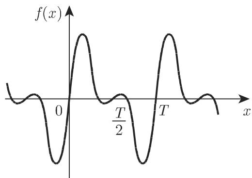
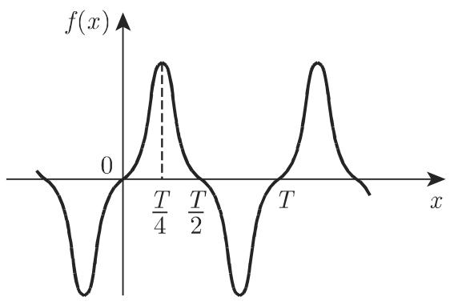
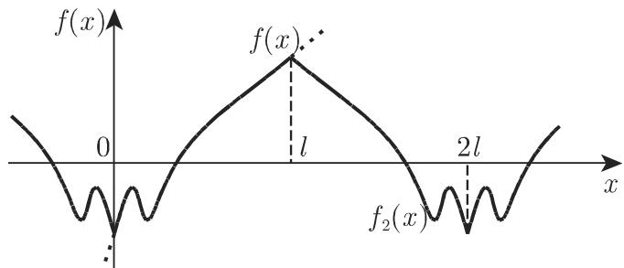
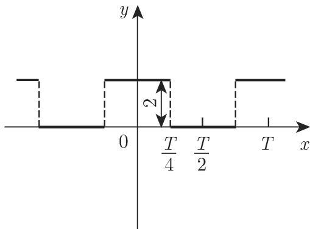

# 数学手册(原书第10版) 7.4 傅里叶级数

## 文献定位

本源是 [[entities/数学手册原书第10版]] 第 7 章「无穷级数」的第 7.4 节，节末署名「（胡俊美 译）」，原文页码约 634–638（7.4.1.2 位于第 635 页，由回指「第 635 7.4.1.2, 3.」推知）。母书为手册式权威参考书：本节按「基本定义 → 收敛性质 → 对称化简 → 有限区间展开 → 傅里叶积分 → 查表技巧」的顺序系统陈述傅里叶级数理论，公式编号 7.101–7.119，插图 7.2–7.9（图 7.5 含 (a)(b) 两幅）。

同章已入库：[[sources/10-数学手册原书第10版--5-71-数列--1afqre2]]（7.1 数列）、[[sources/10-数学手册原书第10版--7-72-数项级数--pq540w]]（7.2 数项级数）。两节之间的 7.3 尚未入库，见 [[queries/7-3未入库缺口]]。

## 章节结构与核心内容

- **7.4.1 三角和与傅里叶级数**
  - 7.4.1.1 基本概念：周期函数的傅里叶表示（三角和，式 7.101，基频 ω = 2π/T，T = 2π 时 ω = 1）；[[concepts/傅里叶系数]] 的欧拉公式（式 7.102a/b，三种等价形式）；[[concepts/傅里叶级数]]（式 7.103a–c）；[[concepts/傅里叶级数的复形式]]（式 7.104a/b）。系数亦可由调和分析法近似确定（回指 19.6.4，第 1287 页，未入库）。
  - 7.4.1.2 重要性质：[[concepts/均方收敛与最小均方误差]]（式 7.105a/b）；均方收敛与 [[concepts/帕塞瓦尔方程]]（式 7.106a/b）；[[concepts/狄利克雷条件]]；傅里叶系数的渐近性——**全节唯一复算存疑项**，见 [[findings/傅里叶系数渐近性及条件复算存疑]]。
- **7.4.2 对称函数系数的确定**
  - 7.4.2.1 各种类型的对称：四类对称（式 7.107–7.111，图 7.2–7.5），见 [[concepts/对称函数的傅里叶系数]]。
  - 7.4.2.2 傅里叶级数展开形式：区间 [0, l] 上的三种展开 f₁/f₂/f₃（式 7.112a–c，图 7.6–7.8），见 [[concepts/傅里叶展开的三种形式]]。
- **7.4.3 数值法对傅里叶系数的确定**：仅一段引述——函数复杂或仅在离散点 x_k = kT/N（k = 0, 1, …, N−1）已知时系数只能近似确定，N 可以很大，须用数值调和分析（回指 19.6.4）。主体不在本节。
- **7.4.4 傅里叶级数与傅里叶积分**：[[concepts/傅里叶积分]]（式 7.113a/b，条件为任意有限区间狄利克雷 + ∫|f| 收敛，回指 8.2.3.2 第 674 页）；非周期函数的极限情况与 [[concepts/谱密度]]（式 7.113c，离散谱 vs 连续谱）；偶/奇函数化简（式 7.114a/b）；算例 e^{−|x|}（式 7.115a/b）。
- **7.4.5 关于表中某些傅里叶级数的注**：第 1378 页表 21.6（未入库）的两种使用技巧——坐标变换的应用（式 7.116a/b，图 7.9）与复函数幂级数展开的应用（式 7.117–7.119）。

## 核心公式（依源转录）

### 基本定义（式 7.101–7.104）

```latex
% (7.101) 三角和 s_n(x)，基频 omega = 2pi/T
s_n(x) = a_0/2 + a_1 cos omega x + a_2 cos 2 omega x + ... + a_n cos n omega x
              + b_1 sin omega x + b_2 sin 2 omega x + ... + b_n sin n omega x

% (7.102a/b) 欧拉公式（三种等价积分形式）
a_k = (2/T) Int_0^T f(x) cos k omega x dx = (2/T) Int_{x_0}^{x_0+T} f(x) cos k omega x dx
    = (2/T) Int_0^{T/2} [f(x) + f(-x)] cos k omega x dx
b_k = (2/T) Int_0^T f(x) sin k omega x dx = (2/T) Int_{x_0}^{x_0+T} f(x) sin k omega x dx
    = (2/T) Int_0^{T/2} [f(x) - f(-x)] sin k omega x dx

% (7.103a/b/c) 傅里叶级数：三角形式与振幅-相位形式
s(x) = a_0/2 + a_1 cos omega x + ... + a_n cos n omega x + ...
              + b_1 sin omega x + ... + b_n sin n omega x + ...
s(x) = a_0/2 + A_1 sin(omega x + phi_1) + A_2 sin(2 omega x + phi_2) + ... + A_n sin(n omega x + phi_n) + ...
A_k = sqrt(a_k^2 + b_k^2),   tan phi_k = a_k / b_k

% (7.104a/b) 复形式
s(x) = Sum_{k=-inf}^{+inf} c_k e^{i k omega x}
c_k = (1/T) Int_0^T f(x) e^{-i k omega x} dx
    = a_0/2                   (k = 0)
      (a_k - i b_k)/2         (k > 0)
      (a_{-k} + i b_{-k})/2   (k < 0)
```

### 收敛性质（式 7.105–7.106）

```latex
% (7.105a/b) 傅里叶和与均方误差
s_n(x) = a_0/2 + Sum_{k=1}^n a_k cos k omega x + Sum_{k=1}^n b_k sin k omega x
F = (1/T) Int_0^T [f(x) - s_n(x)]^2 dx          % 系数取傅里叶系数时 F 最小

% (7.106a/b) 均方收敛与帕塞瓦尔方程（f 有界且在 (0,T) 分段连续）
Int_0^T [f(x) - s_n(x)]^2 dx -> 0   (n -> inf)
(2/T) Int_0^T [f(x)]^2 dx = a_0^2/2 + Sum_{k=1}^inf (a_k^2 + b_k^2)
```

狄利克雷条件（7.4.1.2.3，无编号）：a) 定义区间可分为有限个连续单调区间；b) 间断点处单侧极限存在（转写残缺）。结论：连续点级数收敛于 f(x)，间断点收敛于 ½[f(x−0)+f(x+0)]。渐近性（7.4.1.2.4，无编号）：「f 及其 k 阶与 k 阶以下导数均连续 ⟹ a_n·n^{k+1}, b_n·n^{k+1} → 0」——**复算存疑**，见 [[findings/傅里叶系数渐近性及条件复算存疑]]。

### 四类对称系数公式（式 7.107–7.111）

| 类型 | 判定条件 | 恒为零的系数 | 非零系数公式 | 积分限 |
|---|---|---|---|---|
| 第一类（7.107，图 7.2） | f(x) = f(−x) | b_k = 0 | a_k = (4/T)∫₀^{T/2} f(x)cos(k·2πx/T)dx | [0, T/2] |
| 第二类（7.108，图 7.3） | f(x) = −f(−x) | a_k = 0 | b_k = (4/T)∫₀^{T/2} f(x)sin(k·2πx/T)dx | [0, T/2] |
| 第三类（7.109a/b，图 7.4） | f(x+T/2) = −f(x) | a_{2k} = b_{2k} = 0 | a_{2k+1}、b_{2k+1} = (4/T)∫₀^{T/2} f(x){cos/sin}((2k+1)·2πx/T)dx | [0, T/2] |
| 第四类·奇（7.110，图 7.5(a)） | 奇 ∧ 第三类 | a_k = b_{2k} = 0 | b_{2k+1} = (8/T)∫₀^{T/4} f(x)sin((2k+1)·2πx/T)dx | [0, T/4] |
| 第四类·偶（7.111，图 7.5(b)） | 偶 ∧ 第三类 | b_k = a_{2k} = 0 | a_{2k+1} = (8/T)∫₀^{T/4} f(x)cos((2k+1)·2πx/T)dx | [0, T/4] |

### 三种展开形式（式 7.112a–c）

| 形式 | 级数类型 | 周期 | 基频 | 对称性（延拓方式） | 系数来源 |
|---|---|---|---|---|---|
| f₁（7.112a，图 7.6） | 完整三角级数 | T = l | 2π/l | 无（周期延拓） | 欧拉公式 7.102，ω = 2π/l |
| f₂（7.112b，图 7.7） | 余弦级数 | T = 2l | π/l | 第一类（偶延拓） | 式 7.107 取 T = 2l |
| f₃（7.112c，图 7.8） | 正弦级数 | T = 2l | π/l | 第二类（奇延拓） | 式 7.108 取 T = 2l |

### 傅里叶积分与谱（式 7.113–7.115）

```latex
% (7.113a/b/c) 傅里叶积分与谱密度
f(x) = (1/2pi) Int_{-inf}^{+inf} e^{i omega x} d omega Int_{-inf}^{+inf} f(t) e^{-i omega t} dt
     = (1/pi) Int_0^{inf} d omega Int_{-inf}^{+inf} f(t) cos omega(t - x) dt
f(x) = [f(x-0) + f(x+0)]/2                                    % 间断点
g(omega) = (1/2pi) Int_{-inf}^{+inf} f(t) e^{-i omega t} dt   % 复、双侧约定

% (7.114a/b) 偶/奇函数的化简形式
f(x) = (2/pi) Int_0^{inf} cos omega x d omega Int_0^{inf} f(t) cos omega t dt      % 偶
f(x) = (2/pi) Int_0^{inf} sin omega x d omega Int_0^{inf} f(t) sin omega t dt      % 奇

% (7.115a/b) 算例 f(x) = e^{-|x|}
g(omega) = (2/pi) Int_0^{inf} e^{-t} cos omega t dt = (2/pi) · 1/(omega^2 + 1)     % 单侧约定
e^{-|x|} = (2/pi) Int_0^{inf} cos omega x / (omega^2 + 1) d omega
```

注意：g(ω) 在式 7.113c（复、双侧）与式 7.115a（偶函数、单侧）中是两种相差因子 2 的归一化约定，见 [[queries/谱密度gω两种归一化约定]]。

### 查表两算例（式 7.116–7.119）

```latex
% (7.116a/b) 坐标变换化简查表：偶函数方波（图 7.9）
y = 2  (0 < x < T/4),   y = 0  (T/4 < x < T/2)
% 代换 Y = y - 1, X = 2pi x/T + pi/2 化为表 21.6 中的标准方波，再用恒等式
% sin((2n+1)(2pi x/T + pi/2)) = (-1)^n cos((2n+1)·2pi x/T) 回代，得
y = 1 + (4/pi)(cos 2pi x/T - (1/3) cos 3·2pi x/T + (1/5) cos 5·2pi x/T - ...)

% (7.117/7.118/7.119) 复幂级数展开求三角级数和
1/(1 - z) = 1 + z + z^2 + ...   (|z| < 1),   z = a e^{i phi}
1 + a cos phi + a^2 cos 2 phi + ... = (1 - a cos phi)/(1 - 2 a cos phi + a^2)
a sin phi + a^2 sin 2 phi + ... = a sin phi/(1 - 2 a cos phi + a^2)      (|a| < 1)
```

## 复算状态

按本 wiki 惯例对全节公式逐式复算，结果：**除一处存疑外全部通过**。

- 复算通过：式 7.101–7.104（[[findings/三角和与傅里叶系数欧拉公式-式7-101至7-104]]）、式 7.105–7.106（[[findings/最小均方误差与帕塞瓦尔方程-式7-105至7-106]]）、狄利克雷条件（[[findings/狄利克雷条件与间断点中值收敛]]）、式 7.107–7.111（[[findings/四类对称系数公式-式7-107至7-111]]）、式 7.112a–c（[[findings/三种展开形式-式7-112a至7-112c]]）、式 7.113–7.115（[[findings/傅里叶积分与谱密度-式7-113至7-115]]）、式 7.116–7.119（[[findings/坐标变换与幂级数求三角级数两算例-式7-116至7-119]]）。
- 复算存疑：7.4.1.2.4 傅里叶系数渐近性——按转写字面条件过强，疑原书含附加条款且转写脱字（[[queries/傅里叶系数渐近性条件是否完整]]）。

## 转写质量

转写（OCR）损坏集中在汉字叙述与交叉引用，公式 LaTeX 主体基本完好。系统性问题：缺字（「周期为 _ 的周期函数」缺 T、「及其 _ 阶」缺 k、「另外，_ 的数值」缺 N、「第 _ 种形式」缺序号、「当 l _ ∞」缺 →）；「趋千/等千」系「趋于/等于」之讹；w 与 ω 混用；[O,T] 应为 [0,T]；式 7.111 编号错位；游离编号 (1)(3)；「h (x)」疑应为 f₂(x)；「635 7.4.2.1」回指粘连且疑应为 7.4.1.2.1。完整清单见 [[queries/7-4全节系统性转写讹误清单]]。

## 回指缺口

本节四处回指目标未入库：表 21.6（第 1378 页）、19.6.2.1（第 1278 页）、19.6.4（第 1287/1288 页）、8.2.3.2（第 674 页），见 [[queries/表21-6及19-6与8-2-3-2未入库回指缺口]]。

## 媒体文件

插图 7.2–7.9 位于 `media/10-数学手册原书第10版--8-74-傅里叶级数--7f2use/`，已嵌入相关 concept 与 finding 页。

<!-- llm-wiki:embedded-images -->
## Embedded Images

### Document










<!-- llm-wiki:embedded-images -->
