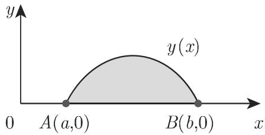
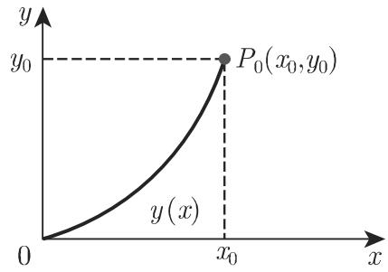

# 数学手册(原书第10版) 第10章 变分法

《数学手册(原书第10版)》第10章（变分法）全章正文，属 [[entities/数学手册原书第10版]]（母作品为德文原书 [[entities/taschenbuch-der-mathematik数学手册母作品]]）。本章以参考手册体例系统陈述变分法经典部分：变分问题的分类与积分表达式类型（10.1）、历史名题（等周问题与捷线问题，10.2）、一个自变量情形下欧拉微分方程的完整推导与诸变形（10.3）、多个自变量情形（10.4）、变分问题的数值解（10.5），以及一阶二阶变分与物理学应用（10.6）。章末署「（陆柱家译）」，可回指 [[concepts/人名译名对照表]]；其后衍出下章标题「11 线性积分方程」，非本章内容。本章正文未署作者；出版年份依全库文献目时间下限（2010）推断，参见 [[findings/文献目时间下限2010与自引2008的版本张力]]。

## 章节结构

- **10.1 定义问题**：积分表达式的极值；六类积分表达式 (10.1)–(10.6)；参数表示 (10.7)。
- **10.2 历史上的问题**：10.2.1 等周问题（黛多女王传说，(10.8a–c)）；10.2.2 捷线问题（J. 伯努利 1696，(10.9)–(10.10)，x=x₀ 处奇点）。
- **10.3 一个自变量的变分问题**：10.3.1 简单变分问题和极值曲线；10.3.2 变分法的欧拉微分方程（(10.13)–(10.22c)，附最短连线与旋转面最小面积两算例）；10.3.3 具有附加条件的变分问题（拉格朗日乘子，(10.25)–(10.29c)）；10.3.4 具有高阶导数的变分问题（(10.30)–(10.33)，附 y⁽⁴⁾+αy″−βy=0 算例）；10.3.5 具有数个未知函数的变分问题（(10.34)–(10.37)）；10.3.6 利用参数表达式的变分问题（一次正齐次函数与魏尔斯特拉斯形式，(10.38)–(10.43d)，附参数式等周问题算例）。
- **10.4 多个自变量函数的变分问题**：10.4.1 简单变分问题（(10.44)–(10.49f)，附膜形变与狄利克雷变分问题算例）；10.4.2 较一般的变分问题（(10.50)–(10.51)）。
- **10.5 变分问题的数值解**：欧拉微分方程边值问题的数值解；直接法与里茨方法（完整算例 (10.52a–j)）；有限元方法（FEM）与梯度方法之前瞻。
- **10.6 增补的问题**：10.6.1 一阶和二阶变分（(10.53)–(10.57)）；10.6.2 在物理学中的应用（概述性文字，引 [10.3]、[10.4]、[10.6]）。

## 公式谱系（结构化保留）

```text
(10.19)  F_y − d/dx F_{y'} = 0                        单函数一阶（欧拉微分方程）
(10.20)  F_y − F_{xy'} − F_{yy'}·y' − F_{y'y'}·y″ = 0 展开形式（F_{y'y'}≠0 时为二阶常微分方程）
(10.21b) d/dx F_{y'} = 0                              特例 F = F(y')
(10.22c) F − y'·F_{y'} = c                            特例 F = F(y,y')（Beltrami 型恒等式，手册未名）
(10.28)  H_y − d/dx H_{y'} = 0,  H = F + λG           积分型附加条件（拉格朗日）
(10.31)  F_y − d/dx F_{y'} + d²/dx² F_{y''} = 0       含二阶导数（四阶方程；正文「其通解包含 个任意常数」脱「4」）
(10.33)  Σₖ (−1)^k dᵏ/dxᵏ F_{y⁽ᵏ⁾} = 0                n 阶通式
(10.37)  F_{yᵢ} − d/dx F_{yᵢ'} = 0 (i = 1..n)         n 个未知函数方程组
(10.41)  F_x − d/dt F_ẋ = 0,  F_y − d/dt F_ẏ = 0      参数式
(10.42a) F_{xẏ} − F_{ẋy} + M(ẋÿ − ẍẏ) = 0             魏尔斯特拉斯形式
(10.48)  F_u − ∂/∂x F_{u_x} − ∂/∂y F_{u_y} = 0        二重积分（多元）
(10.51)  F_u − Σₖ ∂/∂xₖ F_{u_{xₖ}} = 0                n 个自变量通式
```

## 交叉引用图谱

| 参见目标 | 页码 | 转写状态与入库情况 |
|---|---|---|
| 11.5.1 下降时间公式 | 849 | 脱「页」字；第11章未入库 |
| 7.3.3.3 泰勒展开 | 630 | 脱「页」字；第7章已入库（[[sources/10-数学手册原书第10版--8-第7章-无穷级数--snvm34]]） |
| 2.15.1 悬链线 | 139 | 脱「页」字；第2章已入库（[[sources/10-数学手册原书第10版--6-第2章-函数--1e0xyfg]]） |
| 9.2.2.3,1. 可分离变量方程 | 763 | 脱「页」字；第9章未入库 |
| 6.2.5.6 拉格朗日乘子 | 611 | 脱「页」字；第6章已入库（[[sources/10-数学手册原书第10版--7-第6章-微分学--lca0xl]]） |
| 10.2.1 / 10.3.2 / 10.3.3 | 804 / 806 / 808 | 章内回指，脱「页」字 |
| 19.2.2 非线性方程组 | 1249 | 脱「页」字；第19章未入库 |
| 9.1.2.3 常系数线性 ODE | 732 | 脱「页」字；第9章未入库 |
| 3.6.1.1,1. 参数曲线曲率 | 326 | 脱「页」字；第3章已入库（[[sources/10-数学手册原书第10版--7-第3章-几何学--1itkakl]]） |
| 13.5.1 拉普拉斯方程 | 951 | 脱「页」字；第13章未入库 |
| 19.5 / 20.3.4 | 1267 / 1353 | 「第 135320.3.4」连排脱空格；两章均未入库 |
| 19.4.2.2 / 19.5.2 / 19.5.3 | 1265 / 1270 / 1271 | 脱「页」字；第19章未入库 |
| 6.2.2.3 泰勒公式 | 602 | 脱「页」字；第6章已入库 |

## 闭式复算结论（本库独立验证）

详见 [[findings/第10章诸算例闭式复算通过清单]]、[[findings/第10章里茨方法算例全链闭式复算]]、[[findings/10-29b第二式根号与圆解不自洽复算]]：

- (10.23b) 最短连线 ⟹ y″=0（直线）：复算通过。
- (10.24b) 旋转面最小面积 ⟹ 悬链线 y = c₁cosh(x/c₁ + c₂)：复算通过。
- (10.32b) y⁽⁴⁾ + αy″ − βy = 0：复算通过。
- (10.43d) 参数式等周问题 M = λ/(ẋ²+ẏ²)^{3/2}、H_{ẋy}=1、H_{xẏ}=0 ⟹ R = |λ|，极值曲线为圆：复算通过，与 (10.29c) 圆族互证。
- (10.49f) Δu = 0：复算通过。
- (10.52) 里茨算例全链（六个积分系数、特征方程 λ²−52λ+420=0、根 λ₁=10 与 λ₂=42、降秩解、归一化 a₁=√30≈5.48、对照精确本征值 π²≈9.87 与 y=√2·sin πx）：复算通过，里茨值 10 为上界，结构自洽。
- **(10.29b) 第二式与 (10.29c) 不自洽（疑讹）**：由第一式闭式推得 y′² = (λ²−(c₁−y)²)/(c₁−y)²，与圆族解一致；印本作 y′² = √(λ²−(c₁−y)²)/(c₁−y)，其右端恰为正确式之平方根（即 |y′|），与圆解矛盾。

## 转写讹误与文本问题

（详见 [[queries/第10章全节系统性转写讹误清单]] 与 [[queries/第10章参见页码脱页字与1353连排之辨]]）

- 「千」讹「于」遍布全章（「依赖千」「起源千」「取决千」「由千」「关千」「借助千」等）。
- λ 多处讹作「入」（10.3.3、10.3.6）；δI 讹作「6I」（10.6.1）；Γ 讹作「I'」（10.4.1 两处）；ẋ 讹作「土」（10.3.6）；(10.52f) 两处讹作「(10.52£)」。
- 大量脱符号：「对哪些 值」脱 x、「绕 轴旋转」脱 x、「包含 个任意常数」脱 4、「在有 个自变量」「即得 个欧拉微分方程」脱 n、「弧长是 这一要求」脱 l、「不出现在 中」脱 H、「须是一个一次正齐次函数」脱 F、「以及函数 是给定的」脱 F、Ω/G/Γ/R/b 等区域与端点符号多处脱落。
- 10.3.4 节标题「l. F = F (X'y'y''y")」为「1. F = F(x, y, y′, y″)」之乱码。
- 10.5 末「例如欧拉微分方程，或者根(19.146a) (19.146b)，双线性型」一句文气断裂，疑有脱讹。
- 等周传说拉丁括注作「(Carthego)」，与通行拉丁地名 Carthago 拼写有异。
- 章末衍出下章标题「11 线性积分方程」。
- (10.12) 以单侧不等号 I[y₀] ⩾ I[y] 定义「极值」，仅覆盖极大情形（原文体例之松，见 [[queries/10-12单侧不等号定义极值之辨]]）。

## 引用文献

10.6.1 与 10.6.2 引 [10.3]、[10.4]、[10.6]，与 [[sources/10-数学手册原书第10版--4-参考文献--170yu5v]] 的章号-序号制条目（10-3、10-4、10-6）直接对应；既有查询 [[queries/10-7作者SCHWANK身份之辨]] 表明第10章文献条目至少编至 10-7，可互相印证。

## 插图





<!-- llm-wiki:embedded-images -->
## Embedded Images

### Document


<!-- llm-wiki:embedded-images -->
