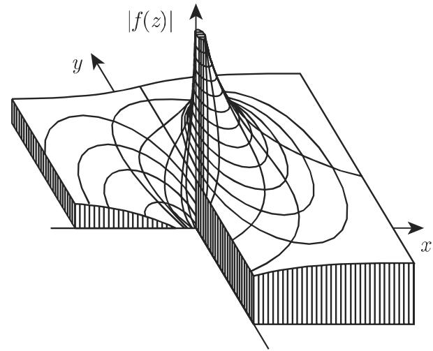

# 数学手册(原书第10版) 14.1.2 解析函数

## 来源概述

本节是《数学手册(原书第10版)》第 14 章（复变函数）的首个入库小节，也是本 wiki 复分析主题簇的起点。它给出解析函数的定义与可微性判据（柯西–黎曼微分方程）、实部虚部的调和性、共轭调和函数的确定（式 14.6）、模与模曲面（式 14.7）、有界性、最大模原理与刘维尔定理，并以孤立奇点的三分类（可去奇点、极点、本质奇点）收尾，为后续 14.3（极点阶数、Laurent 级数）建立入口。

## 小节结构

- **14.1.2.1 解析函数的定义**：区域上逐点可微即解析；柯西–黎曼微分方程为判据；实部虚部满足拉普拉斯微分方程；初等复变函数导数按实函数同一公式计算（例 A：z³、例 B：sin z）
- **14.1.2.2 解析函数的一些例子**：初等代数函数与超越函数除孤立奇点外全平面解析（例 A：z²、例 B：2x+y/x+2y、例 C/D 与 14.1.2.1 例 A/B 重复）；小节 2 为共轭调和函数的确定（标题转写残缺为"函数 的确定"）
- **14.1.2.3 解析函数的性质**：模与模曲面（式 14.7）、函数的根（小节 2，原文无标题）、有界性、关于最大值的定理、关于常数的定理（刘维尔定理）
- **14.1.2.4 奇点**：孤立奇点定义与三种类型，附例 1/(z−a) 与 e^(1/z)

## 核心公式（逐字转录）

可微性判据——柯西–黎曼微分方程 (Cauchy-Riemann differential equations)：

$$
\frac{\partial u}{\partial x} = \frac{\partial v}{\partial y}, \qquad \frac{\partial u}{\partial y} = -\frac{\partial v}{\partial x}.\tag{14.4}
$$

解析函数的实部和虚部满足拉普拉斯微分方程：

$$
\Delta u(x,y) = \frac{\partial^2 u}{\partial x^2} + \frac{\partial^2 u}{\partial y^2} = 0,\tag{14.5a}
$$

$$
\Delta v(x,y) = \frac{\partial^2 v}{\partial x^2} + \frac{\partial^2 v}{\partial y^2} = 0.\tag{14.5b}
$$

共轭调和函数的确定（已知 u 定 v，差一附加常数）：

$$
v = \int \frac{\partial u}{\partial x}\,\mathrm{d}y + \varphi(x), \qquad
\frac{\mathrm{d}\varphi}{\mathrm{d}x} = -\left(\frac{\partial u}{\partial y} + \frac{\partial}{\partial x}\int \frac{\partial u}{\partial x}\,\mathrm{d}y\right).\tag{14.6}
$$

模与模曲面 (relief)：

$$
|w| = |f(z)| = \sqrt{[u(x,y)]^2 + [v(x,y)]^2} = \varphi(x,y).\tag{14.7}
$$

属 $f(z)=\sin z$ 的具体断言：$\sin z = \sin x \cosh y + \mathrm{i}\cos x \sinh y$，$|\sin z| = \sqrt{\sin^2 x + \sinh^2 y}$。

## 例证

- $f(z) = z^3$，$f'(z) = 3z^2$（14.1.2.1 例 A；14.1.2.2 例 C 为重复）
- $f(z) = \sin z$，$f'(z) = \cos z$（14.1.2.1 例 B；14.1.2.2 例 D 为重复）
- $w = z^2$（$u = x^2 - y^2,\ v = 2xy$）：处处解析
- $u = 2x + y,\ v = x + 2y$：处处不解析
- $w = \frac{1}{z-a}$：在 $z = a$ 处有一个极点
- $w = e^{1/z}$：在 $z = 0$ 处有一个本质奇点；其模曲面见图 14.2(b)

## 主要断言（均无证明）

1. 可微性判据（式 14.4）：$f(z) = u(x,y) + \mathrm{i}v(x,y)$ 可微，当且仅当 $u$、$v$ 有连续偏导数且满足柯西–黎曼方程。
2. 调和性（式 14.5a/b）：解析函数的实部与虚部均为调和函数（原文显式回指"参见第 951 13.5.1"，即第 13.5 节）。
3. 共轭调和函数（式 14.6）：已知一调和函数，另一可由柯西–黎曼方程组确定，只相差一个附加常数；类似地已知 $v$ 也可确定 $u$。
4. 无穷可微性：函数在一个域上解析（可微）⇒ 任意多次可微。
5. 最大模原理（"关于最大值的定理"）：闭区域上解析函数的 $|f|$ 最大值在边界上达到。
6. 刘维尔定理（"关于常数的定理"）：整个复平面上解析且有界 ⇒ 常数。
7. 奇点三分类：邻域有界 ⇒ 可去奇点（补全后解析）；$\lim_{z\to a}|f(z)| = \infty$ ⇒ 极点；其余 ⇒ 本质奇点，且对任意复数 $w$ 存在序列 $z_n \to a$ 使 $f(z_n) \to w$。

本节所有可复算内容（式 14.4–14.7 及全部例证）经独立复算均自洽，见 [[findings/式14-4至14-5b柯西黎曼方程与调和性转录复算]]、[[findings/式14-6共轭调和函数确定公式转录复算]]、[[findings/式14-7模与模曲面及sinz模公式转录复算]]、[[findings/14-1-2解析与非解析算例复算]]。各定理均为陈述性断言，手册未给证明。

## 与既有 wiki 的关联

- [[concepts/调和函数]]、[[concepts/拉普拉斯微分方程]]：手册原文以"参见第 951 13.5.1"显式回指第 13.5 节；本节是 13.5 调和函数与边值问题理论向复分析的自然延伸，构成"柯西–黎曼方程 → 拉普拉斯方程 → 调和函数"的跨章联结线。
- [[concepts/狄利克雷问题]]、[[concepts/诺伊曼问题]]、[[concepts/第三类边值问题]]：式 (14.6) 与边值问题同属"由部分场量恢复共轭量、差一规范化常数"的结构，见 [[comparisons/共轭调和函数确定与三类边值问题比较]]。
- 本节与 12.9 分布理论（[[concepts/分布空间]] 等）无直接关联。

## 图示

按正文断言，图 14.2(a) 为 $\sin z$ 的模曲面（例 A）、图 14.2(b) 为 $e^{1/z}$ 的模曲面（例 B）；OCR 图注块的 (a)(b) 顺序与此相反，疑图注错位，图像内容本身不可由文本核验，见 [[queries/14-1-2全节系统性转写讹误清单]]。

## 转写质量与回指缺口

本节转写噪声密集（符号脱落、错字、结构残缺），汇总于 [[queries/14-1-2全节系统性转写讹误清单]]；前向引用缺口（式编号始于 14.4、14.3.5.1 极点阶数未入库、文献 [14.8] 不可解）见 [[queries/14-1-2未入库回指缺口]]；"奇点"一词的双重用法见 [[queries/奇点术语双重用法之辨]]。

<!-- llm-wiki:embedded-images -->
## Embedded Images

### Document

<!-- llm-wiki:embedded-images -->
