# 数学手册(原书第10版) 14.1.3 共形映射

本页对应《数学手册(原书第10版)》第 14 章 14.1.3 节「共形映射」，是 14.1「复变函数」的第三节，接续 [[concepts/复函数]]（14.1.1 极限、连续性与可微性）与 [[concepts/解析函数]]（14.1.2）。全节从共形映射的定义出发，经柯西–黎曼方程的几何解释、初等映射目录、施瓦茨–克里斯托费尔公式与施瓦茨反射原理，落到平面场的复位势形式体系，最后以任意映射与黎曼曲面收束。来源链：[[sources/10-数学手册原书第10版--8-141-复变函数--10zcww1]] → 14.1.1 → 14.1.2 → 本节。

本节的两个核心概念是 [[concepts/共形映射]]（保角的解析单射）与 [[concepts/复位势]]（无源无旋平面场的解析函数表示 $W=\Phi+\mathrm{i}\Psi$）。

## 节次结构

- **14.1.3.1 共形映射的概念和性质**：定义（式 14.8，解析且单射、$f'(z)\neq0$）；线元变换 $\mathrm{d}w=f'(z)\,\mathrm{d}z$ 为伸缩 $\sigma=\lvert f'(z)\rvert$ 与旋转 $\alpha=\arg f'(z)$ 的组合；柯西–黎曼方程的几何意义（式 14.9a–14.10e，雅可比矩阵即旋转—伸缩矩阵）；正交系；例 A（$u=2x+y,\ v=x+2y$，非解析故正交性不成立）与例 B（$w=z^2$，除 $z=0$ 外保角，第一象限 ↦ 上半平面）。
- **14.1.3.2 最简单的一些共形映射**：线性函数（14.11a–c）、反演 $w=1/z$（14.12）、线性分式函数（14.13a–b、14.14）、二次函数（14.15a–c）、平方根（14.16）、[[entities/线性与分式线性函数之和]]（14.17a–e）、对数（14.18a–b）、指数函数（14.19a–c）、施瓦茨–克里斯托费尔公式（14.20a–b）及例 A、例 B。
- **14.1.3.3 施瓦茨反射原理**：对称点 ↦ 对称点；流线边界与位势线边界的两套反射规则。
- **14.1.3.4 复位势**：无源场与流函数（14.21a–b）、无旋场与势函数（14.22a–b）、复位势定义（14.23）与导数公式（14.24）；六种基本复位势（14.25–14.30）。
- **14.1.3.5 叠加原理**：复位势叠加的线性性依据；连续旋度分布的柯西型积分（14.31）；[[methodology/麦克斯韦对角线方法]]。
- **14.1.3.6 复平面的任意映射**：坐标线与几何图形的变换（14.32a–c）；[[concepts/黎曼曲面]] 与 [[concepts/分支点]]。

## 关键公式（转录）

定义与几何意义（式 14.8、14.10a）：

$$w=f(z)=u+\mathrm{i}v,\qquad f'(z)\neq0$$

$$A=\begin{pmatrix}u_x&-v_x\\ v_x&u_x\end{pmatrix}=\sigma\begin{pmatrix}\cos\alpha&-\sin\alpha\\ \sin\alpha&\cos\alpha\end{pmatrix}$$

施瓦茨–克里斯托费尔公式（式 14.20a–b）：

$$z=C_1\int_0^w\frac{\mathrm{d}t}{(t-w_1)^{\alpha_1}(t-w_2)^{\alpha_2}\cdots(t-w_n)^{\alpha_n}}+C_2,\qquad \sum_{\nu=1}^n\alpha_\nu=2$$

例 A 结果（$C_1=\mathrm{i}d/\pi$，$C_2=0$）：

$$z=C_1\int_0^w\frac{\mathrm{d}t}{(t+1)t^{-1/2}}=2C_1(\sqrt w-\arctan\sqrt w)=\mathrm{i}\frac{2d}{\pi}(\sqrt w-\arctan\sqrt w)$$

例 B 结果（矩形 ↦ 实轴，落点为 [[entities/第一类椭圆积分]]）：

$$z=\int_0^w\frac{\mathrm{d}t}{\sqrt{(1-t^2)(1-k^2t^2)}}=\int_0^\varphi\frac{\mathrm{d}\vartheta}{\sqrt{1-k^2\sin^2\vartheta}}=F(\varphi,k)$$

复位势及其导数关系（式 14.23–14.24）：

$$W=f(z)=\Phi(x,y)+\mathrm{i}\Psi(x,y),\qquad \frac{\mathrm{d}W}{\mathrm{d}z}=V_x-\mathrm{i}V_y,\qquad \overline{f'(z)}=V_x+\mathrm{i}V_y$$

六种基本复位势（式 14.25–14.30）：

| 场 | 复位势 |
|---|---|
| 齐次场（$a$ 实） | $W=az$ |
| 源（强度 $s>0$，位于 $z_0$） | $W=\frac{s}{2\pi}\ln(z-z_0)$ |
| 汇（强度 $s>0$，位于 $z_0$） | $W=-\frac{s}{2\pi}\ln(z-z_0)$ |
| 源—汇系统 | $W=\frac{s}{2\pi}\ln\frac{z-z_1}{z-z_2}$ |
| 偶极子（矩 $M$，轴角 $\alpha$） | $W=\frac{M\mathrm{e}^{\mathrm{i}\alpha}}{2\pi(z-z_0)}$ |
| 旋度（强度 $\Gamma$） | $W=\frac{\Gamma}{2\pi\mathrm{i}}\ln(z-z_0)$ |

施瓦茨–克里斯托费尔例 A 顶点表（原文照录）：

| | $z_\nu$ | $\alpha_\nu$ | $w_\nu$ |
|---|---|---|---|
| A | $\infty$ | 1 | $-1$ |
| B | 0 | $-1/2$ | 0 |
| C | $\infty$ | $3/2$ | $\infty$ |

## 复核状态总评

- 式 14.8–14.32 的代数内容经逐式独立复算，一致，置信度高，详见各 finding 页。
- 施瓦茨–克里斯托费尔两例的常数确定（$C_1=\mathrm{i}d/\pi$、$C_1=1/k$、$C_2=0$）全过程复算通过，是本手册罕见的完整算例，见 [[findings/式14-20a至14-20b施瓦茨-克里斯托费尔公式及两例转录复算]]。
- 例 A 的区域形状（推断为以 $y=-d$ 为界的上半平面挖去第一象限直角切口）依赖未随文核验的图 14.19(a)，属推断级证据。
- 麦克斯韦对角线方法一节转写讹损严重，复核受限，见 [[methodology/麦克斯韦对角线方法]]。
- 矩形例「$z=\mathrm{i}K$ 的像为 $w=\infty$」疑为 $z=\mathrm{i}K'$，见 [[queries/矩形例iK疑为iK′]]。

## 与既有维基的联系

- 概念衔接：[[concepts/解析函数]]、[[concepts/柯西-黎曼微分方程]]（本节补入其旋转—伸缩矩阵几何意义）、[[concepts/共轭调和函数]]（$\Phi,\Psi$ 即其场论实例）、[[concepts/解析函数的奇点]]（分支点）、[[concepts/无旋场]]、[[concepts/保守场与位势]]、[[concepts/位势符号约定]]（$-\Phi$ 约定延续 §13.3.1.6）、[[concepts/等值面与等值线]]、[[concepts/向量线]]。
- 跨章桥接：与 13.4 的 [[concepts/向量场的源旋分解]]、[[methodology/向量场源旋分解求解流程]] 构成二维场问题的两套互补方法，见 [[comparisons/复位势法与源旋分解比较]]。
- 前向引用缺口：§3.5.2.2、§1.5.3.6、§14.5.2（式 14.74c）、式 14.69、§8.1.4.3、§14.2.3、文献 [14.16]，见 [[queries/14-1-3未入库回指缺口]]。

## 已知转写问题

本节转写讹误较多（「于→千」「几→儿」、$\pi$ 讹作「兮/冗/亢/$\mathfrak N$」、多处脱字与噪声符等），系统清单见 [[queries/14-1-3全节系统性转写讹误清单]]。图 14.3–14.32 的图像文件已随源引用（media/10-数学手册原书第10版--9-1413-共形映射--r80kxz/），但其内容未经本次转写核验。

## 开放问题

- 原书作者、版本与出版年份信息待补入本页 frontmatter。
- $K,K'$ 与第一类完全椭圆积分的等同关系系由 $z(w{=}1)=\int_0^1=K(k)=z_1$ 推得，源未明言，待 §8.1.4.3 入库后正式回指（[[entities/第一类椭圆积分]]）。
- 文献 [14.16]（黎曼曲面）尚未解析。
- (14.17) 处「根据 (14.8)」的引用所指存疑。

<!-- llm-wiki:embedded-images -->
## Embedded Images

### Document

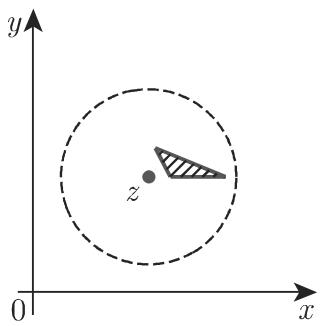
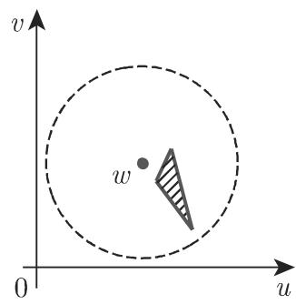

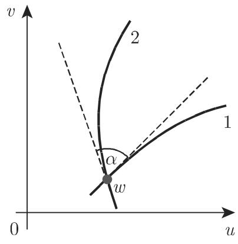
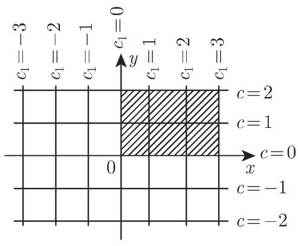

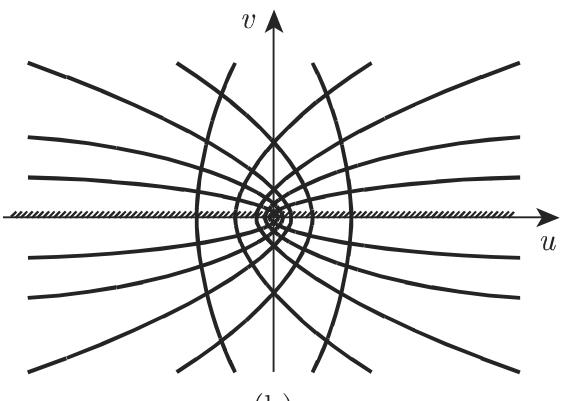

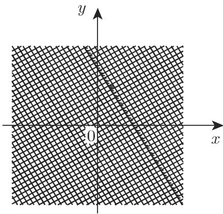

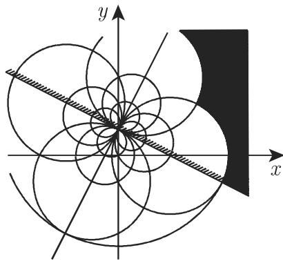

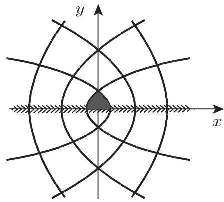

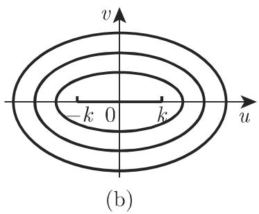

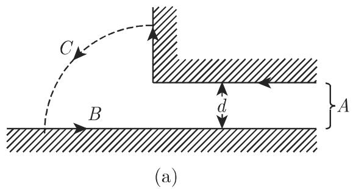
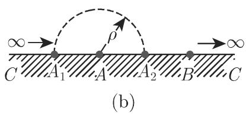
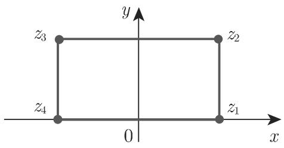
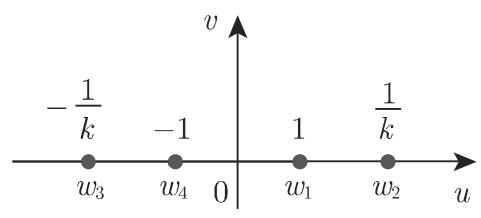
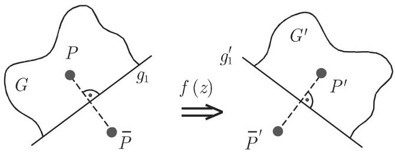
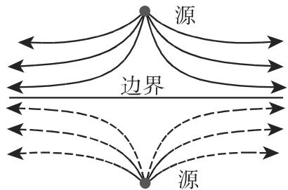

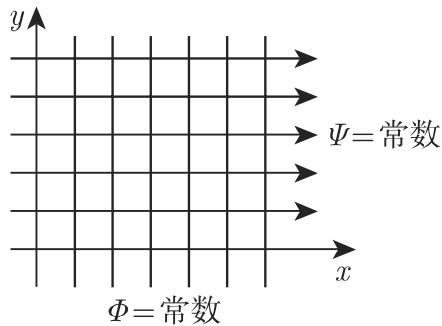

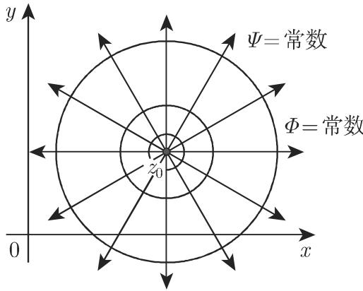
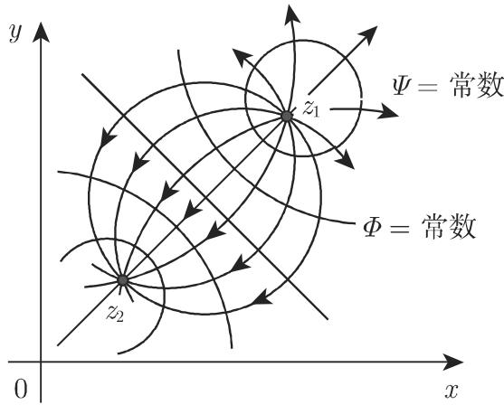

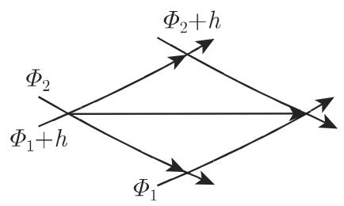
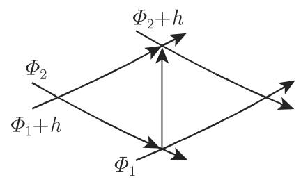
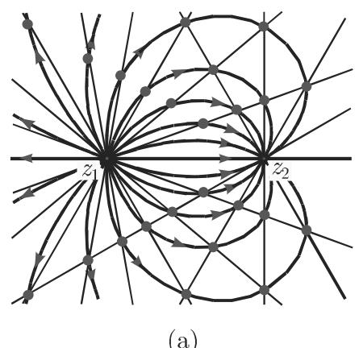
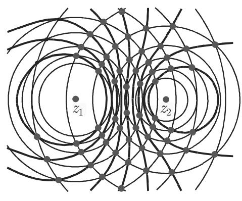

<!-- llm-wiki:embedded-images -->
