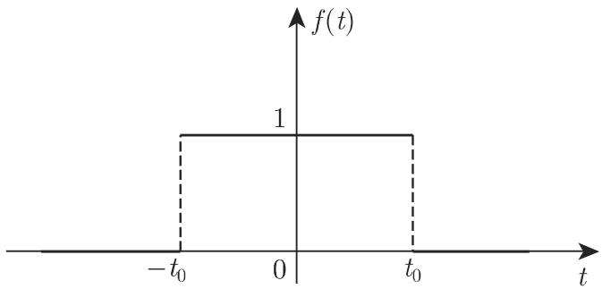
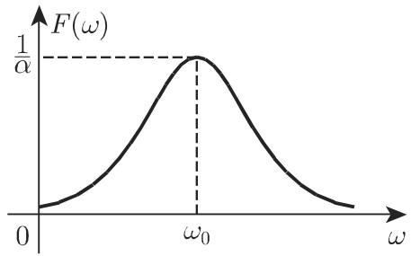
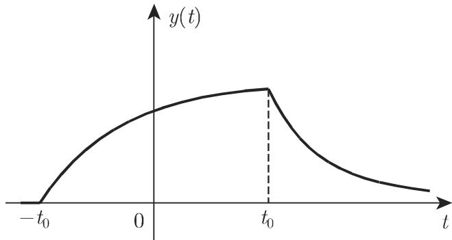

# 数学手册(原书第10版) 15.3 傅里叶变换

本页是《数学手册(原书第10版)》第 15 章“积分变换”第 3 节（15.3 傅里叶变换）的源摘要。本节以傅里叶积分为理论基础，定义 [[concepts/傅里叶变换]] 及其正弦、余弦与指数型变体，给出谱解释、九类计算法则与卷积定理，系统比较傅里叶变换与拉普拉斯变换（表 15.2），并以四个特殊函数算例（A–D）与两类微分方程求解示范应用。本节是 15.1 节 [[concepts/积分变换]] 一般框架（式 15.1a/b）的具体化，与 15.2/15.2.1 节的拉普拉斯理论（见 [[sources/10-数学手册原书第10版--10-152-拉普拉斯变换--12vbv4w]]、[[sources/10-数学手册原书第10版--14-1521-拉普拉斯变换的性质--o3w7ds]]）平行。

## 内容结构与要点

### 15.3.1.1 傅里叶积分

非周期函数的谐波分解。前提：f(t) 在任意有限区间满足狄利克雷条件（回指 7.4.1.2，第 635 页，未入库），且 $\int_{-\infty}^{+\infty}|f(t)|\,\mathrm{d}t$（15.64a）收敛，则连续点处复形式

$$f(t)=\frac{1}{2\pi}\int_{-\infty}^{+\infty}\int_{-\infty}^{+\infty}\mathrm{e}^{\mathrm{i}\omega(t-\tau)}f(\tau)\,\mathrm{d}\omega\,\mathrm{d}\tau \tag{15.64b}$$

成立；间断点处取左右极限平均（15.64c）。等价形式：谐波形式 (15.65a)–(15.65d)、振幅–相位形式 (15.66)（余弦型）与 (15.67)（正弦型），配套关系式 (15.68a)–(15.68f)。详见 [[concepts/傅里叶积分]] 与 [[findings/式15-64至15-68傅里叶积分公式转录复算]]。

### 15.3.1.2 傅里叶变换和逆变换

定义与逆变换：

$$F(\omega)=\mathcal{F}\{f(t)\}=\int_{-\infty}^{+\infty}\mathrm{e}^{-\mathrm{i}\omega t}f(t)\,\mathrm{d}t,\qquad f(t)=\frac{1}{2\pi}\int_{-\infty}^{+\infty}\mathrm{e}^{\mathrm{i}\omega t}F(\omega)\,\mathrm{d}\omega. \tag{15.71/15.70}$$

存在性与基本性质 (15.72)–(15.73)：$|F(\omega)|\leqslant\int|f|$，故 F 有界、连续且 $\lim_{|\omega|\to\infty}F(\omega)=0$；绝对可积为充分条件；不可傅里叶变换的函数类：常数、周期函数、幂函数、多项式、指数函数、双曲函数。半区间变体：正弦/余弦变换 (15.74a/b) 与转换公式 (15.75a–d)。指数型傅里叶变换 (15.76)：$F_e(\omega)=\frac12\int\mathrm{e}^{\mathrm{i}\omega t}f(t)\,\mathrm{d}t$，且 $F(\omega)=2F_e(-\omega)$ (15.77)。变换表前向引用：表 21.14.1–21.14.4（第 1436/1444/1451/1453 页，未入库）。谱解释 (15.78)–(15.81)：$|F(\omega)|=\pi A(\omega)$、$F(\omega)=\pi[a(\omega)-\mathrm{i}b(\omega)]$。单极矩形脉冲谱算例 (A.1)–(A.4)。详见 [[concepts/傅里叶变换]]、[[concepts/傅里叶正弦变换]]、[[concepts/傅里叶余弦变换]]、[[concepts/指数型傅里叶变换]]、[[concepts/频谱（振幅谱与相位谱）]]、[[findings/式15-69至15-77傅里叶变换定义存在性与变体转录复算]]、[[findings/式15-78至15-81谱解释与矩形脉冲谱算例转录复算]]。

### 15.3.1.3 傅里叶变换的计算法则

设 f、g 绝对可积，$F=\mathcal{F}\{f\}$、$G=\mathcal{F}\{g\}$（15.82），则九类法则成立：线性 (15.83)、相似 (15.84)、移位 (15.85a–c)、频移 (15.86a–b)、像空间微分 (15.87a–c)、原空间微分 (15.88a–b)、像空间积分 (15.89)、积分定理 (15.90a–b)、帕塞瓦尔公式 (15.91)；第 9 小节卷积：双侧卷积 (15.92)、单侧卷积为其特例 (15.93)、卷积定理 (15.94)、平方可积条件 (15.95)；单极矩形脉冲自卷积三角形算例 (A.1)–(A.7)。第 10 小节给出傅里叶–拉普拉斯比较（表 15.2）：傅里叶变换是拉普拉斯变换在 $p=\mathrm{i}\omega$ 的特例，可傅里叶变换 ⟹ 可拉普拉斯变换，逆不真。详见 [[concepts/傅里叶变换的运算规则]]、[[concepts/帕塞瓦尔公式]]、[[concepts/卷积与卷积定理]]、[[findings/式15-82至15-91运算法则与帕塞瓦尔公式转录复算]]、[[findings/式15-92至15-95卷积定理与三角形卷积算例转录复算]]、[[comparisons/傅里叶变换与拉普拉斯变换比较]]、[[comparisons/双侧卷积与单侧卷积比较]]。

### 15.3.1.4 特殊函数的变换

四个算例：A：$\mathcal{F}\{e^{-a|t|}\}=\dfrac{2a}{a^2+\omega^2}$（$\operatorname{Re}a>0$）；B：$e^{-at}$ 在全直线上不可傅里叶变换；C：双极矩形脉冲 $\varPhi(\omega)=4\mathrm{i}\dfrac{\sin^2\omega t_0}{\omega}$；D：阻尼振荡 $f(t)=e^{-\alpha t}\cos\omega_0 t$（$t\geqslant0$）的谱为洛伦兹曲线/布赖特–维格纳曲线 $\alpha/(\alpha^2+(\omega-\omega_0)^2)$（有保留，见下）。详见 [[findings/特殊函数算例A至D转录复算]]、[[concepts/矩形脉冲]]、[[concepts/洛伦兹曲线与布赖特-维格纳曲线]]。

### 15.3.2 使用傅里叶变换求解微分方程

15.3.2.1 常微分方程 $y'(t)+ay(t)=f(t)$（f 为单极矩形脉冲 15.96a）：变换化为代数方程 $\mathrm{i}\omega Y+aY=\dfrac{2\sin\omega t_0}{\omega}$（15.96c），解 $Y=2\dfrac{\sin\omega t_0}{\omega(a+\mathrm{i}\omega)}$（15.96d），逆变换得分段解 (15.96f)。15.3.2.2 偏微分方程：一般说明 (15.97)–(15.99)；一维波动方程 $u_{xx}-u_{tt}=0$ 柯西问题 (15.100) 经对 x 变换化为 $\omega^2U+U''=0$（15.101），解出像函数 (15.102) 后逆变换得

$$u(x,t)=\tfrac12 f(x+t)+\tfrac12 f(x-t)+\int_{x-t}^{x+t}g(z)\,\mathrm{d}z. \tag{15.104}$$

此即经典达朗贝尔型公式（波速取 1；源文未命名——分析者注）。详见 [[methodology/傅里叶变换求解常微分方程流程]]、[[methodology/傅里叶变换求解偏微分方程流程]]、[[concepts/一维波动方程柯西问题]]、[[findings/式15-96常微分方程求解转录复算]]、[[findings/式15-97至15-104波动方程求解转录复算]]。

## 表 15.2 傅里叶变换和拉普拉斯变换性质的比较（逐字照录）

源文该表多行被 OCR 合并，下表按语义拆分，文字逐字保留：

| 傅里叶变换 | 拉普拉斯变换 |
|---|---|
| $F(\omega)=\mathcal{F}\{f(t)\}=\int_{-\infty}^{+\infty}e^{-i\omega t}f(t)\,dt$，ω 是实数，有物理意义，即频率 | $F(p)=\mathcal{L}\{f(t),p\}=\int_0^\infty e^{-pt}f(t)\,dt$，p 是复数，$p=r+ix$ |
| 一个移位定理 | 两个移位定理 |
| 区间 $(-\infty,+\infty)$：求解通过双边域描述的问题和微分方程，如波动方程 | 区间 $(0,+\infty)$：求解通过单边域描述的问题和微分方程，如热传导方程 |
| 微分法则不包含初始值 | 微分法则包含初始值 |
| 傅里叶积分的收敛性只依赖于 $f(t)$ | 拉普拉斯积分的收敛性可由因子 $e^{-pt}$ 改善 |
| 满足双侧卷积法则 | 满足单侧卷积法则 |

口径之辨（“一个移位定理”与 15.85/15.86 并存、$p=\mathrm{i}\omega$ 与区间对比的张力）见 [[comparisons/傅里叶变换与拉普拉斯变换比较]]。

## 图版

## 转录复算状态与已知问题

本节属手册性标准理论，全部公式经独立代数复算，绝大部分通过，可信度高。四处数学性问题已立 query 显式追踪：

1. **(15.96f) 第三支错误**（译者注①已标注）：源文 $\frac1a[e^{-a(t-t_0)}-e^{-a(t-t_0)}]\equiv0$，两项相同；正确式为 $\frac1a[e^{-a(t-t_0)}-e^{-a(t+t_0)}]$，见 [[queries/式15-96f第三分支恒为零之误]]。
2. **(15.68d) 符号疑误**：$\sin\psi=b/A$ 与 (15.66)、(15.68b/c/e/f) 联立不相容，最小修正为 $\sin\psi=-b/A$，见 [[queries/式15-68d符号疑误之辨]]。
3. **(15.87a) 中间等号系数疑误**：$(-1)^k$ 疑应为 $(-i)^k$，否则与 (15.87c) 矛盾，见 [[queries/式15-87a负一次方疑为负i次方]]。
4. **例 D 近似性**：源文由 $F\{f^*\}$ 直接给出 $F\{f\}=\alpha/(\alpha^2+(\omega-\omega_0)^2)$，实为取 $\operatorname{Re}F\{f^*\}$；严格谱含 $\omega\approx-\omega_0$ 处镜像峰且近共振幅值约为源文一半，仅在 $\alpha\ll\omega_0$ 窄共振近似下作为谱形成立，见 [[queries/例D阻尼振荡谱实部近似之辨]]。

另：例 A 记号 $e^{-|a|t}$ 与 $e^{-a|t|}$ 之辨见 [[queries/例A指数式绝对值位置疑误]]；15.3.2.2 一般说明与波动方程例的变换变量口径之辨见 [[queries/15-97至15-99与波动方程例变换变量之辨]]；全节系统性转写讹误见 [[queries/15-3全节系统性转写讹误清单]]。

## 回指与未入库章节

本节回指而 wiki 尚未入库的内容（详见 [[queries/15-3未入库回指缺口]]）：7.4.1.2（第 635 页，狄利克雷条件）、8.2.3.3（第 677 页，柯西主值）、2.11.2（第 124 页，洛伦兹曲线）、9.2.3.2（第 777 页，三维波动方程）、表 21.14.1–21.14.4（第 1436/1444/1451/1453 页，变换表）、第 1028 页（本节内部的矩形脉冲算例，已由本源覆盖）。

## 关联页面

- 上游：[[sources/10-数学手册原书第10版--11-151-积分变换的概念--1a68qg0]]、[[sources/10-数学手册原书第10版--10-152-拉普拉斯变换--12vbv4w]]、[[sources/10-数学手册原书第10版--14-1521-拉普拉斯变换的性质--o3w7ds]]
- 概念：[[concepts/积分变换]]、[[concepts/逆变换]]、[[concepts/拉普拉斯变换]]、[[concepts/单侧傅里叶变换]]、[[concepts/有限傅里叶变换]]、[[concepts/拉普拉斯变换的运算规则]]、[[concepts/狄拉克δ函数]]
- 发现、方法、比较与 query：见上文各节所链接页面

<!-- llm-wiki:embedded-images -->
## Embedded Images

### Document

<!-- llm-wiki:embedded-images -->
