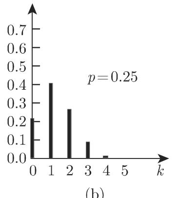
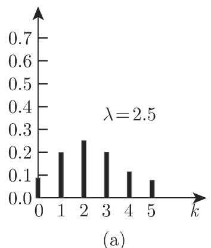
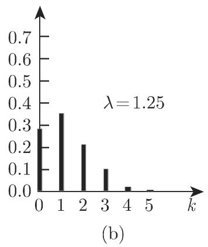
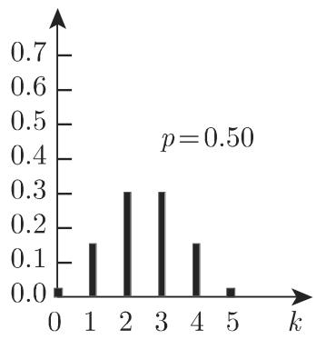
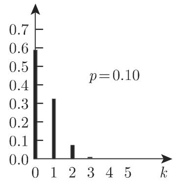

# 数学手册(原书第10版) 16.2.3 离散分布

## 概述

本来源为《数学手册(原书第10版)》16.2 概率论的第 3 小节，所属书籍见[[entities/数学手册原书第10版]]，母节为[[sources/10-数学手册原书第10版--7-162-概率论--dhwnyh]]。全节以[[concepts/瓮模型]]（两阶段总体、放回/不放回抽样）为统一框架，系统给出三种离散分布——[[concepts/二项分布]]（16.2.3.1）、[[concepts/超几何分布]]（16.2.3.2）、[[concepts/泊松分布]]（16.2.3.3）——的定义、期望与方差、实际计算用递推公式、随机变量之和的可加性，以及三种分布之间的相互逼近关系与适用条件。这是本 wiki 首次引入概率分布族概念，构成第 16 章从组合计数跨入分布理论的关键节点。

## 章节结构

- **引言：两阶段总体与瓮模型**——含 N 个元素的总体分为两类（具性质 A 的 M 个、不具性质 A 的 N−M 个）；依次选取 n 个元素时须区分放回与不放回，并引入样本与样本容量概念。
- **16.2.3.1 二项分布**——定义 (16.62)–(16.64)；期望与方差 (16.65a–b)；[[concepts/二项分布的正态逼近|正态逼近]] (16.65c)；递推公式 (16.65d)；服从二项分布的随机变量之和。
- **16.2.3.2 超几何分布**——定义 (16.66a–b)；期望与方差 (16.67a)/(16.67)；递推公式 (16.67c)；由二项分布逼近的条件。
- **16.2.3.3 泊松分布**——定义 (16.68)；期望与方差 (16.69a–b)；独立泊松变量之和；递推公式 (16.69c)；与二项分布的联系（极限与实用判据）；应用举例。

## 核心公式转录

以下按原文顺序转录本节全部编号公式（LaTeX 记法）；已核出的转写讹误以注释标出，逐条辨析见相应疑问页。

```latex
% ---- 16.2.3.1 二项分布 ----
(16.62)   W_p^n(k) = \binom{n}{k} p^k (1-p)^{n-k},   k = 0,1,2,\dots,n
(16.63)   P(A) = M/N = p,   P(\bar A) = (N-M)/N = 1-p = q
(16.64)   \binom{n}{k} = \frac{n!}{k!\,(n-k)!}
(16.65a)  E(X_n) = \mu = np
(16.65b)  D^2(X_n) = \sigma^2 = np(1-p)
(16.65c)  \lim_{n\to\infty} P\!\left(\frac{X_n - E(X_n)}{D(X_n)} \le \lambda\right)
              = \frac{1}{\sqrt{2\pi}} \int_{-\infty}^{t} \exp\!\left(-\frac{t^2}{2}\right) \mathrm{d}t
          % 存疑：不等号左端为 λ、积分上限为 t，两处不一致，左端疑为 t
(16.65d)  W_p^n(k+1) = \frac{n-k}{k+1} \cdot \frac{p}{q} \cdot W_p^n(k)
和的性质： X_n ~ B(n,p), X_m ~ B(m,p)  ⇒  X_n + X_m ~ B(n+m, p)
          % 注：原文此处未声明 X_n 与 X_m 相互独立

% ---- 16.2.3.2 超几何分布 ----
(16.66a)  P(X=k) = W_{M,N}^n(k) = \frac{\binom{M}{k}\binom{N-M}{n-k}}{\binom{N}{n}}
(16.66b)  0 \le k \le n,   k \le M,   n-k \le N-M
(16.67a)  \mu = E(X) = \sum_{k=0}^{n} k\,\frac{\binom{M}{k}\binom{N-M}{n-k}}{\binom{N}{n}} = n\,\frac{M}{N}
          % 存疑：原文求和分母作 \binom{N}{k}，与 (16.66a) 矛盾，应为 \binom{N}{n}
(16.67)   \sigma^2 = D^2(X) = \sum_{k=0}^{n} k^2\,\frac{\binom{M}{k}\binom{N-M}{n-k}}{\binom{N}{n}}
               - \left(n\,\frac{M}{N}\right)^2
               = n\,\frac{M}{N}\left(1-\frac{M}{N}\right)\frac{N-n}{N-1}
          % 编号疑为 (16.67b)；求和分母同样误作 \binom{N}{k}
(16.67c)  W_{M,N}^n(k+1) = \frac{(n-k)(M-k)}{(k+1)(N-M-n+k+1)}\, W_{M,N}^n(k)

% ---- 16.2.3.3 泊松分布 ----
(16.68)   P(X=k) = \frac{\lambda^k}{k!}\,e^{-\lambda},   k = 0,1,2,\dots;  \lambda > 0
(16.69a)  E(X) = \lambda
(16.69b)  D^2(X) = \lambda
(16.69c)  P(X=k+1) = \frac{\lambda}{k+1}\, P(X=k)
和的性质： X_1, X_2 相互独立, X_i ~ Po(\lambda_i)  ⇒  X_1 + X_2 ~ Po(\lambda_1+\lambda_2)
```

**记号约定**：本手册沿用德式记号，**D(X) 表示标准差、D²(X) 表示方差**（主定义属 16.2.1/16.2.2，尚未入库，见[[queries/16-2-3未入库回指缺口]]）；W_p^n(k)、W_{M,N}^n(k) 为手册的分布记号。

## 逼近关系与适用条件

手册给出的三条逼近关系分属不同分布，条件互不可串用：

| 逼近方向 | 依据 | 手册给出的条件（按转写原文） | 状态 |
|---|---|---|---|
| 二项 → 正态 | (16.65c)，正态参数 μ=np、σ²=np(1−p) | n 很大且 1−p 不是太小；p 越接近 0.5、n 越大近似越好；np>4 且 n(1−p)>4 | 条件转写可疑，见[[queries/1减p很小与p不大于008表述之辨]] |
| 二项 → 泊松 | (16.68)，λ=np | n→∞、p→0、np=λ 保持常数；实用判据 p≤0.08 且 n≥1500p | 「n≥1500p」待核，见[[queries/泊松逼近条件n不小于1500p之辨]] |
| 超几何 → 二项 | 参数按 (16.63) 取 p=M/N | M 与 N−M 均远大于 n（句子疑有脱字） | 图示佐证：N=100、n=5 时两分布无明显区别 |

## 图示

正文指出：因二项系数对称，p=q=0.5 时二项分布对称，p 偏离 0.5 越远对称性越弱；图 16.3 与图 16.2 的参数按 p=M/N 对应，图 16.4 与两者按 λ=np 对应，三组图可逐幅对照同一成功率下的三种模型。转写中图 16.2、16.4 的 (b) 子图标注缺失。

### 图 16.2 二项分布（n=5；p=0.5, 0.25, 0.1）


### 图 16.3 超几何分布（N=100, n=5；M=50, 25, 10）





### 图 16.4 泊松分布（λ=2.5, 1.25, 0.5）






## 转写讹误

本节转写质量明显较差，系统性问题集中登记于[[queries/16-2-3全节系统性转写讹误清单]]，要点包括：

1. 行内数学占位符系统性脱落（N、M、n、k、A、Ā、X 多处被吞，如「含有 个元素」「随机摸 个球」「参数为入的泊松分布」中「入」应为 λ）；
2. 「千」误代「于」（由千、接近千、对应千、对千）；「超儿何」应为「超几何」（多处）；「和凡 X₂ 互独立」应为「和 X₂ 相互独立」；
3. 正文将单项概率写作 p^k(n−p)^{n−k}，与 (16.63) 的 q=1−p 直接矛盾，应为 p^k(1−p)^{n−k}（见[[queries/正文p的k次n减p之n减k次疑为1减p]]）；
4. 式 (16.65c) 左端 λ 与右端 t 不一致（见[[queries/式16-65c左端λ与右端t不一致之辨]]）；
5. 式 (16.67a)/(16.67) 求和分母误作 C(N,k)（见[[queries/式16-67a与16-67分母Cnk疑为Cnn]]）；
6. 「若 N−M 也比 大很多」疑脱 M 与 n；「如果 n 很大，且 1−p 不是太小」疑脱「p 和」；
7. 页码引用残缺（「第 1069 16.2.4.1」等疑脱「页」字）；「参数是 p 的二项分布」疑为「参数是 n, p」。

## 与其他页面的联系

- **母节与书籍**：[[sources/10-数学手册原书第10版--7-162-概率论--dhwnyh]]、[[entities/数学手册原书第10版]]。
- **16.1 组合学**：(16.62)(16.64)(16.66a) 直接使用组合数 C(n,k)=n!/(k!(n−k)!)，见[[concepts/组合]]、[[concepts/排列]]、[[concepts/全排列]]与[[findings/式16-1至16-7计数公式与例题转录复算]]；瓮模型的放回/不放回抽样正对应[[comparisons/全排列组合排列无重复有重复公式比较]]中的有重复/无重复计数模型，构成「计数公式 → 概率分布」的知识链。
- **未入库回指**：正态分布（16.2.4.1）、表 21.16（第 1456 页，泊松分布数值表）等，见[[queries/16-2-3未入库回指缺口]]。

## 开放问题

1. 正态逼近条件 np>4、n(1−p)>4 与泊松逼近条件 p≤0.08、n≥1500p 是否与原书（原书第 10 版对应段落）一致（见[[queries/泊松逼近条件n不小于1500p之辨]]、[[queries/1减p很小与p不大于008表述之辨]]）；
2. 「当 1−p 很小时二项分布可由泊松分布逼近」是否应为「p 很小」；
3. 二项分布可加性原文是否确未提独立性（泊松处明确声明，体例不一致）；
4. 图 16.2/16.4 的 (b) 子图与正文参数的一一对应需查图核实。

<!-- llm-wiki:embedded-images -->
## Embedded Images

### Document







<!-- llm-wiki:embedded-images -->
