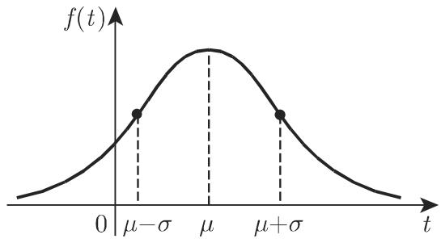
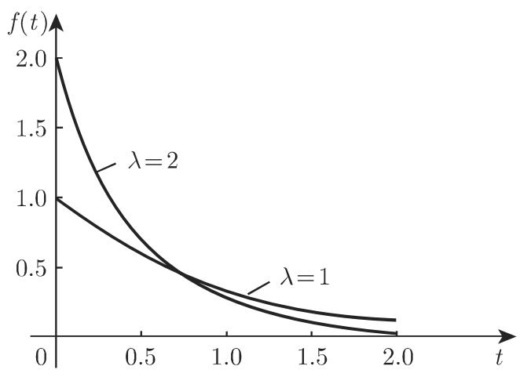
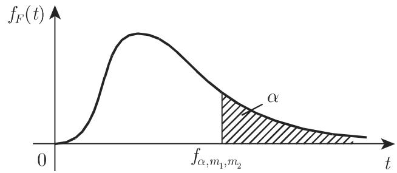
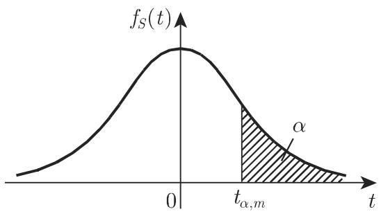

# 数学手册(原书第10版) 16.2.4 连续分布

## 概述

本节是 [[数学手册原书第10版]] 16.2 概率论章（母节源页 [[10-数学手册原书第10版--7-162-概率论--dhwnyh]]）的子节，承接 [[10-数学手册原书第10版--12-1621-事件频率和概率--1abmnju]]（16.2.1 事件、频率和概率）之后转向连续随机变量的分布。本节为参考书式的分布目录而非论证性文本：对每种分布按「密度函数与分布函数 → 期望与方差 → 性质与应用 → 分位数表回指」的固定体例给出结果，全部断言以显式积分公式和构造性定义（如 χ² = X₁² + ⋯ + Xₙ²）为证据，属教科书级强证据；但本转写版存在系统性 OCR 讹误，公式须复核后方可依赖（见「转写疑点与系统性讹误」）。

本节共介绍八种连续分布：[[正态分布]]、[[标准正态分布]]（含 [[高斯误差函数]]）、[[对数正态分布]]、[[指数分布]]、[[韦布尔分布]]、[[卡方分布]]、[[费希尔F分布]]、[[学生t分布]]（由 [[戈赛特]] 以笔名「学生」发表）。

## 分布汇总

| 分布 | 参数 | 期望 | 方差 | 公式编号 |
| --- | --- | --- | --- | --- |
| [[正态分布]] | μ, σ² | μ | σ² | 16.70–16.72 |
| [[标准正态分布]] | —（μ=0, σ²=1） | 0 | 1 | 16.73–16.75 |
| [[对数正态分布]] | μ_L, σ_L²（Y=log X 的） | exp(μ_L + σ_L²/2) | (exp σ_L² − 1)·exp(2μ_L + σ_L²) | 16.76–16.79 |
| [[指数分布]] | λ > 0 | 1/λ | 1/λ² | 16.80–16.81 |
| [[韦布尔分布]] | α（形状）, β（尺度）；三参数形式另有 γ（位置） | β·Γ(1 + 1/α) | β²·[Γ(1 + 2/α) − Γ²(1 + 1/α)] | 16.82–16.85 |
| [[卡方分布]] | 自由度 n | n | 2n | 16.86–16.92 |
| [[费希尔F分布]] | 自由度 m₁, m₂ | m₂/(m₂−2)（须 m₂>2） | 2m₂²(m₁+m₂−2)/[m₁(m₂−2)²(m₂−4)]（须 m₂>4） | 16.93–16.95 |
| [[学生t分布]] | 自由度 m（=n−1） | 0（m>1） | m/(m−2)（m>2） | 16.96–16.99 |

（F 分布两栏中「须 m₂>2」「须 m₂>4」为复核补注：原文 (16.95a,b) 未给适用条件，与 t 分布显式给出 m>1、m>2 的体例不一，疑脱。）

逐条复核结论：上表各公式与标准结果一致（已手工验证：(16.94a) 的 (m₁/2, m₂/2) 参数化等价于标准 F 密度；(16.97a) 为标准 t 密度；(16.78)、(16.83) 均正确；α=1 时韦布尔分布退化为 λ=1/β 的指数分布）。复核细节见四个 finding（「关联页面」）。

## 公式逐字转录

以下按小节转录本节全部编号公式，疑点处按源逐字保留。

### 16.2.4.1 正态分布

```
(16.70a)  P(X ⩽ x) = F(x) = 1/(σ√(2π)) · ∫_{−∞}^{x} e^{−(t−μ)²/(2σ²)} dt
(16.70b)  f(t) = 1/(σ√(2π)) · e^{−(t−μ)²/(2σ²)}
(16.71a)  E(X) = 1/(σ√(2π)) · ∫_{−∞}^{+∞} x·e^{−(x−μ)²/(2σ²)} dx = μ
(16.71b)  D²(X) = E[(X−μ)²] = 1/(σ√(2π)) · ∫_{−∞}^{+∞} (x−μ)²·e^{−(x−μ)²/(2σ²)} dx = σ²
(16.72)   P(a ⩽ X ⩽ b) = Φ((b−μ)/σ) − Φ((a−μ)/σ)
```

(16.71b) 后的未编号线性组合公式（逐字转录）：

```
若 X₁、X₂ 互独立，分别服从参数为 (μ₁, σ₁²)、(μ₂, σ₂²) 的正态分布，则
X = k₁X₁ + k₂X₂（k₁、k₂ 为实常数）也服从正态分布，其参数为
    μ = k₁μ₁ + k₂μ₂ ,   σ = √(k₁σ₁² + k₂σ₂²)
```

疑点：按方差性质应为 σ = √(k₁²σ₁² + k₂²σ₂²），k₁、k₂ 的平方上标疑在转写中脱落，见 [[正态线性组合方差k1k2疑未平方]]。

密度在 t = μ 处取得最大值，在 μ ± σ 处有拐点（原文回指「第 94(2.59)」及图 16.5(a)）。经变量代换 τ = (t−μ)/σ，一般正态分布函数值的计算可转化为 (0,1) 正态分布函数值的计算。

### 16.2.4.2 标准正态分布、高斯误差函数

```
(16.73a)  P(X ⩽ x) = Φ(x) = 1/√(2π) · ∫_{−∞}^{x} e^{−t²/2} dt = ∫_{−∞}^{x} φ(t) dt
(16.73b)  φ(t) = 1/√(2π) · e^{−t²/2}
(16.74)   Φ(−x) = 1 − Φ(x)
(16.75a)  Φ₀(x) = 1/√(2π) · ∫_{0}^{x} e^{−t²/2} dt = Φ(x) − 1/2
(16.75b)  erf(x) = 2/√π · ∫_{0}^{x} e^{−t²/2} dt = 2·Φ₀(√2·x)
```

疑点：(16.75b) 所附恒等式 2Φ₀(√2x) = (2/√π)∫₀ˣ e^{−u²}du 仅当被积函数为 e^{−t²} 时成立，与逐字转录的 e^{−t²/2} 自相矛盾，见 [[式16-75b误差函数被积函数疑为e负t平方]]。Φ(x) 的数值见第 1458 页表 21.17（表中仅给 x>0 的值，x<0 时用 (16.74)）。

### 16.2.4.3 对数正态分布

```
(16.76)   Y = log X
(16.77a)  f(t) = { 0,  t ⩽ 0;
                (log e)/(t·σ_L·√(2π)) · exp(−(log t − μ_L)²/(2σ_L²)),  t > 0 }
(16.77b)  F(x) = { 0,  x ⩽ 0;
                1/(σ_L·√(2π)) · ∫_{−∞}^{log x} exp(−(t−μ_L)²/(2σ_L²)) dt,  x > 0 }
(16.78)   μ = exp(μ_L + σ_L²/2),   σ² = (exp σ_L² − 1)·exp(2μ_L + σ_L²)
(16.79)   F(x) = Φ((log x − μ_L)/σ_L)
```

要点：μ_L、σ_L² 是 Y = log X（而非 X 本身）的期望与方差；实际应用中主要使用自然对数或常用对数；密度处处连续且只对正的自变量取正值；分布函数值经 (16.79) 由 Φ 计算（原文回指「第 1071 b」，所指不明）。应用：经济学、技术、生物过程中的寿命分析；正态分布可用于大量独立随机变量的加法叠加，对数正态分布可用于乘法叠加。

### 16.2.4.4 指数分布

```
(16.80a)  f(t) = { 0,  t < 0;   λ·e^{−λt},  t ⩾ 0 }
(16.80b)  F(x) = ∫_{−∞}^{x} f(t) dt = { 0,  x < 0;   1 − e^{−λx},  x ⩾ 0 }
(16.81)   μ = 1/λ,   σ² = 1/λ²
```

适用问题举例：电话的通话时间，放射性粒子的寿命，某些过程中机器在两次故障之间的工作时间，灯泡或某建筑构件的寿命等。

### 16.2.4.5 韦布尔分布

```
(16.82a)  f(t) = { 0,  t < 0;
                (α/β)·(t/β)^{α−1}·exp[−(t/β)^α],  t ⩾ 0 }
(16.82b)  F(x) = { 0,  x < 0;   1 − exp[−(x/β)^α],  x ⩾ 0 }
(16.83)   μ = β·Γ(1 + 1/α),   σ² = β²·[Γ(1 + 2/α) − Γ²(1 + 1/α)]
(16.84)   Γ(x) = ∫_{0}^{∞} t^{x−1}·e^{−t} dt,   x > 0
(16.85)   F(x) = 1 − exp[−((x−γ)/β)^α]   （三参数形式，γ 为位置参数）
```

α 是形状参数，β 是尺度参数（图 16.8、16.9）。α=1 且 λ=1/β 时韦布尔分布即为指数分布（原文此处转写作「a=l」，系「α=1」之讹）。Γ(x) 之定义与 [[Γ函数]] 一致（原文回指「第 682 8.2.5, 6.」，页码粘连）。应用：可靠性理论中特别有用，可极灵活地描述建筑构件的系统寿命。

### 16.2.4.6 χ² 分布

```
(16.86)   χ² = X₁² + X₂² + ⋯ + Xₙ²   （X₁,…,Xₙ 为相互独立的标准正态随机变量）
(16.87a)  f_χ²(t) = { 1/(2^{n/2}·Γ(n/2)) · t^{n/2−1}·e^{−t/2},  t > 0;   0,  t ⩽ 0 }
(16.87b)  F_χ²(x) = P(χ² ⩽ x) = 1/(2^{n/2}·Γ(n/2)) · ∫_{0}^{x} t^{n/2−1}·e^{−t/2} dt   (x > 0)
(16.88a)  E(χ²) = n
(16.88b)  D²(χ²) = 2n
(16.89)   X = Σ_{i=1}^{n} Xᵢ² 有密度函数  f(t) = (1/σ²)·f_χ²(t/σ²)
(16.90)   X = (1/n)·Σ_{i=1}^{n} Xᵢ² 有密度函数  f(t) = (n/σ²)·f_χ²(n·t/σ²)
(16.91)   X = √((1/n)·Σ_{i=1}^{n} Xᵢ²) 有密度函数  f(t) = (2t/σ²)·f_χ²(t²/σ²)
(16.92)   P(X > χ²_{α,m}) = α
```

疑点：(16.91) 由 (16.90) 变换推导应得 f(t) = (2nt/σ²)·f_χ²(n·t²/σ²)，定义与密度不一致，疑脱两处因子 n，见 [[式16-91均方根密度疑脱因子n]]。

其他要点：独立 χ² 变量之和仍服从 χ² 分布，自由度相加（n+m）；(16.89)–(16.91) 中诸 Xᵢ 为参数 (0, σ²) 的独立正态变量（原文「(0,CJ')」为「(0,σ²)」之转写讹误）；分位数 χ²_{α,m} 的数值见第 1460 页表 21.18（分位数定义回指第 1062 页 16.2.2.2 第 3 条）。体例问题：第 4 条标题作「独立正态随机变量之和」而内容为平方和 ΣXᵢ²；自由度记号在 (16.87) 用 n、在 (16.92) 用 m，前后不一。

### 16.2.4.7 费希尔 F 分布

```
(16.93)   F_{m₁,m₂} = (X₁/m₁) / (X₂/m₂)
(16.94a)  f_F(t) = (m₁/2)^{m₁/2}·(m₂/2)^{m₂/2}·Γ((m₁+m₂)/2) / [Γ(m₁/2)·Γ(m₂/2)]
                · t^{m₁/2−1} / ((m₁/2)·t + (m₂/2))^{(m₁+m₂)/2}   (t > 0)；  0 (t ⩽ 0)
(16.94b)  F_F(x) = 同 (16.94a) 常数 · ∫_{0}^{x} (t^{m₁/2−1} − 1)·dt / ((m₁/2)·t + (m₂/2))^{(m₁+m₂)/2}   (x > 0)
(16.95a)  E(F_{m₁,m₂}) = m₂/(m₂−2)
(16.95b)  D²(F_{m₁,m₂}) = 2·m₂²·(m₁+m₂−2) / [m₁·(m₂−2)²·(m₂−4)]
```

其中 X₁、X₂ 相互独立，分别服从自由度 m₁、m₂ 的 χ² 分布（原文「费希尔分布或 分布」脱「F」字）。疑点：(16.94b) 被积函数中的「− 1」与密度 (16.94a) 对照疑为衍文，见 [[式16-94b被积函数疑衍文负一]]；(16.95a,b) 疑脱适用条件 m₂>2 与 m₂>4。分位数 t_{α,m₁,m₂} 的数值见第 1461 页表 21.19。

### 16.2.4.8 学生 t 分布

```
(16.96)   T = X / √(Y/m)   （X 为 (0,1) 正态随机变量，Y 服从自由度 m = n−1 的 χ² 分布，相互独立）
(16.97a)  f_S(t) = 1/√(m·π) · Γ((m+1)/2)/Γ(m/2) · 1/(1 + t²/m)^{(m+1)/2}
(16.97b)  F_S(x) = P(T ⩽ x) = ∫_{−∞}^{x} f_S(t) dt = 1/√(m·π) · Γ((m+1)/2)/Γ(m/2)
                · ∫_{−∞}^{x} dt/(1 + t²/m)^{(m+1)/2}
(16.98a)  E(T) = 0   (m > 1)
(16.98b)  D²(T) = m/(m−2)   (m > 2)
(16.99a)  P(T > t_{α,m}) = α
(16.99b)  P(|T| > t_{α/2,m}) = α
```

（原文本小节标题与正文的「t」字系统性脱落，如「学生 分布或 分布」。）由 [[戈赛特]] 以笔名「学生」发表，适用于当样本容量较小时、且只能给出均值和标准差的估计的情形；标准差 (16.98b) 不再依赖于从中取出样本的总体标准差。分位数 t_{α,m}、t_{α/2,m} 的数值由第 1463 页表 21.20 给出。

## 转写疑点与系统性讹误

**四处数学性疑点**（影响公式正确性，优先级最高，均须以纸质原书核验）：

1. 正态线性组合方差 σ = √(k₁σ₁² + k₂σ₂²) 疑脱 k₁、k₂ 的平方 → [[正态线性组合方差k1k2疑未平方]]
2. (16.75b) erf 被积函数 e^{−t²/2} 与自附恒等式矛盾 → [[式16-75b误差函数被积函数疑为e负t平方]]
3. (16.91) 均方根变量的密度疑脱两处因子 n → [[式16-91均方根密度疑脱因子n]]
4. (16.94b) 被积函数「t^{m₁/2−1} − 1」的「− 1」疑为衍文 → [[式16-94b被积函数疑衍文负一]]

**系统性转写讹误**（汇总于 [[16-2-4全节系统性转写讹误清单]]）：变量符号 X 在各分布定义处系统性脱落；「t/F」字母在 16.2.4.7–8 标题与正文中系统性脱落；「和」后衍字「凡/劝」三处；「千/于」混淆至少 6 处（进一步坐实 [[千于字形系统性混淆之辨]]）；「(0,CJ')」应为「(0,σ²)」；「r(x)」应为「Γ(x)」；「a=l」应为「α=1」；「随机变最」应为「随机变量」；「分别服从自由度为 的」脱自由度记号 n、m；「样本容量 较小」脱符号 n；多处页码回指粘连（第 94(2.59)、第 1071 b、第 682 8.2.5,6.、第 106216.2.2.2,3.）。

## 图像

图 16.5(a) 正态分布（原文用于说明密度最大值与拐点）：



图 16.5(b) 高斯误差曲线（标准正态密度 φ）：


图 16.6 不同参数 μ_L、σ_L 下的对数正态密度（使用自然对数）：


图 16.7 指数分布密度：



图 16.8、16.9 韦布尔分布密度（原文以之说明形状参数 α 与尺度参数 β 的作用）：


图 16.10 χ² 分布：


图 16.11 费希尔 F 分布：



图 16.12(a) t 分布单侧分位数 t_{α,m}：



图 16.12(b) t 分布双侧分位数 t_{α/2,m}：


## 回指缺口

本节回指但未入库的内容（详见 [[16-2-4未入库回指缺口]]）：16.2.2（期望与方差 D²(X) 记号、16.2.2.2 第 3 条分位数定义，第 1062 页）；第 21 章表 21.17–21.20（第 1458/1460/1461/1463 页）；第 94 页 (2.59)（钟形曲线）；第 682 页 8.2.5（Γ 函数）；「第 1071 b」（所指不明）。

## 关联页面

- 转录复算：[[式16-70至16-75正态与标准正态分布转录复算]]、[[式16-76至16-85对数正态指数与韦布尔分布转录复算]]、[[式16-86至16-92卡方分布转录复算]]、[[式16-93至16-99费希尔F分布与学生t分布转录复算]]
- 比较：[[正态分布与对数正态分布比较]]、[[指数分布与韦布尔分布比较]]、[[卡方F与t分布的构造关系比较]]
- 方法：[[连续分布标准化与查表流程]]
- 既有页面：[[Γ函数]]（(16.83)–(16.84) 再次引用）、[[独立事件]]（16.2.1，本节所有独立性构造的前提）

<!-- llm-wiki:embedded-images -->
## Embedded Images

### Document


<!-- llm-wiki:embedded-images -->
