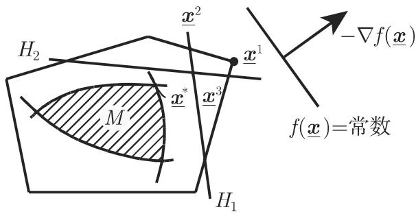

# 数学手册(原书第10版) 18.2.9 割平面法

《数学手册(原书第10版)》第 18 章 18.2「非线性优化问题」的第 9 小节，主题为 [[concepts/割平面法]]：对有界凸可行域上的线性目标规划问题，用一列始终包含可行域 $M$ 的凸多面体从外部迭代逼近，将原问题转化为一列线性规划问题求解。全节分两部分：第 1 部分给出问题的提法与求解原理（一般分离框架），第 2 部分给出 [[entities/凯利]]（Kelley）方法的具体割选取规则，并附收敛性论断与实用缺点评价。

## 内容提要

### 第 1 部分：问题的提法和求解原理

1. 问题形式（式 18.117）：有界区域 $M\subset\mathbb{R}^n$ 上极小化线性目标 $f(\underline{\boldsymbol{x}})=\underline{\boldsymbol{c}}^{\mathrm T}\underline{\boldsymbol{x}}$（$\underline{\boldsymbol{c}}\in\mathbb{R}^n$），可行域由凸函数约束 $g_i(\underline{\boldsymbol{x}})\leqslant 0$（$i=1,\dots,m$）给出（转写文本此处主语脱落）。
2. 适用面扩展：非线性但凸的目标函数的规划问题可经 [[concepts/目标函数线性化变换]] 化为式 18.117 的形式——把 $f(\underline{\boldsymbol{x}})-x_{n+1}\leqslant 0$（式 18.118）看作另一个约束，在 $\overline{g}_i(\underline{\boldsymbol{x}})=g_i(\underline{\boldsymbol{x}})\leqslant 0$ 之下极小化 $x_{n+1}$（式 18.119）。
3. 基本想法：通过极小点 $\underline{\boldsymbol{x}}^*$ 邻域中的凸多面体迭代线性逼近（转写文本此处宾语脱落，应为可行域 $M$），把原规划问题转化成一列线性规划问题。
4. 迭代骨架：先确定凸多面体 $P_1$（式 18.120），解其上的线性规划（式 18.121）得 $P_1$ 相对于 $f$ 的最优极端点 $\underline{\boldsymbol{x}}^1$；若 $\underline{\boldsymbol{x}}^1\in M$ 则找到原问题最优解，否则确定将点 $\underline{\boldsymbol{x}}^1$ 与 $M$（转写脱落）分离的超平面 $H_1$，于是新的多面体 $P_2$（式 18.122）仍包含 $M$（转写残缺）。
5. 配图 18.13：割平面法示意图（图注原文作「割平而法」，见下文讹误清单）。

### 第 2 部分：凯利（Kelley）方法

1. 不同方法之间的区别在于分离平面的选取。
2. 凯利规则：选择标号 $j_k$ 使得 $g_{j_k}(\underline{\boldsymbol{x}}^k)=\max\{g_i(\underline{\boldsymbol{x}}^k):i=1,\dots,m\}$（式 18.123），即当前点处违反最严重的约束；取该函数在 $\underline{\boldsymbol{x}}^k$ 处的切平面 $T$（式 18.124）为割。
3. 超平面 $H_k=\{\underline{\boldsymbol{x}}\in\mathbb{R}^n:T(\underline{\boldsymbol{x}})=0\}$ 把点 $\underline{\boldsymbol{x}}^k$ 与所有满足 $g_{j_k}(\underline{\boldsymbol{x}})\leqslant 0$ 的点集分离开；于是对于第 $k+1$ 个线性规划问题，增加一个约束条件 $T(\underline{\boldsymbol{x}})\leqslant 0$。
4. 收敛性论断（仅陈述未证明）：序列 $\{\underline{\boldsymbol{x}}^k\}$ 的每个聚点 $\underline{\boldsymbol{x}}^*$ 都是原问题的一个极小点。
5. 实用缺点：实际应用表明这种方法的收敛速度较低；此外，约束的数量总是不断增加。

## 公式转录（式 18.117–18.124 与两处超平面定义，逐式照录）

```latex
f(\underline{\boldsymbol{x}}) = \underline{\boldsymbol{c}}^{\mathrm{T}} \underline{\boldsymbol{x}} = \min!, \quad \underline{\boldsymbol{c}} \in \mathbb{R}^{n}                          % (18.117)
f(\underline{\boldsymbol{x}}) - x_{n+1} \leqslant 0, \quad x_{n+1} \in \mathbb{R}                                                                    % (18.118)
\overline{f}(\underline{\boldsymbol{x}}) = x_{n+1} = \min!, \quad \forall \overline{\boldsymbol{x}} = (\underline{\boldsymbol{x}}, x_{n+1}) \in \mathbb{R}^{n+1}  % (18.119)
P_{1} = \{\underline{\boldsymbol{x}} \in \mathbb{R}^{n}: \underline{\boldsymbol{a}}_{i}^{\mathrm{T}} \underline{\boldsymbol{x}} \leqslant b_{i},\ i = 1,\dots,s\}                     % (18.120)
f(\underline{\boldsymbol{x}}) = \min!, \quad \underline{\boldsymbol{x}} \in P_{1}                                                                    % (18.121)
P_{2} = \{\underline{\boldsymbol{x}} \in P_{1}: \underline{\boldsymbol{a}}_{s+1}^{\mathrm{T}} \underline{\boldsymbol{x}} \leqslant b_{s+1}\}                                          % (18.122)
g_{j_{k}}(\underline{\boldsymbol{x}}^{k}) = \max \{g_{i}(\underline{\boldsymbol{x}}^{k}): i = 1,\dots,m\}                                             % (18.123)
T(\underline{\boldsymbol{x}}) = g_{j_{k}}(\underline{\boldsymbol{x}}^{k}) + (\underline{\boldsymbol{x}} - \underline{\boldsymbol{x}}^{k})^{\mathrm{T}} \nabla g_{j_{k}}(\underline{\boldsymbol{x}}^{k})  % (18.124)
```

两处分离超平面定义（行内式，原文照录）：

```latex
H_{1} = \{\underline{\boldsymbol{x}}: \underline{\boldsymbol{a}}_{s+1}^{\mathrm{T}} \underline{\boldsymbol{x}} = b_{s+1},\ \underline{\boldsymbol{a}}_{s+1}^{\mathrm{T}} \underline{\boldsymbol{x}}^{1} > b_{s+1}\}
H_{k} = \{\underline{\boldsymbol{x}} \in \mathbb{R}^{n}: T(\underline{\boldsymbol{x}}) = 0\}, \quad \text{新增约束 } T(\underline{\boldsymbol{x}}) \leqslant 0
```

## 主要论断与证据强度

1. **割平面法基本框架**（关于 [[concepts/割平面法]]）：构造性论证，强度高——若 LP 最优极端点 $\underline{\boldsymbol{x}}^1\in M$ 即得原问题最优解；否则存在分离超平面 $H_1$，割后 $P_2$ 收紧且保留 $M$。但转写文本丢失「$M\subseteq P_1$」与「割保留 $M$」的显式表述，需靠凸分析补全（见 [[findings/式18-120至18-122多面体割平面迭代转录复算]]）。
2. **目标线性化变换的等价性**（关于 [[concepts/目标函数线性化变换]]）：强度高，可完全复算——可行点 $(\underline{\boldsymbol{x}},x_{n+1})$ 必有 $x_{n+1}\geqslant f(\underline{\boldsymbol{x}})$，且 $(\underline{\boldsymbol{x}}^*,f(\underline{\boldsymbol{x}}^*))$ 可行，故 $\min x_{n+1}=\min_M f$；$f,g_i$ 的凸性保证新可行集凸（见 [[findings/式18-117至18-119目标函数线性化变换复算]]）。
3. **凯利割的分离有效性**（关于 [[concepts/凯利割平面方法]]）：强度高，一步凸性论证可复算——凸函数切平面为下方逼近，故 $g_{j_k}(y)\leqslant 0\Rightarrow T(y)\leqslant 0$（半空间保留 $M$）；又 $\underline{\boldsymbol{x}}^k\notin M\Rightarrow g_{j_k}(\underline{\boldsymbol{x}}^k)>0=T(\underline{\boldsymbol{x}}^k)$（切除 $\underline{\boldsymbol{x}}^k$）（见 [[findings/式18-123至18-124凯利割平面构造复算]]）。
4. **收敛性**（仅关于 [[concepts/凯利割平面方法]]）：陈述级，强度中——序列 $\{\underline{\boldsymbol{x}}^k\}$ 的每个聚点都是原问题的极小点；原书未给证明，依赖 $M$ 有界等前提，不可外推到任意割选取的一般框架。
5. **实用缺点**（仅关于 [[concepts/凯利割平面方法]]）：定性经验陈述，强度低—中——收敛速度较低；约束数量总是不断增加。

## 转写讹误

系统性问题（详见 [[queries/18-2-9全节系统性转写讹误清单]]）：

- 「千」系统性误作「于」，本节约 6 处：「相应千」「相对千」「在千」「千是」（×2）「对千」（见 [[queries/千字疑为于字系统性之辨]]）；
- 「割平而法」应为「割平面法」，且图注「18.13 为割平而法的示意图」脱「图」字（见 [[queries/割平而法疑为割平面法之辨]]）；
- 「将点 $\underline{\boldsymbol{x}}^1$ 和 __ 分离」脱落分离对象，「于是新的多面体包含 __」句式残缺（见 [[queries/分离对象M与新多面体包含对象脱落之辨]]）；
- 「非线性但凸的目标函数（~)」回指符号残缺，疑指式 18.117（见 [[queries/目标函数回指符号疑为式18-117之辨]]）；
- 「的点竺」疑为「的点集」（见 [[queries/点竺疑为点集之辨]]）；
- 式 18.118 中 $x_{n+1}$ 被排为带下划线的向量记号 $\underline{\boldsymbol{x}}_{n+1}$，疑排版讹误；
- 「这里 由凸函数……给出」句首主语脱落（应为可行域 $M$ 的描述）；「迭代线性逼近 ，」宾语脱落；「相对千 $f(\underline{\boldsymbol{x}})$ ）」括号不配对。

## 内在张力

- 上图变换后的可行集在 $x_{n+1}$ 方向无上界，与式 18.117「有界区域 $M$」的前提存在轻微张力；
- 收敛性论断仅属凯利方法，第 1 部分的一般分离框架无对应论断，二者不可混淆（见 [[comparisons/一般割平面框架与凯利切平面割比较]]）。

## 与手册其他小节及维基既有页的联系

- 上承 [[sources/10-数学手册原书第10版--11-182-非线性优化问题--1gv38ye]]（18.2 总节）：本节入库后，18.2 的覆盖推进到 18.2.9；18.2.3、18.2.7、18.2.8 仍未入库（见 [[queries/18-2-9未入库回指缺口]]、[[queries/18-2小节覆盖与开放问题待明]]）。
- 回指 18.1 系列：方法把凸规划化为一列 LP，「$P_1$ 相对于 $f$ 的最优极端点 $\underline{\boldsymbol{x}}^1$」直接使用 [[concepts/极端点]] 理论；LP 子问题属 [[concepts/线性规划]]（[[concepts/线性规划规范形]]、[[concepts/单纯形法]]）的求解范围。
- 与 [[concepts/凸优化]]、[[concepts/非线性优化]]：方法适用域为凸问题，是 18.2.1–18.2.2 理论（[[concepts/库恩—塔克条件]]、[[concepts/优化中的对偶性]]）的算法侧延伸。
- 迭代流程整理见 [[methodology/割平面法迭代流程]]。

## 插图



<!-- llm-wiki:embedded-images -->
## Embedded Images

### Document


<!-- llm-wiki:embedded-images -->
