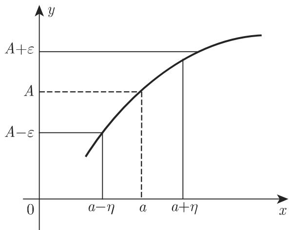
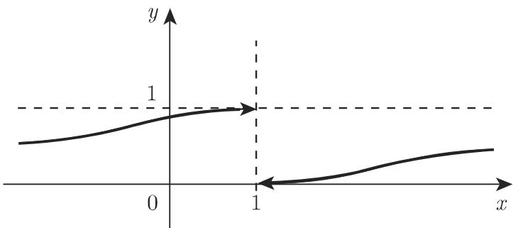

# 数学手册(原书第10版) 2.1.4 函数的极限

## 概述

本页收录《数学手册(原书第10版)》2.1.4 节“函数的极限”。该节上承 2.1.1–2.1.3 的函数概念（[[concepts/函数]]、[[concepts/实函数]]、[[concepts/分段函数]] 等），是全书分析学内容的起点：先以 $\varepsilon$-$\eta$ 语言给出 [[concepts/函数的极限]] 的完整定义体系（点极限、序列刻画、柯西判据、无穷极限、单侧极限、无穷远处极限六种刻画相互衔接），再以五条极限运算定理与 [[concepts/洛必达法则]]、[[concepts/泰勒展开式]] 两个计算工具解决极限计算，最后以 [[concepts/朗道符号]] 建立函数量级的比较理论。公式编号自 (2.14) 至 (2.29)。

## 小节结构与公式体系

| 小节 | 内容 | 式号 |
| --- | --- | --- |
| 2.1.4.1 | 函数极限的定义；$\varepsilon$-$\eta$ 精确定义（图 2.7） | 2.14；2.15a–2.15b |
| 2.1.4.2 | 序列极限的定义（[[concepts/归结原则]]，前向引用第 614 页 7.1.2） | — |
| 2.1.4.3 | [[concepts/柯西收敛准则]] | 2.16a–2.16b |
| 2.1.4.4 | 函数极限为无穷（$K$-$\eta$ 定义） | 2.17；2.18a–2.18e |
| 2.1.4.5 | [[concepts/左极限与右极限]]（图 2.8） | 2.19a–2.19c |
| 2.1.4.6 | $x$ 趋于无穷时函数的极限（有限极限例 A–C；无穷例 A–D） | 2.20a–2.20c |
| 2.1.4.7 | 函数极限定理（常函数、和差、积、商、[[concepts/夹逼定理]]） | 2.21–2.25 |
| 2.1.4.8 | 极限的计算（适当变形；伯努利-洛必达法则；泰勒展开） | 2.26 |
| 2.1.4.9 | 函数的量级与朗道符号（例 A–C） | 2.27a–2.27b；2.28a–2.28b；2.29 |

关键公式：

| 式号 | 内容 |
| --- | --- |
| (2.14) | $\lim_{x\to a}f(x)=A$ 或 $f(x)\to A\ (x\to a)$ |
| (2.15a)–(2.15b) | $x\neq a$ 且 $\lvert x-a\rvert<\eta\ \Rightarrow\ \lvert f(x)-A\rvert<\varepsilon$ |
| (2.16a)–(2.16b) | $0<\lvert x_1-a\rvert<\eta$、$0<\lvert x_2-a\rvert<\eta\ \Rightarrow\ \lvert f(x_1)-f(x_2)\rvert<\varepsilon$ |
| (2.17) | $\lim_{x\to a}\lvert f(x)\rvert=\infty$（$\lvert f(x)\rvert$ 无上界） |
| (2.18a)–(2.18b) | $a-\eta<x<a+\eta\ \Rightarrow\ \lvert f(x)\rvert>K$ |
| (2.18d)–(2.18e) | 邻域内恒正／恒负时记 $\lim f(x)=+\infty$／$-\infty$ |
| (2.19a)–(2.19b) | $A^{-}=\lim_{x\to a-0}f(x)=f(a-0)$；$A^{+}=\lim_{x\to a+0}f(x)=f(a+0)$ |
| (2.19c) | $A^{+}=A^{-}=A$（左右极限相等方有极限） |
| (2.20a)–(2.20b) | $x\to\pm\infty$ 时极限的 $N$-$\varepsilon$ 定义 |
| (2.20c) | $\lim_{x\to\pm\infty}\lvert f(x)\rvert=\infty$ 的 $N$-$K$ 定义 |
| (2.21)–(2.24) | 常函数、和差、积、商四定理（各附未定式排除条款） |
| (2.25) | 夹逼定理 |
| (2.26) | 洛必达法则：$\lim\frac{\varphi}{\psi}=\lim\frac{\varphi'}{\psi'}$ |
| (2.27a)–(2.27b) | 朗道符号 $O$、$o$ 定义 |
| (2.28a)–(2.28b) | $\lim_{x\to\infty}\lvert e^x/x^n\rvert=\infty$ 及其迭代证明 |
| (2.29) | $\lim_{x\to\infty}\lvert\log x/x^{\alpha}\rvert=0$ |

## 定义级原文（逐字保留）

$\varepsilon$-$\eta$ 定义（2.1.4.1，式 2.15a–2.15b）：

```text
若对任意正数 ε，都存在正数 η，使得对定义域中的每个 x，
当 x ≠ a 且 |x − a| < η 时，|f(x) − A| < ε 恒成立，
则称极限 lim_{x→a} f(x) = A 存在。
```

朗道符号定义（2.1.4.9 (4)，式 2.27a–2.27b）：

```text
f(x) = O(g(x))  表示  lim_{x→a} f(x)/g(x) = A ≠ 0,  A 为常数
f(x) = o(g(x))  表示  lim_{x→a} f(x)/g(x) = 0
（a 也可为 ±∞；朗道符号仅在 x 趋于给定的 a 时才有意义）
```

## 手册特有约定

1. **以 $\eta$ 代 $\delta$**：全书 $\varepsilon$-$\eta$ 语言使用 $\eta$，与通行教材的 $\varepsilon$-$\delta$ 记号不同；$x\to\pm\infty$ 情形则用 $N$。
2. **单侧极限记号 $f(a-0)$、$f(a+0)$**（式 2.19a–b），通行教材多记 $f(a^-)$、$f(a^+)$。
3. **区间端点的退化**：若 $a$ 为区间端点，$\lvert x-a\rvert<\eta$ 可简化为 $a-\eta<x$ 或 $x<a+\eta$（手册自注“也可参见第 70 页 2.1.4.5”）。
4. **五定理附未定式排除条款**：和差、积、商、幂各定理分别注明排除 $\infty-\infty$、$0\cdot\infty$、$\frac\infty\infty$、$0^0$、$1^\infty$、$\infty^0$ 型。
5. **冠名**：“伯努利-洛必达（Bernoulli-l'Hospital）法则”，一般简称洛必达法则。

## 算例清单（经独立重算核验无误）

- $\lim_{x\to1}\frac{x^3-1}{x-1}=3$（约分）
- $\lim_{x\to0}\frac{\sqrt{1+x}-1}{x}=\frac12$（有理化）
- $\lim_{x\to0}\frac{\sin 2x}{x}=2$（化归 $\frac{\sin u}{u}\to1$）
- $\lim_{x\to0}\frac{\ln\sin 2x}{\ln\sin x}=1$（洛必达，经化简两次应用）
- $\lim_{x\to\pi/2}(\pi-2x)\tan x=2$（$0\cdot\infty$ 取倒数）
- $\lim_{x\to1}\left(\frac{x}{x-1}-\frac1{\ln x}\right)=\frac12$（$\infty-\infty$ 通分后两次洛必达）
- $\lim_{x\to+0}x^x=1$（$0^0$ 取对数，$\lim_{x\to+0}x\ln x=0$）
- $\lim_{x\to0}\frac{x-\sin x}{x^3}=\frac16$（泰勒展开）
- 左右极限例：$f(x)=\frac{1}{1+e^{1/(x-1)}}$ 的 $f(1-0)=1$、$f(1+0)=0$（图 2.8）
- 2.1.4.6 诸例：$\lim_{x\to\pm\infty}\frac{x+1}{x}=1$、$\lim_{x\to-\infty}e^x=0$；$\frac{x^3-1}{x^2}$ 在 $x\to+\infty$ 为 $+\infty$、$x\to-\infty$ 为 $-\infty$；$\frac{1-x^3}{x^2}$ 则反之。

## 疑似错乱与矛盾（转写考据）

1. **（强）2.1.4.9 (1) “低阶（速度更快）”**：$\lvert f/g\rvert\to\infty$ 时称 $f$ 为比 $g$ “低阶”的无穷大，括号释义与用词自相矛盾，且与 (5) “$x^{n+1}$ 比 $x^n$ 高 1 阶”直接抵触；通行用法为“高阶”。见 [[queries/手册2.1.4.9低阶速度更快是否应为高阶]]。
2. **（强）例 C 结论 $O(\sin x)$**：例 B 已证 $1-\cos x=o(\sin x)$；例 C 设 $g(x)=x^2$、极限为 $\frac12$，结论却写 $1-\cos x=O(\sin x)$——按手册自己的 $O$ 定义此结论为假，应为 $O(x^2)$。见 [[queries/例C结论O-sinx应为O-x平方]]。
3. **（中强）大 $O$ 定义偏离通行口径**：式 2.27a 要求 $\lim f/g=A\neq0$，比通行的有界性定义严格得多，且与 (3) 以上下界定义的“同阶”口径不一致。见 [[queries/手册大O定义是否偏离通行有界性定义]]。
4. **（中强）式 2.26 前置条件疑似循环**：条件写作“$\lim_{x\to a}\frac{\varphi(x)}{\psi(x)}$ 存在”，以此为前提推出其等于导数比的极限；通行陈述应假设 $\lim\frac{\varphi'}{\psi'}$ 存在。见 [[queries/式2-26前置条件是否应为导数比极限存在]]。
5. **（轻）2.1.4.2 单向表述**：标题为“序列极限的定义”，内容仅为“函数极限存在 $\Rightarrow$ 一切相应序列收敛”的单向蕴含；完整归结原则为双向等价。
6. **（轻）措辞疑点**：商的极限中“检验分子的符号”（$\frac00$ 型）含义不明；(6) “任意多次的幂函数”疑应为“任意正数次幂函数”。

本节延续既有“手册勘误考据”工作流，可对照 [[queries/周期定义最小正整数是否应为最小正数]]、[[queries/赫尔德不等式是否应补充共轭指数p大于1]] 等。

## 关联与去向

- 上承：[[concepts/函数]]、[[concepts/实函数]]（2.1.1）；[[concepts/分段函数]]（2.1.2）。
- 冠名关联：[[concepts/伯努利不等式]]（1.4 节）与“伯努利-洛必达法则”同出 Bernoulli 冠名。
- 前向引用（待后续章节入库回填）：6.1.4.5 泰勒级数（第 594 页）、7.1.2（第 614 页）。
- 本节衍生的发现页：[[findings/函数极限的精确定义及a点无需有定义]]、[[findings/函数极限可由收敛数列刻画]]、[[findings/柯西收敛准则是极限存在的充要条件]]、[[findings/无穷极限的定义及正负无穷的区分]]、[[findings/左右极限存在且相等方有极限]]、[[findings/无穷远处极限的N-定义与诸例]]、[[findings/极限五定理均附未定式排除条款]]、[[findings/洛必达法则的条件可迭代性与失效注记]]、[[findings/七类未定式的化归路径]]、[[findings/朗道符号定义与指数对数量级结论]]。

## 插图





<!-- llm-wiki:embedded-images -->
## Embedded Images

### Document


<!-- llm-wiki:embedded-images -->
