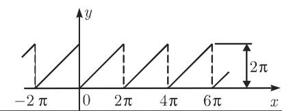
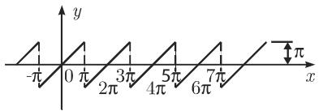
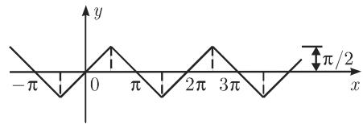
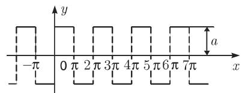
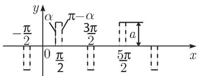
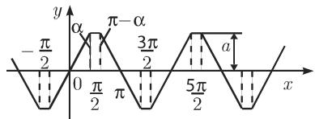
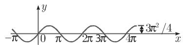

# 数学手册(原书第10版) 21.6 傅里叶级数

## 概述

本源为 [[entities/数学手册(原书第10版)]] 第 21 章「表」之第 6 节，收录 19 个标准 $2\pi$-周期函数的傅里叶展开式：条目 1–13 为常见波形（锯齿、三角、方波、矩形脉冲、梯形、抛物线、整流波形等），各附一幅波形图（共 13 幅，哈希命名，图像内容本次未核验）；条目 14–15 为非整数频率参数 $u$ 之 $\cos ux$、$\sin ux$ 展开；条目 16 为乘积型 $x\cos x$；条目 17–19 为对数型函数。转录中留有 4 处「续表」标记（分别位于条目 2、6、11、16 之后），表明原书将该表排为 5 个表块（1–2、3–6、7–11、12–16、17–19）。本节未署作者，书目信息见母本实体页。

wiki 此前已入库第 21 章之 21.1、21.2、21.3 与第 20 章多节；本节为傅里叶主题之首份入库材料，21.4、21.5 两节仍缺位（[[queries/21-6未入库回指缺口]]）。

## 全表转录（19 式）

「定义」列为一个周期内的分段定义（依源转录，个别明显 OCR 讹误按数学意图回写，并在下文「转录讹误」中登记）；「级数」列为源中所给展开式。全表约定周期 $2\pi$。

| 序 | 定义（一个周期内） | 傅里叶级数 |
|---|---|---|
| 1 | $y=x$，$0<x<2\pi$ | $y=\pi-2\left(\frac{\sin x}{1}+\frac{\sin 2x}{2}+\frac{\sin 3x}{3}+\cdots\right)$ |
| 2 | $y=x$，$0\le x\le\pi$；$y=2\pi-x$，$\pi<x\le 2\pi$ | $y=\frac{\pi}{2}-\frac{4}{\pi}\left(\cos x+\frac{\cos 3x}{3^{2}}+\frac{\cos 5x}{5^{2}}+\cdots\right)$ |
| 3 | $y=x$，$-\pi<x<\pi$ | $y=2\left(\frac{\sin x}{1}-\frac{\sin 2x}{2}+\frac{\sin 3x}{3}-\cdots\right)$ |
| 4 | $y=x$，$-\frac{\pi}{2}\le x\le\frac{\pi}{2}$；$y=\pi-x$，$\frac{\pi}{2}\le x\le\frac{3\pi}{2}$ | $y=\frac{4}{\pi}\left(\sin x-\frac{\sin 3x}{3^{2}}+\frac{\sin 5x}{5^{2}}-\cdots\right)$ |
| 5 | $y=a$，$0<x<\pi$；$y=-a$，$\pi<x<2\pi$ | $y=\frac{4a}{\pi}\left(\sin x+\frac{\sin 3x}{3}+\frac{\sin 5x}{5}+\cdots\right)$ |
| 6 | $y=0$（$0\le x<\alpha$、$\pi-\alpha<x\le\pi+\alpha$、$2\pi-\alpha<x\le 2\pi$）；$y=a$（$\alpha<x<\pi-\alpha$）；$y=-a$（$\pi+\alpha<x\le 2\pi-\alpha$） | $y=\frac{4a}{\pi}\left(\cos\alpha\sin x+\frac{1}{3}\cos 3\alpha\sin 3x+\frac{1}{5}\cos 5\alpha\sin 5x+\cdots\right)$ |
| 7 | $y=\frac{ax}{\alpha}$（$-\alpha\le x\le\alpha$，转录作 $-a\le x\le a$，疑 $\alpha$ 讹作 $a$）；$y=a$（$\alpha\le x\le\pi-\alpha$）；$y=\frac{a(\pi-x)}{\alpha}$（$\pi-\alpha\le x\le\pi+\alpha$）；$y=-a$（$\pi+\alpha\le x\le 2\pi-\alpha$） | $y=\frac{4}{\pi}\frac{a}{\alpha}\left(\sin\alpha\sin x+\frac{1}{3^{2}}\sin 3\alpha\sin 3x+\frac{1}{5^{2}}\sin 5\alpha\sin 5x+\cdots\right)$ |
| 8 | $y=x^{2}$，$-\pi\le x\le\pi$ | $y=\frac{\pi^{2}}{3}-4\left(\frac{\cos x}{1}-\frac{\cos 2x}{2^{2}}+\frac{\cos 3x}{3^{2}}-\cdots\right)$ |
| 9 | $y=x(\pi-x)$，$0\le x\le\pi$（延拓方式源中未明示） | $y=\frac{\pi^{2}}{6}-\left(\frac{\cos 2x}{1^{2}}+\frac{\cos 4x}{2^{2}}+\frac{\cos 6x}{3^{2}}+\cdots\right)$ |
| 10 | $y=x(\pi-x)$，$0\le x\le\pi$；$y=(\pi-x)(2\pi-x)$，$\pi\le x\le 2\pi$ | $y=\frac{8}{\pi}\left(\sin x+\frac{1}{3^{3}}\sin 3x+\frac{1}{5^{3}}\sin 5x+\cdots\right)$ |
| 11 | $y=\sin x$，$0\le x\le\pi$（转录原文讹作「0 :::;; x :::;; 兀」） | $y=\frac{2}{\pi}-\frac{4}{\pi}\left(\frac{\cos 2x}{1\cdot 3}+\frac{\cos 4x}{3\cdot 5}+\frac{\cos 6x}{5\cdot 7}+\cdots\right)$ |
| 12 | $y=\cos x$，$0<x<\pi$ | $y=\frac{4}{\pi}\left(\frac{2\sin 2x}{1\cdot 3}+\frac{4\sin 4x}{3\cdot 5}+\frac{6\sin 6x}{5\cdot 7}+\cdots\right)$ |
| 13 | $y=\sin x$，$0\le x\le\pi$；$y=0$，$\pi\le x\le 2\pi$ | $y=\frac{1}{\pi}+\frac{1}{2}\sin x-\frac{2}{\pi}\left(\frac{\cos 2x}{1\cdot 3}+\frac{\cos 4x}{3\cdot 5}+\frac{\cos 6x}{5\cdot 7}+\cdots\right)$ |
| 14 | $y=\cos ux$，$-\pi\le x\le\pi$（$u$ 为任意非整数） | $y=\frac{2u\sin u\pi}{\pi}\left(\frac{1}{2u^{2}}-\frac{\cos x}{u^{2}-1}+\frac{\cos 2x}{u^{2}-4}-\frac{\cos 3x}{u^{2}-9}+\cdots\right)$ |
| 15 | $y=\sin ux$，$-\pi<x<\pi$（$u$ 为任意非整数） | $y=\frac{2\sin u\pi}{\pi}\left(\frac{\sin x}{1-u^{2}}-\frac{2\sin 2x}{4-u^{2}}+\frac{3\sin 3x}{9-u^{2}}+\cdots\right)$ |
| 16 | $y=x\cos x$，$-\pi<x<\pi$ | $y=-\frac{1}{2}\sin x+\frac{4\sin 2x}{2^{2}-1}-\frac{6\sin 3x}{3^{2}-1}+\frac{8\sin 4x}{4^{2}-1}$（转录无省略号） |
| 17 | $y=-\ln\left(2\sin\frac{x}{2}\right)$，$0<x\le\pi$（定义域疑有误，见 [[queries/条目17定义域疑脱2π之辨]]） | $y=\cos x+\frac{1}{2}\cos 2x+\frac{1}{3}\cos 3x+\cdots$ |
| 18 | $y=\ln\left(2\cos\frac{x}{2}\right)$，$0\le x<\pi$ | $y=\cos x-\frac{1}{2}\cos 2x+\frac{1}{3}\cos 3x-\cdots$ |
| 19 | $y=\frac{1}{2}\ln\cot\frac{x}{2}$，$0<x<\pi$ | $y=\cos x+\frac{1}{3}\cos 3x+\frac{1}{5}\cos 5x+\cdots$ |

条目 7 之特例（$\alpha=\frac{\pi}{3}$）：

$$y=\frac{6\sqrt{3}\,a}{\pi^{2}}\left(\sin x-\frac{1}{5^{2}}\sin 5x+\frac{1}{7^{2}}\sin 7x-\frac{1}{11^{2}}\sin 11x+\cdots\right)$$

（式末转录有孤立衍文「1」，见 [[queries/条目7特例式末衍文1之辨]]。）

### 表下数学注记

- **隐含延拓**：条目 9、11、12 仅给出 $[0,\pi]$ 或 $(0,\pi)$ 上之定义，级数所对应之延拓须由谱结构反推——条目 11 为偶延拓（即 $\lvert\sin x\rvert$，全波整流）；条目 12 为奇延拓；条目 9 之级数仅含常数与偶次余弦，隐含 $f(x+\pi)=f(x)$ 之 $\pi$-周期延拓（$[\pi,2\pi]$ 上为 $(x-\pi)(2\pi-x)$），源中未明示，不注明延拓则问题不定。
- **区间体例不一**：条目 6 之 $x=\alpha$、$x=\pi-\alpha$ 未被任何区间覆盖（跳点），而条目 4、7 在衔接点两段皆闭（重复覆盖）；因系数为积分、不受单点值影响，无数学后果。
- **窗口选取不一**：条目 1、2 用 $(0,2\pi)$，条目 3、8、14–16 用 $(-\pi,\pi)$，条目 4、7 用平移窗（如 $[-\frac{\pi}{2},\frac{3\pi}{2}]$、$[-\alpha,2\pi-\alpha]$），条目 9–13 只给半周期。
- **对称性与谱**：谱结构由对称性决定，见 [[concepts/对称性与谐波结构]]；对数族与参数族分别见 [[concepts/对数三角级数族]]、[[concepts/非整数频率傅里叶展开]]。

## 转录讹误

以下讹误集中于排版层；数学层（19 式系数）经复算全部通过（见下节）。全部条目待原书核对后方可定谳，详见 [[queries/21-6全节系统性转写讹误清单]]。

| 位置 | 转录原文 | 疑当为 | 置信 |
|---|---|---|---|
| 首条编号 | 「l.」 | 「1.」 | 高（自明） |
| 条目 10 编号 | 「IO.」 | 「10.」 | 高（自明） |
| 条目 11 定义域 | 「0 :::;; x :::;; 兀」 | $0\le x\le\pi$ | 高（自明） |
| 条目 7 首段定义域 | $-a\le x\le a$ | $-\alpha\le x\le\alpha$ | 中（依波形连续性） |
| 条目 7 特例式末 | 衍文「1」 | 疑脚注序号 | 中 |
| 条目 16 级数末 | 无省略号 | 「⋯」 | 中 |
| 条目 17 定义域 | $0<x\le\pi$ | $0<x<2\pi$ | 中 |

其中条目 16、17 两项分别详见 [[queries/条目16级数末疑脱省略号之辨]]、[[queries/条目17定义域疑脱2π之辨]]。条目 17 之疑在核对前应表述为「转录疑」而非「原书误」——在 $(0,\pi]$ 上该恒等式亦真，只是非最大域。

## 复算状态

- **系数复算**：19 式按 Euler–Fourier 公式直接符号积分，系数全部吻合（[[findings/21-6傅里叶级数十九式系数复算]]；方法见 [[methodology/傅里叶系数直接积分复算法]]）。
- **结构关系网**：条目间微分链、参数退化链、线性组合关系复算通过（[[findings/21-6条目间结构关系与极限退化复算]]）。
- **古典级数特值**：取特殊点值得 $\sum\frac{1}{n^{2}}=\frac{\pi^{2}}{6}$、$\frac{\pi^{2}}{12}$、$\frac{\pi^{2}}{8}$、Leibniz $\frac{\pi}{4}$、$\ln 2$、$\beta(3)=\frac{\pi^{3}}{32}$（[[findings/21-6古典级数特值复算]]）。

## 与手册其他章节及本 wiki 之关联

- **21.1 常用数学常数**（[[concepts/常用数学常数]]）：上列特值为 21.1 之数值提供独立来源互证。
- **第 20 章 Mathematica**（[[concepts/Integrate积分命令族]]）：本表系数之符号积分复算可由手册自载命令完成，系手册两章间之自然内部回指。
- **方法论**：与 [[methodology/常数表定义式交叉复算法]] 平行而对象不同（常数表↔系数表），见 [[methodology/傅里叶系数直接积分复算法]]。
- **主题概念页**：[[concepts/傅里叶级数]]。

## 波形图清单（条目 1–13，内容未核验）

| 条目 | 波形图（wiki 相对路径） |
|---|---|
| 1 | media/10-数学手册原书第10版--9-216-傅里叶级数--4mrjes/001-2040f1d0b0e7d1e68dca4bf1c7c53c32eb69900402d625200033d5cf9f9c2394.jpg |
| 2 | media/10-数学手册原书第10版--9-216-傅里叶级数--4mrjes/002-90f78512716a3eff007b2c13a97a4bf42f3145fff3664b9f473bfa715194ca53.jpg |
| 3 | media/10-数学手册原书第10版--9-216-傅里叶级数--4mrjes/003-8e18b14c23862f7cb6010f1a8e83216199f198dfb18c5e72004f76be4e96b868.jpg |
| 4 | media/10-数学手册原书第10版--9-216-傅里叶级数--4mrjes/004-701ee50c40ee5f959d4a76daf5c07b890d309a7de3404f59dabe61dad156b10b.jpg |
| 5 | media/10-数学手册原书第10版--9-216-傅里叶级数--4mrjes/005-7e834876d47fe036f932012fd9f51b9dd48283fb8fddd2818d407002efcf2363.jpg |
| 6 | media/10-数学手册原书第10版--9-216-傅里叶级数--4mrjes/006-44b779f92d14a1cd35cb892b48e645fe77f294b8b214483f9a5e66aec2e79468.jpg |
| 7 | media/10-数学手册原书第10版--9-216-傅里叶级数--4mrjes/007-b40c93ae0a46436301b58e9c8d9e292886800fd2039ac62569aee2ea080c646b.jpg |
| 8 | media/10-数学手册原书第10版--9-216-傅里叶级数--4mrjes/008-7564a38e45c33684170cd58f5be7c45520a9a71fc3b1a6a10e5aa13e06d5bde3.jpg |
| 9 | media/10-数学手册原书第10版--9-216-傅里叶级数--4mrjes/009-886d44a1307ef426dd6b8cfad5940a99fec4a2bd3303c3991cbcff01ff73067c.jpg |
| 10 | media/10-数学手册原书第10版--9-216-傅里叶级数--4mrjes/010-c77b9ad483aaeedc35124c0a8ba5b7a3e8e12cb18c285cf61dbc0ee314aa8602.jpg |
| 11 | media/10-数学手册原书第10版--9-216-傅里叶级数--4mrjes/011-c848bbba259cdbfe4dde7d5189910f37b7908c2936f40b6e81dd78748bde87ab.jpg |
| 12 | media/10-数学手册原书第10版--9-216-傅里叶级数--4mrjes/012-9fe52aca9668f2631a6147eaa8ce0a90d17ac53348f7dba53bb1f09e4dd59c02.jpg |
| 13 | media/10-数学手册原书第10版--9-216-傅里叶级数--4mrjes/013-3322f9dee0a3c8880f0b6407e86d3628cc0a0d898499c9a0185e2026b33b6c41.jpg |

<!-- llm-wiki:embedded-images -->
## Embedded Images

### Document

<!-- llm-wiki:embedded-images -->
