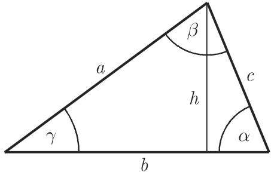
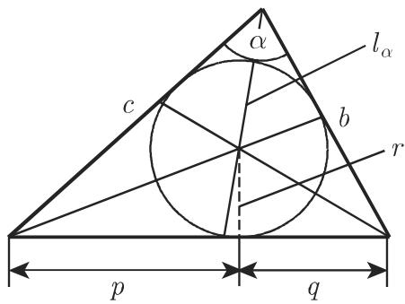
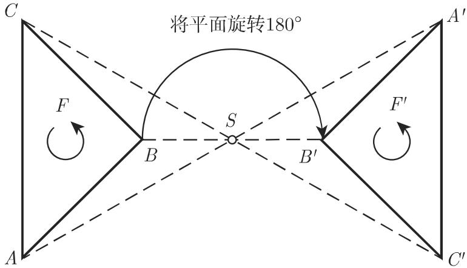
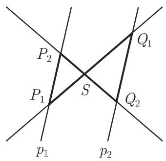

# 数学手册(原书第10版) 3.1.3 平面三角形

## 概述

本源是 [[entities/数学手册原书第10版]] 中 3.1 平面几何学（父节见 [[sources/10-数学手册原书第10版--8-31-平面几何学--g0i8gh]]）的第 3 小节，为手册式的定义与定理陈述，**不含证明**。内容分两大块：

1. **3.1.3.1 有关平面三角形的命题**（条目 (1)–(12)）：三角不等式、内角和、唯一确定条件，以及中线与重心、角平分线、内切圆、外接圆、高与垂心、等腰三角形、等边三角形、中位线、直角三角形。
2. **3.1.3.2 对称**（1–5）：中心对称与轴对称、图形的定向、直接/间接合同；全等三角形与四条全等定理；相似三角形、四条相似定理与面积平方律；截距定理（第一、第二）及其推广。

本节两处前向引用 3.2 平面三角学：第 188 页图 3.31（直角三角形）与第 191 页表 3.4（第三个基本问题，SSA 多解性）。待处理该节时应回链本源。

## 核心公式（逐字转录）

三角不等式（两边之和大于第三边，图 3.8）：

$$
b + c > a.\tag{3.14}
$$

内角和：

$$
\alpha + \beta + \gamma = 180^{\circ}.\tag{3.15}
$$

第一截距定理（自同一点 $S$ 发出的两条射线被平行线 $p_1$、$p_2$ 所截）：

$$
\left| \frac{\overline {SP_1}}{\overline {SQ_1}} \right| = \left| \frac{\overline {SP_2}}{\overline {SQ_2}} \right|.\tag{3.16}
$$

第二截距定理：

$$
\left| \frac{\overline {SP_1}}{\overline {SQ_1}} \right| = \left| \frac{\overline {P_1 P_2}}{\overline {Q_1 Q_2}} \right| \quad \text{或} \quad \left| \frac{\overline {SP_2}}{\overline {SQ_2}} \right| = \left| \frac{\overline {P_1 P_2}}{\overline {Q_1 Q_2}} \right|.\tag{3.17}
$$

## 关键配置清单（逐字转录）

3.1.3.1 (3) 三角形唯一确定条件：

- 三条边，或
- 两条边及其夹角，或
- 两角及其所夹的边

给定两条边及其中一边所对的角时，它们定义两个、一个或者没有这样的三角形（参见第 191 页表 3.4 中第三个基本问题）。

3.1.3.2.3 b) 三角形全等定理（相同即全等）：

- 三条边 (SSS)，或
- 两条边和它们之间的夹角 (SAS)，或
- 一条边和夹这条边的两个内角 (ASA)，或
- 两条边和较长的一边所对的内角 (SSA)

3.1.3.2.4 c) 三角形相似定理（相同即相似）：

- 三边之比
- 两个内角
- 两边之比和它们所夹的内角
- 两边之比和较长的一边所对的内角

## 条目 (1)–(12) 速览

| 条目 | 内容 | 关联页面 |
|---|---|---|
| (1) | 三角不等式（式 3.14） | [[findings/三角不等式与内角和]] |
| (2) | 内角和 180°（式 3.15） | [[findings/三角不等式与内角和]] |
| (3) | 唯一确定条件与 SSA 多解性 | [[findings/三角形的唯一确定条件与SSA多解性]] |
| (4) | 中线共点于重心，从顶点算起分中线 2:1 | [[concepts/三角形的中线与重心]] |
| (5) | 角平分线共点 | [[concepts/角平分线]] |
| (6) | 内切圆：圆心为角平分线交点；半径称「边心距或短半径」 | [[concepts/内切圆]] |
| (7) | 外接圆：过三顶点；圆心为三边垂直平分线交点 | [[concepts/外接圆]] |
| (8) | 三条高共点于垂心 | [[concepts/三角形的高与垂心]] |
| (9) | 等腰三角形：任两边相等即足；第三边上的高、中线、垂直平分线重合 | [[concepts/等腰三角形]] |
| (10) | 等边三角形：四心重合 | [[concepts/等边三角形]] |
| (11) | 中位线：平行于第三边且为其半长 | [[concepts/中位线]] |
| (12) | 直角三角形定义（前向引用第 188 页图 3.31） | [[concepts/直角三角形]] |

## 对称、全等、相似部分要点

- **中心对称**：平面绕对称中心旋转 180° 后图形恰好覆盖自己；大小形状不变，故为相合映射；定向类保持，故为直接合同。
- **轴对称**：图形在空间绕轴旋转 180° 后对应点相互覆盖，即对该轴的反射；定向相反，故为间接合同。对空间图形也有类似的说法（手册评注）。
- **图形的定向**：图形边界旋转的方向，正向（逆时针）或负向（顺时针），是区分直接/间接合同的判据。
- **全等**：大小和形状相符合；可通过平移、旋转、反射及这些变换的组合变换到重合位置。直接全等图形仅需平移与旋转；间接全等图形因定向类相反，还需一次关于一条直线的轴对称变换。
- **相似**：形状相同而大小不同；对应角相等（等价地，对应线段之长成比例）。相似平面图形的面积与相应线性元素（边、高、对角线等）之比的平方成比例。相似定理只要求边之比相等而非边长相等，故弱于相应全等定理。
- **截距定理**：三角形相似定理的推论；当点 $S$ 位于两平行线之间时，对在点 $S$ 相交的直线（而非仅射线）情形也成立。

## 转写质量备注

- 系统性 OCR 讹字：「千」代「于」（大千、相交千、垂直千、位千、对千、内切千等），「笫」代「第」（笫一/笫二截距定理），「平而」代「平面」。
- 符号丢失：轴对称段的对称轴 $g$ 与截距定理段的公共点 $S$ 在叙述句中多处空缺（公式 LaTeX 中完整），见 [[queries/轴对称与截距定理段符号S与g是否缺失]]。
- 疑似错乱句：「轴对称图形是间接全等的。为了将它们彼此变换到另一个，全部需要三种变换。」见 [[queries/轴对称间接全等句子是否转写讹误]]。
- 术语不一致：「合同」（直接合同的、间接合同映射）与「全等」（直接全等、间接全等）混用，实为同一概念（kongruent）的两种译名。
- 内切圆半径的别名「短半径」在中文数学文献中非通行术语，译名存疑（见 [[concepts/内切圆]]）。
- 插图位置错位：图 3.10、3.11 插于条目 (9) 之后而正文引用在 (6)、(7)；图 3.8/3.9 亦后置于 (3)。属排版浮动，非内容错误。

## 与既有维基的联系

- 本源给出「边心距」的明确定义（= 三角形内切圆半径，即圆心到切线的距离），这强化了 [[queries/圆锥例边心距s是否应译作母线]] 的怀疑：按此定义，2.15 圆锥例中把 $s = \sqrt{h^2 + r^2}$（母线）称作「边心距」应属误译——圆锥轴截面的边心距应为该三角形的内切圆半径。
- 条目 (3) 的唯一确定清单只列 SSS/SAS/ASA，不含 SSA（较长边），与 3.1.3.2.3 b) 的全等定理清单表面不一致，见 [[queries/唯一确定清单为何不含SSA较长边]]。

## 插图存档

图 3.8 三角不等式与三角形记号。

图 3.9 中线与重心。

图 3.10 内切圆（圆心为角平分线交点）。

图 3.11 外接圆（圆心为三边垂直平分线交点）。

图 3.12 中心对称与图形的定向。

图 3.13 轴对称与定向类的翻转。

图 3.14(a) 截距定理（自同一点发出的射线情形）。

图 3.14(b) 点 $S$ 位于两平行线之间、相交直线情形。

## 关联产出页面

- 概念：[[concepts/平面三角形]]、[[concepts/全等三角形]]、[[concepts/相似三角形]]、[[concepts/中心对称]]、[[concepts/轴对称]]、[[concepts/图形的定向]]、[[concepts/相合映射]]、[[concepts/截距定理]]、[[concepts/内切圆]]、[[concepts/外接圆]]、[[concepts/三角形的中线与重心]]、[[concepts/三角形的高与垂心]]、[[concepts/角平分线]]、[[concepts/中位线]]、[[concepts/等腰三角形]]、[[concepts/等边三角形]]、[[concepts/直角三角形]]
- 发现：[[findings/三角不等式与内角和]]、[[findings/三角形的唯一确定条件与SSA多解性]]、[[findings/三角形四心的共点性]]、[[findings/等腰三线合一与等边四心合一]]、[[findings/中位线定理]]、[[findings/三角形全等定理四条]]、[[findings/三角形相似定理四条与面积平方律]]、[[findings/截距定理两条及S居中推广]]
- 比较：[[comparisons/全等定理与相似定理比较]]、[[comparisons/中心对称与轴对称比较]]、[[comparisons/三角形四心比较]]
- 疑问：[[queries/轴对称间接全等句子是否转写讹误]]、[[queries/轴对称与截距定理段符号S与g是否缺失]]、[[queries/唯一确定清单为何不含SSA较长边]]

<!-- llm-wiki:embedded-images -->
## Embedded Images

### Document

<!-- llm-wiki:embedded-images -->
