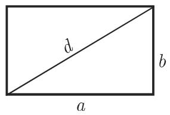
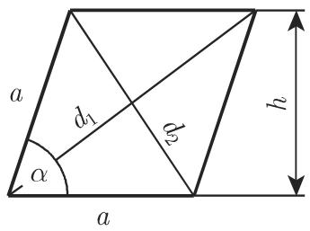
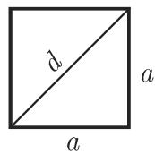
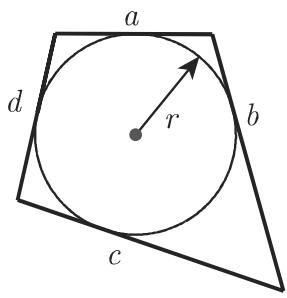

# 数学手册(原书第10版) 3.1.4 平面四边形

《数学手册(原书第10版)》第 3.1.4 节「平面四边形」，隶属 3.1 平面几何学（[[sources/10-数学手册原书第10版--8-31-平面几何学--g0i8gh]]），承接 3.1.1 基本概念（[[sources/10-数学手册原书第10版--8-311-基本概念--mrusl5]]）中 [[concepts/平行与正交直线]]、[[concepts/平行线的角偶对]] 与 [[concepts/相交直线的角偶对]] 的铺垫。本节是手册中四边形知识的完整条目，属参考手册式的「定义—刻画—度量公式」三层结构，而非论证性文本。

## 章节结构

| 小节 | 主题 | 插图 | 公式 |
|---|---|---|---|
| 3.1.4.1 | [[concepts/平行四边形]] | 图 3.15 | 式 3.18–3.20 |
| 3.1.4.2 | [[concepts/矩形]] 与 [[concepts/正方形]] | 图 3.16、图 3.17 | 式 3.21a–b、3.22–3.24 |
| 3.1.4.3 | [[concepts/菱形]] | 图 3.18 | 式 3.25–3.28 |
| 3.1.4.4 | [[concepts/梯形]]（含中位线、质心、等腰梯形） | 图 3.19 | 式 3.29–3.32 |
| 3.1.4.5 | [[concepts/平面四边形]]（一般四边形） | 图 3.20 | 式 3.33–3.35 |
| 3.1.4.6 | [[concepts/内接四边形]] | 图 3.21(a) | 式 3.36–3.41 |
| 3.1.4.7 | [[concepts/外切四边形]] | 图 3.21(b) | 式 3.42–3.43 |

编排特色：对每个主体先列举若干刻画性质，并明确声明「上述属性中单独任何一个已足够；其他所有的属性都可以从它推出来」——即刻画条件的充分性结构；随后给出对角线、周长、面积、质心等度量公式。

## 公式总表

记号约定（依源）：$a, b, c, d$ 为四边，$d_1, d_2$ 为对角线，$\alpha, \beta, \gamma, \delta$ 为内角，$h$ 为高，$m$ 为中位线或对角线中点连线之长，$S$ 为面积，$U$ 为周长，$s$ 为半周长，$r$ 为内切圆半径，$R$ 为外接圆半径。

| 式号 | 公式 | 主体 |
|---|---|---|
| 3.18 | $d_1^2 + d_2^2 = 2(a^2 + b^2)$ | 平行四边形 |
| 3.19 | $h = b\sin\alpha$ | 平行四边形 |
| 3.20 | $S = ah$ | 平行四边形 |
| 3.21a | $U = 2(a+b)$ | 矩形 |
| 3.21b | $S = ab$ | 矩形 |
| 3.22 | $d = a\sqrt{2} \approx 1.414a$ | 正方形 |
| 3.23 | $a = d\frac{\sqrt{2}}{2} \approx 0.707d$ | 正方形 |
| 3.24 | $S = a^2 = \frac{d^2}{2}$ | 正方形 |
| 3.25 | $d_1 = 2a\cos\frac{\alpha}{2}$ | 菱形 |
| 3.26 | $d_2 = 2a\sin\frac{\alpha}{2}$ | 菱形 |
| 3.27 | $d_1^2 + d_2^2 = 4a^2$ | 菱形 |
| 3.28 | $S = ah = a^2\sin\alpha = \frac{d_1 d_2}{2}$ | 菱形 |
| 3.29 | $m = \frac{a+b}{2}$ | 梯形（中位线） |
| 3.30 | $S = \frac{(a+b)h}{2} = mh$ | 梯形 |
| 3.31 | $h_S = \frac{h(a+2b)}{3(a+b)}$ | 梯形（质心） |
| 3.32 | $S = (a - c\cos\gamma)c\sin\gamma = (b + c\cos\gamma)c\sin\gamma$ | 等腰梯形 |
| 3.33 | $\sum_{i=1}^{4}\alpha_i = 360^{\circ}$ | 一般四边形 |
| 3.34 | $a^2 + b^2 + c^2 + d^2 = d_1^2 + d_2^2 + 4m^2$ | 一般四边形（$m$ 为对角线中点连线之长） |
| 3.35 | $S = \frac{1}{2}d_1 d_2\sin\alpha$ | 一般四边形（$\alpha$ 为对角线夹角） |
| 3.36 | $\alpha + \gamma = \beta + \delta = 180^{\circ}$ | 内接四边形（判定） |
| 3.37 | $ac + bd = d_1 d_2$ | 内接四边形（托勒密定理） |
| 3.38 | $R = \frac{1}{4S}\sqrt{(ab+cd)(ac+bd)(ad+cb)}$ | 内接四边形（外接圆半径） |
| 3.39a | $d_1 = \sqrt{\frac{(ac+bd)(ab+cd)}{ad+bc}}$ | 内接四边形 |
| 3.39b | $d_2 = \sqrt{\frac{(ac+bd)(ad+bc)}{ab+cd}}$ | 内接四边形 |
| 3.40 | $S = \sqrt{(s-a)(s-b)(s-c)(s-d)}$，$s = \frac{1}{2}(a+b+c+d)$ | 内接四边形 |
| 3.41 | $S = \sqrt{abcd}$ | 双心四边形（内接且外切） |
| 3.42 | $s = \frac{1}{2}(a+b+c+d) = a + c = b + d$ | 外切四边形（判定） |
| 3.43 | $S = (a+c)r = (b+d)r$ | 外切四边形 |

## 源未冠名的标准定理名（本 wiki 依通行名称补注）

- 式 3.18：平行四边形定律（parallelogram law）
- 式 3.34：欧拉四边形定理
- 式 3.37：托勒密定理（源已冠名）
- 式 3.40：婆罗摩笈多公式
- 式 3.42 的判据：皮托定理（Pitot）

## 转写损坏记录

- 「于」系统性误转为「千」：如「对千菱形」「位千两平行的底 中点的连线上」「等千半周长」「关千用积分计算质心坐标」。
- 行内数学符号脱落：3.1.4.4「以表示底， 表示高， 表示梯形的中位线」（应为 $a, b$ / $h$ / $m$）、「与底 的距离为 $h_S$」（缺底符号）；3.1.4.5「的线段 之长」（缺 $m$）；3.1.4.7「其中 是内切圆的半径」（缺 $r$）。
- 交叉引用损坏：「见第 672 8.2.2.3,5..」，页码与节号错乱（见 [[queries/质心交叉引用页码与节号是否错乱]]）。
- 术语不一致：3.1.4.6 首句用「外接圆」，式 3.38 却作「外切圆半径」（见 [[queries/式3-38外切圆半径是否应为外接圆半径]]）；「能被一个外接圆外接的四边形」为冗余表述；「并且边是该圆的切线一个四边形具有一个内切圆」缺句读。
- 图题与图像在转写中分离（对照见下）。

## 插图对照

**图 3.15 平行四边形**

**图 3.16 矩形**

**图 3.17 正方形**

**图 3.18 菱形**

**图 3.19 梯形**

**图 3.20 一般四边形**

**图 3.21(a) 内接四边形**

**图 3.21(b) 外切四边形**

## 与其他小节的依赖

- 「对边平行」「对角相等」「内角和 $360^{\circ}$」依赖 3.1.1 的 [[concepts/平行与正交直线]]、[[concepts/平行线的角偶对]]（同旁内角互补）与 [[concepts/相交直线的角偶对]]（对顶角）；角记号见 [[concepts/角]]。
- 内角和的论证（对角线把四边形分成两个三角形）隐含引用 3.1.3 三角形节的内角和定理，该节源页尚未入库。
- 质心的积分计算交叉引用第 8.2.2.3 节，该节源页尚未入库。

## 证据性质

本节全部内容为经典欧氏几何的演绎结果，证据强度高。导入分析对式 3.18、3.27–3.28、3.29–3.32、3.41 做了代数自洽性复核，对式 3.31 做了积分推导验证，全部通过。适用范围须注意：式 3.38–3.41 仅对内接四边形、式 3.42–3.43 仅对外切四边形成立，不可互换；各刻画等价性命题隐含「简单（非自交）四边形」假设，源未明言。

<!-- llm-wiki:embedded-images -->
## Embedded Images

### Document

<!-- llm-wiki:embedded-images -->
