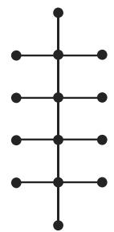

# 数学手册(原书第10版) 5.8.3 树和生成树

《数学手册(原书第10版)》第 5.8 章（图论算法）的第三小节，继 5.8.1 基本概念和记号（[[sources/10-数学手册原书第10版--11-581-基本概念和记号--1us4sp9]]、[[concepts/图与关联函数]]）之后的转写件。本节定义树及其各种特化（有根树、正则二元树、有序二元树）与三种遍历，随后转入生成树理论：存在性构造证明、凯莱定理、矩阵生成树定理（附完整算例），最后以极小生成树与克鲁斯卡尔算法收尾。

## 章节结构

- **5.8.3.1**（小节标题在转写中脱落，据内容应为「树」）：树的定义与计数性质；有根树（水平、高）；正则二元树；有序二元树与三种遍历、前缀/后缀表示法。
- **5.8.3.2 生成树**：生成树定义与存在性；凯莱定理；矩阵生成树定理；极小生成树与克鲁斯卡尔算法。

## 结构化数据（原文保留）

次数矩阵 D、容许矩阵 L 与生成树总长（式 5.323a–b、5.324）：

```
d_ij = 0        (i ≠ j)
d_ij = d_G(v_i) (i = j)          (5.323a)  次数矩阵 D

L = D − A                        (5.323b)  G 的容许矩阵 L

f(H) = Σ_{e∈H} f(e)              (5.324)   生成树 H 的总长
```

图 5.53 算例矩阵：

```
A = ( 2  1  1  0 )      D = ( 4  0  0  0 )      L = (  2 -1 -1  0 )
    ( 1  0  2  0 )          ( 0  3  0  0 )          ( -1  3 -2  0 )
    ( 1  2  0  1 )          ( 0  0  4  0 )          ( -1 -2  4 -1 )
    ( 0  0  1  0 )          ( 0  0  0  1 )          (  0  0 -1  1 )

因为 det L₃ = 5，所以这个图有 5 个生成树。
```

克鲁斯卡尔算法及标号技巧（按转写原文）：

```
a) 选取有极小权的边。
b) 尽可能地继续选取其他的有最小权，并且不与已经选得的边形成圈的边，将这样的边添加到树中。

在步骤 b) 中，容许边的选取容易通过下列标号算法实现：
设图的顶点被两两不同地标号。
在每一步，仅可能在这种情形增加一条边：它连接有不同标号的顶点。
增加一条边后，将较大标号端点的标号改为较小的端点标号值。
```

## 插图

- 图 5.49 / 图 5.50：两个不同构的 14 顶点树，分别表示丁烷与异构丁烷的化学结构（原文讹作「丁烧/异构丁烧」），见 [[findings/丁烷与异构丁烷非同构树]]。
- 图 5.51：用有根树表示一个家庭的谱系（根是表示父亲的顶点），见 [[concepts/有根树]]。
- 图 5.52：表达式 a·(b−c)+d 的有序二元树表示，见 [[findings/表达式树三种遍历算例图5-52]]。


- 图 5.53：矩阵树定理算例所用图 G（含自环与重边的多重图），见 [[findings/矩阵树定理算例图5-53]]。


- 图 5.54：图 5.53 中的图 G 的生成树 H。


## 已复算内容

- [[findings/表达式树三种遍历算例图5-52]]：内序 a·b−c+d、前序 +·a−bcd、后序 abc−·d+，三式独立复算全部正确。
- [[findings/矩阵树定理算例图5-53]]：L = D − A 与所印 A、D 一致；det L₃ = 5 复算成立，且按多重图约定（A[1][1]=2 为 v₁ 自环、A[2][3]=2 为 v₂–v₃ 重边）独立枚举恰得 5 棵生成树。
- [[findings/正则二元树顶点数与叶数公式]]：顶点数为奇数、1 次顶点数 (n+1)/2，由 n₁ = n₃ + 2 与握手计数独立复推成立。

其余论点（丁烷判例、生成树存在性证明、凯莱定理断言）见对应 finding 页。

## 转写讹误与疑点

本节转写受损较重，主要问题（详见 [[queries/5-8-3全节系统性转写讹误清单]]）：

- 系统性数字脱落（≥12 处）：树的计数性质、正则二元树的次数、有序二元树的次数指派、凯莱定理的 n、「去掉 L 的第 i 行和第 i 列」「这个图有 5 个生成树」等处的数字与变量均为重构。
- 系统性「千/于」混淆：位千/对应千/用千/等千 应为 位于/对应于/用于/等于。
- 化学名讹误：「丁烧/异构丁烧」应为 丁烷/异构丁烷。
- 图号脱落：5.49、5.50、5.51、5.53、5.54 五处句首「图」被「•」替代。
- 树的第二定义改用「有向图」与首句「无向连通图」不一致（[[queries/树的第二定义有向图是否应为无向图]]）。
- 波兰/逆波兰表示法归属与通行约定相反（[[queries/波兰与逆波兰表示法归属是否颠倒]]）。
- 「容许矩阵」译名存疑，L = D − A 通称拉普拉斯矩阵（[[queries/容许矩阵译名是否应为拉普拉斯矩阵]]）。
- 克鲁斯卡尔标号规则疑脱漏「同分量全体顶点统一改标」（[[queries/克鲁斯卡尔标号算法是否应改同分量全部顶点标号]]）。
- 交叉引用「参见第 551 5.8.6」残缺（疑脱「页」字）。

## 与既有内容的联系

- 上游：[[sources/10-数学手册原书第10版--7-58-图论算法--wf3s74]]（5.8 章总页，需补记 5.8.3 覆盖）、[[sources/10-数学手册原书第10版--11-581-基本概念和记号--1us4sp9]]。
- 图 5.53 是含自环与重边的多重图实例，其矩阵约定（自环对角计 2、重边按重数计入、A 的行和=次数）需与 [[concepts/邻接矩阵]]（式 5.317）、[[concepts/顶点次数与正则图]]、[[concepts/重边环与简单图]] 的定义核对一致性。
- [[concepts/图的同构]]：丁烷/异构丁烷是「同阶非同构树」的新判例。
- [[concepts/加权图]]：极小生成树是该概念在本手册中的首个应用场景。
- [[concepts/完全图]]：凯莱定理是对 K_n 的计数结果。
- [[concepts/子图导出子图部分图与因子]]：生成树即「部分图」意义下的树子图，术语衔接点。
- 依赖缺口：5.8.2（圈、通路等概念的定义处，按章节次序推断）未入库（[[queries/5-8-2未入库依赖缺口]]）。

<!-- llm-wiki:embedded-images -->
## Embedded Images

### Document




<!-- llm-wiki:embedded-images -->
