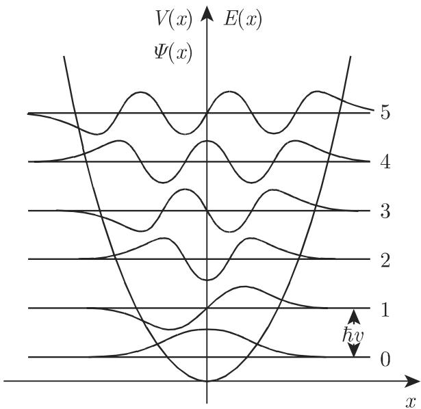

# 数学手册(原书第10版) 9.2.4 薛定谔方程

## 概述

本源为手册第 9 章「微分方程」9.2「偏微分方程」的子节 9.2.4，是 9.2 序列中继 9.2.1（一阶偏微分方程）、9.2.2（二阶线性偏微分方程）之后入库的第三个子节（9.2.3「偏微分方程的逼近方法」仍未入库，见 [[queries/9-2子小节未入库回指缺口]]）。全节系统阐述非相对论量子力学的薛定谔方程理论：基本方程与算符（9.111–9.114）、波函数的统计解释与不确定度关系（9.115–9.131），随后给出三个完整可复算的算例——粒子在方块中的自由运动（9.132–9.134）、中心对称场中的粒子运动（9.135–9.141）、线性谐振子（9.142–9.147）。

文本带有大量系统性 OCR 讹误（「千→于」「心→ψ」「入→λ」「清形→情形」等），并存在若干经内部矛盾或量纲分析判定为高置信的公式级疑误（见下表及各专项查询）。这些疑误究竟是原书印刷错误还是本次电子转写引入，需对照纸质原书方能定谳（[[queries/9-2-4全节系统性转写讹误清单]]）。

## 小节结构

- **9.2.4.1 薛定谔方程的概念**：确定性和依赖性；注记 a)–e)（哈密顿算子与经典对应、复波函数与概率条件、初始/边界条件与本征值、德布罗意物质波与波粒二象性、非相对论适用范围 v ≪ c）
- **9.2.4.2 含时薛定谔方程**：波函数三条件（9.112a）、定态解形式（9.112b/c）
- **9.2.4.3 定常薛定谔方程**：空间本征值方程（9.113a）、能谱与边界条件、U=0 特例即亥姆霍兹方程（9.114a/b）
- **9.2.4.4 波函数的统计解释**：可观察量与厄米算子、概率振幅、叠加原理与干涉项、期望值与不确定度、不确定度关系（9.115–9.131）
- **9.2.4.5 粒子在一方块中的自由运动**：直角坐标分离变量、量子数、结点平面、立方体的退化（简并）、零点平移能（9.132–9.134）
- **9.2.4.6 中心对称场中的粒子运动**：球坐标分离变量、径向方程与离心位势、相伴勒让德多项式、球面调和函数、宇称（9.135–9.141）
- **9.2.4.7 线性谐振子**：韦伯微分方程、幂级数与截止条件、埃尔米特多项式、等距能谱与零点振动能、经典-量子概率对比与对应原理（9.142–9.147）

## 核心公式组（转录与复算标记）

### A. 基本方程组（9.111–9.114）

```latex
\mathrm{i}\hbar \frac{\partial\psi}{\partial t} = -\frac{\hbar^{2}}{2m}\Delta\psi + U(x_1,x_2,x_3,t)\psi = \hat{H}\psi          % 9.111a ✓
\hat{H} \equiv \frac{\hat{p}^{2}}{2m} + U(\vec{r},t),\quad \hat{p} \equiv \frac{\hbar}{\mathrm{i}}\frac{\partial}{\partial\vec{r}} \equiv \frac{\hbar}{\mathrm{i}}\nabla   % 9.111b ✓
\iiint_V |\psi(x_1,x_2,x_3,t)|^{2}\,\mathrm{d}V < \infty                                                                    % 9.112a ✓
\psi(x_1,x_2,x_3,t) = \Psi(x_1,x_2,x_3)\exp\Big(-\mathrm{i}\frac{E}{\hbar}t\Big)                                            % 9.112b ✓
\mathrm{d}\omega = |\psi|^{2}\,\mathrm{d}V = \psi\psi^{*}\,\mathrm{d}V                                                       % 9.112c ✓
\Delta\Psi + \frac{2m}{\hbar^{2}}(E-U)\Psi = 0                                                                              % 9.113a ✓
E = \frac{p^{2}}{2m}\quad(p = h/\lambda,\ h = 2\pi\hbar)                                                                    % 9.113b ✓
\Delta\Psi + \lambda\Psi = 0,\qquad \lambda = \frac{2mE}{\hbar^{2}}                                                         % 9.114a,b ✓
```

### B. 统计诠释组（9.115–9.131）

```latex
\hat{l}_x = \hat{y}\hat{p}_z - \hat{z}\hat{p}_y = \frac{\hbar}{\mathrm{i}}\Big(y\frac{\partial}{\partial z} - z\frac{\partial}{\partial y}\Big)             % 9.115a ✓
\hat{l}_y = \hat{z}\hat{p}_x - \hat{x}\hat{p}_z = \frac{\hbar}{\mathrm{i}}\Big(z\frac{\partial}{\partial x} - x\frac{\partial}{\partial z}\Big),\
\hat{l}_z = \hat{x}\hat{p}_y - \hat{y}\hat{p}_x = \frac{\hbar}{\mathrm{i}}\Big(x\frac{\partial}{\partial y} - y\frac{\partial}{\partial x}\Big)             % 9.115b ✓
\hat{A}\varphi_i = a_i\varphi_i,\quad \iiint_V \varphi_i^{*}\varphi_k\,\mathrm{d}V = \delta_{i,k}                                                           % 9.116 ✓
W_i = \lim_{N\to\infty}\frac{N_i}{N},\quad \sum_i N_i = N                                                                                                   % 9.117 ✓
\psi = \sum_i c_i\varphi_i,\qquad c_i = \iiint_V \varphi_i^{*}\psi\,\mathrm{d}V                                                                             % 9.118 ✓
W_i = |c_i|^{2},\quad \sum_i W_i = \iiint_V \psi^{*}\psi\,\mathrm{d}V = 1                                                                                   % 9.119 ✓
\psi = \psi_1 + \psi_2                                                                                                                                      % 9.120 ✓
|\psi|^{2} = |\psi_1+\psi_2|^{2} = |\psi_1|^{2}+|\psi_2|^{2}+2\,\mathrm{Re}(\psi_1\psi_2^{*})                                                               % 9.121 ✓
\bar{A} = \lim_{N\to\infty}\frac{1}{N}\sum_i a_iN_i = \sum_i a_iW_i = \iiint_V \psi^{*}\hat{A}\psi\,\mathrm{d}V                                            % 9.122 ✓
(\Delta A)^{2} = \lim_{N\to\infty}\frac{1}{N}\sum_i N_i(a_i-\bar{A})^{2} = \sum_i W_i(a_i-\bar{A})^{2}                                                     % 9.123 ✓
(\Delta A)^{2} = \overline{(A-\bar{A})^{2}} = \overline{A^{2}}-\bar{A}^{2} = \iiint_V \psi^{*}(\hat{A}-\bar{A})^{2}\psi\,\mathrm{d}V                        % 9.124 ✓
\bar{A}=a_i,\qquad \Delta A=0                                                                                                                              % 9.125 ✓
\hat{C}=[\hat{A},\hat{B}]=\hat{A}\hat{B}-\hat{B}\hat{A}=0                                                                                                   % 9.126 ✓
\hat{A}\varphi_{i,\nu}=a_i\varphi_{i,\nu},\qquad \hat{B}\varphi_{i,\nu}=b_\nu\varphi_{i,\nu}                                                                % 9.127 ✓
\Delta A\,\Delta B \geqslant \Big|\frac{1}{2\mathrm{i}}\overline{[\hat{A},\hat{B}]}\Big|                                                                    % 9.129 ✓
[\hat{p}_x,\hat{x}] = \frac{\hbar}{\mathrm{i}}                                                                                                              % 9.130 ✓
\Delta p_x\,\Delta x \geqslant \frac{\hbar}{2}                                                                                                              % 9.131 ✓（由 9.130 代入 9.129 直接可得）
```

### C. 方盒组（9.132–9.134）

```latex
\frac{\partial^{2}\Psi}{\partial x^{2}}+\frac{\partial^{2}\Psi}{\partial y^{2}}+\frac{\partial^{2}\Psi}{\partial z^{2}}+\frac{2m}{\hbar^{2}}E\Psi=0            % 9.132a ✓
\Psi=0\quad(x=0,a;\ y=0,b;\ z=0,c)                                                                                                                            % 9.132b ✓
k_x^2+k_y^2+k_z^2=B,\qquad E=\frac{\hbar^{2}}{2m}(k_x^2+k_y^2+k_z^2)                                                                                          % 9.133d,e ✓
k_x=\frac{\pi n_x}{a},\ k_y=\frac{\pi n_y}{b},\ k_z=\frac{\pi n_z}{c}                                                                                        % 9.134c ✓
E_{n_x,n_y,n_z}=\frac{\hbar^{2}}{2m}\Big[\Big(\frac{n_x}{a}\Big)^{2}+\Big(\frac{n_y}{b}\Big)^{2}+\Big(\frac{n_z}{c}\Big)^{2}\Big]\ (n_x,n_y,n_z=\pm1,\pm2,\dots)     % 9.134d ✓（± 取法冗余但非错误）
\Psi_{n_x,n_y,n_z}=\sqrt{\frac{8}{abc}}\sin\frac{\pi n_xx}{a}\sin\frac{\pi n_yy}{b}\sin\frac{\pi n_zz}{c}                                                    % 9.134f ✓（归一化复算：∫sin²=a/2，积为 abc/8）
E_0=\frac{\hbar^{2}}{2m}\Big(\frac{1}{a^{2}}+\frac{1}{b^{2}}+\frac{1}{c^{2}}\Big)                                                                            % 9.134h ✓
```

### D. 中心场组（9.135–9.141）

```latex
\Delta\Psi = \frac{\partial^{2}\Psi}{\partial r^{2}}+\frac{2}{r}\frac{\partial\Psi}{\partial r}
 +\frac{1}{r^{2}}\frac{\partial^{2}\Psi}{\partial\vartheta^{2}}+\frac{\cos\vartheta}{r^{2}\sin\vartheta}\frac{\partial\Psi}{\partial\vartheta}
 +\frac{1}{r^{2}\sin^{2}\vartheta}\frac{\partial^{2}\Psi}{\partial\varphi^{2}}                                                                               % 9.135b ✓
\frac{1}{r^{2}}\frac{\partial}{\partial r}\Big(r^{2}\frac{\partial\Psi}{\partial r}\Big)
 +\frac{1}{r^{2}\sin^{2}\vartheta}\frac{\partial}{\partial\vartheta}\Big(\sin\vartheta\frac{\partial\Psi}{\partial\vartheta}\Big)   % ⚠ 9.135c 此项分母疑应为 r²sinϑ
 +\frac{1}{r^{2}\sin^{2}\vartheta}\frac{\partial^{2}\Psi}{\partial\varphi^{2}}+\frac{2m}{\hbar^{2}}[E-V(r)]\Psi=0
\frac{1}{R_l r^{2}}\frac{d}{dr}\Big(r^{2}\frac{dR_l}{dr}\Big)+\frac{2m}{\hbar^{2}}\Big[E-V(r)-\frac{l(l+1)\hbar^{2}}{2mr^{2}}\Big]=0                         % 9.136d 径向方程 ✓
\frac{1}{\varTheta\sin\vartheta}\frac{d}{d\vartheta}\Big(\sin\vartheta\frac{d\varTheta}{d\vartheta}\Big)+l(l+1)-\frac{m^{2}}{\sin^{2}\vartheta}=0            % 9.136g 极方程 ✓
\frac{d^{2}\varPhi}{d\varphi^{2}}+m^{2}\varPhi=0                                                                                                             % 9.136h 方位方程 ✓
u_l(r)=r\,R_l(r)                                                                                                                                             % 9.137a ✓
\frac{d^{2}u_l}{dr^{2}}+\frac{2m}{\hbar}\Big[E-V(r)-\frac{l(l+1)\hbar^{2}}{2mr^{2}}\Big]u_l=0        % ⚠ 9.137b 系数疑应为 2m/ℏ²
V_{\mathrm{eff}}=V(r)+V_{l}(l),\qquad V_{l}(r)=V_{\mathrm{rot}}(l)=\frac{l(l+1)\hbar^{2}}{2mr^{2}}                                                           % 9.137c,d ✓（记号 V_l(l)/V_l(r) 不一致）
\vec{l}^{2}=l(l+1)\hbar^{2},\quad |\vec{l}|=\hbar\sqrt{l(l+1)}                                                                                               % 9.137f ✓（源内译者注：原书此处误为 |l⃗²|）
P_l^{m}(\cos\vartheta)=\frac{(-1)^{m}}{2^{l}l!}(1-\cos^{2}\vartheta)^{m/2}\frac{d^{l+m}(\cos^{2}\vartheta-1)^{l}}{(d\cos\vartheta)^{l+m}}                    % 9.138c ✓（含 Condon–Shortley 相因子的标准式）
\varTheta_l^{m}=\sqrt{\frac{2l+1}{2}\cdot\frac{(l-m)!}{(l+m)!}}\,P_l^{m}(\cos\vartheta)                                                                      % 9.138d ✓
\varPhi_m(\varphi)=\frac{1}{\sqrt{2\pi}}e^{\mathrm{i}m\varphi}\ (m=0,\pm1,\pm2,\dots)                                                                        % 9.139d ✓
Y_l^{m}=\frac{1}{\sqrt{2\pi}}N_l^{m}P_l^{m}(\cos\vartheta)e^{\mathrm{i}m\varphi}                                                                             % 9.140a ✓
Y_l^{m}(\pi-\vartheta,\varphi+\pi)=(-1)^{l}Y_l^{m}(\vartheta,\varphi)                                                                                        % 9.140b ✓（经 P_l^m(−x)=(−1)^{l+m} 与 e^{imπ}=(−1)^m 联乘复算通过）
P=(-1)^{l},\qquad P^{2}=1,\ P=\pm1                                                                                                                           % 9.141a,b ✓
```

### E. 谐振子组（9.142–9.147）

```latex
\nu=\frac{1}{2\pi}\sqrt{\frac{k}{m}},\quad \omega=\sqrt{\frac{k}{m}},\quad
E_{\mathrm{pot}}=\frac{1}{2}kx^{2}=\frac{\omega^{2}}{2}x^{2}          % ⚠ 9.142c 末式疑漏因子 m，应为 (mω²/2)x²
y=x\sqrt{\frac{m\omega}{\hbar}},\qquad \lambda=\frac{2E}{\hbar\omega}                                                                                        % 9.143b,c ✓
\frac{d^{2}\Psi}{dy^{2}}+(\lambda-y^{2})\Psi=0                                                                                                               % 9.143d 韦伯微分方程简单形式 ✓
\frac{d^{2}H}{dy^{2}}-2y\frac{dH}{dy}+(\lambda-1)H=0                                                                                                         % 9.144c ✓
\sum_{i=2}^{\infty}i(i-1)a_iy^{i-2}-\sum_{i=1}^{\infty}2ia_iy^{i}+\sum_{i=0}^{\infty}i(\lambda-1)a_iy^{i}=0    % ⚠ 9.145b 第三和疑多乘因子 i
(j+2)(j+1)a_{j+2}=[2j-(\lambda-1)]a_j                                                                                                                         % 9.145c ✓（与 9.145b 修正后一致）
\lambda=\frac{2E}{\hbar\omega}=2n+1                                                                                                                           % 9.146b ✓
H_0=1,\ H_1=2y,\ H_2=-2+4y^{2},\ H_3=-12y+8y^{3},\ H_4=12-48y^{2}+16y^{4},\ H_5=120y-160y^{3}+32y^{5}                                                       % 9.146c ✓（物理学家型，逐项复算通过）
\Psi_n=N_ne^{-y^{2}/2}H_n(y),\qquad N_n^{2}=\frac{1}{2^{n}n!}\sqrt{\frac{\alpha}{\pi}},\ \sqrt{\alpha}=\sqrt{\frac{m\omega}{\hbar}}                          % 9.147a,b ✓
E_n=\hbar\omega\Big(n+\frac{1}{2}\Big)\quad(n=0,1,2,\dots)                                                                                                    % 9.147c ✓
x_{\max,qu}=\pm\frac{1}{\sqrt{\lambda}}=\pm\sqrt{\frac{\hbar}{m\omega}},\qquad
x_{\max,kl}=\pm a=\pm\sqrt{\frac{2E}{m\omega^{2}}}=\pm\sqrt{\frac{3\hbar}{m\omega}}                                                                           % 9.147d,e ✓（但 9.147d 的 λ 与 9.143c 含义冲突，见查询）
```

## 高置信公式疑误一览

| 位置 | 原文 | 疑点 | 内部依据 |
|---|---|---|---|
| 9.135c | 极角项分母 r²sin²ϑ | 应为 r²sinϑ（一次方） | 与 9.135b（正确的拉普拉斯展开）及 9.136b（该项为 1/(r²sinϑ)）直接矛盾 |
| 9.137b | 系数 2m/ℏ | 应为 2m/ℏ² | 量纲分析；9.136d、9.143a 同类项均为 ℏ² |
| 9.142c | E_pot = (ω²/2)x² | 漏因子 m，应为 (mω²/2)x² | 与 9.143a 中 (ω²/2)mx² 内部矛盾 |
| 9.145b | 第三和 Σi(λ−1)aᵢyⁱ | 多乘因子 i | 由 9.145c 递推公式反推，修正后自洽 |
| 9.2.4.5.4 | 量子数「跑遍除了零之外的所有实数」 | 应为整数 | 上下文 9.134c 量子数取整数 |
| 9.138c 前文 | 特殊情形条件「(l=0, m=n)」 | 应为 m=0（l=n） | m=0 才退化为第一类勒让德多项式 Pₗ |
| 9.2.4.7.3 | 「对于 n=l」 | 应为 n=1 | 所配能量 E=(3/2)ℏω 对应 n=1 |
| 9.147d 前文 | dw_qu = 2√(λ/π)e^{−λx²}dx | 疑漏乘因子 λx² | 若无该因子，密度极大在 x=0，与 9.147d 的 x_max=±1/√λ 矛盾 |
| 9.147d | λ | 与 9.143c 的 λ=2E/ℏω 含义冲突，此处实为 α=mω/ℏ | 节内记号复用 |
| 9.2.4.7.1 | 「把这些代入 (9.114a)」 | 应为 9.113a | 9.114a 是 U=0 的亥姆霍兹方程，容纳不了势能项 |
| 9.147c 前文 | 「级数 (9.143c) 的有尽条件」 | 应指 9.145a/9.146b | 截止条件作用于级数系数 |
| 9.137f | \|l⃗\| | 原书误为 \|l⃗²\| | 源内译者注明确指出（已证实的原书勘误，非转写讹误） |

以上各项的专项核对查询见 [[queries/式9-135c极角项分母疑误]]、[[queries/式9-137b径向方程系数疑漏ℏ平方]]、[[queries/式9-142c势能末式疑漏因子m]]、[[queries/式9-145b第三和疑多乘因子i]]、[[queries/方盒量子数应为整数而非实数]]、[[queries/式9-138c前特殊情形条件疑为m等于0]]、[[queries/谐振子对n等于l疑为n等于1]]、[[queries/式9-147d概率密度疑漏因子λx平方]]、[[queries/谐振子一节代入9-114a还是9-113a]]。

## 系统性转写讹误（OCR 层面）

- 字符替换：「千→于」（关千/依赖千/位千/趋千/对千/等千）、「心→ψ」、「户→（算符与期望值符号丢失）」、「入→λ」、「清形→情形」、「球而→球面」、「笫→第」、「幕→幂」、「9.llla→9.111a」。
- 行内符号丢失：质量 m、时刻 t、光速 c、速度 v、位势 U、波函数 Ψ、可观察量 B、宇称本征值 P、方向的数目「三」、折叠退化的重数 i、级数起始指标 n、轴名 x/y/z。
- 杂字符：「严」「叩」「®」「⟩ 1」。
- 全部清单与术语问题汇总于 [[queries/9-2-4全节系统性转写讹误清单]]，不逐条立页。

## 术语与记号张力

- 称谓：「相关的勒让德多项式」vs 9.1.2 的「相伴勒让德函数」vs 通行译名「缔合/连带勒让德多项式」（[[queries/相伴勒让德函数称谓问题]]）；「退化态/折叠退化」通行作「简并态/i 重简并」；「冲量」表动量（Impuls 直译）；「拉力」表恢复力；「逆向点」表转折点；「容限测量」表同时（相容）测量；「平稳态」表定态；「算子」通行作「算符」；「方块」指三维长方体盒。
- 记号复用：Θ 同时为极角函数（9.136e）与转动惯量（9.137e）；dW/dw/dω 三种概率记号混用；φ（方位角）与 Φ（方位函数）混排；宇称算子 P 与其本征值 P 连写为「PPΨ」；λ 在 9.114b、9.143c、9.147d 三处含义不同。
- 与库内命名张力：「韦伯微分方程」（抛物柱/埃尔米特型，9.143d）与库内 [[entities/韦伯函数]]（Yₙ(x)，贝塞尔型）同名不同物，两页已互加辨析。
- 表述强度：9.2.4.4 开头断言量子力学「不存在可以消去……统计特性的隐藏子结构和隐藏参量」，系无保留的强陈述（未区分定域/非定域隐变量）；[[concepts/波函数与统计诠释]] 已加限定注记。

## 与库内页面的衔接

- [[entities/薛定谔方程]]：本源是其完整论述，该页已据此大幅扩充。
- [[concepts/本征值与本征函数]]、[[concepts/斯图姆-刘维尔问题]]、[[concepts/按本征函数的傅里叶展开]]、[[concepts/帕塞瓦尔方程]]（9.1.3）：9.116 正交归一、9.118 本征展开、9.119 概率求和恒等式与 9.1.3 框架严格平行，是最强的跨节印证。
- [[entities/埃尔米特多项式]]、[[comparisons/两型埃尔米特方程与多项式比较]]（9.1.2）：9.146c 为物理学家的 Hₙ；源文明确回指「第 751 页 9.1.2.6,6 第二个定义方程」。
- [[entities/勒让德多项式]]、[[concepts/勒让德微分方程]]（9.1.2）：极方程 9.136g 即缔合勒让德方程；m=0 特例回指「第 748 页 9.60c」。
- [[concepts/分离变量法]]、[[methodology/分离变量法解题流程]]、[[comparisons/分离变量法五算例比较]]：本源新增直角三向（方盒）与球坐标 R/Θ/Φ（中心场）两类分离实例。
- [[concepts/狄利克雷问题]]、[[findings/式9-94圆膜振动贝塞尔本征函数复算]]、[[concepts/拉普拉斯方程与拉普拉斯算子]]：亥姆霍兹方程 9.114a 是膜振动本征值问题的母体；9.135b 给出球坐标拉普拉斯算子。
- [[concepts/热传导方程]]、[[concepts/二阶偏微分方程的分类]]：含时薛定谔方程「时间一阶+空间二阶+虚系数」的结构可与之对照（见 [[comparisons/含时与定常薛定谔方程比较]]）。
- 未入库回指：第 758 页二体问题、第 908 页 12.9.3.2 勒贝格积分、第 478 页 5.3.6.4 李括号、第 916 页 13.1.2.2、第 384 页 4.3.5.1 空间反演、文献 [8.9][9.5][9.7][9.15][22.19]，见 [[queries/9-2-4未入库回指缺口]]。

## 插图

- 图 9.20（球坐标示意，9.2.4.6.1）：`media/10-数学手册原书第10版--9-924-薛定谔方程--1lweyuj/001-165422a9134001d1dfe19371aa9b8f2bfc4f2af02c0fdcc0b412ef987ddb79e5.jpg`
- 图 9.21（谐振子等距能级、Ψ₀–Ψ₅ 波函数与势能抛物线，9.2.4.7.3）：`media/10-数学手册原书第10版--9-924-薛定谔方程--1lweyuj/002-648fa93a1dc48d135a7d620698427589544008f9f26d0552235b9a2c61148bed.jpg`

## 遗留核对事项

1. 各公式级疑误是原书印刷错误还是转写错误（需对照纸质原书或可靠电子版）。
2. 9.147d 概率密度公式是否确漏因子 λx²（建议按 n=1 波函数完整复算后定稿，见 [[findings/式9-142至9-147线性谐振子转录复算]]）。
3. 「有限区域内声振荡的初始数学方程」一句的原文含义（疑为「出发方程」之误译）。
4. 图 9.20/9.21 图片内容是否需要在 finding 页核对登记。

<!-- llm-wiki:embedded-images -->
## Embedded Images

### Document



<!-- llm-wiki:embedded-images -->
